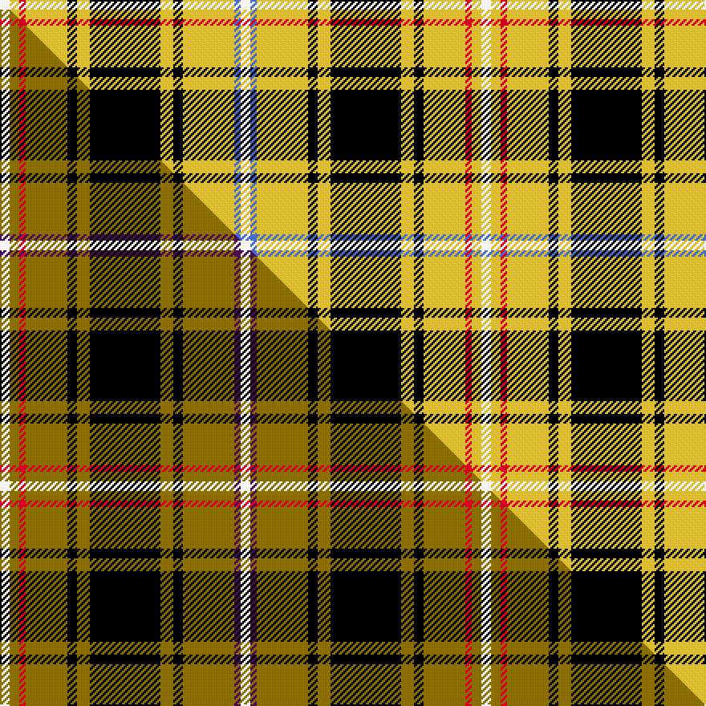

This is one **variant** — a specific cloth: this exact thread count and colourway, with its own
provenance below. It is one weaving of the [sett](/tartans/l/lo/loch-sween/) (the scale-free proportion — the
same cloth at any scale or shade), whose colour order is pattern [WBYKYKYKYRYW](/stripes/wbykykykyryw/).

Part of the [Loch Sween](/tartans/l/lo/loch-sween/) tartan — the named design grouping this sett with its other cloths.

Sourced from tartans-authority.  It is a [12 stripe tartan](/stripes/stripes12/).

Original link <code>http://www.tartansauthority.com/tartan-ferret/display/11081/</code> — retired · [Internet Archive copy](https://web.archive.org/web/*/http://www.tartansauthority.com/tartan-ferret/display/11081/*)

Dataset <small>— provenance for this record, inherited from the source manifest</small>

<dl class="dataset-prov">
<dt>source</dt><dd><a href="/sources/tartans-authority/">Scottish Tartans Authority</a></dd>
<dt>data captured from</dt><dd><a href="https://github.com/thetartan/tartan-database/blob/master/data/tartans-authority/data.csv">https://github.com/thetartan/tartan-database/blob/master/data/tartans-authority/data.csv</a></dd>
<dt>data date</dt><dd>2014 <small>(this record)</small></dd>
<dt>licence</dt><dd><a href="https://creativecommons.org/licenses/by-nc-nd/4.0/">CC BY-NC-ND 4.0</a></dd>
</dl>

Capture chain <small>— the hands this data passed through, oldest first; each capture carries its own licence</small>

<ol class="capture-chain">
<li><a href="https://www.tartansauthority.com/">Scottish Tartans Authority</a> <small>the heritage body’s archive — its tartan-ferret record browser is retired; dead record links are shown unlinked, with an Internet Archive copy (ITI numbers are not SRT references)</small></li>
<li><a href="https://github.com/thetartan/tartan-database">thetartan/tartan-database</a> <small>2016-2017</small> · <a href="https://creativecommons.org/licenses/by-nc-nd/4.0/">CC BY-NC-ND 4.0</a> <small>Levko Kravets's frozen compilation — the capture we vendored, and where its CC licence text came from</small></li>
<li>this dictionary <small>captured 2026-06-10 · commit 5bf86c7566</small> <small>each re-capture is a git commit to data/sources</small></li>
</ol>

## Register references

External register numbers recorded for this tartan.

- Scottish Register of Tartans: [11081](https://www.tartanregister.gov.uk/tartanDetails?ref=11081)
- Scottish Tartans Authority (ITI): 11081

## Thread count
W/6 LY6 R4 LY26 K6 LY8 K44 LY8 K6 LY32 B4 W/6

One full sett is **300 threads**.

## Palette
<table><thead><tr><th>Colour</th><th>Shade</th><th>OKLCh</th></tr></thead><tbody><tr><td>K</td><td><code style="background-color:#000000;">#000000</code> <small style="color:#888">#000000</small></td><td><small style="color:#888">oklch(0.0% 0.000 0.0)</small></td></tr><tr><td>B</td><td><code style="background-color:#466CC8;">#466CC8</code> <small style="color:#888">#466CC8</small></td><td><small style="color:#888">oklch(55.1% 0.149 265.0)</small></td></tr><tr><td>R</td><td><code style="background-color:#D60020;">#D60020</code> <small style="color:#888">#D60020</small></td><td><small style="color:#888">oklch(55.2% 0.224 25.5)</small></td></tr><tr><td>W</td><td><code style="background-color:#F7F7F7;">#F7F7F7</code> <small style="color:#888">#F7F7F7</small></td><td><small style="color:#888">oklch(97.6% 0.000 89.9)</small></td></tr><tr><td>LY</td><td><code style="background-color:#DCBC32;">#DCBC32</code> <small style="color:#888">#DCBC32</small></td><td><small style="color:#888">oklch(80.0% 0.150 95.2)</small></td></tr></tbody></table>

# Sample pattern

[Sample sheet (PDF)](swatch.pdf) — the woven sample, thread count and palette on one printable A4, rendered on demand (the same sheet the TTD print page downloads).

## Compared to the master

This cloth is one sett of its design; the master sett (the exemplar the design is anchored on) is below for comparison.

Its **ΔTartan distance** from the master is **0.43** — the same measure the nearest-tartans table ranks by (0 is identical; a re-scale of the same cloth is near 0, a recolour or a different proportion further).

<figure class="master-compare" style="margin:0">

this sett
master sett ★

<figcaption style="color:#888;font-size:smaller">One weave of this sett against the <a href="/setts/w3y3r2y13k3y4k22y4k3y16dp2w3/">master sett ★</a>, split on the diagonal: a shared proportion runs seamlessly across it with only the shades shifting; a different proportion breaks on it.</figcaption>
</figure>

## Nearest tartan variants

The nearest existing variants by ΔTartan distance, with this cloth at the top so the swatches line up against it.

ΔTartan

Threads

Variant

Sett

—

300

<a href="/variants/s12/w3ly3r2ly13k3ly4k22ly4k3ly16b2w3~x2/">Loch Sween</a>

<a href="/ttd/edit/#slug=w3y3r2y13k3y4k22y4k3y16dp2w3~x2&amp;base=w3ly3r2ly13k3ly4k22ly4k3ly16b2w3~x2" title="compare in the TTD">0.43</a>

300

<a href="/variants/s12/w3y3r2y13k3y4k22y4k3y16dp2w3~x2/">Loch Sween</a>

<a href="/ttd/edit/#slug=do1lr2k5do3k1ly4k1ly10k1ly1~x4&amp;base=w3ly3r2ly13k3ly4k22ly4k3ly16b2w3~x2" title="compare in the TTD">2.23</a>

224

<a href="/variants/s10/do1lr2k5do3k1ly4k1ly10k1ly1~x4/">Campbell 'Camel'</a>

<a href="/ttd/edit/#slug=dy1w2k5dy3k1ly5k1ly11k1ly1~x4&amp;base=w3ly3r2ly13k3ly4k22ly4k3ly16b2w3~x2" title="compare in the TTD">2.34</a>

240

<a href="/variants/s10/dy1w2k5dy3k1ly5k1ly11k1ly1~x4/">Braemar or Blair Atholl Trade Tartan</a>

<a href="/ttd/edit/#slug=r4ly24k13ly2k4ly3k1ly3lb2~x2&amp;base=w3ly3r2ly13k3ly4k22ly4k3ly16b2w3~x2" title="compare in the TTD">2.35</a>

212

<a href="/variants/s9/r4ly24k13ly2k4ly3k1ly3lb2~x2/">Cardiff City Football Club (Corp)</a>

<a href="/ttd/edit/#slug=ly15n1ly2lo2ly2n1ly3k8n10ly3~x4&amp;base=w3ly3r2ly13k3ly4k22ly4k3ly16b2w3~x2" title="compare in the TTD">2.74</a>

304

<a href="/variants/s10/ly15n1ly2lo2ly2n1ly3k8n10ly3~x4/">Annan Trade Tartan</a>

<a href="/ttd/edit/#slug=k3lb7ly26k26w5k26ly26lb7k3r3~x2&amp;base=w3ly3r2ly13k3ly4k22ly4k3ly16b2w3~x2" title="compare in the TTD">2.83</a>

516

<a href="/variants/s10/k3lb7ly26k26w5k26ly26lb7k3r3~x2/">Cornish National</a>

<a href="/ttd/edit/#slug=ly4k2dr2k1dr1k1dr2b3ly1dg4ly9dg1~x4&amp;base=w3ly3r2ly13k3ly4k22ly4k3ly16b2w3~x2" title="compare in the TTD">2.93</a>

228

<a href="/variants/s12/ly4k2dr2k1dr1k1dr2b3ly1dg4ly9dg1~x4/">California Firefighters (Corporate)</a>

<a href="/ttd/edit/#slug=ly4k2dr2k1dr1k1dr2db3ly1dg4ly9dg1~x4~db2920264&amp;base=w3ly3r2ly13k3ly4k22ly4k3ly16b2w3~x2" title="compare in the TTD">2.96</a>

228

<a href="/variants/s12/ly4k2dr2k1dr1k1dr2db3ly1dg4ly9dg1~x4~db2920264/">California Firefighters (Corporate)</a>

<a href="/ttd/edit/#slug=w3k2g18r2db9r18g2r2g2r2db2r3g18k2~x2&amp;base=w3ly3r2ly13k3ly4k22ly4k3ly16b2w3~x2" title="compare in the TTD">3.16</a>

330

<a href="/variants/s14/w3k2g18r2db9r18g2r2g2r2db2r3g18k2~x2/">MacGuire (Name)</a>

<a href="/ttd/edit/#slug=dg36ly8k9ly24dg4ly12dg4ly24k9ly8dg36dr4&amp;base=w3ly3r2ly13k3ly4k22ly4k3ly16b2w3~x2" title="compare in the TTD">3.16</a>

316

<a href="/variants/s12/dg36ly8k9ly24dg4ly12dg4ly24k9ly8dg36dr4/">Harmer</a>

## Neighbour map

Every grey dot is one of 13662 variants placed by the first two principal components of the ΔTartan feature space (42% of its variance). Red is this tartan; blue dots are its nearest — click one to open its page. The map is a flat projection of a many-dimensional space — [how to read it](/posts/neighbourhood-maps/).

<svg viewBox="0 0 640 380" role="img" style="max-width:100%;height:auto;border:1px solid #e0e0e0;border-radius:4px;display:block" xmlns="http://www.w3.org/2000/svg"><image href="/nn/cloud.v1.png" width="640" height="380"/><a href="/variants/s12/w3y3r2y13k3y4k22y4k3y16dp2w3~x2/"><circle cx="204.5" cy="128.5" r="4" fill="#3465a4"><title>Loch Sween</title></circle></a><a href="/variants/s10/do1lr2k5do3k1ly4k1ly10k1ly1~x4/"><circle cx="205.5" cy="156.1" r="4" fill="#3465a4"><title>Campbell 'Camel'</title></circle></a><a href="/variants/s10/dy1w2k5dy3k1ly5k1ly11k1ly1~x4/"><circle cx="221.9" cy="147.7" r="4" fill="#3465a4"><title>Braemar or Blair Atholl Trade Tartan</title></circle></a><a href="/variants/s9/r4ly24k13ly2k4ly3k1ly3lb2~x2/"><circle cx="287.8" cy="114.8" r="4" fill="#3465a4"><title>Cardiff City Football Club (Corp)</title></circle></a><a href="/variants/s10/ly15n1ly2lo2ly2n1ly3k8n10ly3~x4/"><circle cx="239.5" cy="147.1" r="4" fill="#3465a4"><title>Annan Trade Tartan</title></circle></a><a href="/variants/s10/k3lb7ly26k26w5k26ly26lb7k3r3~x2/"><circle cx="138.9" cy="156.4" r="4" fill="#3465a4"><title>Cornish National</title></circle></a><a href="/variants/s12/ly4k2dr2k1dr1k1dr2b3ly1dg4ly9dg1~x4/"><circle cx="135.8" cy="152.0" r="4" fill="#3465a4"><title>California Firefighters (Corporate)</title></circle></a><a href="/variants/s12/ly4k2dr2k1dr1k1dr2db3ly1dg4ly9dg1~x4~db2920264/"><circle cx="133.6" cy="151.2" r="4" fill="#3465a4"><title>California Firefighters (Corporate)</title></circle></a><a href="/variants/s14/w3k2g18r2db9r18g2r2g2r2db2r3g18k2~x2/"><circle cx="194.0" cy="136.3" r="4" fill="#3465a4"><title>MacGuire (Name)</title></circle></a><a href="/variants/s12/dg36ly8k9ly24dg4ly12dg4ly24k9ly8dg36dr4/"><circle cx="190.1" cy="179.3" r="4" fill="#3465a4"><title>Harmer</title></circle></a><circle cx="198.7" cy="131.6" r="5" fill="#c00000"/><text x="320" y="376" text-anchor="middle" font-size="11" fill="#999">ground</text><text x="11" y="190" text-anchor="middle" font-size="11" fill="#999" transform="rotate(-90 11 190)">complexity</text></svg>

ID: /variants/s12/w3ly3r2ly13k3ly4k22ly4k3ly16b2w3~x2/
