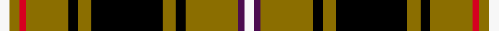

This is one **variant** — a specific cloth: this exact thread count and colourway, with its own
provenance below. It is one weaving of the [sett](/tartans/l/lo/loch-sween/) (the scale-free proportion — the
same cloth at any scale or shade), whose colour order is pattern [WBGKGKGKGRGW](/stripes/wbgkgkgkgrgw/).

Part of the [Loch Sween](/tartans/l/lo/loch-sween/) tartan — the named design grouping this sett with its other cloths.

Sourced from register-of-tartans.  It is a [12 stripe tartan](/stripes/stripes12/).

Original link [https://www.tartanregister.gov.uk/tartanDetails.aspx?ref=11081](https://www.tartanregister.gov.uk/tartanDetails.aspx?ref=11081)

Dataset <small>— provenance for this record, inherited from the source manifest</small>

<dl class="dataset-prov">
<dt>source</dt><dd><a href="/sources/register-of-tartans/">Scottish Register of Tartans</a></dd>
<dt>data captured from</dt><dd><a href="https://github.com/thetartan/tartan-database/blob/master/data/register-of-tartans/data.csv">https://github.com/thetartan/tartan-database/blob/master/data/register-of-tartans/data.csv</a></dd>
<dt>data date</dt><dd>11/06/2014 <small>(this record)</small></dd>
<dt>licence</dt><dd><a href="https://www.tartanregister.gov.uk/copyright">Crown copyright</a></dd>
</dl>

Capture chain <small>— the hands this data passed through, oldest first; each capture carries its own licence</small>

<ol class="capture-chain">
<li><a href="https://www.tartanregister.gov.uk/">Scottish Register of Tartans</a> · <a href="https://www.tartanregister.gov.uk/copyright">Crown copyright</a> <small>the living register — still published by National Records of Scotland</small></li>
<li><a href="https://github.com/thetartan/tartan-database">thetartan/tartan-database</a> <small>2016-2017</small> · <a href="https://creativecommons.org/licenses/by-nc-nd/4.0/">CC BY-NC-ND 4.0</a> <small>Levko Kravets's frozen compilation — the capture we vendored, and where its CC licence text came from</small></li>
<li>this dictionary <small>captured 2026-06-10 · commit 5bf86c7566</small> <small>each re-capture is a git commit to data/sources</small></li>
</ol>

## Register references

External register numbers recorded for this tartan.

- Scottish Register of Tartans: [11081](https://www.tartanregister.gov.uk/tartanDetails.aspx?ref=11081)

## Thread count
W/6 Y6 R4 Y26 K6 Y8 K44 Y8 K6 Y32 DP4 W/6

One full sett is **300 threads**.

## Palette
<table><thead><tr><th>Colour</th><th>Shade</th><th>OKLCh</th></tr></thead><tbody><tr><td>K</td><td><code style="background-color:#000000;">#000000</code> <small style="color:#888">#000000</small></td><td><small style="color:#888">oklch(0.0% 0.000 0.0)</small></td></tr><tr><td>DP</td><td><code style="background-color:#4B0B4F;">#4B0B4F</code> <small style="color:#888">#4B0B4F</small></td><td><small style="color:#888">oklch(30.1% 0.125 325.4)</small></td></tr><tr><td>R</td><td><code style="background-color:#D60020;">#D60020</code> <small style="color:#888">#D60020</small></td><td><small style="color:#888">oklch(55.2% 0.224 25.5)</small></td></tr><tr><td>W</td><td><code style="background-color:#F7F7F7;">#F7F7F7</code> <small style="color:#888">#F7F7F7</small></td><td><small style="color:#888">oklch(97.6% 0.000 89.9)</small></td></tr><tr><td>Y</td><td><code style="background-color:#8B6E00;">#8B6E00</code> <small style="color:#888">#8B6E00</small></td><td><small style="color:#888">oklch(55.1% 0.113 90.4)</small></td></tr></tbody></table>

# Sample pattern

## Nearest tartan variants

The nearest existing variants by ΔTartan distance, with this cloth at the top so the swatches line up against it.

ΔTartan

Threads

Variant

Sett

—

300

<a href="/variants/s12/w3y3r2y13k3y4k22y4k3y16dp2w3~x2/">Loch Sween</a>

<a href="/ttd/edit/#slug=w3ly3r2ly13k3ly4k22ly4k3ly16b2w3~x2&amp;base=w3y3r2y13k3y4k22y4k3y16dp2w3~x2" title="compare in the TTD">0.43</a>

300

<a href="/variants/s12/w3ly3r2ly13k3ly4k22ly4k3ly16b2w3~x2/">Loch Sween</a>

<a href="/ttd/edit/#slug=do1lr2k5do3k1y4k1y10k1y1~x4&amp;base=w3y3r2y13k3y4k22y4k3y16dp2w3~x2" title="compare in the TTD">2.33</a>

224

<a href="/variants/s10/do1lr2k5do3k1y4k1y10k1y1~x4/">Braemar, Camel</a>

<a href="/ttd/edit/#slug=o1w2k5o3k1oi5k1oi11k1oi1~x4~o5105048-oi5309063&amp;base=w3y3r2y13k3y4k22y4k3y16dp2w3~x2" title="compare in the TTD">2.52</a>

240

<a href="/variants/s10/o1w2k5o3k1oi5k1oi11k1oi1~x4~o5105048-oi5309063/">Braemar, or Blair Atholl</a>

<a href="/ttd/edit/#slug=dr4k2g13ly3k22dr2k2w13k7dr3k7w4~x2&amp;base=w3y3r2y13k3y4k22y4k3y16dp2w3~x2" title="compare in the TTD">2.60</a>

312

<a href="/variants/s12/dr4k2g13ly3k22dr2k2w13k7dr3k7w4~x2/">Tyrone County Crest (Fashion)</a>

<a href="/ttd/edit/#slug=k3lb7ly26k26w5k26ly26lb7k3r3~x2&amp;base=w3y3r2y13k3y4k22y4k3y16dp2w3~x2" title="compare in the TTD">2.61</a>

516

<a href="/variants/s10/k3lb7ly26k26w5k26ly26lb7k3r3~x2/">Cornish National</a>

<a href="/ttd/edit/#slug=dr4k2g13dy3k22dr2k2w13k7dr3k7w4~x2&amp;base=w3y3r2y13k3y4k22y4k3y16dp2w3~x2" title="compare in the TTD">2.72</a>

312

<a href="/variants/s12/dr4k2g13dy3k22dr2k2w13k7dr3k7w4~x2/">Tyrone County, Crest Range</a>

<a href="/ttd/edit/#slug=k4ly17k2ly2g7k2ly2k22db4~x2&amp;base=w3y3r2y13k3y4k22y4k3y16dp2w3~x2" title="compare in the TTD">2.78</a>

232

<a href="/variants/s9/k4ly17k2ly2g7k2ly2k22db4~x2/">Bro-Leon</a>

<a href="/ttd/edit/#slug=k4ly15dg5k3dg7k3dg30r20dg3~x2&amp;base=w3y3r2y13k3y4k22y4k3y16dp2w3~x2" title="compare in the TTD">2.80</a>

346

<a href="/variants/s9/k4ly15dg5k3dg7k3dg30r20dg3~x2/">MacKillen</a>

<a href="/ttd/edit/#slug=dr6k2dr2k4dr2k2dr6g18dr2lo1dr2k2dr10w1dr2~x4&amp;base=w3y3r2y13k3y4k22y4k3y16dp2w3~x2" title="compare in the TTD">2.82</a>

464

<a href="/variants/s15/dr6k2dr2k4dr2k2dr6g18dr2lo1dr2k2dr10w1dr2~x4/">Ainslie #2</a>

<a href="/ttd/edit/#slug=lo11k4o2k3y2k4lo15k32lo2k5w2~x2&amp;base=w3y3r2y13k3y4k22y4k3y16dp2w3~x2" title="compare in the TTD">2.85</a>

302

<a href="/variants/s11/lo11k4o2k3y2k4lo15k32lo2k5w2~x2/">Livingston Football Club</a>

## Neighbour map

Every grey dot is one of 13662 variants placed by the first two principal components of the ΔTartan feature space (42% of its variance). Red is this tartan; blue dots are its nearest — click one to open its page. The map is a flat projection of a many-dimensional space — [how to read it](/posts/neighbourhood-maps/).

<svg viewBox="0 0 640 380" role="img" style="max-width:100%;height:auto;border:1px solid #e0e0e0;border-radius:4px;display:block" xmlns="http://www.w3.org/2000/svg"><image href="/nn/cloud.v1.png" width="640" height="380"/><a href="/variants/s12/w3ly3r2ly13k3ly4k22ly4k3ly16b2w3~x2/"><circle cx="198.7" cy="131.6" r="4" fill="#3465a4"><title>Loch Sween</title></circle></a><a href="/variants/s10/do1lr2k5do3k1y4k1y10k1y1~x4/"><circle cx="225.4" cy="159.3" r="4" fill="#3465a4"><title>Braemar, Camel</title></circle></a><a href="/variants/s10/o1w2k5o3k1oi5k1oi11k1oi1~x4~o5105048-oi5309063/"><circle cx="243.6" cy="148.7" r="4" fill="#3465a4"><title>Braemar, or Blair Atholl</title></circle></a><a href="/variants/s12/dr4k2g13ly3k22dr2k2w13k7dr3k7w4~x2/"><circle cx="151.0" cy="137.5" r="4" fill="#3465a4"><title>Tyrone County Crest (Fashion)</title></circle></a><a href="/variants/s10/k3lb7ly26k26w5k26ly26lb7k3r3~x2/"><circle cx="138.9" cy="156.4" r="4" fill="#3465a4"><title>Cornish National</title></circle></a><a href="/variants/s12/dr4k2g13dy3k22dr2k2w13k7dr3k7w4~x2/"><circle cx="151.0" cy="136.8" r="4" fill="#3465a4"><title>Tyrone County, Crest Range</title></circle></a><a href="/variants/s9/k4ly17k2ly2g7k2ly2k22db4~x2/"><circle cx="200.0" cy="151.8" r="4" fill="#3465a4"><title>Bro-Leon</title></circle></a><a href="/variants/s9/k4ly15dg5k3dg7k3dg30r20dg3~x2/"><circle cx="212.6" cy="167.5" r="4" fill="#3465a4"><title>MacKillen</title></circle></a><a href="/variants/s15/dr6k2dr2k4dr2k2dr6g18dr2lo1dr2k2dr10w1dr2~x4/"><circle cx="246.5" cy="108.1" r="4" fill="#3465a4"><title>Ainslie #2</title></circle></a><a href="/variants/s11/lo11k4o2k3y2k4lo15k32lo2k5w2~x2/"><circle cx="259.8" cy="95.6" r="4" fill="#3465a4"><title>Livingston Football Club</title></circle></a><circle cx="204.5" cy="128.5" r="5" fill="#c00000"/><text x="320" y="376" text-anchor="middle" font-size="11" fill="#999">ground</text><text x="11" y="190" text-anchor="middle" font-size="11" fill="#999" transform="rotate(-90 11 190)">complexity</text></svg>

ID: /variants/s12/w3y3r2y13k3y4k22y4k3y16dp2w3~x2/
