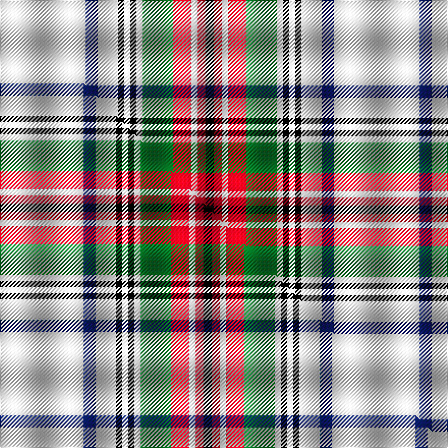

This page is one **sett** — a single exact thread-count. It belongs to the [tartan](/setts/w42db6w10k3w3k3w3g15r9w3r4k4/)
(the same proportion at any scale), whose colour order is pattern [KRWRGWKWKWBW](/stripes/krwrgwkwkwbw/).

Part of the [Braveheart](/tartans/braveheart/) tartan — the named design grouping this sett with its other cloths.

Sourced from house-of-tartan.  It is a [12 stripe tartan](/stripes/stripes12/).

Original link http://www.house-of-tartan.scotland.net/house/TartanViewjs.asp?colr=Def&tnam=2236

## Provenance

Earliest known date: pre 2002 Designed by Michael King of Aberdeen to prevent anyone else 'cashing in' on the popularity of the Braveheart film. Never been woven as far as is known.

## Thread count
W/84 DB12 W20 K6 W6 K6 W6 G30 R18 W6 R8 K/8

One full sett is **328 threads**.

## Palette
<table><thead><tr><th>Colour</th><th>Shade</th><th>OKLCh</th></tr></thead><tbody><tr><td>DB</td><td><code style="background-color:#082077;">#082077</code> <small style="color:#888">#082077</small></td><td><small style="color:#888">oklch(30.0% 0.149 265.1)</small></td></tr><tr><td>G</td><td><code style="background-color:#008B2A;">#008B2A</code> <small style="color:#888">#008B2A</small></td><td><small style="color:#888">oklch(55.4% 0.170 145.9)</small></td></tr><tr><td>K</td><td><code style="background-color:#000000;">#000000</code> <small style="color:#888">#000000</small></td><td><small style="color:#888">oklch(0.0% 0.000 0.0)</small></td></tr><tr><td>R</td><td><code style="background-color:#D60020;">#D60020</code> <small style="color:#888">#D60020</small></td><td><small style="color:#888">oklch(55.2% 0.224 25.5)</small></td></tr><tr><td>W</td><td><code style="background-color:#F7F7F7;">#F7F7F7</code> <small style="color:#888">#F7F7F7</small></td><td><small style="color:#888">oklch(97.6% 0.000 89.9)</small></td></tr></tbody></table>

# Sample pattern

## Compared to the master

This cloth is one sett of its design; the master sett (the exemplar the design is anchored on) is below for comparison.

Its **ΔTartan distance** from the master is **0.07** — the same measure the nearest-tartans table ranks by (0 is identical; a re-scale of the same cloth is near 0, a recolour or a different proportion further).

<figure class="master-compare" style="margin:0">

this sett
master sett ★

<figcaption style="color:#888;font-size:smaller">One weave of this sett against the <a href="/setts/w41db6w10k3w3k3w3g15r9w3r4k4/">master sett ★</a>, split on the diagonal: a shared proportion runs seamlessly across it with only the shades shifting; a different proportion breaks on it.</figcaption>
</figure>

## Nearest variants

The nearest existing variants by ΔTartan distance, with this cloth at the top so the swatches line up against it.

ΔTartan

Threads

Variant

Sett

—

328

<a href="/variants/s12/w42db6w10k3w3k3w3g15r9w3r4k4~x2/">Braveheart - Warrior (dress) Universal Tartan</a>

<a href="/ttd/edit/#slug=w41db6w10k3w3k3w3g15r9w3r4k4~x2&amp;base=w42db6w10k3w3k3w3g15r9w3r4k4~x2" title="compare in the TTD">0.01</a>

326

<a href="/variants/s12/w41db6w10k3w3k3w3g15r9w3r4k4~x2/">Braveheart Warrior (Dress)</a>

<a href="/ttd/edit/#slug=r2w28db4w2k6w2g7r4k1r2w1~x2&amp;base=w42db6w10k3w3k3w3g15r9w3r4k4~x2" title="compare in the TTD">2.38</a>

230

<a href="/variants/s11/r2w28db4w2k6w2g7r4k1r2w1~x2/">Rothesay, Duke of</a>

<a href="/ttd/edit/#slug=w16ly1k2ly1w16g2k1g2r22w4db3w4db3w4db3~x2&amp;base=w42db6w10k3w3k3w3g15r9w3r4k4~x2" title="compare in the TTD">2.67</a>

298

<a href="/variants/s15/w16ly1k2ly1w16g2k1g2r22w4db3w4db3w4db3~x2/">Salaberry-de-Valleyfield Cer. (Dis )</a>

<a href="/ttd/edit/#slug=w16dy1k2dy1w16g2k1g2r22w4db3w4db3w4db3~x2&amp;base=w42db6w10k3w3k3w3g15r9w3r4k4~x2" title="compare in the TTD">2.67</a>

298

<a href="/variants/s15/w16dy1k2dy1w16g2k1g2r22w4db3w4db3w4db3~x2/">Salaberry-de-Valleyfield Ceremonial</a>

<a href="/ttd/edit/#slug=w12k3w28g6k4w2k2w14r11g3r4w4~x2&amp;base=w42db6w10k3w3k3w3g15r9w3r4k4~x2" title="compare in the TTD">2.79</a>

340

<a href="/variants/s12/w12k3w28g6k4w2k2w14r11g3r4w4~x2/">Grant of Acharrow</a>

<a href="/ttd/edit/#slug=r3w28k2w2k2w2g12r8k1r1w1~x2&amp;base=w42db6w10k3w3k3w3g15r9w3r4k4~x2" title="compare in the TTD">2.89</a>

240

<a href="/variants/s11/r3w28k2w2k2w2g12r8k1r1w1~x2/">Royal Stuart / Stewart</a>

<a href="/ttd/edit/#slug=r6w56db9w8k16w4k3w4k3w36r36k3r12w3~x2&amp;base=w42db6w10k3w3k3w3g15r9w3r4k4~x2" title="compare in the TTD">2.98</a>

778

<a href="/variants/s14/r6w56db9w8k16w4k3w4k3w36r36k3r12w3~x2/">Duke of Rothesay (Royal)</a>

## Neighbour map

Every grey dot is one of 13620 variants placed by the first two principal components of the ΔTartan feature space (42% of its variance). Red is this tartan; blue dots are its nearest — click one to open its page.

<svg viewBox="0 0 640 380" role="img" style="max-width:100%;height:auto;border:1px solid #e0e0e0;border-radius:4px;display:block" xmlns="http://www.w3.org/2000/svg"><image href="/nn/cloud.v1.png" width="640" height="380"/><a href="/variants/s12/w41db6w10k3w3k3w3g15r9w3r4k4~x2/"><circle cx="229.2" cy="106.8" r="4" fill="#3465a4"><title>Braveheart Warrior (Dress)</title></circle></a><a href="/variants/s11/r2w28db4w2k6w2g7r4k1r2w1~x2/"><circle cx="246.5" cy="72.0" r="4" fill="#3465a4"><title>Rothesay, Duke of</title></circle></a><a href="/variants/s15/w16ly1k2ly1w16g2k1g2r22w4db3w4db3w4db3~x2/"><circle cx="207.0" cy="71.5" r="4" fill="#3465a4"><title>Salaberry-de-Valleyfield Cer. (Dis )</title></circle></a><a href="/variants/s15/w16dy1k2dy1w16g2k1g2r22w4db3w4db3w4db3~x2/"><circle cx="205.7" cy="70.9" r="4" fill="#3465a4"><title>Salaberry-de-Valleyfield Ceremonial</title></circle></a><a href="/variants/s12/w12k3w28g6k4w2k2w14r11g3r4w4~x2/"><circle cx="286.8" cy="137.7" r="4" fill="#3465a4"><title>Grant of Acharrow</title></circle></a><a href="/variants/s11/r3w28k2w2k2w2g12r8k1r1w1~x2/"><circle cx="262.2" cy="87.9" r="4" fill="#3465a4"><title>Royal Stuart / Stewart</title></circle></a><a href="/variants/s14/r6w56db9w8k16w4k3w4k3w36r36k3r12w3~x2/"><circle cx="251.3" cy="102.9" r="4" fill="#3465a4"><title>Duke of Rothesay (Royal)</title></circle></a><circle cx="233.4" cy="104.8" r="5" fill="#c00000"/><text x="320" y="376" text-anchor="middle" font-size="11" fill="#999">ground</text><text x="11" y="190" text-anchor="middle" font-size="11" fill="#999" transform="rotate(-90 11 190)">complexity</text></svg>

ID: /variants/s12/w42db6w10k3w3k3w3g15r9w3r4k4~x2/
