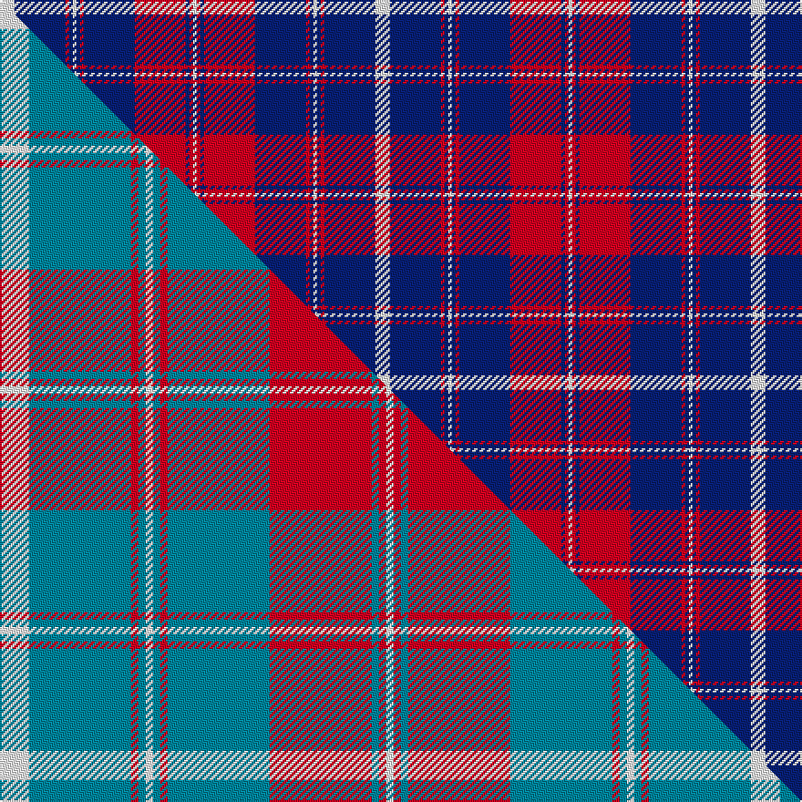

This page is one **sett** — a single exact thread-count. It belongs to the [tartan](/setts/w4db14r1db1w1db1r1db14r14db1r1w1/)
(the same proportion at any scale), whose colour order is pattern [WBRBWBRBRBRW](/stripes/wbrbwbrbrbrw/).

Part of the [Frame](/tartans/frame/) tartan — the named design grouping this sett with its other cloths.

Sourced from weddslist.  It is a [12 stripe tartan](/stripes/stripes12/).

Original link http://www.weddslist.com/cgi-bin/tartans/pg.pl?source=sts

## Provenance

Earliest known date: 1983 Designed around 1982 by Donald B. Frame of 15584 Cornell Trail, Rosemont, MN 55068. USA and registered with Scottish Tartans Society. Other STS notes say 'Robert Frame' and Archie Frame from Ayrshire.. Sindex notes add "Mr Frame wrote of the design, 'arrived at after years of doodling ... the flag colours of Britain, Scotland and the US. B&W stripes in the red: R&W in the blue with St Andrews cross in the blue. A tartan is lines and stripes at right angles to each other.'!!"

2 attestations — the source records this cloth was collapsed from (oldest owns this page)

<ul>
<li>undated — Frame (weddslist, <a href="http://www.weddslist.com/cgi-bin/tartans/pg.pl?source=sts">record</a>) </li>
<li>undated — Frame Family Tartan (house-of-tartan, <a href="http://www.house-of-tartan.scotland.net/house/TartanViewjs.asp?colr=Def&tnam=1777">record</a>) </li>
</ul>

## Thread count
W/8 DB28 R2 DB2 W2 DB2 R2 DB28 R28 DB2 R2 W/2

One full sett is **206 threads**.

## Palette
<table><thead><tr><th>Colour</th><th>Shade</th><th>OKLCh</th></tr></thead><tbody><tr><td>DB</td><td><code style="background-color:#082077;">#082077</code> <small style="color:#888">#082077</small></td><td><small style="color:#888">oklch(30.0% 0.149 265.1)</small></td></tr><tr><td>W</td><td><code style="background-color:#F7F7F7;">#F7F7F7</code> <small style="color:#888">#F7F7F7</small></td><td><small style="color:#888">oklch(97.6% 0.000 89.9)</small></td></tr><tr><td>R</td><td><code style="background-color:#D60020;">#D60020</code> <small style="color:#888">#D60020</small></td><td><small style="color:#888">oklch(55.2% 0.224 25.5)</small></td></tr></tbody></table>

# Sample pattern

## Compared to the master

This cloth is one sett of its design; the master sett (the exemplar the design is anchored on) is below for comparison.

Its **ΔTartan distance** from the master is **2.01** — the same measure the nearest-tartans table ranks by (0 is identical; a re-scale of the same cloth is near 0, a recolour or a different proportion further).

<figure class="master-compare" style="margin:0">

this sett
master sett ★

<figcaption style="color:#888;font-size:smaller">One weave of this sett against the <a href="/setts/w4t14r1t1w1t1r1t14r14t1r1w1/">master sett ★</a>, split on the diagonal: a shared proportion runs seamlessly across it with only the shades shifting; a different proportion breaks on it.</figcaption>
</figure>

## Nearest variants

The nearest existing variants by ΔTartan distance, with this cloth at the top so the swatches line up against it.

ΔTartan

Threads

Variant

Sett

—

206

<a href="/variants/s12/w4db14r1db1w1db1r1db14r14db1r1w1~x2/">Frame</a>

<a href="/ttd/edit/#slug=w4t14r1t1w1t1r1t14r14t1r1w1~x4~w4000000&amp;base=w4db14r1db1w1db1r1db14r14db1r1w1~x2" title="compare in the TTD">0.00</a>

412

<a href="/variants/s12/w4t14r1t1w1t1r1t14r14t1r1w1~x4~w4000000/">Frame</a>

<a href="/ttd/edit/#slug=w4t14r1t1w1t1r1t14r14t1r1w1~x4&amp;base=w4db14r1db1w1db1r1db14r14db1r1w1~x2" title="compare in the TTD">0.00</a>

412

<a href="/variants/s12/w4t14r1t1w1t1r1t14r14t1r1w1~x4/">Frame (Name)</a>

<a href="/ttd/edit/#slug=db3r64db3r3db62r3db3r3&amp;base=w4db14r1db1w1db1r1db14r14db1r1w1~x2" title="compare in the TTD">2.81</a>

282

<a href="/variants/s8/db3r64db3r3db62r3db3r3/">Unidentified Plaid #12</a>

<a href="/ttd/edit/#slug=db5r2db5w7db32w7r13db3r13w2~x2&amp;base=w4db14r1db1w1db1r1db14r14db1r1w1~x2" title="compare in the TTD">2.93</a>

342

<a href="/variants/s10/db5r2db5w7db32w7r13db3r13w2~x2/">America (Eagle version)</a>

## Neighbour map

Every grey dot is one of 13620 variants placed by the first two principal components of the ΔTartan feature space (42% of its variance). Red is this tartan; blue dots are its nearest — click one to open its page.

<svg viewBox="0 0 640 380" role="img" style="max-width:100%;height:auto;border:1px solid #e0e0e0;border-radius:4px;display:block" xmlns="http://www.w3.org/2000/svg"><image href="/nn/cloud.v1.png" width="640" height="380"/><a href="/variants/s12/w4t14r1t1w1t1r1t14r14t1r1w1~x4~w4000000/"><circle cx="364.6" cy="162.7" r="4" fill="#3465a4"><title>Frame</title></circle></a><a href="/variants/s12/w4t14r1t1w1t1r1t14r14t1r1w1~x4/"><circle cx="367.0" cy="163.5" r="4" fill="#3465a4"><title>Frame (Name)</title></circle></a><a href="/variants/s8/db3r64db3r3db62r3db3r3/"><circle cx="413.7" cy="155.4" r="4" fill="#3465a4"><title>Unidentified Plaid #12</title></circle></a><a href="/variants/s10/db5r2db5w7db32w7r13db3r13w2~x2/"><circle cx="281.5" cy="166.2" r="4" fill="#3465a4"><title>America (Eagle version)</title></circle></a><circle cx="334.0" cy="146.6" r="5" fill="#c00000"/><text x="320" y="376" text-anchor="middle" font-size="11" fill="#999">ground</text><text x="11" y="190" text-anchor="middle" font-size="11" fill="#999" transform="rotate(-90 11 190)">complexity</text></svg>

ID: /variants/s12/w4db14r1db1w1db1r1db14r14db1r1w1~x2/
