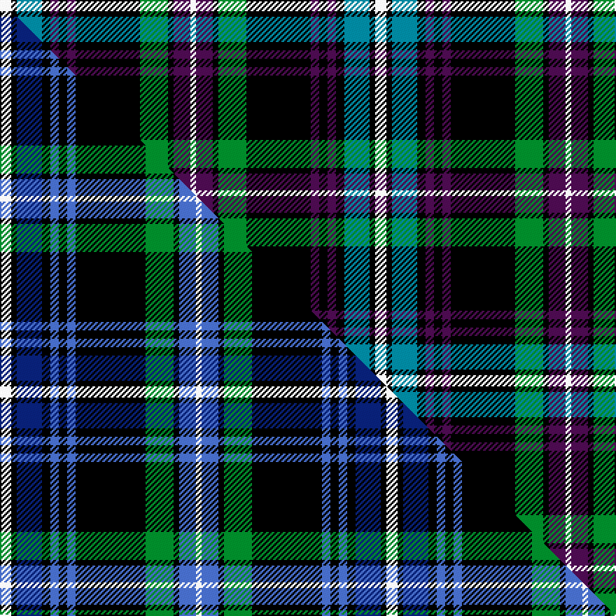

This is one **variant** — a specific cloth: this exact thread count and colourway, with its own
provenance below. It is one weaving of the [sett](/setts/w4k2t9k3dp3k3dp3k23g10k2dp6w2/) (the scale-free proportion — the
same cloth at any scale or shade), whose colour order is pattern [WBKGKBKBKBKW](/stripes/wbkgkbkbkbkw/).

Part of the [Auld Lang Syne](/tartans/auld-lang-syne-4/) tartan — the named design grouping this sett with its other cloths.

Sourced from tartans-authority.  It is a [12 stripe tartan](/stripes/stripes12/).

Original link [https://www.tartanregister.gov.uk/tartanDetails.aspx?ref=7250](https://www.tartanregister.gov.uk/tartanDetails.aspx?ref=7250)

Dataset <small>— provenance for this record, inherited from the source manifest</small>

<dl class="dataset-prov">
<dt>source</dt><dd><a href="/sources/tartans-authority/">Scottish Tartans Authority</a></dd>
<dt>data captured from</dt><dd><a href="https://github.com/thetartan/tartan-database/blob/master/data/tartans-authority/data.csv">https://github.com/thetartan/tartan-database/blob/master/data/tartans-authority/data.csv</a></dd>
<dt>data date</dt><dd>pre 2007 <small>(this record)</small></dd>
<dt>licence</dt><dd><a href="https://creativecommons.org/licenses/by-nc-nd/4.0/">CC BY-NC-ND 4.0</a></dd>
</dl>

Capture chain <small>— the hands this data passed through, oldest first; each capture carries its own licence</small>

<ol class="capture-chain">
<li><a href="https://www.tartansauthority.com/">Scottish Tartans Authority</a> <small>the heritage body's archive — its tartan-ferret record browser is retired (links repaired to the SRT, above)</small></li>
<li><a href="https://github.com/thetartan/tartan-database">thetartan/tartan-database</a> <small>2016-2017</small> · <a href="https://creativecommons.org/licenses/by-nc-nd/4.0/">CC BY-NC-ND 4.0</a> <small>Levko Kravets's frozen compilation — the capture we vendored, and where its CC licence text came from</small></li>
<li>this dictionary <small>captured 2026-06-10 · commit 5bf86c7566</small> <small>each re-capture is a git commit to data/sources</small></li>
</ol>

## Register references

External register numbers recorded for this tartan.

- Scottish Tartans Authority (ITI): 7250

## Thread count
W/8 K4 T18 K6 DP6 K6 DP6 K46 G20 K4 DP12 W/4

One full sett is **268 threads**.

## Palette
<table><thead><tr><th>Colour</th><th>Shade</th><th>OKLCh</th></tr></thead><tbody><tr><td>T</td><td><code style="background-color:#00879F;">#00879F</code> <small style="color:#888">#00879F</small></td><td><small style="color:#888">oklch(57.4% 0.102 216.1)</small></td></tr><tr><td>G</td><td><code style="background-color:#008B2A;">#008B2A</code> <small style="color:#888">#008B2A</small></td><td><small style="color:#888">oklch(55.4% 0.170 145.9)</small></td></tr><tr><td>K</td><td><code style="background-color:#000000;">#000000</code> <small style="color:#888">#000000</small></td><td><small style="color:#888">oklch(0.0% 0.000 0.0)</small></td></tr><tr><td>W</td><td><code style="background-color:#F7F7F7;">#F7F7F7</code> <small style="color:#888">#F7F7F7</small></td><td><small style="color:#888">oklch(97.6% 0.000 89.9)</small></td></tr><tr><td>DP</td><td><code style="background-color:#4B0B4F;">#4B0B4F</code> <small style="color:#888">#4B0B4F</small></td><td><small style="color:#888">oklch(30.1% 0.125 325.4)</small></td></tr></tbody></table>

# Sample pattern

## Compared to the master

This cloth is one sett of its design; the master sett (the exemplar the design is anchored on) is below for comparison.

Its **ΔTartan distance** from the master is **1.65** — the same measure the nearest-tartans table ranks by (0 is identical; a re-scale of the same cloth is near 0, a recolour or a different proportion further).

<figure class="master-compare" style="margin:0">

this sett
master sett ★

<figcaption style="color:#888;font-size:smaller">One weave of this sett against the <a href="/setts/w4k2db9k3b3k3b3k25g10k2b6w2/">master sett ★</a>, split on the diagonal: a shared proportion runs seamlessly across it with only the shades shifting; a different proportion breaks on it.</figcaption>
</figure>

## Nearest tartan variants

The nearest existing variants by ΔTartan distance, with this cloth at the top so the swatches line up against it.

ΔTartan

Threads

Variant

Sett

—

268

<a href="/variants/s12/w4k2t9k3dp3k3dp3k23g10k2dp6w2~x2/">Auld Lang Syne, Blue (Fashion)</a>

<a href="/ttd/edit/#slug=k16db2lb2db4g16r2k15db6lb2k3lb4~x2&amp;base=w4k2t9k3dp3k3dp3k23g10k2dp6w2~x2" title="compare in the TTD">1.65</a>

248

<a href="/variants/s11/k16db2lb2db4g16r2k15db6lb2k3lb4~x2/">Wilson's No.060</a>

<a href="/ttd/edit/#slug=w4k2db9k3b3k3b3k25g10k2b6w2~x2&amp;base=w4k2t9k3dp3k3dp3k23g10k2dp6w2~x2" title="compare in the TTD">1.65</a>

276

<a href="/variants/s12/w4k2db9k3b3k3b3k25g10k2b6w2~x2/">Auld Lang Syne Blue Fashion Tartan</a>

<a href="/ttd/edit/#slug=k16db2lb2db4g16y2k15db6lb2k3lb4~x2&amp;base=w4k2t9k3dp3k3dp3k23g10k2dp6w2~x2" title="compare in the TTD">1.75</a>

248

<a href="/variants/s11/k16db2lb2db4g16y2k15db6lb2k3lb4~x2/">Wilson's, No 30</a>

<a href="/ttd/edit/#slug=dp3k2n6k2n2k18g13lb2g2k6dp2~x2&amp;base=w4k2t9k3dp3k3dp3k23g10k2dp6w2~x2" title="compare in the TTD">1.80</a>

222

<a href="/variants/s11/dp3k2n6k2n2k18g13lb2g2k6dp2~x2/">Dama Resort (Fashion)</a>

<a href="/ttd/edit/#slug=dr4k2g13dy3k22dr2k2w13k7dr3k7w4~x2&amp;base=w4k2t9k3dp3k3dp3k23g10k2dp6w2~x2" title="compare in the TTD">1.82</a>

312

<a href="/variants/s12/dr4k2g13dy3k22dr2k2w13k7dr3k7w4~x2/">Tyrone County, Crest Range</a>

<a href="/ttd/edit/#slug=db8r8db42k4db4k4db4k20g4k10g25w8&amp;base=w4k2t9k3dp3k3dp3k23g10k2dp6w2~x2" title="compare in the TTD">1.92</a>

266

<a href="/variants/s12/db8r8db42k4db4k4db4k20g4k10g25w8/">Bannatyne</a>

<a href="/ttd/edit/#slug=db4k6db10k20g4y3g4k20w4db4w20db2w3&amp;base=w4k2t9k3dp3k3dp3k23g10k2dp6w2~x2" title="compare in the TTD">1.93</a>

201

<a href="/variants/s13/db4k6db10k20g4y3g4k20w4db4w20db2w3/">Gordon Dress MINI design Tartan</a>

<a href="/ttd/edit/#slug=k4b1k12w1b4w1dg4w1dr4dg12k1w2~x2&amp;base=w4k2t9k3dp3k3dp3k23g10k2dp6w2~x2" title="compare in the TTD">1.96</a>

176

<a href="/variants/s12/k4b1k12w1b4w1dg4w1dr4dg12k1w2~x2/">Glenfalloch</a>

<a href="/ttd/edit/#slug=w4k2t9k3o3k3o3k23g10k2o6w2~x2&amp;base=w4k2t9k3dp3k3dp3k23g10k2dp6w2~x2" title="compare in the TTD">1.97</a>

268

<a href="/variants/s12/w4k2t9k3o3k3o3k23g10k2o6w2~x2/">Auld Lang Syne Blue</a>

<a href="/ttd/edit/#slug=dr4k2g13ly3k22dr2k2w13k7dr3k7w4~x2&amp;base=w4k2t9k3dp3k3dp3k23g10k2dp6w2~x2" title="compare in the TTD">2.08</a>

312

<a href="/variants/s12/dr4k2g13ly3k22dr2k2w13k7dr3k7w4~x2/">Tyrone County Crest (Fashion)</a>

## Neighbour map

Every grey dot is one of 13621 variants placed by the first two principal components of the ΔTartan feature space (42% of its variance). Red is this tartan; blue dots are its nearest — click one to open its page.

<svg viewBox="0 0 640 380" role="img" style="max-width:100%;height:auto;border:1px solid #e0e0e0;border-radius:4px;display:block" xmlns="http://www.w3.org/2000/svg"><image href="/nn/cloud.v1.png" width="640" height="380"/><a href="/variants/s11/k16db2lb2db4g16r2k15db6lb2k3lb4~x2/"><circle cx="145.2" cy="155.2" r="4" fill="#3465a4"><title>Wilson's No.060</title></circle></a><a href="/variants/s12/w4k2db9k3b3k3b3k25g10k2b6w2~x2/"><circle cx="167.3" cy="121.8" r="4" fill="#3465a4"><title>Auld Lang Syne Blue Fashion Tartan</title></circle></a><a href="/variants/s11/k16db2lb2db4g16y2k15db6lb2k3lb4~x2/"><circle cx="148.7" cy="158.1" r="4" fill="#3465a4"><title>Wilson's, No 30</title></circle></a><a href="/variants/s11/dp3k2n6k2n2k18g13lb2g2k6dp2~x2/"><circle cx="175.4" cy="147.7" r="4" fill="#3465a4"><title>Dama Resort (Fashion)</title></circle></a><a href="/variants/s12/dr4k2g13dy3k22dr2k2w13k7dr3k7w4~x2/"><circle cx="151.2" cy="137.4" r="4" fill="#3465a4"><title>Tyrone County, Crest Range</title></circle></a><a href="/variants/s12/db8r8db42k4db4k4db4k20g4k10g25w8/"><circle cx="140.1" cy="140.9" r="4" fill="#3465a4"><title>Bannatyne</title></circle></a><a href="/variants/s13/db4k6db10k20g4y3g4k20w4db4w20db2w3/"><circle cx="126.3" cy="140.5" r="4" fill="#3465a4"><title>Gordon Dress MINI design Tartan</title></circle></a><a href="/variants/s12/k4b1k12w1b4w1dg4w1dr4dg12k1w2~x2/"><circle cx="125.5" cy="134.4" r="4" fill="#3465a4"><title>Glenfalloch</title></circle></a><a href="/variants/s12/w4k2t9k3o3k3o3k23g10k2o6w2~x2/"><circle cx="148.2" cy="125.9" r="4" fill="#3465a4"><title>Auld Lang Syne Blue</title></circle></a><a href="/variants/s12/dr4k2g13ly3k22dr2k2w13k7dr3k7w4~x2/"><circle cx="151.1" cy="138.1" r="4" fill="#3465a4"><title>Tyrone County Crest (Fashion)</title></circle></a><circle cx="155.3" cy="128.4" r="5" fill="#c00000"/><text x="320" y="376" text-anchor="middle" font-size="11" fill="#999">ground</text><text x="11" y="190" text-anchor="middle" font-size="11" fill="#999" transform="rotate(-90 11 190)">complexity</text></svg>

ID: /variants/s12/w4k2t9k3dp3k3dp3k23g10k2dp6w2~x2/
