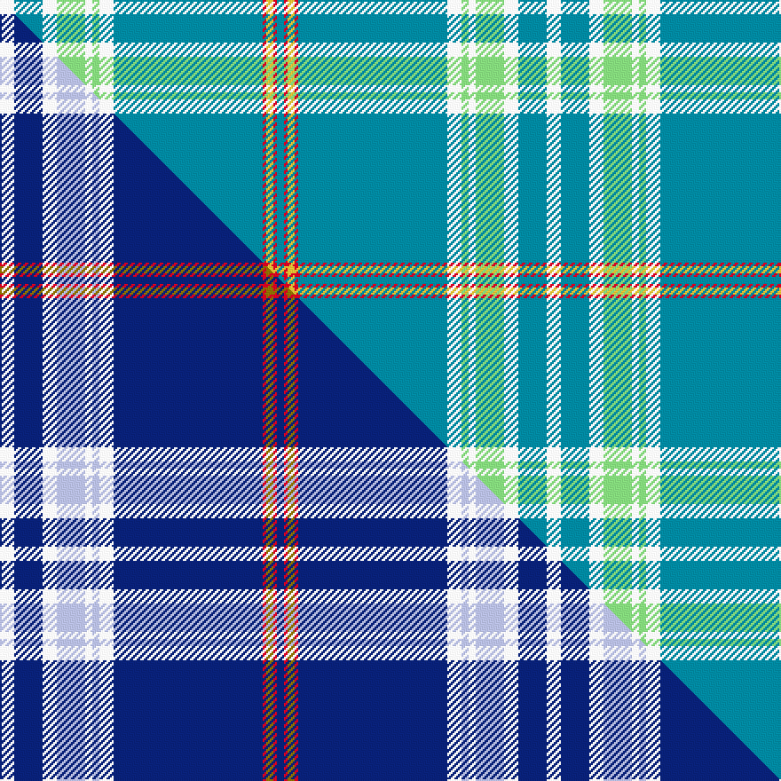

This is one **variant** — a specific cloth: this exact thread count and colourway, with its own
provenance below. It is one weaving of the [sett](/tartans/s/st/stammbar/) (the scale-free proportion — the
same cloth at any scale or shade), whose colour order is pattern [BRYRBWYWYWBW](/stripes/bryrbwywywbw/).

Part of the [StammBar](/tartans/s/st/stammbar/) tartan — the named design grouping this sett with its other cloths.

Sourced from tartans-authority.  It is a [12 stripe tartan](/stripes/stripes12/).

Original link <code>http://www.tartansauthority.com/tartan-ferret/display/11040/</code> — retired · [Internet Archive copy](https://web.archive.org/web/*/http://www.tartansauthority.com/tartan-ferret/display/11040/*)

Dataset <small>— provenance for this record, inherited from the source manifest</small>

<dl class="dataset-prov">
<dt>source</dt><dd><a href="/sources/tartans-authority/">Scottish Tartans Authority</a></dd>
<dt>data captured from</dt><dd><a href="https://github.com/thetartan/tartan-database/blob/master/data/tartans-authority/data.csv">https://github.com/thetartan/tartan-database/blob/master/data/tartans-authority/data.csv</a></dd>
<dt>data date</dt><dd>2014 <small>(this record)</small></dd>
<dt>licence</dt><dd><a href="https://creativecommons.org/licenses/by-nc-nd/4.0/">CC BY-NC-ND 4.0</a></dd>
</dl>

Capture chain <small>— the hands this data passed through, oldest first; each capture carries its own licence</small>

<ol class="capture-chain">
<li><a href="https://www.tartansauthority.com/">Scottish Tartans Authority</a> <small>the heritage body’s archive — its tartan-ferret record browser is retired; dead record links are shown unlinked, with an Internet Archive copy (ITI numbers are not SRT references)</small></li>
<li><a href="https://github.com/thetartan/tartan-database">thetartan/tartan-database</a> <small>2016-2017</small> · <a href="https://creativecommons.org/licenses/by-nc-nd/4.0/">CC BY-NC-ND 4.0</a> <small>Levko Kravets's frozen compilation — the capture we vendored, and where its CC licence text came from</small></li>
<li>this dictionary <small>captured 2026-06-10 · commit 5bf86c7566</small> <small>each re-capture is a git commit to data/sources</small></li>
</ol>

## Register references

External register numbers recorded for this tartan.

- Scottish Register of Tartans: [11040](https://www.tartanregister.gov.uk/tartanDetails?ref=11040)
- Scottish Tartans Authority (ITI): 11040

## Thread count
W/8 T16 W8 LG16 W4 LG4 W8 T84 R2 LY4 R2 T/4

One full sett is **308 threads**.

## Palette
<table><thead><tr><th>Colour</th><th>Shade</th><th>OKLCh</th></tr></thead><tbody><tr><td>T</td><td><code style="background-color:#00879F;">#00879F</code> <small style="color:#888">#00879F</small></td><td><small style="color:#888">oklch(57.4% 0.102 216.1)</small></td></tr><tr><td>LG</td><td><code style="background-color:#82D67A;">#82D67A</code> <small style="color:#888">#82D67A</small></td><td><small style="color:#888">oklch(80.1% 0.150 142.2)</small></td></tr><tr><td>R</td><td><code style="background-color:#D60020;">#D60020</code> <small style="color:#888">#D60020</small></td><td><small style="color:#888">oklch(55.2% 0.224 25.5)</small></td></tr><tr><td>W</td><td><code style="background-color:#F7F7F7;">#F7F7F7</code> <small style="color:#888">#F7F7F7</small></td><td><small style="color:#888">oklch(97.6% 0.000 89.9)</small></td></tr><tr><td>LY</td><td><code style="background-color:#DCBC32;">#DCBC32</code> <small style="color:#888">#DCBC32</small></td><td><small style="color:#888">oklch(80.0% 0.150 95.2)</small></td></tr></tbody></table>

# Sample pattern

## Compared to the master

This cloth is one sett of its design; the master sett (the exemplar the design is anchored on) is below for comparison.

Its **ΔTartan distance** from the master is **0.69** — the same measure the nearest-tartans table ranks by (0 is identical; a re-scale of the same cloth is near 0, a recolour or a different proportion further).

<figure class="master-compare" style="margin:0">

this sett
master sett ★

<figcaption style="color:#888;font-size:smaller">One weave of this sett against the <a href="/setts/w4db8w4lb8w2lb2w4db42r1y2r1db2/">master sett ★</a>, split on the diagonal: a shared proportion runs seamlessly across it with only the shades shifting; a different proportion breaks on it.</figcaption>
</figure>

## Nearest tartan variants

The nearest existing variants by ΔTartan distance, with this cloth at the top so the swatches line up against it.

ΔTartan

Threads

Variant

Sett

—

308

<a href="/variants/s12/w4t8w4lg8w2lg2w4t42r1ly2r1t2~x2/">StammBar</a>

<a href="/ttd/edit/#slug=t42w5t1w1ly9t1dg2w1t1r1~x4&amp;base=w4t8w4lg8w2lg2w4t42r1ly2r1t2~x2" title="compare in the TTD">2.48</a>

340

<a href="/variants/s10/t42w5t1w1ly9t1dg2w1t1r1~x4/">Stratford, (Oregon) City of (Dist.)</a>

<a href="/ttd/edit/#slug=g1w1g39r2w3b13w3dy2r1dy2w1~x2&amp;base=w4t8w4lg8w2lg2w4t42r1ly2r1t2~x2" title="compare in the TTD">3.54</a>

268

<a href="/variants/s11/g1w1g39r2w3b13w3dy2r1dy2w1~x2/">Schuster (Bavaria) (Personal), Benedikt</a>

<a href="/ttd/edit/#slug=lb3db1lb1r1lb1db10r1lb9t35ly2t2ly1lb2~x2&amp;base=w4t8w4lg8w2lg2w4t42r1ly2r1t2~x2" title="compare in the TTD">3.74</a>

266

<a href="/variants/s13/lb3db1lb1r1lb1db10r1lb9t35ly2t2ly1lb2~x2/">De Clercq, Christian (Belgium)</a>

<a href="/ttd/edit/#slug=t46ly1dy5ly1g5ly1dp5ly1t16r1ly4~x2~ly3307090-dy1603076&amp;base=w4t8w4lg8w2lg2w4t42r1ly2r1t2~x2" title="compare in the TTD">3.79</a>

244

<a href="/variants/s11/t46ly1dy5ly1g5ly1dp5ly1t16r1ly4~x2~ly3307090-dy1603076/">Craven County (Commemorative)</a>

<a href="/ttd/edit/#slug=g1w1g39r2w3t13w3dr2r1dr2w1~x2&amp;base=w4t8w4lg8w2lg2w4t42r1ly2r1t2~x2" title="compare in the TTD">3.99</a>

268

<a href="/variants/s11/g1w1g39r2w3t13w3dr2r1dr2w1~x2/">Schuster (Perosnal)</a>

## Neighbour map

Every grey dot is one of 13656 variants placed by the first two principal components of the ΔTartan feature space (42% of its variance). Red is this tartan; blue dots are its nearest — click one to open its page. The map is a flat projection of a many-dimensional space — [how to read it](/posts/neighbourhood-maps/).

<svg viewBox="0 0 640 380" role="img" style="max-width:100%;height:auto;border:1px solid #e0e0e0;border-radius:4px;display:block" xmlns="http://www.w3.org/2000/svg"><image href="/nn/cloud.v1.png" width="640" height="380"/><a href="/variants/s10/t42w5t1w1ly9t1dg2w1t1r1~x4/"><circle cx="475.3" cy="84.5" r="4" fill="#3465a4"><title>Stratford, (Oregon) City of (Dist.)</title></circle></a><a href="/variants/s11/g1w1g39r2w3b13w3dy2r1dy2w1~x2/"><circle cx="366.4" cy="84.0" r="4" fill="#3465a4"><title>Schuster (Bavaria) (Personal), Benedikt</title></circle></a><a href="/variants/s13/lb3db1lb1r1lb1db10r1lb9t35ly2t2ly1lb2~x2/"><circle cx="358.2" cy="91.9" r="4" fill="#3465a4"><title>De Clercq, Christian (Belgium)</title></circle></a><a href="/variants/s11/t46ly1dy5ly1g5ly1dp5ly1t16r1ly4~x2~ly3307090-dy1603076/"><circle cx="495.1" cy="84.6" r="4" fill="#3465a4"><title>Craven County (Commemorative)</title></circle></a><a href="/variants/s11/g1w1g39r2w3t13w3dr2r1dr2w1~x2/"><circle cx="379.6" cy="89.9" r="4" fill="#3465a4"><title>Schuster (Perosnal)</title></circle></a><circle cx="425.3" cy="89.3" r="5" fill="#c00000"/><text x="320" y="376" text-anchor="middle" font-size="11" fill="#999">ground</text><text x="11" y="190" text-anchor="middle" font-size="11" fill="#999" transform="rotate(-90 11 190)">complexity</text></svg>

ID: /variants/s12/w4t8w4lg8w2lg2w4t42r1ly2r1t2~x2/
