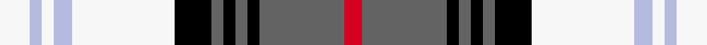

This is one **variant** — a specific cloth: this exact thread count and colourway, with its own
provenance below. It is one weaving of the [sett](/tartans/u/un/unidentified-80/) (the scale-free proportion — the
same cloth at any scale or shade), whose colour order is pattern [RBKBKBKWWWWW](/stripes/rbkbkbkwwwww/).

Part of the [Unidentified](/tartans/u/un/unidentified-80/) tartan — the named design grouping this sett with its other cloths.

Sourced from tartans-authority.  It is a [12 stripe tartan](/stripes/stripes12/).

Original link <code>http://www.tartansauthority.com/tartan-ferret/display/8544/</code> — retired · [Internet Archive copy](https://web.archive.org/web/*/http://www.tartansauthority.com/tartan-ferret/display/8544/*)

Dataset <small>— provenance for this record, inherited from the source manifest</small>

<dl class="dataset-prov">
<dt>source</dt><dd><a href="/sources/tartans-authority/">Scottish Tartans Authority</a></dd>
<dt>data captured from</dt><dd><a href="https://github.com/thetartan/tartan-database/blob/master/data/tartans-authority/data.csv">https://github.com/thetartan/tartan-database/blob/master/data/tartans-authority/data.csv</a></dd>
<dt>data date</dt><dd>pre 2012 <small>(this record)</small></dd>
<dt>licence</dt><dd><a href="https://creativecommons.org/licenses/by-nc-nd/4.0/">CC BY-NC-ND 4.0</a></dd>
</dl>

Capture chain <small>— the hands this data passed through, oldest first; each capture carries its own licence</small>

<ol class="capture-chain">
<li><a href="https://www.tartansauthority.com/">Scottish Tartans Authority</a> <small>the heritage body’s archive — its tartan-ferret record browser is retired; dead record links are shown unlinked, with an Internet Archive copy (ITI numbers are not SRT references)</small></li>
<li><a href="https://github.com/thetartan/tartan-database">thetartan/tartan-database</a> <small>2016-2017</small> · <a href="https://creativecommons.org/licenses/by-nc-nd/4.0/">CC BY-NC-ND 4.0</a> <small>Levko Kravets's frozen compilation — the capture we vendored, and where its CC licence text came from</small></li>
<li>this dictionary <small>captured 2026-06-10 · commit 5bf86c7566</small> <small>each re-capture is a git commit to data/sources</small></li>
</ol>

## Register references

External register numbers recorded for this tartan.

- Scottish Register of Tartans: [8544](https://www.tartanregister.gov.uk/tartanDetails?ref=8544)
- Scottish Tartans Authority (ITI): 8544

## Thread count
W/10 LB4 W4 LB6 W34 K12 N4 K4 N4 K4 N28 R/6

One full sett is **224 threads**.

## Palette
<table><thead><tr><th>Colour</th><th>Shade</th><th>OKLCh</th></tr></thead><tbody><tr><td>LB</td><td><code style="background-color:#B5BBDE;">#B5BBDE</code> <small style="color:#888">#B5BBDE</small></td><td><small style="color:#888">oklch(79.9% 0.050 277.6)</small></td></tr><tr><td>K</td><td><code style="background-color:#000000;">#000000</code> <small style="color:#888">#000000</small></td><td><small style="color:#888">oklch(0.0% 0.000 0.0)</small></td></tr><tr><td>W</td><td><code style="background-color:#F7F7F7;">#F7F7F7</code> <small style="color:#888">#F7F7F7</small></td><td><small style="color:#888">oklch(97.6% 0.000 89.9)</small></td></tr><tr><td>N</td><td><code style="background-color:#636363;">#636363</code> <small style="color:#888">#636363</small></td><td><small style="color:#888">oklch(50.0% 0.000 89.9)</small></td></tr><tr><td>R</td><td><code style="background-color:#D60020;">#D60020</code> <small style="color:#888">#D60020</small></td><td><small style="color:#888">oklch(55.2% 0.224 25.5)</small></td></tr></tbody></table>

# Sample pattern

## Nearest tartan variants

The nearest existing variants by ΔTartan distance, with this cloth at the top so the swatches line up against it.

ΔTartan

Threads

Variant

Sett

—

224

<a href="/variants/s12/w5lb2w2lb3w17k6n2k2n2k2n14r3~x2/">Unidentified (Fashion)</a>

<a href="/ttd/edit/#slug=lo2db2w2r1w2db10w1k2lo10w1lo2~x4&amp;base=w5lb2w2lb3w17k6n2k2n2k2n14r3~x2" title="compare in the TTD">1.63</a>

264

<a href="/variants/s11/lo2db2w2r1w2db10w1k2lo10w1lo2~x4/">Bear Baars (Personal)</a>

<a href="/ttd/edit/#slug=r5w2lb20dy2k16w18k2w5~x2&amp;base=w5lb2w2lb3w17k6n2k2n2k2n14r3~x2" title="compare in the TTD">2.25</a>

260

<a href="/variants/s8/r5w2lb20dy2k16w18k2w5~x2/">Ailsa Craig (District)</a>

<a href="/ttd/edit/#slug=w5g2w23k7db4k3db3k3db11r2db2r3~x2&amp;base=w5lb2w2lb3w17k6n2k2n2k2n14r3~x2" title="compare in the TTD">2.31</a>

256

<a href="/variants/s12/w5g2w23k7db4k3db3k3db11r2db2r3~x2/">Sutherland, Dress</a>

<a href="/ttd/edit/#slug=dr1o6ly2w1k8w1ly2w9k1w4dy1~x4~o2500000&amp;base=w5lb2w2lb3w17k6n2k2n2k2n14r3~x2" title="compare in the TTD">2.42</a>

280

<a href="/variants/s11/dr1o6ly2w1k8w1ly2w9k1w4dy1~x4~o2500000/">Kintyre</a>

<a href="/ttd/edit/#slug=r5w2o20dy2k16w18k2w5~x2~r2109032-o2500000&amp;base=w5lb2w2lb3w17k6n2k2n2k2n14r3~x2" title="compare in the TTD">2.44</a>

260

<a href="/variants/s8/r5w2o20dy2k16w18k2w5~x2~r2109032-o2500000/">Ailsa Craig</a>

<a href="/ttd/edit/#slug=w1r1db8lb1k1w8k1lo8lb1lo1db8lb1lo1~x6&amp;base=w5lb2w2lb3w17k6n2k2n2k2n14r3~x2" title="compare in the TTD">2.46</a>

480

<a href="/variants/s13/w1r1db8lb1k1w8k1lo8lb1lo1db8lb1lo1~x6/">Robieson Kith &amp; Kin (Personal)</a>

<a href="/ttd/edit/#slug=dr1n6ly2w1k8w1ly2w9k1w4dy1~x4&amp;base=w5lb2w2lb3w17k6n2k2n2k2n14r3~x2" title="compare in the TTD">2.48</a>

280

<a href="/variants/s11/dr1n6ly2w1k8w1ly2w9k1w4dy1~x4/">Kintyre (Fashion)</a>

<a href="/ttd/edit/#slug=g4b3g3b4g4k8g3k9w29r2w4r2~x2&amp;base=w5lb2w2lb3w17k6n2k2n2k2n14r3~x2" title="compare in the TTD">2.49</a>

288

<a href="/variants/s12/g4b3g3b4g4k8g3k9w29r2w4r2~x2/">Ross, hunting dress</a>

<a href="/ttd/edit/#slug=g5y2lb20w2k20w20k2w5~x2&amp;base=w5lb2w2lb3w17k6n2k2n2k2n14r3~x2" title="compare in the TTD">2.49</a>

284

<a href="/variants/s8/g5y2lb20w2k20w20k2w5~x2/">Alexander Brothers - 2007? (Corp.)</a>

<a href="/ttd/edit/#slug=lb10w18lb4lo6lb45k30lb4k4y4r4y4r4y4&amp;base=w5lb2w2lb3w17k6n2k2n2k2n14r3~x2" title="compare in the TTD">2.49</a>

268

<a href="/variants/s13/lb10w18lb4lo6lb45k30lb4k4y4r4y4r4y4/">Les Coeurs de Lions en Bleu</a>

## Neighbour map

Every grey dot is one of 13656 variants placed by the first two principal components of the ΔTartan feature space (42% of its variance). Red is this tartan; blue dots are its nearest — click one to open its page. The map is a flat projection of a many-dimensional space — [how to read it](/posts/neighbourhood-maps/).

<svg viewBox="0 0 640 380" role="img" style="max-width:100%;height:auto;border:1px solid #e0e0e0;border-radius:4px;display:block" xmlns="http://www.w3.org/2000/svg"><image href="/nn/cloud.v1.png" width="640" height="380"/><a href="/variants/s11/lo2db2w2r1w2db10w1k2lo10w1lo2~x4/"><circle cx="152.1" cy="141.6" r="4" fill="#3465a4"><title>Bear Baars (Personal)</title></circle></a><a href="/variants/s8/r5w2lb20dy2k16w18k2w5~x2/"><circle cx="107.7" cy="163.5" r="4" fill="#3465a4"><title>Ailsa Craig (District)</title></circle></a><a href="/variants/s12/w5g2w23k7db4k3db3k3db11r2db2r3~x2/"><circle cx="135.3" cy="127.4" r="4" fill="#3465a4"><title>Sutherland, Dress</title></circle></a><a href="/variants/s11/dr1o6ly2w1k8w1ly2w9k1w4dy1~x4~o2500000/"><circle cx="106.4" cy="142.7" r="4" fill="#3465a4"><title>Kintyre</title></circle></a><a href="/variants/s8/r5w2o20dy2k16w18k2w5~x2~r2109032-o2500000/"><circle cx="106.3" cy="161.9" r="4" fill="#3465a4"><title>Ailsa Craig</title></circle></a><a href="/variants/s13/w1r1db8lb1k1w8k1lo8lb1lo1db8lb1lo1~x6/"><circle cx="105.8" cy="131.0" r="4" fill="#3465a4"><title>Robieson Kith &amp; Kin (Personal)</title></circle></a><a href="/variants/s11/dr1n6ly2w1k8w1ly2w9k1w4dy1~x4/"><circle cx="106.2" cy="142.4" r="4" fill="#3465a4"><title>Kintyre (Fashion)</title></circle></a><a href="/variants/s12/g4b3g3b4g4k8g3k9w29r2w4r2~x2/"><circle cx="149.5" cy="110.2" r="4" fill="#3465a4"><title>Ross, hunting dress</title></circle></a><a href="/variants/s8/g5y2lb20w2k20w20k2w5~x2/"><circle cx="114.4" cy="167.9" r="4" fill="#3465a4"><title>Alexander Brothers - 2007? (Corp.)</title></circle></a><a href="/variants/s13/lb10w18lb4lo6lb45k30lb4k4y4r4y4r4y4/"><circle cx="131.4" cy="101.9" r="4" fill="#3465a4"><title>Les Coeurs de Lions en Bleu</title></circle></a><circle cx="122.1" cy="143.9" r="5" fill="#c00000"/><text x="320" y="376" text-anchor="middle" font-size="11" fill="#999">ground</text><text x="11" y="190" text-anchor="middle" font-size="11" fill="#999" transform="rotate(-90 11 190)">complexity</text></svg>

ID: /variants/s12/w5lb2w2lb3w17k6n2k2n2k2n14r3~x2/
