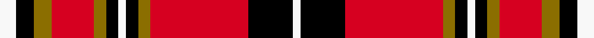

This is one **variant** — a specific cloth: this exact thread count and colourway, with its own
provenance below. It is one weaving of the [sett](/setts/w8k9y9r21y6k6w4k6y6r49k22w4/) (the scale-free proportion — the
same cloth at any scale or shade), whose colour order is pattern [WKGRGKWKGRKW](/stripes/wkgrgkwkgrkw/).

Sourced from register-of-tartans.  It is a [12 stripe tartan](/stripes/stripes12/).

Original link [https://www.tartanregister.gov.uk/tartanDetails.aspx?ref=3148](https://www.tartanregister.gov.uk/tartanDetails.aspx?ref=3148)

2 attestations — the source records this cloth was collapsed from (oldest owns this page)

<ul>
<li>01/04/2005 — Normandy (Fashion) (register-of-tartans, <a href="https://www.tartanregister.gov.uk/tartanDetails.aspx?ref=3148">record</a>)  <em>Commemorating the links between Scotland and Normandy, the red and yellow are the colours of the Normandy flag and black and white are the ancient colours of the North Men. Applicant requested the STA categorise the tartan as a District tartan but until such time as there is official approval from an appropriate authority in Normandy, it can only be categorised as 'Fashion'.</em></li>
<li>2005 April — Normandy (Fashion) (tartans-authority, <a href="https://www.tartanregister.gov.uk/tartanDetails.aspx?ref=6658">record</a>)  <em>Commemorating the links between Scotland and Normandy, the red and yellow are the colours of the Normandy flag and black and white are the ancient colours of the North Men (?). Applicant asked for this to be categorised as a District tartan but until such time as there is official approval from a responsible government or local government body in Normandy, it can only be categorised as 'Fashion'. Woven sample from Lady Chrystel 18.5.15.</em></li>
</ul>

Dataset <small>— provenance for this record, inherited from the source manifest</small>

<dl class="dataset-prov">
<dt>source</dt><dd><a href="/sources/register-of-tartans/">Scottish Register of Tartans</a></dd>
<dt>data captured from</dt><dd><a href="https://github.com/thetartan/tartan-database/blob/master/data/register-of-tartans/data.csv">https://github.com/thetartan/tartan-database/blob/master/data/register-of-tartans/data.csv</a></dd>
<dt>data date</dt><dd>01/04/2005 <small>(this record)</small></dd>
<dt>licence</dt><dd><a href="https://www.tartanregister.gov.uk/copyright">Crown copyright</a></dd>
</dl>

Capture chain <small>— the hands this data passed through, oldest first; each capture carries its own licence</small>

<ol class="capture-chain">
<li><a href="https://www.tartanregister.gov.uk/">Scottish Register of Tartans</a> · <a href="https://www.tartanregister.gov.uk/copyright">Crown copyright</a> <small>the living register — still published by National Records of Scotland</small></li>
<li><a href="https://github.com/thetartan/tartan-database">thetartan/tartan-database</a> <small>2016-2017</small> · <a href="https://creativecommons.org/licenses/by-nc-nd/4.0/">CC BY-NC-ND 4.0</a> <small>Levko Kravets's frozen compilation — the capture we vendored, and where its CC licence text came from</small></li>
<li>this dictionary <small>captured 2026-06-10 · commit 5bf86c7566</small> <small>each re-capture is a git commit to data/sources</small></li>
</ol>

## Register references

External register numbers recorded for this tartan.

- Scottish Register of Tartans: [3148](https://www.tartanregister.gov.uk/tartanDetails.aspx?ref=3148)
- Scottish Tartans Authority (ITI): 6658

## Thread count
W/8 K9 Y9 R21 Y6 K6 W4 K6 Y6 R49 K22 W/4

One full sett is **288 threads**.

## Palette
<table><thead><tr><th>Colour</th><th>Shade</th><th>OKLCh</th></tr></thead><tbody><tr><td>K</td><td><code style="background-color:#000000;">#000000</code> <small style="color:#888">#000000</small></td><td><small style="color:#888">oklch(0.0% 0.000 0.0)</small></td></tr><tr><td>W</td><td><code style="background-color:#E8CCB8;">#E8CCB8</code> <small style="color:#888">#E8CCB8</small></td><td><small style="color:#888">oklch(86.3% 0.042 57.7)</small></td></tr><tr><td>LO</td><td><code style="background-color:#EC8048;">#EC8048</code> <small style="color:#888">#EC8048</small></td><td><small style="color:#888">oklch(71.0% 0.150 46.4)</small></td></tr><tr><td>LO</td><td><code style="background-color:#D87C00;">#D87C00</code> <small style="color:#888">#D87C00</small></td><td><small style="color:#888">oklch(67.3% 0.155 61.8)</small></td></tr><tr><td>R</td><td><code style="background-color:#D60020;">#D60020</code> <small style="color:#888">#D60020</small></td><td><small style="color:#888">oklch(55.2% 0.224 25.5)</small></td></tr><tr><td>W</td><td><code style="background-color:#F8F8F8;">#F8F8F8</code> <small style="color:#888">#F8F8F8</small></td><td><small style="color:#888">oklch(97.9% 0.000 89.9)</small></td></tr><tr><td>Y</td><td><code style="background-color:#8B6E00;">#8B6E00</code> <small style="color:#888">#8B6E00</small></td><td><small style="color:#888">oklch(55.1% 0.113 90.4)</small></td></tr></tbody></table>

# Sample pattern

## Nearest tartan variants

The nearest existing variants by ΔTartan distance, with this cloth at the top so the swatches line up against it.

ΔTartan

Threads

Variant

Sett

—

288

<a href="/variants/s12/w8k9y9r21y6k6w4k6y6r49k22w4/">Normandy (Fashion)</a>

<a href="/ttd/edit/#slug=db6k3r2k3r31k6ly2k6ly13k2ly2~x2&amp;base=w8k9y9r21y6k6w4k6y6r49k22w4" title="compare in the TTD">1.60</a>

288

<a href="/variants/s11/db6k3r2k3r31k6ly2k6ly13k2ly2~x2/">Rourke-Frew (Name)</a>

<a href="/ttd/edit/#slug=k9r4k2r4k2r29k9r4lg14y2~x2&amp;base=w8k9y9r21y6k6w4k6y6r49k22w4" title="compare in the TTD">1.72</a>

294

<a href="/variants/s10/k9r4k2r4k2r29k9r4lg14y2~x2/">Hannay Dress (Dance)</a>

<a href="/ttd/edit/#slug=k10lb1k1r10lb1k1lb1r10g6r2~x2&amp;base=w8k9y9r21y6k6w4k6y6r49k22w4" title="compare in the TTD">2.04</a>

148

<a href="/variants/s10/k10lb1k1r10lb1k1lb1r10g6r2~x2/">Scoepaig fragment Artifact Tartan</a>

<a href="/ttd/edit/#slug=k2db2r26dg25k13db13r26db2k2~x2~r2609032&amp;base=w8k9y9r21y6k6w4k6y6r49k22w4" title="compare in the TTD">2.14</a>

436

<a href="/variants/s9/k2db2r26dg25k13db13r26db2k2~x2~r2609032/">MacNaughton (Logan) #2</a>

<a href="/ttd/edit/#slug=r5k1r2k2r16lb2r2k9r2g2r2g13r2k2r4~x2&amp;base=w8k9y9r21y6k6w4k6y6r49k22w4" title="compare in the TTD">2.26</a>

246

<a href="/variants/s15/r5k1r2k2r16lb2r2k9r2g2r2g13r2k2r4~x2/">Unidentified No 3 #2</a>

<a href="/ttd/edit/#slug=w3k1r15k6r5k3r8k2r5y3w2y4k1w3~x2&amp;base=w8k9y9r21y6k6w4k6y6r49k22w4" title="compare in the TTD">2.40</a>

232

<a href="/variants/s14/w3k1r15k6r5k3r8k2r5y3w2y4k1w3~x2/">Avalon - Stewart House</a>

<a href="/ttd/edit/#slug=y4k2r7k15r3k3r3k7r28dg7r6dg2&amp;base=w8k9y9r21y6k6w4k6y6r49k22w4" title="compare in the TTD">2.46</a>

168

<a href="/variants/s12/y4k2r7k15r3k3r3k7r28dg7r6dg2/">Walker</a>

<a href="/ttd/edit/#slug=lb2k2r27g27k12lb12r27k2lb2~x2&amp;base=w8k9y9r21y6k6w4k6y6r49k22w4" title="compare in the TTD">2.56</a>

444

<a href="/variants/s9/lb2k2r27g27k12lb12r27k2lb2~x2/">MacNaughton</a>

<a href="/ttd/edit/#slug=db1k1r12g12k6db5r12k1db1~x2&amp;base=w8k9y9r21y6k6w4k6y6r49k22w4" title="compare in the TTD">2.59</a>

200

<a href="/variants/s9/db1k1r12g12k6db5r12k1db1~x2/">Montrose Clan Tartan</a>

<a href="/ttd/edit/#slug=g4r2k2r20lb1k7r2g10r3k2~x2&amp;base=w8k9y9r21y6k6w4k6y6r49k22w4" title="compare in the TTD">2.60</a>

200

<a href="/variants/s10/g4r2k2r20lb1k7r2g10r3k2~x2/">MacKillop (Scottish Tartan Society)</a>

## Neighbour map

Every grey dot is one of 13621 variants placed by the first two principal components of the ΔTartan feature space (42% of its variance). Red is this tartan; blue dots are its nearest — click one to open its page.

<svg viewBox="0 0 640 380" role="img" style="max-width:100%;height:auto;border:1px solid #e0e0e0;border-radius:4px;display:block" xmlns="http://www.w3.org/2000/svg"><image href="/nn/cloud.v1.png" width="640" height="380"/><a href="/variants/s11/db6k3r2k3r31k6ly2k6ly13k2ly2~x2/"><circle cx="194.0" cy="112.0" r="4" fill="#3465a4"><title>Rourke-Frew (Name)</title></circle></a><a href="/variants/s10/k9r4k2r4k2r29k9r4lg14y2~x2/"><circle cx="232.4" cy="128.3" r="4" fill="#3465a4"><title>Hannay Dress (Dance)</title></circle></a><a href="/variants/s10/k10lb1k1r10lb1k1lb1r10g6r2~x2/"><circle cx="215.0" cy="150.0" r="4" fill="#3465a4"><title>Scoepaig fragment Artifact Tartan</title></circle></a><a href="/variants/s9/k2db2r26dg25k13db13r26db2k2~x2~r2609032/"><circle cx="193.0" cy="154.0" r="4" fill="#3465a4"><title>MacNaughton (Logan) #2</title></circle></a><a href="/variants/s15/r5k1r2k2r16lb2r2k9r2g2r2g13r2k2r4~x2/"><circle cx="239.0" cy="113.1" r="4" fill="#3465a4"><title>Unidentified No 3 #2</title></circle></a><a href="/variants/s14/w3k1r15k6r5k3r8k2r5y3w2y4k1w3~x2/"><circle cx="219.6" cy="128.9" r="4" fill="#3465a4"><title>Avalon - Stewart House</title></circle></a><a href="/variants/s12/y4k2r7k15r3k3r3k7r28dg7r6dg2/"><circle cx="252.9" cy="124.8" r="4" fill="#3465a4"><title>Walker</title></circle></a><a href="/variants/s9/lb2k2r27g27k12lb12r27k2lb2~x2/"><circle cx="206.9" cy="154.6" r="4" fill="#3465a4"><title>MacNaughton</title></circle></a><a href="/variants/s9/db1k1r12g12k6db5r12k1db1~x2/"><circle cx="200.1" cy="161.1" r="4" fill="#3465a4"><title>Montrose Clan Tartan</title></circle></a><a href="/variants/s10/g4r2k2r20lb1k7r2g10r3k2~x2/"><circle cx="250.6" cy="119.7" r="4" fill="#3465a4"><title>MacKillop (Scottish Tartan Society)</title></circle></a><circle cx="191.3" cy="129.3" r="5" fill="#c00000"/><text x="320" y="376" text-anchor="middle" font-size="11" fill="#999">ground</text><text x="11" y="190" text-anchor="middle" font-size="11" fill="#999" transform="rotate(-90 11 190)">complexity</text></svg>

ID: /variants/s12/w8k9y9r21y6k6w4k6y6r49k22w4/
