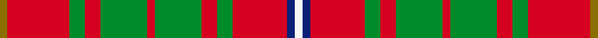

This is one **variant** — a specific cloth: this exact thread count and colourway, with its own
provenance below. It is one weaving of the [sett](/tartans/b/br/bruce-county/) (the scale-free proportion — the
same cloth at any scale or shade), whose colour order is pattern [GRGRGRGRGRBW](/stripes/grgrgrgrgrbw/).

Part of the [Bruce County](/tartans/b/br/bruce-county/) tartan — the named design grouping this sett with its other cloths.

Sourced from house-of-tartan.  It is a [12 stripe tartan](/stripes/stripes12/).

Original link [http://www.house-of-tartan.scotland.net/house/TartanViewjs.asp?colr=Def&tnam=1778](http://www.house-of-tartan.scotland.net/house/TartanViewjs.asp?colr=Def&tnam=1778)

## Provenance

Earliest known date: 1964 Bruce County is an administrative district of the Province of Ontario. The design is attributed to Lord Bruce, the son of the Earl of Elgin, and chief of the Clan Bruce, for his role in adapting the Bruce clan tartan. Two blue stripes have been added to represent the coastline of Lake Huron and Georgian Bay.

2 attestations — the source records this cloth was collapsed from (oldest owns this page)

<ul>
<li>1964 — Bruce County District Tartan (house-of-tartan, <a href="http://www.house-of-tartan.scotland.net/house/TartanViewjs.asp?colr=Def&tnam=1778">record</a>) </li>
<li>undated — Bruce County (weddslist, <a href="http://www.weddslist.com/cgi-bin/tartans/pg.pl?source=sts">record</a>) </li>
</ul>

Dataset <small>— provenance for this record, inherited from the source manifest</small>

<dl class="dataset-prov">
<dt>source</dt><dd><a href="/sources/house-of-tartan/">House of Tartan</a></dd>
<dt>data captured from</dt><dd><a href="https://github.com/thetartan/tartan-database/blob/master/data/house-of-tartan/data.csv">https://github.com/thetartan/tartan-database/blob/master/data/house-of-tartan/data.csv</a></dd>
<dt>data date</dt><dd>1964 <small>(this record)</small></dd>
<dt>licence</dt><dd><a href="https://creativecommons.org/licenses/by-nc-nd/4.0/">CC BY-NC-ND 4.0</a></dd>
</dl>

Capture chain <small>— the hands this data passed through, oldest first; each capture carries its own licence</small>

<ol class="capture-chain">
<li><a href="http://www.house-of-tartan.scotland.net/">House of Tartan</a> <small>the weaver/retailer's database — the site is now offline; the URL is kept as the ultimate source's identity</small></li>
<li><a href="https://github.com/thetartan/tartan-database">thetartan/tartan-database</a> <small>2016-2017</small> · <a href="https://creativecommons.org/licenses/by-nc-nd/4.0/">CC BY-NC-ND 4.0</a> <small>Levko Kravets's frozen compilation — the capture we vendored, and where its CC licence text came from</small></li>
<li>this dictionary <small>captured 2026-06-10 · commit 5bf86c7566</small> <small>each re-capture is a git commit to data/sources</small></li>
</ol>

## Thread count
Y/2 R16 G4 R4 G12 R2 G12 R4 G4 R14 DB2 W/2

One full sett is **152 threads**.

## Palette
<table><thead><tr><th>Colour</th><th>Shade</th><th>OKLCh</th></tr></thead><tbody><tr><td>DB</td><td><code style="background-color:#082077;">#082077</code> <small style="color:#888">#082077</small></td><td><small style="color:#888">oklch(30.0% 0.149 265.1)</small></td></tr><tr><td>G</td><td><code style="background-color:#008B2A;">#008B2A</code> <small style="color:#888">#008B2A</small></td><td><small style="color:#888">oklch(55.4% 0.170 145.9)</small></td></tr><tr><td>W</td><td><code style="background-color:#F7F7F7;">#F7F7F7</code> <small style="color:#888">#F7F7F7</small></td><td><small style="color:#888">oklch(97.6% 0.000 89.9)</small></td></tr><tr><td>R</td><td><code style="background-color:#D60020;">#D60020</code> <small style="color:#888">#D60020</small></td><td><small style="color:#888">oklch(55.2% 0.224 25.5)</small></td></tr><tr><td>Y</td><td><code style="background-color:#8B6E00;">#8B6E00</code> <small style="color:#888">#8B6E00</small></td><td><small style="color:#888">oklch(55.1% 0.113 90.4)</small></td></tr></tbody></table>

# Sample pattern

[Sample sheet (PDF)](swatch.pdf) — the woven sample, thread count and palette on one printable A4, rendered on demand (the same sheet the TTD print page downloads).

## Nearest tartan variants

The nearest existing variants by ΔTartan distance, with this cloth at the top so the swatches line up against it.

ΔTartan

Threads

Variant

Sett

—

152

<a href="/variants/s12/y1r8g2r2g6r1g6r2g2r7db1w1~x2/">Bruce County District Tartan</a>

<a href="/ttd/edit/#slug=y1r8g2r2g6r1g6r2g2r7db1w1~x4&amp;base=y1r8g2r2g6r1g6r2g2r7db1w1~x2" title="compare in the TTD">0.00</a>

304

<a href="/variants/s12/y1r8g2r2g6r1g6r2g2r7db1w1~x4/">Bruce County</a>

<a href="/ttd/edit/#slug=w1db1r7g2r2g6r1g6r2g2r8lo1~x4&amp;base=y1r8g2r2g6r1g6r2g2r7db1w1~x2" title="compare in the TTD">0.30</a>

304

<a href="/variants/s12/w1db1r7g2r2g6r1g6r2g2r8lo1~x4/">Bruce County (District)</a>

<a href="/ttd/edit/#slug=y1r8g2r2g6r1g6r2g2r8w1~x2&amp;base=y1r8g2r2g6r1g6r2g2r7db1w1~x2" title="compare in the TTD">0.36</a>

152

<a href="/variants/s11/y1r8g2r2g6r1g6r2g2r8w1~x2/">Bruce</a>

<a href="/ttd/edit/#slug=y1r8g2r2g6r1g6r2g2r8w1~x4&amp;base=y1r8g2r2g6r1g6r2g2r7db1w1~x2" title="compare in the TTD">0.36</a>

304

<a href="/variants/s11/y1r8g2r2g6r1g6r2g2r8w1~x4/">Bruce (Vestiarium)</a>

<a href="/ttd/edit/#slug=r8g2r2g6r1g6r2g2r8y1&amp;base=y1r8g2r2g6r1g6r2g2r7db1w1~x2" title="compare in the TTD">0.66</a>

67

<a href="/variants/s10/r8g2r2g6r1g6r2g2r8y1/">Bruce</a>

<a href="/ttd/edit/#slug=y1r4g1r1g3r1g3r1g1r4w1~x2&amp;base=y1r8g2r2g6r1g6r2g2r7db1w1~x2" title="compare in the TTD">0.81</a>

80

<a href="/variants/s11/y1r4g1r1g3r1g3r1g1r4w1~x2/">Bruce</a>

<a href="/ttd/edit/#slug=g21r5g21r21g5r4g5r21w4r5db21r4&amp;base=y1r8g2r2g6r1g6r2g2r7db1w1~x2" title="compare in the TTD">1.89</a>

249

<a href="/variants/s12/g21r5g21r21g5r4g5r21w4r5db21r4/">MacRae (Sample)</a>

<a href="/ttd/edit/#slug=dp3r4g3db3r7g17r3db5g4r21g7dp3r6w3~x2&amp;base=y1r8g2r2g6r1g6r2g2r7db1w1~x2" title="compare in the TTD">2.05</a>

344

<a href="/variants/s14/dp3r4g3db3r7g17r3db5g4r21g7dp3r6w3~x2/">MacKinnon #3</a>

<a href="/ttd/edit/#slug=w2r4lb2g8r16g2db4r2g16r6db2g2r3lb2~x2&amp;base=y1r8g2r2g6r1g6r2g2r7db1w1~x2" title="compare in the TTD">2.11</a>

276

<a href="/variants/s14/w2r4lb2g8r16g2db4r2g16r6db2g2r3lb2~x2/">MacKinnon #2</a>

<a href="/ttd/edit/#slug=dp2r3g2db2r6g16r2db4g2r16g8dp2r4w2~x2&amp;base=y1r8g2r2g6r1g6r2g2r7db1w1~x2" title="compare in the TTD">2.11</a>

276

<a href="/variants/s14/dp2r3g2db2r6g16r2db4g2r16g8dp2r4w2~x2/">MacKinnon</a>

## Neighbour map

Every grey dot is one of 13662 variants placed by the first two principal components of the ΔTartan feature space (42% of its variance). Red is this tartan; blue dots are its nearest — click one to open its page. The map is a flat projection of a many-dimensional space — [how to read it](/posts/neighbourhood-maps/).

<svg viewBox="0 0 640 380" role="img" style="max-width:100%;height:auto;border:1px solid #e0e0e0;border-radius:4px;display:block" xmlns="http://www.w3.org/2000/svg"><image href="/nn/cloud.v1.png" width="640" height="380"/><a href="/variants/s12/y1r8g2r2g6r1g6r2g2r7db1w1~x4/"><circle cx="277.9" cy="187.4" r="4" fill="#3465a4"><title>Bruce County</title></circle></a><a href="/variants/s12/w1db1r7g2r2g6r1g6r2g2r8lo1~x4/"><circle cx="274.5" cy="186.0" r="4" fill="#3465a4"><title>Bruce County (District)</title></circle></a><a href="/variants/s11/y1r8g2r2g6r1g6r2g2r8w1~x2/"><circle cx="317.8" cy="206.9" r="4" fill="#3465a4"><title>Bruce</title></circle></a><a href="/variants/s11/y1r8g2r2g6r1g6r2g2r8w1~x4/"><circle cx="317.8" cy="206.9" r="4" fill="#3465a4"><title>Bruce (Vestiarium)</title></circle></a><a href="/variants/s10/r8g2r2g6r1g6r2g2r8y1/"><circle cx="356.2" cy="231.7" r="4" fill="#3465a4"><title>Bruce</title></circle></a><a href="/variants/s11/y1r4g1r1g3r1g3r1g1r4w1~x2/"><circle cx="266.3" cy="242.6" r="4" fill="#3465a4"><title>Bruce</title></circle></a><a href="/variants/s12/g21r5g21r21g5r4g5r21w4r5db21r4/"><circle cx="206.6" cy="219.5" r="4" fill="#3465a4"><title>MacRae (Sample)</title></circle></a><a href="/variants/s14/dp3r4g3db3r7g17r3db5g4r21g7dp3r6w3~x2/"><circle cx="211.3" cy="175.5" r="4" fill="#3465a4"><title>MacKinnon #3</title></circle></a><a href="/variants/s14/w2r4lb2g8r16g2db4r2g16r6db2g2r3lb2~x2/"><circle cx="218.3" cy="166.3" r="4" fill="#3465a4"><title>MacKinnon #2</title></circle></a><a href="/variants/s14/dp2r3g2db2r6g16r2db4g2r16g8dp2r4w2~x2/"><circle cx="218.8" cy="165.5" r="4" fill="#3465a4"><title>MacKinnon</title></circle></a><circle cx="277.9" cy="187.4" r="5" fill="#c00000"/><text x="320" y="376" text-anchor="middle" font-size="11" fill="#999">ground</text><text x="11" y="190" text-anchor="middle" font-size="11" fill="#999" transform="rotate(-90 11 190)">complexity</text></svg>

ID: /variants/s12/y1r8g2r2g6r1g6r2g2r7db1w1~x2/
