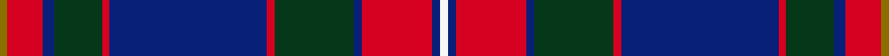

This is one **variant** — a specific cloth: this exact thread count and colourway, with its own
provenance below. It is one weaving of the [sett](/setts/y2r9db3dg12r2db40r2dg20db2r18db2w2/) (the scale-free proportion — the
same cloth at any scale or shade), whose colour order is pattern [GRBGRBRGBRBW](/stripes/grbgrbrgbrbw/).

Part of the [Kormylo](/tartans/k/ko/kormylo-2/) tartan — the named design grouping this sett with its other cloths.

Sourced from tartans-authority.  It is a [12 stripe tartan](/stripes/stripes12/).

Original link [https://www.tartanregister.gov.uk/tartanDetails.aspx?ref=6314](https://www.tartanregister.gov.uk/tartanDetails.aspx?ref=6314)

Dataset <small>— provenance for this record, inherited from the source manifest</small>

<dl class="dataset-prov">
<dt>source</dt><dd><a href="/sources/tartans-authority/">Scottish Tartans Authority</a></dd>
<dt>data captured from</dt><dd><a href="https://github.com/thetartan/tartan-database/blob/master/data/tartans-authority/data.csv">https://github.com/thetartan/tartan-database/blob/master/data/tartans-authority/data.csv</a></dd>
<dt>data date</dt><dd>Aug 2004 <small>(this record)</small></dd>
<dt>licence</dt><dd><a href="https://creativecommons.org/licenses/by-nc-nd/4.0/">CC BY-NC-ND 4.0</a></dd>
</dl>

Capture chain <small>— the hands this data passed through, oldest first; each capture carries its own licence</small>

<ol class="capture-chain">
<li><a href="https://www.tartansauthority.com/">Scottish Tartans Authority</a> <small>the heritage body's archive — its tartan-ferret record browser is retired (links repaired to the SRT, above)</small></li>
<li><a href="https://github.com/thetartan/tartan-database">thetartan/tartan-database</a> <small>2016-2017</small> · <a href="https://creativecommons.org/licenses/by-nc-nd/4.0/">CC BY-NC-ND 4.0</a> <small>Levko Kravets's frozen compilation — the capture we vendored, and where its CC licence text came from</small></li>
<li>this dictionary <small>captured 2026-06-10 · commit 5bf86c7566</small> <small>each re-capture is a git commit to data/sources</small></li>
</ol>

## Register references

External register numbers recorded for this tartan.

- Scottish Tartans Authority (ITI): 6314

## Thread count
Y/4 R18 DB6 DG24 R4 DB80 R4 DG40 DB4 R36 DB4 W/4

One full sett is **448 threads**.

## Palette
<table><thead><tr><th>Colour</th><th>Shade</th><th>OKLCh</th></tr></thead><tbody><tr><td>DB</td><td><code style="background-color:#082077;">#082077</code> <small style="color:#888">#082077</small></td><td><small style="color:#888">oklch(30.0% 0.149 265.1)</small></td></tr><tr><td>DG</td><td><code style="background-color:#053819;">#053819</code> <small style="color:#888">#053819</small></td><td><small style="color:#888">oklch(30.0% 0.075 151.3)</small></td></tr><tr><td>R</td><td><code style="background-color:#D60020;">#D60020</code> <small style="color:#888">#D60020</small></td><td><small style="color:#888">oklch(55.2% 0.224 25.5)</small></td></tr><tr><td>W</td><td><code style="background-color:#F7F7F7;">#F7F7F7</code> <small style="color:#888">#F7F7F7</small></td><td><small style="color:#888">oklch(97.6% 0.000 89.9)</small></td></tr><tr><td>Y</td><td><code style="background-color:#8B6E00;">#8B6E00</code> <small style="color:#888">#8B6E00</small></td><td><small style="color:#888">oklch(55.1% 0.113 90.4)</small></td></tr></tbody></table>

# Sample pattern

## Nearest tartan variants

The nearest existing variants by ΔTartan distance, with this cloth at the top so the swatches line up against it.

ΔTartan

Threads

Variant

Sett

—

448

<a href="/variants/s12/y2r9db3dg12r2db40r2dg20db2r18db2w2~x2/">Kormylo (Personal)</a>

<a href="/ttd/edit/#slug=w4dp40g2dp2g2dp2g2dp3g16db15m3~x2&amp;base=y2r9db3dg12r2db40r2dg20db2r18db2w2~x2" title="compare in the TTD">2.27</a>

350

<a href="/variants/s11/w4dp40g2dp2g2dp2g2dp3g16db15m3~x2/">Solway Spirit (District)</a>

<a href="/ttd/edit/#slug=b4r4db44w6db5o4db3o8db3o16b4r22w4&amp;base=y2r9db3dg12r2db40r2dg20db2r18db2w2~x2" title="compare in the TTD">2.49</a>

246

<a href="/variants/s13/b4r4db44w6db5o4db3o8db3o16b4r22w4/">Largs</a>

<a href="/ttd/edit/#slug=n20r2db4lb2db4r2db4k1db1k1db1k4~x4&amp;base=y2r9db3dg12r2db40r2dg20db2r18db2w2~x2" title="compare in the TTD">2.65</a>

272

<a href="/variants/s12/n20r2db4lb2db4r2db4k1db1k1db1k4~x4/">Broz Sanz Elementary School</a>

<a href="/ttd/edit/#slug=r9db3dg12r2db40r2dg20db2r18db2w2db2r18db2dg20r2db40r2dg12db3r9y2~x2&amp;base=y2r9db3dg12r2db40r2dg20db2r18db2w2~x2" title="compare in the TTD">2.68</a>

874

<a href="/variants/s22/r9db3dg12r2db40r2dg20db2r18db2w2db2r18db2dg20r2db40r2dg12db3r9y2~x2/">Kormylo (Personal)</a>

<a href="/ttd/edit/#slug=r16db2r2db2r2db16g16dy1r16db16r2n2~x2&amp;base=y2r9db3dg12r2db40r2dg20db2r18db2w2~x2" title="compare in the TTD">2.80</a>

336

<a href="/variants/s12/r16db2r2db2r2db16g16dy1r16db16r2n2~x2/">Army Medical Services</a>

<a href="/ttd/edit/#slug=db37w2db2y2r17w2db2g17y2db2~x2&amp;base=y2r9db3dg12r2db40r2dg20db2r18db2w2~x2" title="compare in the TTD">2.81</a>

262

<a href="/variants/s10/db37w2db2y2r17w2db2g17y2db2~x2/">MDF (Personal)</a>

<a href="/ttd/edit/#slug=db45r4n20w3ly9dr4ly3dr9n11~x2&amp;base=y2r9db3dg12r2db40r2dg20db2r18db2w2~x2" title="compare in the TTD">2.97</a>

320

<a href="/variants/s9/db45r4n20w3ly9dr4ly3dr9n11~x2/">United Arrows House Check</a>

<a href="/ttd/edit/#slug=g3r12dg12g5r2db30g2r2~x2&amp;base=y2r9db3dg12r2db40r2dg20db2r18db2w2~x2" title="compare in the TTD">2.97</a>

262

<a href="/variants/s8/g3r12dg12g5r2db30g2r2~x2/">Rannoch Moor (Fashion)</a>

<a href="/ttd/edit/#slug=dy4w2dy2r3dy19lb6db3lb2db2lb2db15dy3~x2&amp;base=y2r9db3dg12r2db40r2dg20db2r18db2w2~x2" title="compare in the TTD">2.98</a>

238

<a href="/variants/s12/dy4w2dy2r3dy19lb6db3lb2db2lb2db15dy3~x2/">Cailean (Scotch House)</a>

<a href="/ttd/edit/#slug=db4r1db12w1r4w1dg4w1dr4dg12db1w2~x2&amp;base=y2r9db3dg12r2db40r2dg20db2r18db2w2~x2" title="compare in the TTD">3.05</a>

176

<a href="/variants/s12/db4r1db12w1r4w1dg4w1dr4dg12db1w2~x2/">Glenfalloch</a>

## Neighbour map

Every grey dot is one of 13621 variants placed by the first two principal components of the ΔTartan feature space (42% of its variance). Red is this tartan; blue dots are its nearest — click one to open its page. The map is a flat projection of a many-dimensional space — [how to read it](/posts/neighbourhood-maps/).

<svg viewBox="0 0 640 380" role="img" style="max-width:100%;height:auto;border:1px solid #e0e0e0;border-radius:4px;display:block" xmlns="http://www.w3.org/2000/svg"><image href="/nn/cloud.v1.png" width="640" height="380"/><a href="/variants/s11/w4dp40g2dp2g2dp2g2dp3g16db15m3~x2/"><circle cx="300.3" cy="117.5" r="4" fill="#3465a4"><title>Solway Spirit (District)</title></circle></a><a href="/variants/s13/b4r4db44w6db5o4db3o8db3o16b4r22w4/"><circle cx="216.3" cy="128.8" r="4" fill="#3465a4"><title>Largs</title></circle></a><a href="/variants/s12/n20r2db4lb2db4r2db4k1db1k1db1k4~x4/"><circle cx="232.7" cy="104.8" r="4" fill="#3465a4"><title>Broz Sanz Elementary School</title></circle></a><a href="/variants/s22/r9db3dg12r2db40r2dg20db2r18db2w2db2r18db2dg20r2db40r2dg12db3r9y2~x2/"><circle cx="245.7" cy="106.8" r="4" fill="#3465a4"><title>Kormylo (Personal)</title></circle></a><a href="/variants/s12/r16db2r2db2r2db16g16dy1r16db16r2n2~x2/"><circle cx="228.2" cy="148.2" r="4" fill="#3465a4"><title>Army Medical Services</title></circle></a><a href="/variants/s10/db37w2db2y2r17w2db2g17y2db2~x2/"><circle cx="269.7" cy="121.1" r="4" fill="#3465a4"><title>MDF (Personal)</title></circle></a><a href="/variants/s9/db45r4n20w3ly9dr4ly3dr9n11~x2/"><circle cx="210.6" cy="144.3" r="4" fill="#3465a4"><title>United Arrows House Check</title></circle></a><a href="/variants/s8/g3r12dg12g5r2db30g2r2~x2/"><circle cx="263.1" cy="173.8" r="4" fill="#3465a4"><title>Rannoch Moor (Fashion)</title></circle></a><a href="/variants/s12/dy4w2dy2r3dy19lb6db3lb2db2lb2db15dy3~x2/"><circle cx="214.3" cy="159.2" r="4" fill="#3465a4"><title>Cailean (Scotch House)</title></circle></a><a href="/variants/s12/db4r1db12w1r4w1dg4w1dr4dg12db1w2~x2/"><circle cx="174.9" cy="158.2" r="4" fill="#3465a4"><title>Glenfalloch</title></circle></a><circle cx="252.4" cy="126.2" r="5" fill="#c00000"/><text x="320" y="376" text-anchor="middle" font-size="11" fill="#999">ground</text><text x="11" y="190" text-anchor="middle" font-size="11" fill="#999" transform="rotate(-90 11 190)">complexity</text></svg>

ID: /variants/s12/y2r9db3dg12r2db40r2dg20db2r18db2w2~x2/
