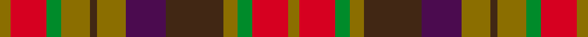

This is one **variant** — a specific cloth: this exact thread count and colourway, with its own
provenance below. It is one weaving of the [sett](/tartans/h/ha/hallowfield-wood/) (the scale-free proportion — the
same cloth at any scale or shade), whose colour order is pattern [GRGGBBGBGGRG](/stripes/grggbbgbggrg/).

Part of the [Hallowfield Wood](/tartans/h/ha/hallowfield-wood/) tartan — the named design grouping this sett with its other cloths.

Sourced from register-of-tartans.  It is a [12 stripe tartan](/stripes/stripes12/).

Original link [https://www.tartanregister.gov.uk/tartanDetails.aspx?ref=11413](https://www.tartanregister.gov.uk/tartanDetails.aspx?ref=11413)

Dataset <small>— provenance for this record, inherited from the source manifest</small>

<dl class="dataset-prov">
<dt>source</dt><dd><a href="/sources/register-of-tartans/">Scottish Register of Tartans</a></dd>
<dt>data captured from</dt><dd><a href="https://github.com/thetartan/tartan-database/blob/master/data/register-of-tartans/data.csv">https://github.com/thetartan/tartan-database/blob/master/data/register-of-tartans/data.csv</a></dd>
<dt>data date</dt><dd>29/10/2015 <small>(this record)</small></dd>
<dt>licence</dt><dd><a href="https://www.tartanregister.gov.uk/copyright">Crown copyright</a></dd>
</dl>

Capture chain <small>— the hands this data passed through, oldest first; each capture carries its own licence</small>

<ol class="capture-chain">
<li><a href="https://www.tartanregister.gov.uk/">Scottish Register of Tartans</a> · <a href="https://www.tartanregister.gov.uk/copyright">Crown copyright</a> <small>the living register — still published by National Records of Scotland</small></li>
<li><a href="https://github.com/thetartan/tartan-database">thetartan/tartan-database</a> <small>2016-2017</small> · <a href="https://creativecommons.org/licenses/by-nc-nd/4.0/">CC BY-NC-ND 4.0</a> <small>Levko Kravets's frozen compilation — the capture we vendored, and where its CC licence text came from</small></li>
<li>this dictionary <small>captured 2026-06-10 · commit 5bf86c7566</small> <small>each re-capture is a git commit to data/sources</small></li>
</ol>

## Register references

External register numbers recorded for this tartan.

- Scottish Register of Tartans: [11413](https://www.tartanregister.gov.uk/tartanDetails.aspx?ref=11413)

## Thread count
Y/6 R20 G8 Y16 DO4 Y16 DP22 DO32 Y8 G8 R20 Y/6

One full sett is **320 threads**.

## Palette
<table><thead><tr><th>Colour</th><th>Shade</th><th>OKLCh</th></tr></thead><tbody><tr><td>DO</td><td><code style="background-color:#412714;">#412714</code> <small style="color:#888">#412714</small></td><td><small style="color:#888">oklch(30.1% 0.050 55.7)</small></td></tr><tr><td>G</td><td><code style="background-color:#008B2A;">#008B2A</code> <small style="color:#888">#008B2A</small></td><td><small style="color:#888">oklch(55.4% 0.170 145.9)</small></td></tr><tr><td>DP</td><td><code style="background-color:#4B0B4F;">#4B0B4F</code> <small style="color:#888">#4B0B4F</small></td><td><small style="color:#888">oklch(30.1% 0.125 325.4)</small></td></tr><tr><td>Y</td><td><code style="background-color:#8B6E00;">#8B6E00</code> <small style="color:#888">#8B6E00</small></td><td><small style="color:#888">oklch(55.1% 0.113 90.4)</small></td></tr><tr><td>R</td><td><code style="background-color:#D60020;">#D60020</code> <small style="color:#888">#D60020</small></td><td><small style="color:#888">oklch(55.2% 0.224 25.5)</small></td></tr></tbody></table>

# Sample pattern

[Sample sheet (PDF)](swatch.pdf) — the woven sample, thread count and palette on one printable A4, rendered on demand (the same sheet the TTD print page downloads).

## Nearest tartan variants

The nearest existing variants by ΔTartan distance, with this cloth at the top so the swatches line up against it.

ΔTartan

Threads

Variant

Sett

—

320

<a href="/variants/s12/y3r10g4y8do2y8dp11do16y4g4r10y3~x2/">Hallowfield Wood</a>

<a href="/ttd/edit/#slug=o5lo3o19do6lo5do6dg12n5dg12n3~x2&amp;base=y3r10g4y8do2y8dp11do16y4g4r10y3~x2" title="compare in the TTD">2.29</a>

288

<a href="/variants/s10/o5lo3o19do6lo5do6dg12n5dg12n3~x2/">Roscommon Irish County Tartan</a>

<a href="/ttd/edit/#slug=g18r6dr4ri6g20ri6dr4ri6dr4r6db22ri8r6dr4ri5~r3715030-ri5021030&amp;base=y3r10g4y8do2y8dp11do16y4g4r10y3~x2" title="compare in the TTD">2.98</a>

227

<a href="/variants/s15/g18r6dr4ri6g20ri6dr4ri6dr4r6db22ri8r6dr4ri5~r3715030-ri5021030/">MacDougall 6</a>

<a href="/ttd/edit/#slug=g18rii6ri4r6g20r6ri4r6ri4rii6db22r8rii6ri4r5~rii4217030-ri3813006&amp;base=y3r10g4y8do2y8dp11do16y4g4r10y3~x2" title="compare in the TTD">3.00</a>

227

<a href="/variants/s15/g18rii6ri4r6g20r6ri4r6ri4rii6db22r8rii6ri4r5~rii4217030-ri3813006/">Unidentified #35</a>

<a href="/ttd/edit/#slug=db21dp21y21o2r21lo21y21db2r2dp2o21~x2&amp;base=y3r10g4y8do2y8dp11do16y4g4r10y3~x2" title="compare in the TTD">3.21</a>

536

<a href="/variants/s11/db21dp21y21o2r21lo21y21db2r2dp2o21~x2/">Watret (Artefact)</a>

<a href="/ttd/edit/#slug=o5ly3o19do6ly5do6dg12db5dg12db3~x2&amp;base=y3r10g4y8do2y8dp11do16y4g4r10y3~x2" title="compare in the TTD">3.25</a>

288

<a href="/variants/s10/o5ly3o19do6ly5do6dg12db5dg12db3~x2/">Roscommon, County</a>

<a href="/ttd/edit/#slug=g3db1g6r6lo1r6n6db1n6r2n6lb1~x4&amp;base=y3r10g4y8do2y8dp11do16y4g4r10y3~x2" title="compare in the TTD">3.31</a>

344

<a href="/variants/s12/g3db1g6r6lo1r6n6db1n6r2n6lb1~x4/">Wcwm 1243</a>

<a href="/ttd/edit/#slug=dg6r1dg1r4g4r4dg1r1dg6o2g2gi4~x8~dg2709141-gi5109120&amp;base=y3r10g4y8do2y8dp11do16y4g4r10y3~x2" title="compare in the TTD">3.45</a>

496

<a href="/variants/s12/dg6r1dg1r4g4r4dg1r1dg6o2g2gi4~x8~dg2709141-gi5109120/">Maple Leaf</a>

<a href="/ttd/edit/#slug=y7do5dg4do3dg4do6r4do1r4do6y7r1~x4&amp;base=y3r10g4y8do2y8dp11do16y4g4r10y3~x2" title="compare in the TTD">3.50</a>

384

<a href="/variants/s12/y7do5dg4do3dg4do6r4do1r4do6y7r1~x4/">Buchanan Variation (Fashion)</a>

<a href="/ttd/edit/#slug=dg6r1dg1r4g4r4dg1r1dg6dy2g2y2~x8&amp;base=y3r10g4y8do2y8dp11do16y4g4r10y3~x2" title="compare in the TTD">3.50</a>

480

<a href="/variants/s12/dg6r1dg1r4g4r4dg1r1dg6dy2g2y2~x8/">Maple Leaf Canadian District Tartan</a>

<a href="/ttd/edit/#slug=dg6r1dg1r4g4r4dg1r1dg6dy2g2y2~x4&amp;base=y3r10g4y8do2y8dp11do16y4g4r10y3~x2" title="compare in the TTD">3.50</a>

240

<a href="/variants/s12/dg6r1dg1r4g4r4dg1r1dg6dy2g2y2~x4/">Maple Leaf MINI Canadian District Tartan</a>

## Neighbour map

Every grey dot is one of 13662 variants placed by the first two principal components of the ΔTartan feature space (42% of its variance). Red is this tartan; blue dots are its nearest — click one to open its page. The map is a flat projection of a many-dimensional space — [how to read it](/posts/neighbourhood-maps/).

<svg viewBox="0 0 640 380" role="img" style="max-width:100%;height:auto;border:1px solid #e0e0e0;border-radius:4px;display:block" xmlns="http://www.w3.org/2000/svg"><image href="/nn/cloud.v1.png" width="640" height="380"/><a href="/variants/s10/o5lo3o19do6lo5do6dg12n5dg12n3~x2/"><circle cx="169.8" cy="238.6" r="4" fill="#3465a4"><title>Roscommon Irish County Tartan</title></circle></a><a href="/variants/s15/g18r6dr4ri6g20ri6dr4ri6dr4r6db22ri8r6dr4ri5~r3715030-ri5021030/"><circle cx="123.3" cy="206.2" r="4" fill="#3465a4"><title>MacDougall 6</title></circle></a><a href="/variants/s15/g18rii6ri4r6g20r6ri4r6ri4rii6db22r8rii6ri4r5~rii4217030-ri3813006/"><circle cx="120.5" cy="203.7" r="4" fill="#3465a4"><title>Unidentified #35</title></circle></a><a href="/variants/s11/db21dp21y21o2r21lo21y21db2r2dp2o21~x2/"><circle cx="105.3" cy="186.5" r="4" fill="#3465a4"><title>Watret (Artefact)</title></circle></a><a href="/variants/s10/o5ly3o19do6ly5do6dg12db5dg12db3~x2/"><circle cx="146.6" cy="231.5" r="4" fill="#3465a4"><title>Roscommon, County</title></circle></a><a href="/variants/s12/g3db1g6r6lo1r6n6db1n6r2n6lb1~x4/"><circle cx="199.5" cy="220.8" r="4" fill="#3465a4"><title>Wcwm 1243</title></circle></a><a href="/variants/s12/dg6r1dg1r4g4r4dg1r1dg6o2g2gi4~x8~dg2709141-gi5109120/"><circle cx="163.9" cy="224.4" r="4" fill="#3465a4"><title>Maple Leaf</title></circle></a><a href="/variants/s12/y7do5dg4do3dg4do6r4do1r4do6y7r1~x4/"><circle cx="230.8" cy="266.6" r="4" fill="#3465a4"><title>Buchanan Variation (Fashion)</title></circle></a><a href="/variants/s12/dg6r1dg1r4g4r4dg1r1dg6dy2g2y2~x8/"><circle cx="186.2" cy="221.3" r="4" fill="#3465a4"><title>Maple Leaf Canadian District Tartan</title></circle></a><a href="/variants/s12/dg6r1dg1r4g4r4dg1r1dg6dy2g2y2~x4/"><circle cx="186.2" cy="221.3" r="4" fill="#3465a4"><title>Maple Leaf MINI Canadian District Tartan</title></circle></a><circle cx="167.0" cy="223.5" r="5" fill="#c00000"/><text x="320" y="376" text-anchor="middle" font-size="11" fill="#999">ground</text><text x="11" y="190" text-anchor="middle" font-size="11" fill="#999" transform="rotate(-90 11 190)">complexity</text></svg>

ID: /variants/s12/y3r10g4y8do2y8dp11do16y4g4r10y3~x2/
