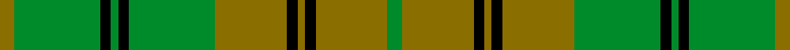

This is one **variant** — a specific cloth: this exact thread count and colourway, with its own
provenance below. It is one weaving of the [sett](/tartans/m/me/meredith/) (the scale-free proportion — the
same cloth at any scale or shade), whose colour order is pattern [GGKGKGGKGKGG](/stripes/ggkgkggkgkgg/).

Part of the [Meredith](/tartans/m/me/meredith/) tartan — the named design grouping this sett with its other cloths.

Sourced from register-of-tartans.  It is a [12 stripe tartan](/stripes/stripes12/).

Original link [https://www.tartanregister.gov.uk/tartanDetails.aspx?ref=2936](https://www.tartanregister.gov.uk/tartanDetails.aspx?ref=2936)

## Provenance

Earliest known date: Apr 2004 The tartan for this Welsh surname and its variations, Beddoes, Beddow, Bedo, Bettis, Eddow, Eddowes, Maredudd, Meredith, Meredyth, Merideth, Meridith, Mredyth, Predith, Preddy, Priddy, is actually woven in Wales at the Cambrian Woollen Mill, weaving on the same site since 1830. This tartan differs from many traditional patterns in that the warp and weft differ, giving the finished worsted wool cloth more of a predominant stripe noticeable in the finished Kilt, or Cilt in Wales.

3 attestations — the source records this cloth was collapsed from (oldest owns this page)

<ul>
<li>01/04/2004 — Meredith of Wales (register-of-tartans, <a href="https://www.tartanregister.gov.uk/tartanDetails.aspx?ref=2936">record</a>)  <em>Despite there being no known tradition of tartan in Wales, this is one of a growing series of commercial Welsh 'name' tartans marketed by the Wales Tartan Centre in Cardiff. Their inclusion in this Index does not confer upon them any historical or genealogical credibility and the use of the words 'of Wales' is not of conventional territorial significance but is purely to identify the source and thus avoid confusion with surnames which have a genuine tartan connection. Designed for The Wales Tartan Centre in Cardiff by Sheila Daniel of Cambrian Woollen Mill, Powys. They're unusual in that almost all of them incorporate odd numbered threads and have quite different warp & weft, both in thread numbers and sometimes colours. This places the classification of some of them as tartans in some doubt. Welsh Tartan Centre Cardiff.</em></li>
<li>Apr 2004 — Meredith (Welsh Name) (tartans-authority, <a href="https://web.archive.org/web/*/http://www.tartansauthority.com/tartan-ferret/display/6167/*">record</a>)  <em>The tartan for this Welsh surname and its variations, is commercially accepted as a tartan or ?plaid? in Wales, this is one of the tartans actually woven in Wales at the Cambrian Woollen Mill, weaving on the same site since 1830. This tartan differs from many traditional patterns in that the warp and weft differ, giving the finished worsted wool cloth more of a predominant ?stripe?, vertically noticeable in the finished Kilt, or ?Cilt? in Wales. Available from Wales Tartan Centres in Swansea, +44 (0)1792 474685.</em></li>
<li>Apr 2004 — Meredith Welsh Name Tartan (house-of-tartan, <a href="http://www.house-of-tartan.scotland.net/house/TartanViewjs.asp?colr=Def&tnam=6167">record</a>) </li>
</ul>

Dataset <small>— provenance for this record, inherited from the source manifest</small>

<dl class="dataset-prov">
<dt>source</dt><dd><a href="/sources/register-of-tartans/">Scottish Register of Tartans</a></dd>
<dt>data captured from</dt><dd><a href="https://github.com/thetartan/tartan-database/blob/master/data/register-of-tartans/data.csv">https://github.com/thetartan/tartan-database/blob/master/data/register-of-tartans/data.csv</a></dd>
<dt>data date</dt><dd>01/04/2004 <small>(this record)</small></dd>
<dt>licence</dt><dd><a href="https://www.tartanregister.gov.uk/copyright">Crown copyright</a></dd>
</dl>

Capture chain <small>— the hands this data passed through, oldest first; each capture carries its own licence</small>

<ol class="capture-chain">
<li><a href="https://www.tartanregister.gov.uk/">Scottish Register of Tartans</a> · <a href="https://www.tartanregister.gov.uk/copyright">Crown copyright</a> <small>the living register — still published by National Records of Scotland</small></li>
<li><a href="https://github.com/thetartan/tartan-database">thetartan/tartan-database</a> <small>2016-2017</small> · <a href="https://creativecommons.org/licenses/by-nc-nd/4.0/">CC BY-NC-ND 4.0</a> <small>Levko Kravets's frozen compilation — the capture we vendored, and where its CC licence text came from</small></li>
<li>this dictionary <small>captured 2026-06-10 · commit 5bf86c7566</small> <small>each re-capture is a git commit to data/sources</small></li>
</ol>

## Register references

External register numbers recorded for this tartan.

- Scottish Register of Tartans: [2936](https://www.tartanregister.gov.uk/tartanDetails.aspx?ref=2936)
- Scottish Tartans Authority (ITI): 6167

## Thread count
Y/4 G24 K3 G2 K3 G24 Y20 K3 Y2 K3 Y20 G/4

One full sett is **216 threads**.

## Palette
<table><thead><tr><th>Colour</th><th>Shade</th><th>OKLCh</th></tr></thead><tbody><tr><td>G</td><td><code style="background-color:#008B2A;">#008B2A</code> <small style="color:#888">#008B2A</small></td><td><small style="color:#888">oklch(55.4% 0.170 145.9)</small></td></tr><tr><td>K</td><td><code style="background-color:#000000;">#000000</code> <small style="color:#888">#000000</small></td><td><small style="color:#888">oklch(0.0% 0.000 0.0)</small></td></tr><tr><td>Y</td><td><code style="background-color:#8B6E00;">#8B6E00</code> <small style="color:#888">#8B6E00</small></td><td><small style="color:#888">oklch(55.1% 0.113 90.4)</small></td></tr></tbody></table>

# Sample pattern

[Sample sheet (PDF)](swatch.pdf) — the woven sample, thread count and palette on one printable A4, rendered on demand (the same sheet the TTD print page downloads).

## Nearest tartan variants

The nearest existing variants by ΔTartan distance, with this cloth at the top so the swatches line up against it.

ΔTartan

Threads

Variant

Sett

—

216

<a href="/variants/s12/y4g24k3g2k3g24y20k3y2k3y20g4/">Meredith of Wales</a>

<a href="/ttd/edit/#slug=dy10g1k1g1k1g11dy18g1k1g10~x4&amp;base=y4g24k3g2k3g24y20k3y2k3y20g4" title="compare in the TTD">3.02</a>

360

<a href="/variants/s10/dy10g1k1g1k1g11dy18g1k1g10~x4/">Donachie of Brockloch Ancient Hunting</a>

<a href="/ttd/edit/#slug=y24k2y3k2y3k8g24k2g5~x2&amp;base=y4g24k3g2k3g24y20k3y2k3y20g4" title="compare in the TTD">3.33</a>

234

<a href="/variants/s9/y24k2y3k2y3k8g24k2g5~x2/">Jamaican National</a>

<a href="/ttd/edit/#slug=g12k2g2dg9g4k2~x4~dg4112135&amp;base=y4g24k3g2k3g24y20k3y2k3y20g4" title="compare in the TTD">3.43</a>

192

<a href="/variants/s6/g12k2g2dg9g4k2~x4~dg4112135/">Campbell-Simpson (Personal)</a>

<a href="/ttd/edit/#slug=dy3g1dy15r2dy1r2dy1g7w1g2~x4&amp;base=y4g24k3g2k3g24y20k3y2k3y20g4" title="compare in the TTD">3.59</a>

260

<a href="/variants/s10/dy3g1dy15r2dy1r2dy1g7w1g2~x4/">Seton Htg (Clan)</a>

<a href="/ttd/edit/#slug=g2k1g18k1g2k1r12g4y6k1y6k1~x2&amp;base=y4g24k3g2k3g24y20k3y2k3y20g4" title="compare in the TTD">3.64</a>

214

<a href="/variants/s12/g2k1g18k1g2k1r12g4y6k1y6k1~x2/">MacMillan Old Clan Tartan</a>

<a href="/ttd/edit/#slug=g2k1g18k1g2k1r12g4y6k1y6k1&amp;base=y4g24k3g2k3g24y20k3y2k3y20g4" title="compare in the TTD">3.64</a>

107

<a href="/variants/s12/g2k1g18k1g2k1r12g4y6k1y6k1/">MacMillan Ancient</a>

<a href="/ttd/edit/#slug=dg2g4dg2g2dg1g2dg3k2dg2k2dg12r1dg2r1~x2~dg4514144-g6019141&amp;base=y4g24k3g2k3g24y20k3y2k3y20g4" title="compare in the TTD">3.72</a>

146

<a href="/variants/s14/dg2g4dg2g2dg1g2dg3k2dg2k2dg12r1dg2r1~x2~dg4514144-g6019141/">Ross Hunting Clan Tartan</a>

<a href="/ttd/edit/#slug=r3g8r2g18dr5g3do3g3do16g3do3g3~x2&amp;base=y4g24k3g2k3g24y20k3y2k3y20g4" title="compare in the TTD">3.87</a>

268

<a href="/variants/s12/r3g8r2g18dr5g3do3g3do16g3do3g3~x2/">Dublin</a>

<a href="/ttd/edit/#slug=g7k3g53k3g8k3dr24g8ly18k3ly18k3~x2&amp;base=y4g24k3g2k3g24y20k3y2k3y20g4" title="compare in the TTD">3.90</a>

584

<a href="/variants/s12/g7k3g53k3g8k3dr24g8ly18k3ly18k3~x2/">MacMillan - 1847 (Clan)</a>

## Neighbour map

Every grey dot is one of 13662 variants placed by the first two principal components of the ΔTartan feature space (42% of its variance). Red is this tartan; blue dots are its nearest — click one to open its page. The map is a flat projection of a many-dimensional space — [how to read it](/posts/neighbourhood-maps/).

<svg viewBox="0 0 640 380" role="img" style="max-width:100%;height:auto;border:1px solid #e0e0e0;border-radius:4px;display:block" xmlns="http://www.w3.org/2000/svg"><image href="/nn/cloud.v1.png" width="640" height="380"/><a href="/variants/s10/dy10g1k1g1k1g11dy18g1k1g10~x4/"><circle cx="346.1" cy="168.0" r="4" fill="#3465a4"><title>Donachie of Brockloch Ancient Hunting</title></circle></a><a href="/variants/s9/y24k2y3k2y3k8g24k2g5~x2/"><circle cx="239.2" cy="178.1" r="4" fill="#3465a4"><title>Jamaican National</title></circle></a><a href="/variants/s6/g12k2g2dg9g4k2~x4~dg4112135/"><circle cx="269.6" cy="241.0" r="4" fill="#3465a4"><title>Campbell-Simpson (Personal)</title></circle></a><a href="/variants/s10/dy3g1dy15r2dy1r2dy1g7w1g2~x4/"><circle cx="351.4" cy="157.6" r="4" fill="#3465a4"><title>Seton Htg (Clan)</title></circle></a><a href="/variants/s12/g2k1g18k1g2k1r12g4y6k1y6k1~x2/"><circle cx="252.4" cy="134.9" r="4" fill="#3465a4"><title>MacMillan Old Clan Tartan</title></circle></a><a href="/variants/s12/g2k1g18k1g2k1r12g4y6k1y6k1/"><circle cx="252.4" cy="134.9" r="4" fill="#3465a4"><title>MacMillan Ancient</title></circle></a><a href="/variants/s14/dg2g4dg2g2dg1g2dg3k2dg2k2dg12r1dg2r1~x2~dg4514144-g6019141/"><circle cx="332.2" cy="161.4" r="4" fill="#3465a4"><title>Ross Hunting Clan Tartan</title></circle></a><a href="/variants/s12/r3g8r2g18dr5g3do3g3do16g3do3g3~x2/"><circle cx="318.1" cy="202.0" r="4" fill="#3465a4"><title>Dublin</title></circle></a><a href="/variants/s12/g7k3g53k3g8k3dr24g8ly18k3ly18k3~x2/"><circle cx="235.8" cy="129.8" r="4" fill="#3465a4"><title>MacMillan - 1847 (Clan)</title></circle></a><circle cx="301.4" cy="187.6" r="5" fill="#c00000"/><text x="320" y="376" text-anchor="middle" font-size="11" fill="#999">ground</text><text x="11" y="190" text-anchor="middle" font-size="11" fill="#999" transform="rotate(-90 11 190)">complexity</text></svg>

ID: /variants/s12/y4g24k3g2k3g24y20k3y2k3y20g4/
