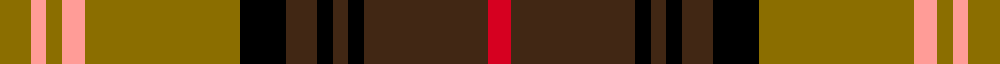

This is one **variant** — a specific cloth: this exact thread count and colourway, with its own
provenance below. It is one weaving of the [sett](/tartans/s/sc/scotch-house-dorcas/) (the scale-free proportion — the
same cloth at any scale or shade), whose colour order is pattern [GYGYGKBKBKBR](/stripes/gygygkbkbkbr/).

Part of the [Scotch House 'Dorcas'](/tartans/s/sc/scotch-house-dorcas/) tartan — the named design grouping this sett with its other cloths.

Sourced from tartans-authority.  It is a [12 stripe tartan](/stripes/stripes12/).

Original link <code>http://www.tartansauthority.com/tartan-ferret/display/1315/</code> — retired · [Internet Archive copy](https://web.archive.org/web/*/http://www.tartansauthority.com/tartan-ferret/display/1315/*)

Dataset <small>— provenance for this record, inherited from the source manifest</small>

<dl class="dataset-prov">
<dt>source</dt><dd><a href="/sources/tartans-authority/">Scottish Tartans Authority</a></dd>
<dt>data captured from</dt><dd><a href="https://github.com/thetartan/tartan-database/blob/master/data/tartans-authority/data.csv">https://github.com/thetartan/tartan-database/blob/master/data/tartans-authority/data.csv</a></dd>
<dt>data date</dt><dd>1980 <small>(this record)</small></dd>
<dt>licence</dt><dd><a href="https://creativecommons.org/licenses/by-nc-nd/4.0/">CC BY-NC-ND 4.0</a></dd>
</dl>

Capture chain <small>— the hands this data passed through, oldest first; each capture carries its own licence</small>

<ol class="capture-chain">
<li><a href="https://www.tartansauthority.com/">Scottish Tartans Authority</a> <small>the heritage body’s archive — its tartan-ferret record browser is retired; dead record links are shown unlinked, with an Internet Archive copy (ITI numbers are not SRT references)</small></li>
<li><a href="https://github.com/thetartan/tartan-database">thetartan/tartan-database</a> <small>2016-2017</small> · <a href="https://creativecommons.org/licenses/by-nc-nd/4.0/">CC BY-NC-ND 4.0</a> <small>Levko Kravets's frozen compilation — the capture we vendored, and where its CC licence text came from</small></li>
<li>this dictionary <small>captured 2026-06-10 · commit 5bf86c7566</small> <small>each re-capture is a git commit to data/sources</small></li>
</ol>

## Register references

External register numbers recorded for this tartan.

- Scottish Tartans Authority (ITI): 1315

## Thread count
Y/8 LR4 Y4 LR6 Y40 K12 DO8 K4 DO4 K4 DO32 R/6

One full sett is **250 threads**.

## Palette
<table><thead><tr><th>Colour</th><th>Shade</th><th>OKLCh</th></tr></thead><tbody><tr><td>K</td><td><code style="background-color:#000000;">#000000</code> <small style="color:#888">#000000</small></td><td><small style="color:#888">oklch(0.0% 0.000 0.0)</small></td></tr><tr><td>Y</td><td><code style="background-color:#8B6E00;">#8B6E00</code> <small style="color:#888">#8B6E00</small></td><td><small style="color:#888">oklch(55.1% 0.113 90.4)</small></td></tr><tr><td>LR</td><td><code style="background-color:#FF9C97;">#FF9C97</code> <small style="color:#888">#FF9C97</small></td><td><small style="color:#888">oklch(79.3% 0.119 23.2)</small></td></tr><tr><td>R</td><td><code style="background-color:#D60020;">#D60020</code> <small style="color:#888">#D60020</small></td><td><small style="color:#888">oklch(55.2% 0.224 25.5)</small></td></tr><tr><td>DO</td><td><code style="background-color:#412714;">#412714</code> <small style="color:#888">#412714</small></td><td><small style="color:#888">oklch(30.1% 0.050 55.7)</small></td></tr></tbody></table>

# Sample pattern

## Nearest tartan variants

The nearest existing variants by ΔTartan distance, with this cloth at the top so the swatches line up against it.

ΔTartan

Threads

Variant

Sett

—

250

<a href="/variants/s12/y4lr2y2lr3y20k6do4k2do2k2do16r3~x2/">Scotch House 'Dorcas' (Fashion)</a>

<a href="/ttd/edit/#slug=y4w2y2w3y20k6do4k2do2k2do16r3~x2&amp;base=y4lr2y2lr3y20k6do4k2do2k2do16r3~x2" title="compare in the TTD">0.60</a>

250

<a href="/variants/s12/y4w2y2w3y20k6do4k2do2k2do16r3~x2/">Dorcas</a>

<a href="/ttd/edit/#slug=k2g2r3dp18r2g6r4y2dp6r3g18r3k2g2~x2&amp;base=y4lr2y2lr3y20k6do4k2do2k2do16r3~x2" title="compare in the TTD">1.75</a>

284

<a href="/variants/s14/k2g2r3dp18r2g6r4y2dp6r3g18r3k2g2~x2/">MacIntyre and Glenorchy</a>

<a href="/ttd/edit/#slug=dy2k10n2k2n2k3n10o16y2o2y2~x2&amp;base=y4lr2y2lr3y20k6do4k2do2k2do16r3~x2" title="compare in the TTD">1.77</a>

204

<a href="/variants/s11/dy2k10n2k2n2k3n10o16y2o2y2~x2/">Dryburgh</a>

<a href="/ttd/edit/#slug=g6k2g3k2g6db8r20y2r3g2~x2&amp;base=y4lr2y2lr3y20k6do4k2do2k2do16r3~x2" title="compare in the TTD">1.81</a>

200

<a href="/variants/s10/g6k2g3k2g6db8r20y2r3g2~x2/">Connolly Dress</a>

<a href="/ttd/edit/#slug=y14lo1y1lo1y2k3y3k3dy3do1dy9lo1~x4~dy1402055-do1103038&amp;base=y4lr2y2lr3y20k6do4k2do2k2do16r3~x2" title="compare in the TTD">2.12</a>

276

<a href="/variants/s12/y14lo1y1lo1y2k3y3k3doi3do1doi9lo1~x4~doi1402055-do1103038/">Glen Nevis #2 (Personal)</a>

<a href="/ttd/edit/#slug=k10r26k2r4k2r26k3dg36k3g30k3y2~y2400000&amp;base=y4lr2y2lr3y20k6do4k2do2k2do16r3~x2" title="compare in the TTD">2.22</a>

282

<a href="/variants/s12/k10r26k2r4k2r26k3dg36k3g30k3y2~y2400000/">Pope Welsh Name Tartan</a>

<a href="/ttd/edit/#slug=o22w2o2w2o4k5o5k5n5dr2n13w2~x2&amp;base=y4lr2y2lr3y20k6do4k2do2k2do16r3~x2" title="compare in the TTD">2.33</a>

228

<a href="/variants/s12/o22w2o2w2o4k5o5k5n5dr2n13w2~x2/">Glen Nevis</a>

<a href="/ttd/edit/#slug=w3k2dg18r2db8r18dg2r2dg2r2db2r18dg18k2~x2&amp;base=y4lr2y2lr3y20k6do4k2do2k2do16r3~x2" title="compare in the TTD">2.35</a>

386

<a href="/variants/s14/w3k2dg18r2db8r18dg2r2dg2r2db2r18dg18k2~x2/">MacGuire (Personal)</a>

<a href="/ttd/edit/#slug=r10dg3y3w1k2w1y3dg12w2r3w1~x4&amp;base=y4lr2y2lr3y20k6do4k2do2k2do16r3~x2" title="compare in the TTD">2.36</a>

284

<a href="/variants/s11/r10dg3y3w1k2w1y3dg12w2r3w1~x4/">Unnamed C18th - Pr Ch Ed Plaid?</a>

<a href="/ttd/edit/#slug=ri7b5r5ri31k9r4b3ri5b3r4g30ri4b3r5ri5~x2~ri2008029-r1506028&amp;base=y4lr2y2lr3y20k6do4k2do2k2do16r3~x2" title="compare in the TTD">2.41</a>

468

<a href="/variants/s15/ri7b5r5ri31k9r4b3ri5b3r4g30ri4b3r5ri5~x2~ri2008029-r1506028/">MacDougall 3</a>

## Neighbour map

Every grey dot is one of 13657 variants placed by the first two principal components of the ΔTartan feature space (42% of its variance). Red is this tartan; blue dots are its nearest — click one to open its page. The map is a flat projection of a many-dimensional space — [how to read it](/posts/neighbourhood-maps/).

<svg viewBox="0 0 640 380" role="img" style="max-width:100%;height:auto;border:1px solid #e0e0e0;border-radius:4px;display:block" xmlns="http://www.w3.org/2000/svg"><image href="/nn/cloud.v1.png" width="640" height="380"/><a href="/variants/s12/y4w2y2w3y20k6do4k2do2k2do16r3~x2/"><circle cx="159.5" cy="138.3" r="4" fill="#3465a4"><title>Dorcas</title></circle></a><a href="/variants/s14/k2g2r3dp18r2g6r4y2dp6r3g18r3k2g2~x2/"><circle cx="160.9" cy="139.2" r="4" fill="#3465a4"><title>MacIntyre and Glenorchy</title></circle></a><a href="/variants/s11/dy2k10n2k2n2k3n10o16y2o2y2~x2/"><circle cx="132.5" cy="158.4" r="4" fill="#3465a4"><title>Dryburgh</title></circle></a><a href="/variants/s10/g6k2g3k2g6db8r20y2r3g2~x2/"><circle cx="180.7" cy="148.8" r="4" fill="#3465a4"><title>Connolly Dress</title></circle></a><a href="/variants/s12/y14lo1y1lo1y2k3y3k3doi3do1doi9lo1~x4~doi1402055-do1103038/"><circle cx="228.3" cy="127.1" r="4" fill="#3465a4"><title>Glen Nevis #2 (Personal)</title></circle></a><a href="/variants/s12/k10r26k2r4k2r26k3dg36k3g30k3y2~y2400000/"><circle cx="160.3" cy="113.2" r="4" fill="#3465a4"><title>Pope Welsh Name Tartan</title></circle></a><a href="/variants/s12/o22w2o2w2o4k5o5k5n5dr2n13w2~x2/"><circle cx="195.0" cy="133.8" r="4" fill="#3465a4"><title>Glen Nevis</title></circle></a><a href="/variants/s14/w3k2dg18r2db8r18dg2r2dg2r2db2r18dg18k2~x2/"><circle cx="193.1" cy="137.7" r="4" fill="#3465a4"><title>MacGuire (Personal)</title></circle></a><a href="/variants/s11/r10dg3y3w1k2w1y3dg12w2r3w1~x4/"><circle cx="151.6" cy="145.7" r="4" fill="#3465a4"><title>Unnamed C18th - Pr Ch Ed Plaid?</title></circle></a><a href="/variants/s15/ri7b5r5ri31k9r4b3ri5b3r4g30ri4b3r5ri5~x2~ri2008029-r1506028/"><circle cx="184.3" cy="127.5" r="4" fill="#3465a4"><title>MacDougall 3</title></circle></a><circle cx="173.1" cy="141.5" r="5" fill="#c00000"/><text x="320" y="376" text-anchor="middle" font-size="11" fill="#999">ground</text><text x="11" y="190" text-anchor="middle" font-size="11" fill="#999" transform="rotate(-90 11 190)">complexity</text></svg>

ID: /variants/s12/y4lr2y2lr3y20k6do4k2do2k2do16r3~x2/
