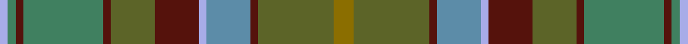

This is one **variant** — a specific cloth: this exact thread count and colourway, with its own
provenance below. It is one weaving of the [sett](/tartans/g/go/gordonstoun-3/) (the scale-free proportion — the
same cloth at any scale or shade), whose colour order is pattern [GGBBWBGBGBGW](/stripes/ggbbwbgbgbgw/).

Part of the [Gordonstoun](/tartans/g/go/gordonstoun-3/) tartan — the named design grouping this sett with its other cloths.

Sourced from register-of-tartans.  It is a [12 stripe tartan](/stripes/stripes12/).

Original link [https://www.tartanregister.gov.uk/tartanDetails.aspx?ref=1468](https://www.tartanregister.gov.uk/tartanDetails.aspx?ref=1468)

Dataset <small>— provenance for this record, inherited from the source manifest</small>

<dl class="dataset-prov">
<dt>source</dt><dd><a href="/sources/register-of-tartans/">Scottish Register of Tartans</a></dd>
<dt>data captured from</dt><dd><a href="https://github.com/thetartan/tartan-database/blob/master/data/register-of-tartans/data.csv">https://github.com/thetartan/tartan-database/blob/master/data/register-of-tartans/data.csv</a></dd>
<dt>data date</dt><dd>1957 <small>(this record)</small></dd>
<dt>licence</dt><dd><a href="https://www.tartanregister.gov.uk/copyright">Crown copyright</a></dd>
</dl>

Capture chain <small>— the hands this data passed through, oldest first; each capture carries its own licence</small>

<ol class="capture-chain">
<li><a href="https://www.tartanregister.gov.uk/">Scottish Register of Tartans</a> · <a href="https://www.tartanregister.gov.uk/copyright">Crown copyright</a> <small>the living register — still published by National Records of Scotland</small></li>
<li><a href="https://github.com/thetartan/tartan-database">thetartan/tartan-database</a> <small>2016-2017</small> · <a href="https://creativecommons.org/licenses/by-nc-nd/4.0/">CC BY-NC-ND 4.0</a> <small>Levko Kravets's frozen compilation — the capture we vendored, and where its CC licence text came from</small></li>
<li>this dictionary <small>captured 2026-06-10 · commit 5bf86c7566</small> <small>each re-capture is a git commit to data/sources</small></li>
</ol>

## Register references

External register numbers recorded for this tartan.

- Scottish Register of Tartans: [1468](https://www.tartanregister.gov.uk/tartanDetails.aspx?ref=1468)
- Scottish Tartans Authority (ITI): 190
- Scottish Tartans World Register: 190

## Thread count
Y/10 G38 DR4 T22 LB4 DR22 G22 DR4 Gi40 DR4 Gi4 LB/4

One full sett is **342 threads**.

The source recorded this cloth as LB/4 Gi4 DR4 Gi40 DR4 G22 DR22 LB4 T22 DR4 G38 Y10 G38 DR4 T22 LB4 DR22 G22 DR4 Gi40 DR4 Gi/4 — 676 threads; it folds to the canonical 342-thread sett above.

## Palette
<table><thead><tr><th>Colour</th><th>Shade</th><th>OKLCh</th></tr></thead><tbody><tr><td>T</td><td><code style="background-color:#5C8CA8;">#5C8CA8</code> <small style="color:#888">#5C8CA8</small></td><td><small style="color:#888">oklch(61.7% 0.067 235.0)</small></td></tr><tr><td>DB</td><td><code style="background-color:#082077;">#082077</code> <small style="color:#888">#082077</small></td><td><small style="color:#888">oklch(30.0% 0.149 265.1)</small></td></tr><tr><td>DR</td><td><code style="background-color:#55120C;">#55120C</code> <small style="color:#888">#55120C</small></td><td><small style="color:#888">oklch(30.0% 0.099 29.3)</small></td></tr><tr><td>LY</td><td><code style="background-color:#DCBC32;">#DCBC32</code> <small style="color:#888">#DCBC32</small></td><td><small style="color:#888">oklch(80.0% 0.150 95.2)</small></td></tr><tr><td>DG</td><td><code style="background-color:#006818;">#006818</code> <small style="color:#888">#006818</small></td><td><small style="color:#888">oklch(45.0% 0.142 145.0)</small></td></tr><tr><td>G</td><td><code style="background-color:#5C6428;">#5C6428</code> <small style="color:#888">#5C6428</small></td><td><small style="color:#888">oklch(48.3% 0.084 116.0)</small></td></tr><tr><td>G</td><td><code style="background-color:#408060;">#408060</code> <small style="color:#888">#408060</small></td><td><small style="color:#888">oklch(54.8% 0.084 160.1)</small></td></tr><tr><td>LB</td><td><code style="background-color:#A8ACE8;">#A8ACE8</code> <small style="color:#888">#A8ACE8</small></td><td><small style="color:#888">oklch(76.3% 0.086 281.2)</small></td></tr><tr><td>R</td><td><code style="background-color:#D60020;">#D60020</code> <small style="color:#888">#D60020</small></td><td><small style="color:#888">oklch(55.2% 0.224 25.5)</small></td></tr><tr><td>Y</td><td><code style="background-color:#8B6E00;">#8B6E00</code> <small style="color:#888">#8B6E00</small></td><td><small style="color:#888">oklch(55.1% 0.113 90.4)</small></td></tr></tbody></table>

# Sample pattern

## Nearest tartan variants

The nearest existing variants by ΔTartan distance, with this cloth at the top so the swatches line up against it.

ΔTartan

Threads

Variant

Sett

—

676

<a href="/variants/s12/y5g19dr2t11lb2dr11g11dr2gi20dr2gi2lb2~x2~g4808117-t6107234-lb7609282-gi5408159/">Gordonstoun #2</a>

<a href="/ttd/edit/#slug=dy20dp2dy2dp2dy3dp8dg9dgi8g8dg1lb2~x2~dg3007159-dgi4514144-g4808117&amp;base=y5g19dr2t11lb2dr11g11dr2gi20dr2gi2lb2~x2~g4808117-t6107234-lb7609282-gi5408159" title="compare in the TTD">3.53</a>

216

<a href="/variants/s11/dy20dp2dy2dp2dy3dp8dg9dgi8g8dg1lb2~x2~dg3007159-dgi4514144-g4808117/">Isle of Skye</a>

<a href="/ttd/edit/#slug=do16dr2do3dr4do2n12dy18lb2dy18n12do12ly2dr2ly2~x2&amp;base=y5g19dr2t11lb2dr11g11dr2gi20dr2gi2lb2~x2~g4808117-t6107234-lb7609282-gi5408159" title="compare in the TTD">3.98</a>

392

<a href="/variants/s14/do16dr2do3dr4do2n12dy18lb2dy18n12do12ly2dr2ly2~x2/">Allen - 2012 (Personal)</a>

## Neighbour map

Every grey dot is one of 13662 variants placed by the first two principal components of the ΔTartan feature space (42% of its variance). Red is this tartan; blue dots are its nearest — click one to open its page. The map is a flat projection of a many-dimensional space — [how to read it](/posts/neighbourhood-maps/).

<svg viewBox="0 0 640 380" role="img" style="max-width:100%;height:auto;border:1px solid #e0e0e0;border-radius:4px;display:block" xmlns="http://www.w3.org/2000/svg"><image href="/nn/cloud.v1.png" width="640" height="380"/><a href="/variants/s11/dy20dp2dy2dp2dy3dp8dg9dgi8g8dg1lb2~x2~dg3007159-dgi4514144-g4808117/"><circle cx="250.1" cy="178.4" r="4" fill="#3465a4"><title>Isle of Skye</title></circle></a><a href="/variants/s14/do16dr2do3dr4do2n12dy18lb2dy18n12do12ly2dr2ly2~x2/"><circle cx="288.5" cy="226.3" r="4" fill="#3465a4"><title>Allen - 2012 (Personal)</title></circle></a><circle cx="255.4" cy="195.5" r="5" fill="#c00000"/><text x="320" y="376" text-anchor="middle" font-size="11" fill="#999">ground</text><text x="11" y="190" text-anchor="middle" font-size="11" fill="#999" transform="rotate(-90 11 190)">complexity</text></svg>

ID: /variants/s12/y5g19dr2t11lb2dr11g11dr2gi20dr2gi2lb2~x2~g4808117-t6107234-lb7609282-gi5408159/
