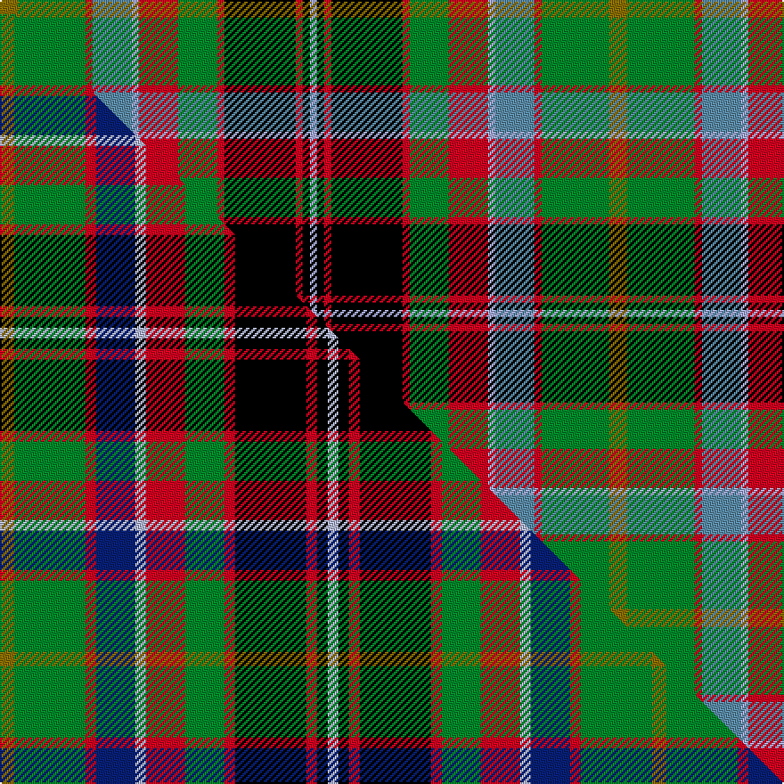

This is one **variant** — a specific cloth: this exact thread count and colourway, with its own
provenance below. It is one weaving of the [sett](/tartans/g/go/gordonstoun-5/) (the scale-free proportion — the
same cloth at any scale or shade), whose colour order is pattern [GGRBWRGRKRKW](/stripes/ggrbwrgrkrkw/).

Part of the [Gordonstoun](/tartans/g/go/gordonstoun-5/) tartan — the named design grouping this sett with its other cloths.

Sourced from tartans-authority.  It is a [12 stripe tartan](/stripes/stripes12/).

Original link <code>http://www.tartansauthority.com/tartan-ferret/display/362/</code> — retired · [Internet Archive copy](https://web.archive.org/web/*/http://www.tartansauthority.com/tartan-ferret/display/362/*)

Dataset <small>— provenance for this record, inherited from the source manifest</small>

<dl class="dataset-prov">
<dt>source</dt><dd><a href="/sources/tartans-authority/">Scottish Tartans Authority</a></dd>
<dt>data captured from</dt><dd><a href="https://github.com/thetartan/tartan-database/blob/master/data/tartans-authority/data.csv">https://github.com/thetartan/tartan-database/blob/master/data/tartans-authority/data.csv</a></dd>
<dt>data date</dt><dd>1956 <small>(this record)</small></dd>
<dt>licence</dt><dd><a href="https://creativecommons.org/licenses/by-nc-nd/4.0/">CC BY-NC-ND 4.0</a></dd>
</dl>

Capture chain <small>— the hands this data passed through, oldest first; each capture carries its own licence</small>

<ol class="capture-chain">
<li><a href="https://www.tartansauthority.com/">Scottish Tartans Authority</a> <small>the heritage body’s archive — its tartan-ferret record browser is retired; dead record links are shown unlinked, with an Internet Archive copy (ITI numbers are not SRT references)</small></li>
<li><a href="https://github.com/thetartan/tartan-database">thetartan/tartan-database</a> <small>2016-2017</small> · <a href="https://creativecommons.org/licenses/by-nc-nd/4.0/">CC BY-NC-ND 4.0</a> <small>Levko Kravets's frozen compilation — the capture we vendored, and where its CC licence text came from</small></li>
<li>this dictionary <small>captured 2026-06-10 · commit 5bf86c7566</small> <small>each re-capture is a git commit to data/sources</small></li>
</ol>

## Register references

External register numbers recorded for this tartan.

- Scottish Tartans Authority (ITI): 362

## Thread count
Y/10 G38 R4 T22 LB4 R22 G22 R4 K40 R4 K4 LB/4

One full sett is **342 threads**.

## Palette
<table><thead><tr><th>Colour</th><th>Shade</th><th>OKLCh</th></tr></thead><tbody><tr><td>T</td><td><code style="background-color:#5C8CA8;">#5C8CA8</code> <small style="color:#888">#5C8CA8</small></td><td><small style="color:#888">oklch(61.7% 0.067 235.0)</small></td></tr><tr><td>R</td><td><code style="background-color:#D60020;">#D60020</code> <small style="color:#888">#D60020</small></td><td><small style="color:#888">oklch(55.2% 0.224 25.5)</small></td></tr><tr><td>G</td><td><code style="background-color:#008B2A;">#008B2A</code> <small style="color:#888">#008B2A</small></td><td><small style="color:#888">oklch(55.4% 0.170 145.9)</small></td></tr><tr><td>K</td><td><code style="background-color:#000000;">#000000</code> <small style="color:#888">#000000</small></td><td><small style="color:#888">oklch(0.0% 0.000 0.0)</small></td></tr><tr><td>LB</td><td><code style="background-color:#A8ACE8;">#A8ACE8</code> <small style="color:#888">#A8ACE8</small></td><td><small style="color:#888">oklch(76.3% 0.086 281.2)</small></td></tr><tr><td>Y</td><td><code style="background-color:#8B6E00;">#8B6E00</code> <small style="color:#888">#8B6E00</small></td><td><small style="color:#888">oklch(55.1% 0.113 90.4)</small></td></tr></tbody></table>

# Sample pattern

## Compared to the master

This cloth is one sett of its design; the master sett (the exemplar the design is anchored on) is below for comparison.

Its **ΔTartan distance** from the master is **0.41** — the same measure the nearest-tartans table ranks by (0 is identical; a re-scale of the same cloth is near 0, a recolour or a different proportion further).

<figure class="master-compare" style="margin:0">

this sett
master sett ★

<figcaption style="color:#888;font-size:smaller">One weave of this sett against the <a href="/setts/y4g20r3db11lb3r11g11r3k20r3k3lb3/">master sett ★</a>, split on the diagonal: a shared proportion runs seamlessly across it with only the shades shifting; a different proportion breaks on it.</figcaption>
</figure>

## Nearest tartan variants

The nearest existing variants by ΔTartan distance, with this cloth at the top so the swatches line up against it.

ΔTartan

Threads

Variant

Sett

—

342

<a href="/variants/s12/y5g19r2t11lb2r11g11r2k20r2k2lb2~x2~t6107234-lb7609282/">Gordonstoun (Corporate)</a>

<a href="/ttd/edit/#slug=y4g20r3db11lb3r11g11r3k20r3k3lb3~x2&amp;base=y5g19r2t11lb2r11g11r2k20r2k2lb2~x2~t6107234-lb7609282" title="compare in the TTD">0.41</a>

366

<a href="/variants/s12/y4g20r3db11lb3r11g11r3k20r3k3lb3~x2/">Gordonstoun</a>

<a href="/ttd/edit/#slug=db8k8y2k3w3k3g24r16db3r4k2~x2&amp;base=y5g19r2t11lb2r11g11r2k20r2k2lb2~x2~t6107234-lb7609282" title="compare in the TTD">1.42</a>

284

<a href="/variants/s11/db8k8y2k3w3k3g24r16db3r4k2~x2/">MacLean</a>

<a href="/ttd/edit/#slug=k4dg10ly4dg10k4g20dg5k2ly6k2r10k2w4~x2&amp;base=y5g19r2t11lb2r11g11r2k20r2k2lb2~x2~t6107234-lb7609282" title="compare in the TTD">1.63</a>

316

<a href="/variants/s13/k4dg10ly4dg10k4g20dg5k2ly6k2r10k2w4~x2/">Donegal County Crest (Fashion)</a>

<a href="/ttd/edit/#slug=y8g2k4lo1k1lb1k1do8y3k1y1lb1~x4&amp;base=y5g19r2t11lb2r11g11r2k20r2k2lb2~x2~t6107234-lb7609282" title="compare in the TTD">1.86</a>

220

<a href="/variants/s12/y8g2k4lo1k1lb1k1do8y3k1y1lb1~x4/">Wcwm 9275-1258</a>

<a href="/ttd/edit/#slug=g10dr2g2dr3g11lr2k10dr2db12k1lo2dr2lo2dr2lo2~x2&amp;base=y5g19r2t11lb2r11g11r2k20r2k2lb2~x2~t6107234-lb7609282" title="compare in the TTD">1.94</a>

236

<a href="/variants/s15/g10dr2g2dr3g11lr2k10dr2db12k1lo2dr2lo2dr2lo2~x2/">Esteba-Quer (Personal)</a>

<a href="/ttd/edit/#slug=k2g2lo1g2o1g2o1g10db3k2db2k2db2k2db3lr9o2~x2&amp;base=y5g19r2t11lb2r11g11r2k20r2k2lb2~x2~t6107234-lb7609282" title="compare in the TTD">1.97</a>

184

<a href="/variants/s17/k2g2lo1g2o1g2o1g10db3k2db2k2db2k2db3lr9o2~x2/">Kennedy Dress, (Pendleton)</a>

<a href="/ttd/edit/#slug=lo2g6r12k3w3k3g16k2g2k2g2k12lp2~x2&amp;base=y5g19r2t11lb2r11g11r2k20r2k2lb2~x2~t6107234-lb7609282" title="compare in the TTD">1.99</a>

260

<a href="/variants/s13/lo2g6r12k3w3k3g16k2g2k2g2k12lp2~x2/">Kapasi (Personal)</a>

<a href="/ttd/edit/#slug=g19k18dr18w2y2dp2y2w2dr8dp3~x2&amp;base=y5g19r2t11lb2r11g11r2k20r2k2lb2~x2~t6107234-lb7609282" title="compare in the TTD">2.00</a>

260

<a href="/variants/s10/g19k18dr18w2y2dp2y2w2dr8dp3~x2/">McMuldroch (2014)</a>

<a href="/ttd/edit/#slug=g10dr2g2dr3g11lr2k10dr2db12k1lo2dr2lo2dr2~x2&amp;base=y5g19r2t11lb2r11g11r2k20r2k2lb2~x2~t6107234-lb7609282" title="compare in the TTD">2.04</a>

228

<a href="/variants/s14/g10dr2g2dr3g11lr2k10dr2db12k1lo2dr2lo2dr2~x2/">Esteba-Quer (Personal)</a>

<a href="/ttd/edit/#slug=db2k2db8k8g12k1w2k1g12k8r3lb3r14lb2r2~x2&amp;base=y5g19r2t11lb2r11g11r2k20r2k2lb2~x2~t6107234-lb7609282" title="compare in the TTD">2.05</a>

312

<a href="/variants/s15/db2k2db8k8g12k1w2k1g12k8r3lb3r14lb2r2~x2/">Unidentified - C20th</a>

## Neighbour map

Every grey dot is one of 13662 variants placed by the first two principal components of the ΔTartan feature space (42% of its variance). Red is this tartan; blue dots are its nearest — click one to open its page. The map is a flat projection of a many-dimensional space — [how to read it](/posts/neighbourhood-maps/).

<svg viewBox="0 0 640 380" role="img" style="max-width:100%;height:auto;border:1px solid #e0e0e0;border-radius:4px;display:block" xmlns="http://www.w3.org/2000/svg"><image href="/nn/cloud.v1.png" width="640" height="380"/><a href="/variants/s12/y4g20r3db11lb3r11g11r3k20r3k3lb3~x2/"><circle cx="49.5" cy="154.3" r="4" fill="#3465a4"><title>Gordonstoun</title></circle></a><a href="/variants/s11/db8k8y2k3w3k3g24r16db3r4k2~x2/"><circle cx="82.3" cy="122.3" r="4" fill="#3465a4"><title>MacLean</title></circle></a><a href="/variants/s13/k4dg10ly4dg10k4g20dg5k2ly6k2r10k2w4~x2/"><circle cx="41.5" cy="143.6" r="4" fill="#3465a4"><title>Donegal County Crest (Fashion)</title></circle></a><a href="/variants/s12/y8g2k4lo1k1lb1k1do8y3k1y1lb1~x4/"><circle cx="109.9" cy="140.4" r="4" fill="#3465a4"><title>Wcwm 9275-1258</title></circle></a><a href="/variants/s15/g10dr2g2dr3g11lr2k10dr2db12k1lo2dr2lo2dr2lo2~x2/"><circle cx="89.7" cy="124.9" r="4" fill="#3465a4"><title>Esteba-Quer (Personal)</title></circle></a><a href="/variants/s17/k2g2lo1g2o1g2o1g10db3k2db2k2db2k2db3lr9o2~x2/"><circle cx="61.7" cy="122.6" r="4" fill="#3465a4"><title>Kennedy Dress, (Pendleton)</title></circle></a><a href="/variants/s13/lo2g6r12k3w3k3g16k2g2k2g2k12lp2~x2/"><circle cx="92.8" cy="132.3" r="4" fill="#3465a4"><title>Kapasi (Personal)</title></circle></a><a href="/variants/s10/g19k18dr18w2y2dp2y2w2dr8dp3~x2/"><circle cx="99.5" cy="140.6" r="4" fill="#3465a4"><title>McMuldroch (2014)</title></circle></a><a href="/variants/s14/g10dr2g2dr3g11lr2k10dr2db12k1lo2dr2lo2dr2~x2/"><circle cx="98.9" cy="129.3" r="4" fill="#3465a4"><title>Esteba-Quer (Personal)</title></circle></a><a href="/variants/s15/db2k2db8k8g12k1w2k1g12k8r3lb3r14lb2r2~x2/"><circle cx="60.4" cy="116.8" r="4" fill="#3465a4"><title>Unidentified - C20th</title></circle></a><circle cx="73.3" cy="134.1" r="5" fill="#c00000"/><text x="320" y="376" text-anchor="middle" font-size="11" fill="#999">ground</text><text x="11" y="190" text-anchor="middle" font-size="11" fill="#999" transform="rotate(-90 11 190)">complexity</text></svg>

ID: /variants/s12/y5g19r2t11lb2r11g11r2k20r2k2lb2~x2~t6107234-lb7609282/
