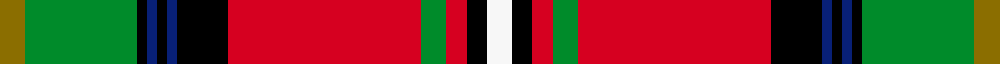

This is one **variant** — a specific cloth: this exact thread count and colourway, with its own
provenance below. It is one weaving of the [sett](/tartans/b/bo/boyd/) (the scale-free proportion — the
same cloth at any scale or shade), whose colour order is pattern [GGKBKBKRGRKW](/stripes/ggkbkbkrgrkw/).

Part of the [Boyd](/tartans/b/bo/boyd/) tartan — the named design grouping this sett with its other cloths.

Sourced from register-of-tartans.  It is a [12 stripe tartan](/stripes/stripes12/).

Original link [https://www.tartanregister.gov.uk/tartanDetails.aspx?ref=326](https://www.tartanregister.gov.uk/tartanDetails.aspx?ref=326)

3 attestations — the source records this cloth was collapsed from (oldest owns this page)

<ul>
<li>01/01/1956 — Boyd (register-of-tartans, <a href="https://www.tartanregister.gov.uk/tartanDetails.aspx?ref=326">record</a>)  <em>Designed in 1956 by Jamie Scarlett MBE for Lord Kilmarnock and recorded in the Lord Lyon Court Books (LCB 3) on 7th March 1956. The Lords Kilmarnock are descended from both the Hays (the Earls of Errol), and the Stewarts and the design incorporates elements from the Hay-Leith tartan (the red section) and the Hunting Stewart (the green section) with minor alterations to each. The Boyd family are closely associated with the town of Kilmarnock in the South West of the Scottish Lowlands.</em></li>
<li>undated — Boyd (weddslist, <a href="http://www.weddslist.com/cgi-bin/tartans/pg.pl?source=sts">record</a>) </li>
<li>undated — Boyd (weddslist, <a href="http://www.weddslist.com/cgi-bin/tartans/pg.pl?source=tinsel">record</a>) </li>
</ul>

Dataset <small>— provenance for this record, inherited from the source manifest</small>

<dl class="dataset-prov">
<dt>source</dt><dd><a href="/sources/register-of-tartans/">Scottish Register of Tartans</a></dd>
<dt>data captured from</dt><dd><a href="https://github.com/thetartan/tartan-database/blob/master/data/register-of-tartans/data.csv">https://github.com/thetartan/tartan-database/blob/master/data/register-of-tartans/data.csv</a></dd>
<dt>data date</dt><dd>1956 <small>(this record)</small></dd>
<dt>licence</dt><dd><a href="https://www.tartanregister.gov.uk/copyright">Crown copyright</a></dd>
</dl>

Capture chain <small>— the hands this data passed through, oldest first; each capture carries its own licence</small>

<ol class="capture-chain">
<li><a href="https://www.tartanregister.gov.uk/">Scottish Register of Tartans</a> · <a href="https://www.tartanregister.gov.uk/copyright">Crown copyright</a> <small>the living register — still published by National Records of Scotland</small></li>
<li><a href="https://github.com/thetartan/tartan-database">thetartan/tartan-database</a> <small>2016-2017</small> · <a href="https://creativecommons.org/licenses/by-nc-nd/4.0/">CC BY-NC-ND 4.0</a> <small>Levko Kravets's frozen compilation — the capture we vendored, and where its CC licence text came from</small></li>
<li>this dictionary <small>captured 2026-06-10 · commit 5bf86c7566</small> <small>each re-capture is a git commit to data/sources</small></li>
</ol>

## Register references

External register numbers recorded for this tartan.

- Scottish Register of Tartans: [326](https://www.tartanregister.gov.uk/tartanDetails.aspx?ref=326)
- Scottish Tartans Authority (ITI): 1820
- Scottish Tartans World Register: 1820

## Thread count
Y/10 G44 K4 DB4 K4 DB4 K20 R76 G10 R8 K8 W/10

One full sett is **384 threads**.

## Palette
<table><thead><tr><th>Colour</th><th>Shade</th><th>OKLCh</th></tr></thead><tbody><tr><td>DB</td><td><code style="background-color:#082077;">#082077</code> <small style="color:#888">#082077</small></td><td><small style="color:#888">oklch(30.0% 0.149 265.1)</small></td></tr><tr><td>G</td><td><code style="background-color:#008B2A;">#008B2A</code> <small style="color:#888">#008B2A</small></td><td><small style="color:#888">oklch(55.4% 0.170 145.9)</small></td></tr><tr><td>K</td><td><code style="background-color:#000000;">#000000</code> <small style="color:#888">#000000</small></td><td><small style="color:#888">oklch(0.0% 0.000 0.0)</small></td></tr><tr><td>Y</td><td><code style="background-color:#8B6E00;">#8B6E00</code> <small style="color:#888">#8B6E00</small></td><td><small style="color:#888">oklch(55.1% 0.113 90.4)</small></td></tr><tr><td>W</td><td><code style="background-color:#F7F7F7;">#F7F7F7</code> <small style="color:#888">#F7F7F7</small></td><td><small style="color:#888">oklch(97.6% 0.000 89.9)</small></td></tr><tr><td>R</td><td><code style="background-color:#D60020;">#D60020</code> <small style="color:#888">#D60020</small></td><td><small style="color:#888">oklch(55.2% 0.224 25.5)</small></td></tr></tbody></table>

# Sample pattern

## Nearest tartan variants

The nearest existing variants by ΔTartan distance, with this cloth at the top so the swatches line up against it.

ΔTartan

Threads

Variant

Sett

—

384

<a href="/variants/s12/y5g22k2db2k2db2k10r38g5r4k4w5~x2/">Boyd</a>

<a href="/ttd/edit/#slug=y5g22k2db2k2db2k10r38g5r4k4w5&amp;base=y5g22k2db2k2db2k10r38g5r4k4w5~x2" title="compare in the TTD">0.00</a>

192

<a href="/variants/s12/y5g22k2db2k2db2k10r38g5r4k4w5/">Boyd</a>

<a href="/ttd/edit/#slug=w5k4r4g5r39k10db2k2db2k2g22ly5~x2&amp;base=y5g22k2db2k2db2k10r38g5r4k4w5~x2" title="compare in the TTD">0.05</a>

388

<a href="/variants/s12/w5k4r4g5r39k10db2k2db2k2g22ly5~x2/">Boyd (Clan)</a>

<a href="/ttd/edit/#slug=y1g6k1db1k1db1k6r12g1r1k1w1~x4&amp;base=y5g22k2db2k2db2k10r38g5r4k4w5~x2" title="compare in the TTD">0.58</a>

256

<a href="/variants/s12/y1g6k1db1k1db1k6r12g1r1k1w1~x4/">Boyd Clan Tartan</a>

<a href="/ttd/edit/#slug=k8r2k3ly2k2w3k2y12o22r2o2k1~x2~ly8217090-y5912102&amp;base=y5g22k2db2k2db2k10r38g5r4k4w5~x2" title="compare in the TTD">1.21</a>

226

<a href="/variants/s12/k8r2k3ly2k2w3k2y12o22r2o2k1~x2~ly8217090-y5912102/">O'Keefe</a>

<a href="/ttd/edit/#slug=lb16k12y4k4w6k4g32r50lb6r8k3&amp;base=y5g22k2db2k2db2k10r38g5r4k4w5~x2" title="compare in the TTD">1.53</a>

271

<a href="/variants/s11/lb16k12y4k4w6k4g32r50lb6r8k3/">MacLean of Duart #3</a>

<a href="/ttd/edit/#slug=lb8k4y1k2w3k2g12r24lb2r3k2~x2&amp;base=y5g22k2db2k2db2k10r38g5r4k4w5~x2" title="compare in the TTD">1.61</a>

232

<a href="/variants/s11/lb8k4y1k2w3k2g12r24lb2r3k2~x2/">MacLean of Duart #2</a>

<a href="/ttd/edit/#slug=g9r52lb13k16y2k3w4k3g23r15g7y3~x2&amp;base=y5g22k2db2k2db2k10r38g5r4k4w5~x2" title="compare in the TTD">1.64</a>

576

<a href="/variants/s12/g9r52lb13k16y2k3w4k3g23r15g7y3~x2/">Stewart of Galloway Clan Tartan</a>

<a href="/ttd/edit/#slug=w2r16k1t2k1ly4k1t2k1dg16t1~x4&amp;base=y5g22k2db2k2db2k10r38g5r4k4w5~x2" title="compare in the TTD">1.77</a>

364

<a href="/variants/s11/w2r16k1t2k1ly4k1t2k1dg16t1~x4/">Baxter of Balgavies</a>

<a href="/ttd/edit/#slug=lb16k12y4k4w6k4dg32r50lb6r8k3&amp;base=y5g22k2db2k2db2k10r38g5r4k4w5~x2" title="compare in the TTD">1.80</a>

271

<a href="/variants/s11/lb16k12y4k4w6k4dg32r50lb6r8k3/">Maclean of Duart (Wilsons) (Clan)</a>

<a href="/ttd/edit/#slug=lb14k8y2k3w4k3g21r48lb4r5k3~x2&amp;base=y5g22k2db2k2db2k10r38g5r4k4w5~x2" title="compare in the TTD">1.82</a>

426

<a href="/variants/s11/lb14k8y2k3w4k3g21r48lb4r5k3~x2/">MacLean of Duart #5</a>

## Neighbour map

Every grey dot is one of 13662 variants placed by the first two principal components of the ΔTartan feature space (42% of its variance). Red is this tartan; blue dots are its nearest — click one to open its page. The map is a flat projection of a many-dimensional space — [how to read it](/posts/neighbourhood-maps/).

<svg viewBox="0 0 640 380" role="img" style="max-width:100%;height:auto;border:1px solid #e0e0e0;border-radius:4px;display:block" xmlns="http://www.w3.org/2000/svg"><image href="/nn/cloud.v1.png" width="640" height="380"/><a href="/variants/s12/y5g22k2db2k2db2k10r38g5r4k4w5/"><circle cx="158.8" cy="79.1" r="4" fill="#3465a4"><title>Boyd</title></circle></a><a href="/variants/s12/w5k4r4g5r39k10db2k2db2k2g22ly5~x2/"><circle cx="160.2" cy="76.2" r="4" fill="#3465a4"><title>Boyd (Clan)</title></circle></a><a href="/variants/s12/y1g6k1db1k1db1k6r12g1r1k1w1~x4/"><circle cx="131.9" cy="95.2" r="4" fill="#3465a4"><title>Boyd Clan Tartan</title></circle></a><a href="/variants/s12/k8r2k3ly2k2w3k2y12o22r2o2k1~x2~ly8217090-y5912102/"><circle cx="144.1" cy="76.7" r="4" fill="#3465a4"><title>O'Keefe</title></circle></a><a href="/variants/s11/lb16k12y4k4w6k4g32r50lb6r8k3/"><circle cx="136.5" cy="98.6" r="4" fill="#3465a4"><title>MacLean of Duart #3</title></circle></a><a href="/variants/s11/lb8k4y1k2w3k2g12r24lb2r3k2~x2/"><circle cx="164.6" cy="78.7" r="4" fill="#3465a4"><title>MacLean of Duart #2</title></circle></a><a href="/variants/s12/g9r52lb13k16y2k3w4k3g23r15g7y3~x2/"><circle cx="182.0" cy="79.3" r="4" fill="#3465a4"><title>Stewart of Galloway Clan Tartan</title></circle></a><a href="/variants/s11/w2r16k1t2k1ly4k1t2k1dg16t1~x4/"><circle cx="137.4" cy="91.5" r="4" fill="#3465a4"><title>Baxter of Balgavies</title></circle></a><a href="/variants/s11/lb16k12y4k4w6k4dg32r50lb6r8k3/"><circle cx="137.3" cy="96.3" r="4" fill="#3465a4"><title>Maclean of Duart (Wilsons) (Clan)</title></circle></a><a href="/variants/s11/lb14k8y2k3w4k3g21r48lb4r5k3~x2/"><circle cx="189.9" cy="71.6" r="4" fill="#3465a4"><title>MacLean of Duart #5</title></circle></a><circle cx="158.8" cy="79.1" r="5" fill="#c00000"/><text x="320" y="376" text-anchor="middle" font-size="11" fill="#999">ground</text><text x="11" y="190" text-anchor="middle" font-size="11" fill="#999" transform="rotate(-90 11 190)">complexity</text></svg>

ID: /variants/s12/y5g22k2db2k2db2k10r38g5r4k4w5~x2/
