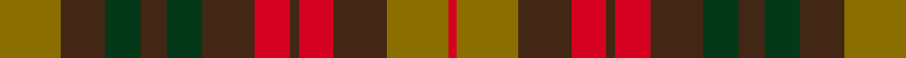

This is one **variant** — a specific cloth: this exact thread count and colourway, with its own
provenance below. It is one weaving of the [sett](/tartans/b/bu/buchanan-variation/) (the scale-free proportion — the
same cloth at any scale or shade), whose colour order is pattern [GBGBGBRBRBGR](/stripes/gbgbgbrbrbgr/).

Part of the [Buchanan Variation](/tartans/b/bu/buchanan-variation/) tartan — the named design grouping this sett with its other cloths.

Sourced from tartans-authority.  It is a [12 stripe tartan](/stripes/stripes12/).

Original link <code>http://www.tartansauthority.com/tartan-ferret/display/3758/</code> — retired · [Internet Archive copy](https://web.archive.org/web/*/http://www.tartansauthority.com/tartan-ferret/display/3758/*)

Dataset <small>— provenance for this record, inherited from the source manifest</small>

<dl class="dataset-prov">
<dt>source</dt><dd><a href="/sources/tartans-authority/">Scottish Tartans Authority</a></dd>
<dt>data captured from</dt><dd><a href="https://github.com/thetartan/tartan-database/blob/master/data/tartans-authority/data.csv">https://github.com/thetartan/tartan-database/blob/master/data/tartans-authority/data.csv</a></dd>
<dt>data date</dt><dd>pre 2002 <small>(this record)</small></dd>
<dt>licence</dt><dd><a href="https://creativecommons.org/licenses/by-nc-nd/4.0/">CC BY-NC-ND 4.0</a></dd>
</dl>

Capture chain <small>— the hands this data passed through, oldest first; each capture carries its own licence</small>

<ol class="capture-chain">
<li><a href="https://www.tartansauthority.com/">Scottish Tartans Authority</a> <small>the heritage body’s archive — its tartan-ferret record browser is retired; dead record links are shown unlinked, with an Internet Archive copy (ITI numbers are not SRT references)</small></li>
<li><a href="https://github.com/thetartan/tartan-database">thetartan/tartan-database</a> <small>2016-2017</small> · <a href="https://creativecommons.org/licenses/by-nc-nd/4.0/">CC BY-NC-ND 4.0</a> <small>Levko Kravets's frozen compilation — the capture we vendored, and where its CC licence text came from</small></li>
<li>this dictionary <small>captured 2026-06-10 · commit 5bf86c7566</small> <small>each re-capture is a git commit to data/sources</small></li>
</ol>

## Register references

External register numbers recorded for this tartan.

- Scottish Tartans Authority (ITI): 3758

## Thread count
Y/28 DO20 DG16 DO12 DG16 DO24 R16 DO4 R16 DO24 Y28 R/4

One full sett is **384 threads**.

## Palette
<table><thead><tr><th>Colour</th><th>Shade</th><th>OKLCh</th></tr></thead><tbody><tr><td>DO</td><td><code style="background-color:#412714;">#412714</code> <small style="color:#888">#412714</small></td><td><small style="color:#888">oklch(30.1% 0.050 55.7)</small></td></tr><tr><td>R</td><td><code style="background-color:#D60020;">#D60020</code> <small style="color:#888">#D60020</small></td><td><small style="color:#888">oklch(55.2% 0.224 25.5)</small></td></tr><tr><td>DG</td><td><code style="background-color:#053819;">#053819</code> <small style="color:#888">#053819</small></td><td><small style="color:#888">oklch(30.0% 0.075 151.3)</small></td></tr><tr><td>Y</td><td><code style="background-color:#8B6E00;">#8B6E00</code> <small style="color:#888">#8B6E00</small></td><td><small style="color:#888">oklch(55.1% 0.113 90.4)</small></td></tr></tbody></table>

# Sample pattern

## Nearest tartan variants

The nearest existing variants by ΔTartan distance, with this cloth at the top so the swatches line up against it.

ΔTartan

Threads

Variant

Sett

—

384

<a href="/variants/s12/y7do5dg4do3dg4do6r4do1r4do6y7r1~x4/">Buchanan Variation (Fashion)</a>

<a href="/ttd/edit/#slug=dg6dp6y1r6dg6~x4~dg1605139-r2109032&amp;base=y7do5dg4do3dg4do6r4do1r4do6y7r1~x4" title="compare in the TTD">3.36</a>

256

<a href="/variants/s8/dg6dp6y1r6dg6r6y1dp6~x4~dg1605139-r2109032/">Wilson's No.223</a>

<a href="/ttd/edit/#slug=y3r10g4y8do2y8dp11do16y4g4r10y3~x2&amp;base=y7do5dg4do3dg4do6r4do1r4do6y7r1~x4" title="compare in the TTD">3.50</a>

320

<a href="/variants/s12/y3r10g4y8do2y8dp11do16y4g4r10y3~x2/">Hallowfield Wood</a>

<a href="/ttd/edit/#slug=o5lo3o19do6lo5do6dg12n5dg12n3~x2&amp;base=y7do5dg4do3dg4do6r4do1r4do6y7r1~x4" title="compare in the TTD">3.82</a>

288

<a href="/variants/s10/o5lo3o19do6lo5do6dg12n5dg12n3~x2/">Roscommon Irish County Tartan</a>

<a href="/ttd/edit/#slug=b3do2o14g17do14b8o14do2b3~x2&amp;base=y7do5dg4do3dg4do6r4do1r4do6y7r1~x4" title="compare in the TTD">3.91</a>

296

<a href="/variants/s9/b3do2o14g17do14b8o14do2b3~x2/">Monaghan</a>

## Neighbour map

Every grey dot is one of 13656 variants placed by the first two principal components of the ΔTartan feature space (42% of its variance). Red is this tartan; blue dots are its nearest — click one to open its page. The map is a flat projection of a many-dimensional space — [how to read it](/posts/neighbourhood-maps/).

<svg viewBox="0 0 640 380" role="img" style="max-width:100%;height:auto;border:1px solid #e0e0e0;border-radius:4px;display:block" xmlns="http://www.w3.org/2000/svg"><image href="/nn/cloud.v1.png" width="640" height="380"/><a href="/variants/s8/dg6dp6y1r6dg6r6y1dp6~x4~dg1605139-r2109032/"><circle cx="193.2" cy="276.5" r="4" fill="#3465a4"><title>Wilson's No.223</title></circle></a><a href="/variants/s12/y3r10g4y8do2y8dp11do16y4g4r10y3~x2/"><circle cx="167.0" cy="223.5" r="4" fill="#3465a4"><title>Hallowfield Wood</title></circle></a><a href="/variants/s10/o5lo3o19do6lo5do6dg12n5dg12n3~x2/"><circle cx="169.8" cy="238.6" r="4" fill="#3465a4"><title>Roscommon Irish County Tartan</title></circle></a><a href="/variants/s9/b3do2o14g17do14b8o14do2b3~x2/"><circle cx="227.8" cy="241.8" r="4" fill="#3465a4"><title>Monaghan</title></circle></a><circle cx="230.8" cy="266.6" r="5" fill="#c00000"/><text x="320" y="376" text-anchor="middle" font-size="11" fill="#999">ground</text><text x="11" y="190" text-anchor="middle" font-size="11" fill="#999" transform="rotate(-90 11 190)">complexity</text></svg>

ID: /variants/s12/y7do5dg4do3dg4do6r4do1r4do6y7r1~x4/
