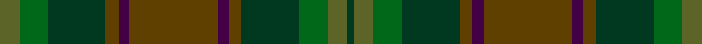

This page is one **sett** — a single exact thread-count. It belongs to the [tartan](/setts/y9g13dg26dy6dp5dy40dp5dy6dg26g13y9dg3/)
(the same proportion at any scale), whose colour order is pattern [GGGGBGBGGGGG](/stripes/ggggbgbggggg/).

Sourced from tartans-authority.  It is a [12 stripe tartan](/stripes/stripes12/).

Original link http://www.tartansauthority.com/tartan-ferret/display/10576/

## Register references

External register numbers recorded for this tartan.

- Scottish Register of Tartans: [10576](https://www.tartanregister.gov.uk/tartanDetails?ref=10576)
- Scottish Tartans Authority (ITI): 10576

## Thread count
G/18 Ga26 DG52 T12 DP10 T80 DP10 T12 DG52 Ga26 G18 DG/6

One full sett is **620 threads**.

## Palette

Palette: <strong>Tartan Register</strong>
<table><thead><tr><th>Colour</th><th>Threads</th><th>Shade</th><th>Base</th><th>OKLCh</th></tr></thead><tbody><tr><td>G/</td><td style="text-align:right;font-variant-numeric:tabular-nums">18</td><td><code style="background-color:#5C6428;">#5C6428</code> <small style="color:#888">#5C6428</small></td><td>G <code style="background-color:#006100;">#006100</code></td><td><small style="color:#888">oklch(48.3% 0.084 116.0)</small></td></tr><tr><td>Ga</td><td style="text-align:right;font-variant-numeric:tabular-nums">26</td><td><code style="background-color:#006818;">#006818</code> <small style="color:#888">#006818</small></td><td>G <code style="background-color:#006100;">#006100</code></td><td><small style="color:#888">oklch(45.0% 0.142 145.0)</small></td></tr><tr><td>DG</td><td style="text-align:right;font-variant-numeric:tabular-nums">52</td><td><code style="background-color:#003820;">#003820</code> <small style="color:#888">#003820</small></td><td>G <code style="background-color:#006100;">#006100</code></td><td><small style="color:#888">oklch(30.0% 0.070 158.3)</small></td></tr><tr><td>T</td><td style="text-align:right;font-variant-numeric:tabular-nums">12</td><td><code style="background-color:#604000;">#604000</code> <small style="color:#888">#604000</small></td><td>G <code style="background-color:#006100;">#006100</code></td><td><small style="color:#888">oklch(39.8% 0.083 76.8)</small></td></tr><tr><td>DP</td><td style="text-align:right;font-variant-numeric:tabular-nums">10</td><td><code style="background-color:#440044;">#440044</code> <small style="color:#888">#440044</small></td><td>B <code style="background-color:#2A418A;">#2A418A</code></td><td><small style="color:#888">oklch(27.1% 0.125 328.4)</small></td></tr><tr><td>T</td><td style="text-align:right;font-variant-numeric:tabular-nums">80</td><td><code style="background-color:#604000;">#604000</code> <small style="color:#888">#604000</small></td><td>G <code style="background-color:#006100;">#006100</code></td><td><small style="color:#888">oklch(39.8% 0.083 76.8)</small></td></tr><tr><td>DP</td><td style="text-align:right;font-variant-numeric:tabular-nums">10</td><td><code style="background-color:#440044;">#440044</code> <small style="color:#888">#440044</small></td><td>B <code style="background-color:#2A418A;">#2A418A</code></td><td><small style="color:#888">oklch(27.1% 0.125 328.4)</small></td></tr><tr><td>T</td><td style="text-align:right;font-variant-numeric:tabular-nums">12</td><td><code style="background-color:#604000;">#604000</code> <small style="color:#888">#604000</small></td><td>G <code style="background-color:#006100;">#006100</code></td><td><small style="color:#888">oklch(39.8% 0.083 76.8)</small></td></tr><tr><td>DG</td><td style="text-align:right;font-variant-numeric:tabular-nums">52</td><td><code style="background-color:#003820;">#003820</code> <small style="color:#888">#003820</small></td><td>G <code style="background-color:#006100;">#006100</code></td><td><small style="color:#888">oklch(30.0% 0.070 158.3)</small></td></tr><tr><td>Ga</td><td style="text-align:right;font-variant-numeric:tabular-nums">26</td><td><code style="background-color:#006818;">#006818</code> <small style="color:#888">#006818</small></td><td>G <code style="background-color:#006100;">#006100</code></td><td><small style="color:#888">oklch(45.0% 0.142 145.0)</small></td></tr><tr><td>G</td><td style="text-align:right;font-variant-numeric:tabular-nums">18</td><td><code style="background-color:#5C6428;">#5C6428</code> <small style="color:#888">#5C6428</small></td><td>G <code style="background-color:#006100;">#006100</code></td><td><small style="color:#888">oklch(48.3% 0.084 116.0)</small></td></tr><tr><td>DG/</td><td style="text-align:right;font-variant-numeric:tabular-nums">6</td><td><code style="background-color:#003820;">#003820</code> <small style="color:#888">#003820</small></td><td>G <code style="background-color:#006100;">#006100</code></td><td><small style="color:#888">oklch(30.0% 0.070 158.3)</small></td></tr></tbody></table>

## Nearest tartans

The nearest existing variants by ΔTartan distance, with this tartan at the top so the swatches line up against it.

ΔTartan

Tartan

Sett

—

<a href="/ttd/edit/#slug=y9g13dg26dy6dp5dy40dp5dy6dg26g13y9dg3~x2">de Meuron (Family)</a> <a class="nn-out" href="/variants/s12/y9g13dg26dy6dp5dy40dp5dy6dg26g13y9dg3~x2/" title="open its dictionary page">↗</a>

1.61

<a href="/ttd/edit/#slug=dy8dg20db15dy6dg4dy8db4dy6dg20dy8db6dy4b2dy4db6&amp;base=y9g13dg26dy6dp5dy40dp5dy6dg26g13y9dg3~x2">Unidentified Fragment #2</a> <a class="nn-out" href="/variants/s15/dy8dg20db15dy6dg4dy8db4dy6dg20dy8db6dy4b2dy4db6/" title="open its dictionary page">↗</a>

1.67

<a href="/ttd/edit/#slug=do22y26r4y26do22dy3do3dy3do3dy31do3dy3do3dy3~x2&amp;base=y9g13dg26dy6dp5dy40dp5dy6dg26g13y9dg3~x2">Devarr</a> <a class="nn-out" href="/variants/s14/do22y26r4y26do22dy3do3dy3do3dy31do3dy3do3dy3~x2/" title="open its dictionary page">↗</a>

1.70

<a href="/ttd/edit/#slug=dgi5dg2db2dg2db2dt5dg2dt1lo1dt1dg10db3~x4&amp;base=y9g13dg26dy6dp5dy40dp5dy6dg26g13y9dg3~x2">Protheroe (Welsh Name)</a> <a class="nn-out" href="/variants/s12/dgi5dg2db2dg2db2dt5dg2dt1lo1dt1dg10db3~x4/" title="open its dictionary page">↗</a>

1.72

<a href="/variants/s7/o5r8dp13dgi21dg34dgii55o3/">Lunting Papi (Personal)</a>

1.75

<a href="/ttd/edit/#slug=r2do1k1do10r1do10k13n4k1n11dy9n2lr1~x2&amp;base=y9g13dg26dy6dp5dy40dp5dy6dg26g13y9dg3~x2">Bruma</a> <a class="nn-out" href="/variants/s13/r2do1k1do10r1do10k13n4k1n11dy9n2lr1~x2/" title="open its dictionary page">↗</a>

1.79

<a href="/ttd/edit/#slug=dg2y8dt1y1dt1y1dt8dti9n1~x4&amp;base=y9g13dg26dy6dp5dy40dp5dy6dg26g13y9dg3~x2">Cowal Highland Gathering</a> <a class="nn-out" href="/variants/s9/dg2y8dt1y1dt1y1dt8dti9n1~x4/" title="open its dictionary page">↗</a>

1.85

<a href="/ttd/edit/#slug=dg1r1dgi22dy21dg12r11dgi22r1dg1~x2&amp;base=y9g13dg26dy6dp5dy40dp5dy6dg26g13y9dg3~x2">MacNaughton Htg</a> <a class="nn-out" href="/variants/s9/dg1r1dgi22dy21dg12r11dgi22r1dg1~x2/" title="open its dictionary page">↗</a>

1.88

<a href="/ttd/edit/#slug=dti9dt8y1dt1y1dt1y8dg2y8dt1y1dt1y1dt8dti9n1~x4&amp;base=y9g13dg26dy6dp5dy40dp5dy6dg26g13y9dg3~x2">Cowal Highland Games Corporate Tartan</a> <a class="nn-out" href="/variants/s16/dti9dt8y1dt1y1dt1y8dg2y8dt1y1dt1y1dt8dti9n1~x4/" title="open its dictionary page">↗</a>

1.89

<a href="/ttd/edit/#slug=lo3g30y20o6y3o3y3dt20r2~x2&amp;base=y9g13dg26dy6dp5dy40dp5dy6dg26g13y9dg3~x2">Glens of Corbie</a> <a class="nn-out" href="/variants/s9/lo3g30y20o6y3o3y3dt20r2~x2/" title="open its dictionary page">↗</a>

1.91

<a href="/ttd/edit/#slug=do26dt28g26dt8y3dt8g26dt28do26dr6~x2&amp;base=y9g13dg26dy6dp5dy40dp5dy6dg26g13y9dg3~x2">House of Bruar</a> <a class="nn-out" href="/variants/s10/do26dt28g26dt8y3dt8g26dt28do26dr6~x2/" title="open its dictionary page">↗</a>

## Neighbour map

Every grey dot is one of 14360 variants placed by the first two principal components of the ΔTartan feature space (44% of its variance). Red is this tartan; blue dots are its nearest — click one to open its page.

<svg viewBox="0 0 640 380" role="img" style="max-width:100%;height:auto;border:1px solid #e0e0e0;border-radius:4px;display:block" xmlns="http://www.w3.org/2000/svg"><image href="/nn/cloud.v1.png" width="640" height="380"/><a href="/variants/s15/dy8dg20db15dy6dg4dy8db4dy6dg20dy8db6dy4b2dy4db6/"><circle cx="299.4" cy="264.7" r="4" fill="#3465a4"><title>Unidentified Fragment #2</title></circle></a><a href="/variants/s14/do22y26r4y26do22dy3do3dy3do3dy31do3dy3do3dy3~x2/"><circle cx="330.3" cy="232.5" r="4" fill="#3465a4"><title>Devarr</title></circle></a><a href="/variants/s12/dgi5dg2db2dg2db2dt5dg2dt1lo1dt1dg10db3~x4/"><circle cx="308.6" cy="248.7" r="4" fill="#3465a4"><title>Protheroe (Welsh Name)</title></circle></a><a href="/variants/s7/o5r8dp13dgi21dg34dgii55o3/"><circle cx="283.9" cy="218.2" r="4" fill="#3465a4"><title>Lunting Papi (Personal)</title></circle></a><a href="/variants/s13/r2do1k1do10r1do10k13n4k1n11dy9n2lr1~x2/"><circle cx="263.6" cy="211.5" r="4" fill="#3465a4"><title>Bruma</title></circle></a><a href="/variants/s9/dg2y8dt1y1dt1y1dt8dti9n1~x4/"><circle cx="256.6" cy="239.7" r="4" fill="#3465a4"><title>Cowal Highland Gathering</title></circle></a><a href="/variants/s9/dg1r1dgi22dy21dg12r11dgi22r1dg1~x2/"><circle cx="402.1" cy="242.5" r="4" fill="#3465a4"><title>MacNaughton Htg</title></circle></a><a href="/variants/s16/dti9dt8y1dt1y1dt1y8dg2y8dt1y1dt1y1dt8dti9n1~x4/"><circle cx="253.6" cy="217.1" r="4" fill="#3465a4"><title>Cowal Highland Games Corporate Tartan</title></circle></a><a href="/variants/s9/lo3g30y20o6y3o3y3dt20r2~x2/"><circle cx="238.4" cy="190.2" r="4" fill="#3465a4"><title>Glens of Corbie</title></circle></a><a href="/variants/s10/do26dt28g26dt8y3dt8g26dt28do26dr6~x2/"><circle cx="249.7" cy="268.8" r="4" fill="#3465a4"><title>House of Bruar</title></circle></a><circle cx="276.7" cy="232.4" r="5" fill="#c00000"/></svg>

ID: /variants/s12/y9g13dg26dy6dp5dy40dp5dy6dg26g13y9dg3~x2/
