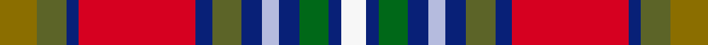

This page is one **sett** — a single exact thread-count. It belongs to the [tartan](/setts/y9g7db3r28db4g7db5lb4db5dg7db3w6/)
(the same proportion at any scale), whose colour order is pattern [GGBRBGBWBGBW](/stripes/ggbrbgbwbgbw/).

Sourced from tartans-authority.  It is a [12 stripe tartan](/stripes/stripes12/).

Original link http://www.tartansauthority.com/tartan-ferret/display/7455/

2 attestations — the source records this cloth was collapsed from (oldest owns this page)

<ul>
<li>2004 — Mayo County Crest (Fashion) (tartans-authority, <a href="http://www.tartansauthority.com/tartan-ferret/display/7455/">record</a>)  <em>This tartan is part of the 'County Crest' range of Irish tartans originally designed by Viking Technology and woven by Marton Mills in 2004. The range of tartans - the ownership and copyright of which were transferred to USA Kilts Inc. in 2012 - are based on the colours found in each of the 32 Irish County crests. This tartan may not be reproduced in any form without the express written consent of USA Kilts Inc.</em></li>
<li>01/05/2005 — Mayo County, Crest Range (register-of-tartans, <a href="https://www.tartanregister.gov.uk/tartanDetails.aspx?ref=4930">record</a>)  <em>Designed by Viking Technology Limited (now Tartan Web Scotland Ltd) in 2005 as one of a set of Irish County and Irish National tartans. Ownership transferred to USA Kilts Inc in Dec 2012.</em></li>
</ul>

## Register references

External register numbers recorded for this tartan.

- Scottish Register of Tartans: [4930](https://www.tartanregister.gov.uk/tartanDetails.aspx?ref=4930)
- Scottish Tartans Authority (ITI): 7455
- Scottish Tartans World Register: 3094

## Thread count
Y/18 G14 DB6 R56 DB8 G14 DB10 LB8 DB10 DG14 DB6 W/12

One full sett is **322 threads**.

## Palette
<table><thead><tr><th>Colour</th><th>Shade</th><th>OKLCh</th></tr></thead><tbody><tr><td>B</td><td><code style="background-color:#B5BBDE;">#B5BBDE</code> <small style="color:#888">#B5BBDE</small></td><td><small style="color:#888">oklch(79.9% 0.050 277.6)</small></td></tr><tr><td>DB</td><td><code style="background-color:#082077;">#082077</code> <small style="color:#888">#082077</small></td><td><small style="color:#888">oklch(30.0% 0.149 265.1)</small></td></tr><tr><td>G</td><td><code style="background-color:#006818;">#006818</code> <small style="color:#888">#006818</small></td><td><small style="color:#888">oklch(45.0% 0.142 145.0)</small></td></tr><tr><td>Ga</td><td><code style="background-color:#5C6428;">#5C6428</code> <small style="color:#888">#5C6428</small></td><td><small style="color:#888">oklch(48.3% 0.084 116.0)</small></td></tr><tr><td>LN</td><td><code style="background-color:#F7F7F7;">#F7F7F7</code> <small style="color:#888">#F7F7F7</small></td><td><small style="color:#888">oklch(97.6% 0.000 89.9)</small></td></tr><tr><td>R</td><td><code style="background-color:#D60020;">#D60020</code> <small style="color:#888">#D60020</small></td><td><small style="color:#888">oklch(55.2% 0.224 25.5)</small></td></tr><tr><td>Y</td><td><code style="background-color:#8B6E00;">#8B6E00</code> <small style="color:#888">#8B6E00</small></td><td><small style="color:#888">oklch(55.1% 0.113 90.4)</small></td></tr></tbody></table>

# Sample pattern

ID: /variants/s12/y9g7db3r28db4g7db5lb4db5dg7db3w6~x2~g1903114-dg1806142/
