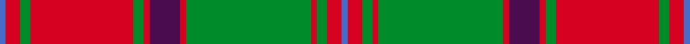
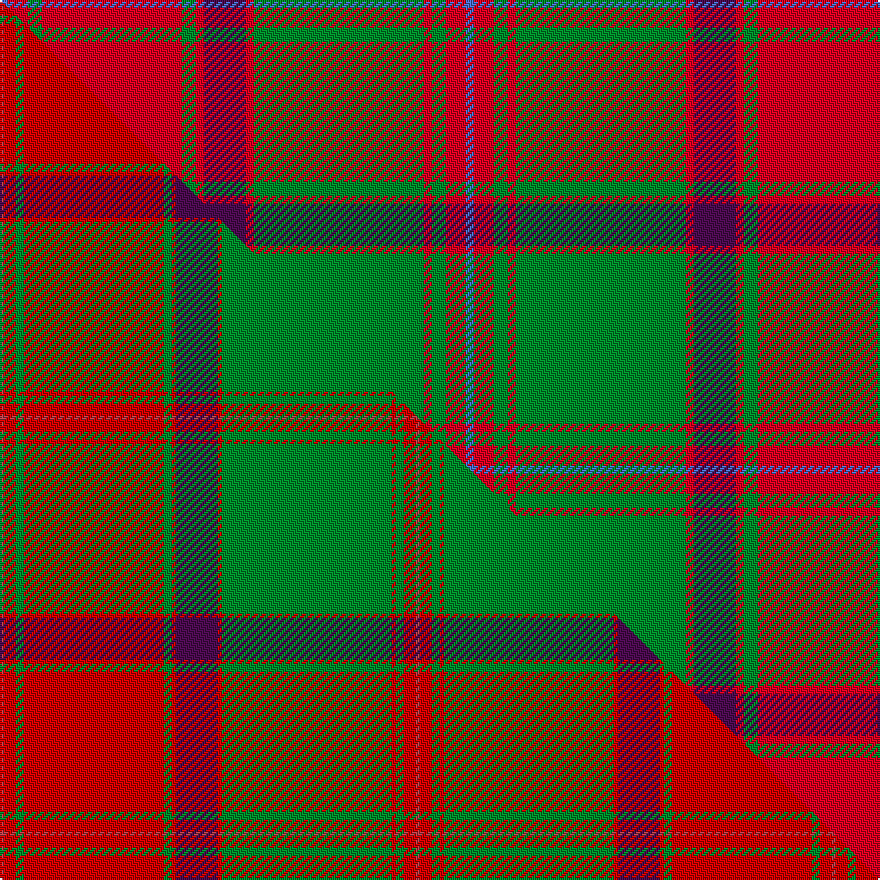

This page is one **sett** — a single exact thread-count. It belongs to the [tartan](/setts/b4r10g7r70g7r4dp21r4g85r4g7r10b4/)
(the same proportion at any scale), whose colour order is pattern [BRGRGRBRGRGRB](/stripes/brgrgrbrgrgrb/).

Part of the [Crieff](/tartans/crieff/) tartan — the named design grouping this sett with its other cloths.

Sourced from weddslist.  It is a [13 stripe tartan](/stripes/stripes13/).

Original link http://www.weddslist.com/cgi-bin/tartans/pg.pl?source=sts

Dataset <small>— provenance for this record, inherited from the source manifest</small>

<dl class="dataset-prov">
<dt>source</dt><dd><a href="/sources/weddslist/">Weddslist</a></dd>
<dt>data captured from</dt><dd><a href="https://github.com/thetartan/tartan-database/blob/master/data/weddslist/data.csv">https://github.com/thetartan/tartan-database/blob/master/data/weddslist/data.csv</a></dd>
<dt>data date</dt><dd>2016-11-17 <small>(dataset default)</small></dd>
<dt>licence</dt><dd><a href="https://creativecommons.org/licenses/by-nc-nd/4.0/">CC BY-NC-ND 4.0</a></dd>
</dl>

Capture chain <small>— the hands this data passed through, oldest first; each capture carries its own licence</small>

<ol class="capture-chain">
<li><a href="https://www.weddslist.com/tartans/">Weddslist</a> <small>the living privately compiled reference</small></li>
<li><a href="https://github.com/thetartan/tartan-database">thetartan/tartan-database</a> <small>2016-2017</small> · <a href="https://creativecommons.org/licenses/by-nc-nd/4.0/">CC BY-NC-ND 4.0</a> <small>Levko Kravets's frozen compilation — the capture we vendored, and where its CC licence text came from</small></li>
<li>this dictionary <small>captured 2026-06-10 · commit 5bf86c7566</small> <small>each re-capture is a git commit to data/sources</small></li>
</ol>

## Thread count
B/4 R10 G7 R70 G7 R4 DP21 R4 G85 R4 G7 R10 B/4

One full sett is **466 threads**.

## Palette
<table><thead><tr><th>Colour</th><th>Shade</th><th>OKLCh</th></tr></thead><tbody><tr><td>G</td><td><code style="background-color:#008B2A;">#008B2A</code> <small style="color:#888">#008B2A</small></td><td><small style="color:#888">oklch(55.4% 0.170 145.9)</small></td></tr><tr><td>DP</td><td><code style="background-color:#4B0B4F;">#4B0B4F</code> <small style="color:#888">#4B0B4F</small></td><td><small style="color:#888">oklch(30.1% 0.125 325.4)</small></td></tr><tr><td>B</td><td><code style="background-color:#466CC8;">#466CC8</code> <small style="color:#888">#466CC8</small></td><td><small style="color:#888">oklch(55.1% 0.149 265.0)</small></td></tr><tr><td>R</td><td><code style="background-color:#D60020;">#D60020</code> <small style="color:#888">#D60020</small></td><td><small style="color:#888">oklch(55.2% 0.224 25.5)</small></td></tr></tbody></table>

# Sample pattern

## Compared to the master

This cloth is one sett of its design; the master sett (the exemplar the design is anchored on) is below for comparison.

Its **ΔTartan distance** from the master is **2.53** — the same measure the nearest-tartans table ranks by (0 is identical; a re-scale of the same cloth is near 0, a recolour or a different proportion further).

<figure class="master-compare" style="margin:0">

this sett
master sett ★

<figcaption style="color:#888;font-size:smaller">One weave of this sett against the <a href="/setts/m2r6g4r70g4r2dp21r2g85r2g4r6m2/">master sett ★</a>, split on the diagonal: a shared proportion runs seamlessly across it with only the shades shifting; a different proportion breaks on it.</figcaption>
</figure>

## Nearest tartan variants

The nearest existing variants by ΔTartan distance, with this cloth at the top so the swatches line up against it.

ΔTartan

Threads

Variant

Sett

—

466

<a href="/variants/s13/b4r10g7r70g7r4dp21r4g85r4g7r10b4/">Crieff</a>

<a href="/ttd/edit/#slug=ri4r10g7r70g7r4dp21r4g85r4g7r10ri4~ri2406019-r2109032&amp;base=b4r10g7r70g7r4dp21r4g85r4g7r10b4" title="compare in the TTD">0.61</a>

466

<a href="/variants/s13/ri4r10g7r70g7r4dp21r4g85r4g7r10ri4~ri2406019-r2109032/">Crieff District Tartan</a>

<a href="/ttd/edit/#slug=m2r6g4r70g4r2dp21r2g85r2g4r6m2~m2106019-r2109032&amp;base=b4r10g7r70g7r4dp21r4g85r4g7r10b4" title="compare in the TTD">1.09</a>

416

<a href="/variants/s13/m2r6g4r70g4r2dp21r2g85r2g4r6m2~m2106019-r2109032/">Crieff</a>

<a href="/ttd/edit/#slug=r3db2r2g38r2g2r2db10r2lb2r37db2r2db2r3~x2&amp;base=b4r10g7r70g7r4dp21r4g85r4g7r10b4" title="compare in the TTD">1.67</a>

432

<a href="/variants/s15/r3db2r2g38r2g2r2db10r2lb2r37db2r2db2r3~x2/">Grant and Drummond</a>

<a href="/ttd/edit/#slug=g6r2g2r24lb1db1r2db12r2db1lb1r2g24r2~x2&amp;base=b4r10g7r70g7r4dp21r4g85r4g7r10b4" title="compare in the TTD">1.79</a>

312

<a href="/variants/s14/g6r2g2r24lb1db1r2db12r2db1lb1r2g24r2~x2/">Unidentified Coat</a>

<a href="/ttd/edit/#slug=r7b2db2r2g32r6db12r41g2r5b2g5~x2&amp;base=b4r10g7r70g7r4dp21r4g85r4g7r10b4" title="compare in the TTD">1.98</a>

448

<a href="/variants/s12/r7b2db2r2g32r6db12r41g2r5b2g5~x2/">MacDonald of Glenaladale</a>

<a href="/ttd/edit/#slug=g18r3g2r2db6r2g2r24g1r2g6~x2&amp;base=b4r10g7r70g7r4dp21r4g85r4g7r10b4" title="compare in the TTD">2.04</a>

224

<a href="/variants/s11/g18r3g2r2db6r2g2r24g1r2g6~x2/">MacDonell of Glengarry #4</a>

<a href="/ttd/edit/#slug=g38r3g3r3db9r3lb2r40db3r3db2r6~x2&amp;base=b4r10g7r70g7r4dp21r4g85r4g7r10b4" title="compare in the TTD">2.07</a>

372

<a href="/variants/s12/g38r3g3r3db9r3lb2r40db3r3db2r6~x2/">MacLintock</a>

<a href="/ttd/edit/#slug=o10lb2g3lb2do24lb4do4o34do2lb3do2~x2&amp;base=b4r10g7r70g7r4dp21r4g85r4g7r10b4" title="compare in the TTD">2.10</a>

336

<a href="/variants/s11/o10lb2g3lb2do24lb4do4o34do2lb3do2~x2/">Fort William (Fashion)</a>

<a href="/ttd/edit/#slug=g18r3g2r2db6r2g2r24g2r2g6~x2&amp;base=b4r10g7r70g7r4dp21r4g85r4g7r10b4" title="compare in the TTD">2.16</a>

228

<a href="/variants/s11/g18r3g2r2db6r2g2r24g2r2g6~x2/">MacDonald of Vallay (Uist) (?)</a>

<a href="/ttd/edit/#slug=g36r3g3r3db9r3lb2r40db3r3db2r6~x2&amp;base=b4r10g7r70g7r4dp21r4g85r4g7r10b4" title="compare in the TTD">2.17</a>

368

<a href="/variants/s12/g36r3g3r3db9r3lb2r40db3r3db2r6~x2/">MacLintock - 1880 (Clan)</a>

## Neighbour map

Every grey dot is one of 13620 variants placed by the first two principal components of the ΔTartan feature space (42% of its variance). Red is this tartan; blue dots are its nearest — click one to open its page.

<svg viewBox="0 0 640 380" role="img" style="max-width:100%;height:auto;border:1px solid #e0e0e0;border-radius:4px;display:block" xmlns="http://www.w3.org/2000/svg"><image href="/nn/cloud.v1.png" width="640" height="380"/><a href="/variants/s13/ri4r10g7r70g7r4dp21r4g85r4g7r10ri4~ri2406019-r2109032/"><circle cx="327.7" cy="123.6" r="4" fill="#3465a4"><title>Crieff District Tartan</title></circle></a><a href="/variants/s13/m2r6g4r70g4r2dp21r2g85r2g4r6m2~m2106019-r2109032/"><circle cx="361.0" cy="86.7" r="4" fill="#3465a4"><title>Crieff</title></circle></a><a href="/variants/s15/r3db2r2g38r2g2r2db10r2lb2r37db2r2db2r3~x2/"><circle cx="311.5" cy="104.3" r="4" fill="#3465a4"><title>Grant and Drummond</title></circle></a><a href="/variants/s14/g6r2g2r24lb1db1r2db12r2db1lb1r2g24r2~x2/"><circle cx="281.2" cy="114.7" r="4" fill="#3465a4"><title>Unidentified Coat</title></circle></a><a href="/variants/s12/r7b2db2r2g32r6db12r41g2r5b2g5~x2/"><circle cx="329.6" cy="128.8" r="4" fill="#3465a4"><title>MacDonald of Glenaladale</title></circle></a><a href="/variants/s11/g18r3g2r2db6r2g2r24g1r2g6~x2/"><circle cx="352.6" cy="148.2" r="4" fill="#3465a4"><title>MacDonell of Glengarry #4</title></circle></a><a href="/variants/s12/g38r3g3r3db9r3lb2r40db3r3db2r6~x2/"><circle cx="329.5" cy="122.9" r="4" fill="#3465a4"><title>MacLintock</title></circle></a><a href="/variants/s11/o10lb2g3lb2do24lb4do4o34do2lb3do2~x2/"><circle cx="342.6" cy="153.7" r="4" fill="#3465a4"><title>Fort William (Fashion)</title></circle></a><a href="/variants/s11/g18r3g2r2db6r2g2r24g2r2g6~x2/"><circle cx="328.0" cy="175.7" r="4" fill="#3465a4"><title>MacDonald of Vallay (Uist) (?)</title></circle></a><a href="/variants/s12/g36r3g3r3db9r3lb2r40db3r3db2r6~x2/"><circle cx="332.4" cy="123.0" r="4" fill="#3465a4"><title>MacLintock - 1880 (Clan)</title></circle></a><circle cx="321.4" cy="122.6" r="5" fill="#c00000"/><text x="320" y="376" text-anchor="middle" font-size="11" fill="#999">ground</text><text x="11" y="190" text-anchor="middle" font-size="11" fill="#999" transform="rotate(-90 11 190)">complexity</text></svg>

ID: /variants/s13/b4r10g7r70g7r4dp21r4g85r4g7r10b4/
