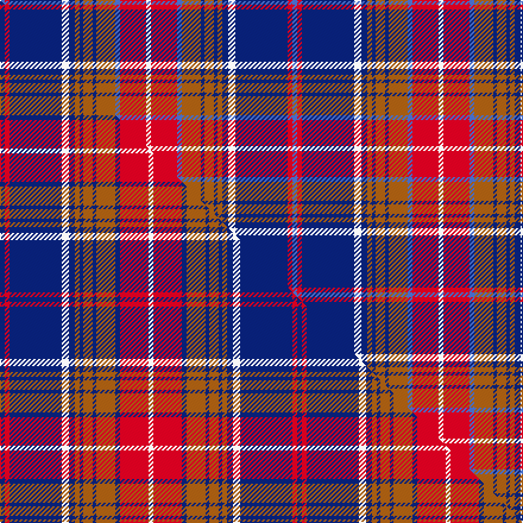

This page is one **sett** — a single exact thread-count. It belongs to the [tartan](/setts/b4r4db44w6db5o4db3o8db3o16b4r22w4/)
(the same proportion at any scale), whose colour order is pattern [BRBWBRBRBRBRW](/stripes/brbwbrbrbrbrw/).

Part of the [Largs](/tartans/largs/) tartan — the named design grouping this sett with its other cloths.

Sourced from weddslist.  It is a [13 stripe tartan](/stripes/stripes13/).

Original link http://www.weddslist.com/cgi-bin/tartans/pg.pl?source=sts

Dataset <small>— provenance for this record, inherited from the source manifest</small>

<dl class="dataset-prov">
<dt>source</dt><dd><a href="/sources/weddslist/">Weddslist</a></dd>
<dt>data captured from</dt><dd><a href="https://github.com/thetartan/tartan-database/blob/master/data/weddslist/data.csv">https://github.com/thetartan/tartan-database/blob/master/data/weddslist/data.csv</a></dd>
<dt>data date</dt><dd>2016-11-17 <small>(dataset default)</small></dd>
<dt>licence</dt><dd><a href="https://creativecommons.org/licenses/by-nc-nd/4.0/">CC BY-NC-ND 4.0</a></dd>
</dl>

Capture chain <small>— the hands this data passed through, oldest first; each capture carries its own licence</small>

<ol class="capture-chain">
<li><a href="https://www.weddslist.com/tartans/">Weddslist</a> <small>the living privately compiled reference</small></li>
<li><a href="https://github.com/thetartan/tartan-database">thetartan/tartan-database</a> <small>2016-2017</small> · <a href="https://creativecommons.org/licenses/by-nc-nd/4.0/">CC BY-NC-ND 4.0</a> <small>Levko Kravets's frozen compilation — the capture we vendored, and where its CC licence text came from</small></li>
<li>this dictionary <small>captured 2026-06-10 · commit 5bf86c7566</small> <small>each re-capture is a git commit to data/sources</small></li>
</ol>

## Thread count
B/4 R4 DB44 W6 DB5 O4 DB3 O8 DB3 O16 B4 R22 W/4

One full sett is **246 threads**.

## Palette
<table><thead><tr><th>Colour</th><th>Shade</th><th>OKLCh</th></tr></thead><tbody><tr><td>DB</td><td><code style="background-color:#082077;">#082077</code> <small style="color:#888">#082077</small></td><td><small style="color:#888">oklch(30.0% 0.149 265.1)</small></td></tr><tr><td>R</td><td><code style="background-color:#D60020;">#D60020</code> <small style="color:#888">#D60020</small></td><td><small style="color:#888">oklch(55.2% 0.224 25.5)</small></td></tr><tr><td>B</td><td><code style="background-color:#466CC8;">#466CC8</code> <small style="color:#888">#466CC8</small></td><td><small style="color:#888">oklch(55.1% 0.149 265.0)</small></td></tr><tr><td>W</td><td><code style="background-color:#F7F7F7;">#F7F7F7</code> <small style="color:#888">#F7F7F7</small></td><td><small style="color:#888">oklch(97.6% 0.000 89.9)</small></td></tr><tr><td>O</td><td><code style="background-color:#A65C11;">#A65C11</code> <small style="color:#888">#A65C11</small></td><td><small style="color:#888">oklch(55.0% 0.125 58.3)</small></td></tr></tbody></table>

# Sample pattern

## Compared to the master

This cloth is one sett of its design; the master sett (the exemplar the design is anchored on) is below for comparison.

Its **ΔTartan distance** from the master is **2.07** — the same measure the nearest-tartans table ranks by (0 is identical; a re-scale of the same cloth is near 0, a recolour or a different proportion further).

<figure class="master-compare" style="margin:0">

this sett
master sett ★

<figcaption style="color:#888;font-size:smaller">One weave of this sett against the <a href="/setts/db4r4db44w6db5o4db3o8db3o16db4r24w4/">master sett ★</a>, split on the diagonal: a shared proportion runs seamlessly across it with only the shades shifting; a different proportion breaks on it.</figcaption>
</figure>

## Nearest tartan variants

The nearest existing variants by ΔTartan distance, with this cloth at the top so the swatches line up against it.

ΔTartan

Threads

Variant

Sett

—

246

<a href="/variants/s13/b4r4db44w6db5o4db3o8db3o16b4r22w4/">Largs</a>

<a href="/ttd/edit/#slug=db4r4db44w6db5o4db3o8db3o16db4r24w4&amp;base=b4r4db44w6db5o4db3o8db3o16b4r22w4" title="compare in the TTD">2.07</a>

250

<a href="/variants/s13/db4r4db44w6db5o4db3o8db3o16db4r24w4/">Largs (1981) (District)</a>

<a href="/ttd/edit/#slug=y2r9db3dg12r2db40r2dg20db2r18db2w2~x2&amp;base=b4r4db44w6db5o4db3o8db3o16b4r22w4" title="compare in the TTD">2.49</a>

448

<a href="/variants/s12/y2r9db3dg12r2db40r2dg20db2r18db2w2~x2/">Kormylo (Personal)</a>

<a href="/ttd/edit/#slug=r16db2r2db2r2db16g16dy1r16db16r2n2~x2&amp;base=b4r4db44w6db5o4db3o8db3o16b4r22w4" title="compare in the TTD">2.54</a>

336

<a href="/variants/s12/r16db2r2db2r2db16g16dy1r16db16r2n2~x2/">Army Medical Services</a>

<a href="/ttd/edit/#slug=db9y4db4lb41db4r4lb4r15lb4r4db41w4~x2&amp;base=b4r4db44w6db5o4db3o8db3o16b4r22w4" title="compare in the TTD">2.57</a>

526

<a href="/variants/s12/db9y4db4lb41db4r4lb4r15lb4r4db41w4~x2/">Philadelphia Police and Fire Pipes and Drums</a>

<a href="/ttd/edit/#slug=dy4w2dy2w3dy20db6lb3db2lb2db2lb16r3~x2&amp;base=b4r4db44w6db5o4db3o8db3o16b4r22w4" title="compare in the TTD">2.62</a>

246

<a href="/variants/s12/dy4w2dy2w3dy20db6lb3db2lb2db2lb16r3~x2/">Callum Scotch House Trade Tartan</a>

<a href="/ttd/edit/#slug=o4w2o2r3o19b6db3b2db2b2db15o3~x2&amp;base=b4r4db44w6db5o4db3o8db3o16b4r22w4" title="compare in the TTD">2.64</a>

238

<a href="/variants/s12/o4w2o2r3o19b6db3b2db2b2db15o3~x2/">Scotch, House Cailean</a>

<a href="/ttd/edit/#slug=r15w2r15y1db8w2db8y1db12r1y3r1db12w2g20w2y1db20y1~x2&amp;base=b4r4db44w6db5o4db3o8db3o16b4r22w4" title="compare in the TTD">2.66</a>

476

<a href="/variants/s19/r15w2r15y1db8w2db8y1db12r1y3r1db12w2g20w2y1db20y1~x2/">Hébert Kitenge Family (Personal)</a>

<a href="/ttd/edit/#slug=dy4w2dy2r3dy19lb6db3lb2db2lb2db15dy3~x2&amp;base=b4r4db44w6db5o4db3o8db3o16b4r22w4" title="compare in the TTD">2.68</a>

238

<a href="/variants/s12/dy4w2dy2r3dy19lb6db3lb2db2lb2db15dy3~x2/">Cailean (Scotch House)</a>

<a href="/ttd/edit/#slug=dt4lr4db7lr4dt3lr22dbi8dt8dbi8dt8dbi8dt8dbi8dt8lr34r4~x2~db1404245-dbi1406275&amp;base=b4r4db44w6db5o4db3o8db3o16b4r22w4" title="compare in the TTD">2.69</a>

568

<a href="/variants/s16/dt4lr4db7lr4dt3lr22dbi8dt8dbi8dt8dbi8dt8dbi8dt8lr34r4~x2~db1404245-dbi1406275/">Perry Golf</a>

<a href="/ttd/edit/#slug=w4db1dbi12db1r8w8db8w2db1w2db24ly4db1r2~x2~db1404245-dbi1406275&amp;base=b4r4db44w6db5o4db3o8db3o16b4r22w4" title="compare in the TTD">2.74</a>

300

<a href="/variants/s14/w4db1dbi12db1r8w8db8w2db1w2db24ly4db1r2~x2~db1404245-dbi1406275/">Submariners (Unofficial)</a>

## Neighbour map

Every grey dot is one of 13620 variants placed by the first two principal components of the ΔTartan feature space (42% of its variance). Red is this tartan; blue dots are its nearest — click one to open its page.

<svg viewBox="0 0 640 380" role="img" style="max-width:100%;height:auto;border:1px solid #e0e0e0;border-radius:4px;display:block" xmlns="http://www.w3.org/2000/svg"><image href="/nn/cloud.v1.png" width="640" height="380"/><a href="/variants/s13/db4r4db44w6db5o4db3o8db3o16db4r24w4/"><circle cx="264.2" cy="139.4" r="4" fill="#3465a4"><title>Largs (1981) (District)</title></circle></a><a href="/variants/s12/y2r9db3dg12r2db40r2dg20db2r18db2w2~x2/"><circle cx="252.5" cy="126.2" r="4" fill="#3465a4"><title>Kormylo (Personal)</title></circle></a><a href="/variants/s12/r16db2r2db2r2db16g16dy1r16db16r2n2~x2/"><circle cx="228.2" cy="148.1" r="4" fill="#3465a4"><title>Army Medical Services</title></circle></a><a href="/variants/s12/db9y4db4lb41db4r4lb4r15lb4r4db41w4~x2/"><circle cx="208.1" cy="143.6" r="4" fill="#3465a4"><title>Philadelphia Police and Fire Pipes and Drums</title></circle></a><a href="/variants/s12/dy4w2dy2w3dy20db6lb3db2lb2db2lb16r3~x2/"><circle cx="174.0" cy="149.8" r="4" fill="#3465a4"><title>Callum Scotch House Trade Tartan</title></circle></a><a href="/variants/s12/o4w2o2r3o19b6db3b2db2b2db15o3~x2/"><circle cx="232.4" cy="161.0" r="4" fill="#3465a4"><title>Scotch, House Cailean</title></circle></a><a href="/variants/s19/r15w2r15y1db8w2db8y1db12r1y3r1db12w2g20w2y1db20y1~x2/"><circle cx="219.7" cy="110.4" r="4" fill="#3465a4"><title>Hébert Kitenge Family (Personal)</title></circle></a><a href="/variants/s12/dy4w2dy2r3dy19lb6db3lb2db2lb2db15dy3~x2/"><circle cx="214.3" cy="159.0" r="4" fill="#3465a4"><title>Cailean (Scotch House)</title></circle></a><a href="/variants/s16/dt4lr4db7lr4dt3lr22dbi8dt8dbi8dt8dbi8dt8dbi8dt8lr34r4~x2~db1404245-dbi1406275/"><circle cx="189.4" cy="152.9" r="4" fill="#3465a4"><title>Perry Golf</title></circle></a><a href="/variants/s14/w4db1dbi12db1r8w8db8w2db1w2db24ly4db1r2~x2~db1404245-dbi1406275/"><circle cx="219.5" cy="110.2" r="4" fill="#3465a4"><title>Submariners (Unofficial)</title></circle></a><circle cx="216.3" cy="128.7" r="5" fill="#c00000"/><text x="320" y="376" text-anchor="middle" font-size="11" fill="#999">ground</text><text x="11" y="190" text-anchor="middle" font-size="11" fill="#999" transform="rotate(-90 11 190)">complexity</text></svg>

ID: /variants/s13/b4r4db44w6db5o4db3o8db3o16b4r22w4/
