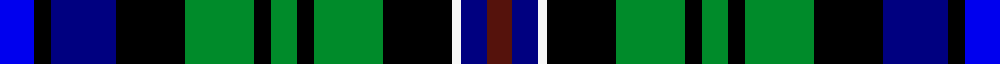

This is one **variant** — a specific cloth: this exact thread count and colourway, with its own
provenance below. It is one weaving of the [sett](/setts/b8k4db15k16g16k4g6k4g16k16w2db6dr6/) (the scale-free proportion — the
same cloth at any scale or shade), whose colour order is pattern [BBWKGKGKGKBKB](/stripes/bbwkgkgkgkbkb/).

Part of the [Free](/tartans/f/fr/free/) tartan — the named design grouping this sett with its other cloths.

Sourced from register-of-tartans.  It is a [13 stripe tartan](/stripes/stripes13/).

Original link [https://www.tartanregister.gov.uk/tartanDetails.aspx?ref=10156](https://www.tartanregister.gov.uk/tartanDetails.aspx?ref=10156)

Dataset <small>— provenance for this record, inherited from the source manifest</small>

<dl class="dataset-prov">
<dt>source</dt><dd><a href="/sources/register-of-tartans/">Scottish Register of Tartans</a></dd>
<dt>data captured from</dt><dd><a href="https://github.com/thetartan/tartan-database/blob/master/data/register-of-tartans/data.csv">https://github.com/thetartan/tartan-database/blob/master/data/register-of-tartans/data.csv</a></dd>
<dt>data date</dt><dd>01/02/2010 <small>(this record)</small></dd>
<dt>licence</dt><dd><a href="https://www.tartanregister.gov.uk/copyright">Crown copyright</a></dd>
</dl>

Capture chain <small>— the hands this data passed through, oldest first; each capture carries its own licence</small>

<ol class="capture-chain">
<li><a href="https://www.tartanregister.gov.uk/">Scottish Register of Tartans</a> · <a href="https://www.tartanregister.gov.uk/copyright">Crown copyright</a> <small>the living register — still published by National Records of Scotland</small></li>
<li><a href="https://github.com/thetartan/tartan-database">thetartan/tartan-database</a> <small>2016-2017</small> · <a href="https://creativecommons.org/licenses/by-nc-nd/4.0/">CC BY-NC-ND 4.0</a> <small>Levko Kravets's frozen compilation — the capture we vendored, and where its CC licence text came from</small></li>
<li>this dictionary <small>captured 2026-06-10 · commit 5bf86c7566</small> <small>each re-capture is a git commit to data/sources</small></li>
</ol>

## Register references

External register numbers recorded for this tartan.

- Scottish Register of Tartans: [10156](https://www.tartanregister.gov.uk/tartanDetails.aspx?ref=10156)

## Thread count
B/8 K4 DB15 K16 G16 K4 G6 K4 G16 K16 W2 DB6 DR/6

One full sett is **224 threads**.

## Palette
<table><thead><tr><th>Colour</th><th>Shade</th><th>OKLCh</th></tr></thead><tbody><tr><td>B</td><td><code style="background-color:#0000EE;">#0000EE</code> <small style="color:#888">#0000EE</small></td><td><small style="color:#888">oklch(42.9% 0.297 264.1)</small></td></tr><tr><td>DB</td><td><code style="background-color:#000080;">#000080</code> <small style="color:#888">#000080</small></td><td><small style="color:#888">oklch(27.1% 0.188 264.1)</small></td></tr><tr><td>G</td><td><code style="background-color:#008B2A;">#008B2A</code> <small style="color:#888">#008B2A</small></td><td><small style="color:#888">oklch(55.4% 0.170 145.9)</small></td></tr><tr><td>K</td><td><code style="background-color:#000000;">#000000</code> <small style="color:#888">#000000</small></td><td><small style="color:#888">oklch(0.0% 0.000 0.0)</small></td></tr><tr><td>DR</td><td><code style="background-color:#55120C;">#55120C</code> <small style="color:#888">#55120C</small></td><td><small style="color:#888">oklch(30.0% 0.099 29.3)</small></td></tr><tr><td>W</td><td><code style="background-color:#F7F7F7;">#F7F7F7</code> <small style="color:#888">#F7F7F7</small></td><td><small style="color:#888">oklch(97.6% 0.000 89.9)</small></td></tr></tbody></table>

# Sample pattern

## Nearest tartan variants

The nearest existing variants by ΔTartan distance, with this cloth at the top so the swatches line up against it.

ΔTartan

Threads

Variant

Sett

—

224

<a href="/variants/s13/b8k4db15k16g16k4g6k4g16k16w2db6dr6~b1712264-db1108266/">Free (Wishaw)</a>

<a href="/ttd/edit/#slug=dbi8k4db15k16g16k4g6k4g16k16w2db6o6~dbi1406275-db1404245&amp;base=b8k4db15k16g16k4g6k4g16k16w2db6dr6~b1712264-db1108266" title="compare in the TTD">0.35</a>

224

<a href="/variants/s13/dbi8k4db15k16g16k4g6k4g16k16w2db6o6~dbi1406275-db1404245/">Free (Universal)</a>

<a href="/ttd/edit/#slug=r2k1db8k7g8y2g8k7db8k1b2~x4~db1108266-b1611266&amp;base=b8k4db15k16g16k4g6k4g16k16w2db6dr6~b1712264-db1108266" title="compare in the TTD">1.60</a>

416

<a href="/variants/s11/r2k1db8k7g8y2g8k7db8k1b2~x4~db1108266-b1511266/">Scottish Economics Society 'Adam Smith'</a>

<a href="/ttd/edit/#slug=r2k1db8k7g8y2g8k7db8k1t2~x4&amp;base=b8k4db15k16g16k4g6k4g16k16w2db6dr6~b1712264-db1108266" title="compare in the TTD">1.70</a>

416

<a href="/variants/s11/r2k1db8k7g8y2g8k7db8k1t2~x4/">Adam Smith (Corporate)</a>

<a href="/ttd/edit/#slug=w7k11lb3db9g19y3k22db9lb3k3db6~x2&amp;base=b8k4db15k16g16k4g6k4g16k16w2db6dr6~b1712264-db1108266" title="compare in the TTD">1.83</a>

354

<a href="/variants/s11/w7k11lb3db9g19y3k22db9lb3k3db6~x2/">Veere</a>

<a href="/ttd/edit/#slug=dp3db13n2db4w2db8k13g10k2g8dp3~x2&amp;base=b8k4db15k16g16k4g6k4g16k16w2db6dr6~b1712264-db1108266" title="compare in the TTD">1.86</a>

260

<a href="/variants/s11/dp3db13n2db4w2db8k13g10k2g8dp3~x2/">Smithers</a>

<a href="/ttd/edit/#slug=db2r1db6k6g6k1lb1k1y1k1g6k6db6g1db2~x4&amp;base=b8k4db15k16g16k4g6k4g16k16w2db6dr6~b1712264-db1108266" title="compare in the TTD">1.97</a>

360

<a href="/variants/s15/db2r1db6k6g6k1lb1k1y1k1g6k6db6g1db2~x4/">Malcolm (symmetrical)</a>

<a href="/ttd/edit/#slug=db1r1db6k6g6k1y1k1w1k1g6k6db6r1&amp;base=b8k4db15k16g16k4g6k4g16k16w2db6dr6~b1712264-db1108266" title="compare in the TTD">2.11</a>

86

<a href="/variants/s14/db1r1db6k6g6k1y1k1w1k1g6k6db6r1/">Malcolm</a>

<a href="/ttd/edit/#slug=k1y1k1g6k6db6r1db1r1db6k6g6k1lb1~x4&amp;base=b8k4db15k16g16k4g6k4g16k16w2db6dr6~b1712264-db1108266" title="compare in the TTD">2.11</a>

344

<a href="/variants/s14/k1y1k1g6k6db6r1db1r1db6k6g6k1lb1~x4/">Malcolm Clan Tartan</a>

<a href="/ttd/edit/#slug=db1r1db6k6g6k1y1k1lb1k1g6k6db6r1~x2&amp;base=b8k4db15k16g16k4g6k4g16k16w2db6dr6~b1712264-db1108266" title="compare in the TTD">2.11</a>

172

<a href="/variants/s14/db1r1db6k6g6k1y1k1lb1k1g6k6db6r1~x2/">Malcolm (a)</a>

<a href="/ttd/edit/#slug=k1y1k1g6k6db6r1db1r1db6k6g6k1t1~x4&amp;base=b8k4db15k16g16k4g6k4g16k16w2db6dr6~b1712264-db1108266" title="compare in the TTD">2.11</a>

344

<a href="/variants/s14/k1y1k1g6k6db6r1db1r1db6k6g6k1t1~x4/">Malcolm</a>

## Neighbour map

Every grey dot is one of 13656 variants placed by the first two principal components of the ΔTartan feature space (42% of its variance). Red is this tartan; blue dots are its nearest — click one to open its page. The map is a flat projection of a many-dimensional space — [how to read it](/posts/neighbourhood-maps/).

<svg viewBox="0 0 640 380" role="img" style="max-width:100%;height:auto;border:1px solid #e0e0e0;border-radius:4px;display:block" xmlns="http://www.w3.org/2000/svg"><image href="/nn/cloud.v1.png" width="640" height="380"/><a href="/variants/s13/dbi8k4db15k16g16k4g6k4g16k16w2db6o6~dbi1406275-db1404245/"><circle cx="71.9" cy="171.7" r="4" fill="#3465a4"><title>Free (Universal)</title></circle></a><a href="/variants/s11/r2k1db8k7g8y2g8k7db8k1b2~x4~db1108266-b1511266/"><circle cx="54.1" cy="175.8" r="4" fill="#3465a4"><title>Scottish Economics Society 'Adam Smith'</title></circle></a><a href="/variants/s11/r2k1db8k7g8y2g8k7db8k1t2~x4/"><circle cx="56.7" cy="176.7" r="4" fill="#3465a4"><title>Adam Smith (Corporate)</title></circle></a><a href="/variants/s11/w7k11lb3db9g19y3k22db9lb3k3db6~x2/"><circle cx="68.1" cy="162.4" r="4" fill="#3465a4"><title>Veere</title></circle></a><a href="/variants/s11/dp3db13n2db4w2db8k13g10k2g8dp3~x2/"><circle cx="80.8" cy="179.1" r="4" fill="#3465a4"><title>Smithers</title></circle></a><a href="/variants/s15/db2r1db6k6g6k1lb1k1y1k1g6k6db6g1db2~x4/"><circle cx="75.0" cy="161.4" r="4" fill="#3465a4"><title>Malcolm (symmetrical)</title></circle></a><a href="/variants/s14/db1r1db6k6g6k1y1k1w1k1g6k6db6r1/"><circle cx="68.7" cy="158.4" r="4" fill="#3465a4"><title>Malcolm</title></circle></a><a href="/variants/s14/k1y1k1g6k6db6r1db1r1db6k6g6k1lb1~x4/"><circle cx="71.6" cy="159.2" r="4" fill="#3465a4"><title>Malcolm Clan Tartan</title></circle></a><a href="/variants/s14/db1r1db6k6g6k1y1k1lb1k1g6k6db6r1~x2/"><circle cx="71.6" cy="159.2" r="4" fill="#3465a4"><title>Malcolm (a)</title></circle></a><a href="/variants/s14/k1y1k1g6k6db6r1db1r1db6k6g6k1t1~x4/"><circle cx="74.2" cy="160.3" r="4" fill="#3465a4"><title>Malcolm</title></circle></a><circle cx="67.7" cy="170.2" r="5" fill="#c00000"/><text x="320" y="376" text-anchor="middle" font-size="11" fill="#999">ground</text><text x="11" y="190" text-anchor="middle" font-size="11" fill="#999" transform="rotate(-90 11 190)">complexity</text></svg>

ID: /variants/s13/b8k4db15k16g16k4g6k4g16k16w2db6dr6~b1712264-db1108266/
