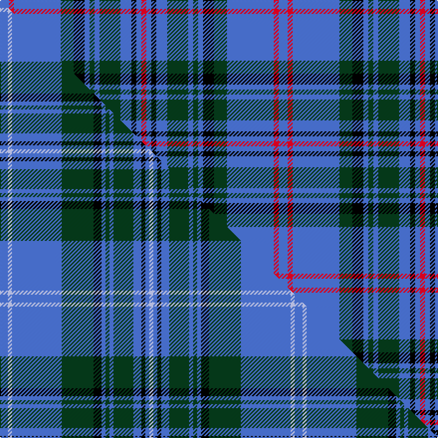

This is one **variant** — a specific cloth: this exact thread count and colourway, with its own
provenance below. It is one weaving of the [sett](/setts/b9r5b47dg13k11b5dg5b5dg21b11k5b5r5/) (the scale-free proportion — the
same cloth at any scale or shade), whose colour order is pattern [BRBGKBGBGBKBR](/stripes/brbgkbgbgbkbr/).

Part of the [Balmoral](/tartans/b/ba/balmoral-3/) tartan — the named design grouping this sett with its other cloths.

Sourced from weddslist.  It is a [13 stripe tartan](/stripes/stripes13/).

Original link [http://www.weddslist.com/cgi-bin/tartans/pg.pl?source=sts](http://www.weddslist.com/cgi-bin/tartans/pg.pl?source=sts)

Dataset <small>— provenance for this record, inherited from the source manifest</small>

<dl class="dataset-prov">
<dt>source</dt><dd><a href="/sources/weddslist/">Weddslist</a></dd>
<dt>data captured from</dt><dd><a href="https://github.com/thetartan/tartan-database/blob/master/data/weddslist/data.csv">https://github.com/thetartan/tartan-database/blob/master/data/weddslist/data.csv</a></dd>
<dt>data date</dt><dd>2016-11-17 <small>(dataset default)</small></dd>
<dt>licence</dt><dd><a href="https://creativecommons.org/licenses/by-nc-nd/4.0/">CC BY-NC-ND 4.0</a></dd>
</dl>

Capture chain <small>— the hands this data passed through, oldest first; each capture carries its own licence</small>

<ol class="capture-chain">
<li><a href="https://www.weddslist.com/tartans/">Weddslist</a> <small>the living privately compiled reference</small></li>
<li><a href="https://github.com/thetartan/tartan-database">thetartan/tartan-database</a> <small>2016-2017</small> · <a href="https://creativecommons.org/licenses/by-nc-nd/4.0/">CC BY-NC-ND 4.0</a> <small>Levko Kravets's frozen compilation — the capture we vendored, and where its CC licence text came from</small></li>
<li>this dictionary <small>captured 2026-06-10 · commit 5bf86c7566</small> <small>each re-capture is a git commit to data/sources</small></li>
</ol>

## Thread count
B/9 R5 B47 DG13 K11 B5 DG5 B5 DG21 B11 K5 B5 R/5

One full sett is **280 threads**.

## Palette
<table><thead><tr><th>Colour</th><th>Shade</th><th>OKLCh</th></tr></thead><tbody><tr><td>K</td><td><code style="background-color:#000000;">#000000</code> <small style="color:#888">#000000</small></td><td><small style="color:#888">oklch(0.0% 0.000 0.0)</small></td></tr><tr><td>DG</td><td><code style="background-color:#053819;">#053819</code> <small style="color:#888">#053819</small></td><td><small style="color:#888">oklch(30.0% 0.075 151.3)</small></td></tr><tr><td>B</td><td><code style="background-color:#466CC8;">#466CC8</code> <small style="color:#888">#466CC8</small></td><td><small style="color:#888">oklch(55.1% 0.149 265.0)</small></td></tr><tr><td>R</td><td><code style="background-color:#D60020;">#D60020</code> <small style="color:#888">#D60020</small></td><td><small style="color:#888">oklch(55.2% 0.224 25.5)</small></td></tr></tbody></table>

# Sample pattern

## Compared to the master

This cloth is one sett of its design; the master sett (the exemplar the design is anchored on) is below for comparison.

Its **ΔTartan distance** from the master is **1.13** — the same measure the nearest-tartans table ranks by (0 is identical; a re-scale of the same cloth is near 0, a recolour or a different proportion further).

<figure class="master-compare" style="margin:0">

this sett
master sett ★

<figcaption style="color:#888;font-size:smaller">One weave of this sett against the <a href="/setts/b4lb2b25dg16k4b2dg2b2dg10b4k2b2lb2/">master sett ★</a>, split on the diagonal: a shared proportion runs seamlessly across it with only the shades shifting; a different proportion breaks on it.</figcaption>
</figure>

## Nearest tartan variants

The nearest existing variants by ΔTartan distance, with this cloth at the top so the swatches line up against it.

ΔTartan

Threads

Variant

Sett

—

280

<a href="/variants/s13/b9r5b47dg13k11b5dg5b5dg21b11k5b5r5/">Balmoral</a>

<a href="/ttd/edit/#slug=b9r5b51dg13k13b5dg4b5dg23b11k5b5r5&amp;base=b9r5b47dg13k11b5dg5b5dg21b11k5b5r5" title="compare in the TTD">0.31</a>

294

<a href="/variants/s13/b9r5b51dg13k13b5dg4b5dg23b11k5b5r5/">Balmoral, Gillies</a>

<a href="/ttd/edit/#slug=b4g2b25dg16k5b2dg2b2dg8b4k2b2g2~x2&amp;base=b9r5b47dg13k11b5dg5b5dg21b11k5b5r5" title="compare in the TTD">1.09</a>

292

<a href="/variants/s13/b4g2b25dg16k5b2dg2b2dg8b4k2b2g2~x2/">Balmoral, Green lines</a>

<a href="/ttd/edit/#slug=b4lb2b25dg16k4b2dg2b2dg10b4k2b2lb2~x2&amp;base=b9r5b47dg13k11b5dg5b5dg21b11k5b5r5" title="compare in the TTD">1.13</a>

296

<a href="/variants/s13/b4lb2b25dg16k4b2dg2b2dg10b4k2b2lb2~x2/">Balmoral - Blue Lines</a>

<a href="/ttd/edit/#slug=dr4y4db9w3y2k9db21y2db2y2db8y3~x2&amp;base=b9r5b47dg13k11b5dg5b5dg21b11k5b5r5" title="compare in the TTD">2.49</a>

262

<a href="/variants/s12/dr4y4db9w3y2k9db21y2db2y2db8y3~x2/">Ruxton, dress</a>

<a href="/ttd/edit/#slug=y2db10k2r5k2db19k2db19g17k2y2~x2&amp;base=b9r5b47dg13k11b5dg5b5dg21b11k5b5r5" title="compare in the TTD">2.50</a>

320

<a href="/variants/s11/y2db10k2r5k2db19k2db19g17k2y2~x2/">Montreat</a>

<a href="/ttd/edit/#slug=k9t4k2t4k2t30k9t4db14dy2~x2~t2503227&amp;base=b9r5b47dg13k11b5dg5b5dg21b11k5b5r5" title="compare in the TTD">2.65</a>

298

<a href="/variants/s10/k9t4k2t4k2t30k9t4db14dy2~x2~t2503227/">Hannay Blue</a>

<a href="/ttd/edit/#slug=lr3dg18k4lb12dg2lb3dg2lb3dg2lb12lr4lb3~x2~lr2800000-lb3103284&amp;base=b9r5b47dg13k11b5dg5b5dg21b11k5b5r5" title="compare in the TTD">2.75</a>

260

<a href="/variants/s12/lr3dg18k4lb12dg2lb3dg2lb3dg2lb12lr4lb3~x2~lr2800000-lb3103284/">Breifne</a>

<a href="/ttd/edit/#slug=n33k4n4k5n4k7db41r4~x2&amp;base=b9r5b47dg13k11b5dg5b5dg21b11k5b5r5" title="compare in the TTD">2.78</a>

334

<a href="/variants/s8/n33k4n4k5n4k7db41r4~x2/">Kinnaird</a>

<a href="/ttd/edit/#slug=db56k6g24k6db8k21y6k21db8k6g24k6db56&amp;base=b9r5b47dg13k11b5dg5b5dg21b11k5b5r5" title="compare in the TTD">2.78</a>

384

<a href="/variants/s13/db56k6g24k6db8k21y6k21db8k6g24k6db56/">Murray of Elibank Clan Tartan</a>

<a href="/ttd/edit/#slug=db18g6db2lb10k3lb10db2g6db18g2~x2~db1406275&amp;base=b9r5b47dg13k11b5dg5b5dg21b11k5b5r5" title="compare in the TTD">2.79</a>

268

<a href="/variants/s10/db18g6db2lb10k3lb10db2g6db18g2~x2~db1406275/">Crombie House Check Corporate Tartan</a>

## Neighbour map

Every grey dot is one of 13621 variants placed by the first two principal components of the ΔTartan feature space (42% of its variance). Red is this tartan; blue dots are its nearest — click one to open its page.

<svg viewBox="0 0 640 380" role="img" style="max-width:100%;height:auto;border:1px solid #e0e0e0;border-radius:4px;display:block" xmlns="http://www.w3.org/2000/svg"><image href="/nn/cloud.v1.png" width="640" height="380"/><a href="/variants/s13/b9r5b51dg13k13b5dg4b5dg23b11k5b5r5/"><circle cx="278.6" cy="144.2" r="4" fill="#3465a4"><title>Balmoral, Gillies</title></circle></a><a href="/variants/s13/b4g2b25dg16k5b2dg2b2dg8b4k2b2g2~x2/"><circle cx="277.2" cy="145.7" r="4" fill="#3465a4"><title>Balmoral, Green lines</title></circle></a><a href="/variants/s13/b4lb2b25dg16k4b2dg2b2dg10b4k2b2lb2~x2/"><circle cx="273.6" cy="144.2" r="4" fill="#3465a4"><title>Balmoral - Blue Lines</title></circle></a><a href="/variants/s12/dr4y4db9w3y2k9db21y2db2y2db8y3~x2/"><circle cx="250.3" cy="146.7" r="4" fill="#3465a4"><title>Ruxton, dress</title></circle></a><a href="/variants/s11/y2db10k2r5k2db19k2db19g17k2y2~x2/"><circle cx="256.9" cy="152.6" r="4" fill="#3465a4"><title>Montreat</title></circle></a><a href="/variants/s10/k9t4k2t4k2t30k9t4db14dy2~x2~t2503227/"><circle cx="258.6" cy="121.5" r="4" fill="#3465a4"><title>Hannay Blue</title></circle></a><a href="/variants/s12/lr3dg18k4lb12dg2lb3dg2lb3dg2lb12lr4lb3~x2~lr2800000-lb3103284/"><circle cx="209.7" cy="169.0" r="4" fill="#3465a4"><title>Breifne</title></circle></a><a href="/variants/s8/n33k4n4k5n4k7db41r4~x2/"><circle cx="268.2" cy="149.3" r="4" fill="#3465a4"><title>Kinnaird</title></circle></a><a href="/variants/s13/db56k6g24k6db8k21y6k21db8k6g24k6db56/"><circle cx="233.1" cy="165.5" r="4" fill="#3465a4"><title>Murray of Elibank Clan Tartan</title></circle></a><a href="/variants/s10/db18g6db2lb10k3lb10db2g6db18g2~x2~db1406275/"><circle cx="234.6" cy="195.2" r="4" fill="#3465a4"><title>Crombie House Check Corporate Tartan</title></circle></a><circle cx="268.0" cy="159.6" r="5" fill="#c00000"/><text x="320" y="376" text-anchor="middle" font-size="11" fill="#999">ground</text><text x="11" y="190" text-anchor="middle" font-size="11" fill="#999" transform="rotate(-90 11 190)">complexity</text></svg>

ID: /variants/s13/b9r5b47dg13k11b5dg5b5dg21b11k5b5r5/
