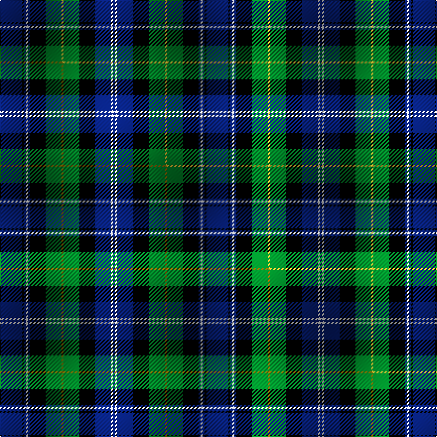

This page is one **sett** — a single exact thread-count. It belongs to the [tartan](/setts/db11k1db1w1db1k8g8ly1g8k8db8w1db1/)
(the same proportion at any scale), whose colour order is pattern [BKBWBKGYGKBWB](/stripes/bkbwbkgygkbwb/).

Part of the [Logan Rogers Hunting](/tartans/logan-rogers-hunting/) tartan — the named design grouping this sett with its other cloths.

Sourced from tartans-authority.  It is a [13 stripe tartan](/stripes/stripes13/).

Original link http://www.tartansauthority.com/tartan-ferret/display/10706/

## Register references

External register numbers recorded for this tartan.

- Scottish Register of Tartans: [10706](https://www.tartanregister.gov.uk/tartanDetails?ref=10706)
- Scottish Tartans Authority (ITI): 10706

## Thread count
DB/22 K2 DB2 W2 DB2 K16 G16 LY2 G16 K16 DB16 W2 DB/2

One full sett is **208 threads**.

## Palette
<table><thead><tr><th>Colour</th><th>Shade</th><th>OKLCh</th></tr></thead><tbody><tr><td>DB</td><td><code style="background-color:#082077;">#082077</code> <small style="color:#888">#082077</small></td><td><small style="color:#888">oklch(30.0% 0.149 265.1)</small></td></tr><tr><td>G</td><td><code style="background-color:#008B2A;">#008B2A</code> <small style="color:#888">#008B2A</small></td><td><small style="color:#888">oklch(55.4% 0.170 145.9)</small></td></tr><tr><td>K</td><td><code style="background-color:#000000;">#000000</code> <small style="color:#888">#000000</small></td><td><small style="color:#888">oklch(0.0% 0.000 0.0)</small></td></tr><tr><td>W</td><td><code style="background-color:#F7F7F7;">#F7F7F7</code> <small style="color:#888">#F7F7F7</small></td><td><small style="color:#888">oklch(97.6% 0.000 89.9)</small></td></tr><tr><td>LY</td><td><code style="background-color:#DCBC32;">#DCBC32</code> <small style="color:#888">#DCBC32</small></td><td><small style="color:#888">oklch(80.0% 0.150 95.2)</small></td></tr></tbody></table>

# Sample pattern

## Compared to the master

This cloth is one sett of its design; the master sett (the exemplar the design is anchored on) is below for comparison.

Its **ΔTartan distance** from the master is **0.01** — the same measure the nearest-tartans table ranks by (0 is identical; a re-scale of the same cloth is near 0, a recolour or a different proportion further).

<figure class="master-compare" style="margin:0">

this sett
master sett ★

<figcaption style="color:#888;font-size:smaller">One weave of this sett against the <a href="/setts/db11k1db1w1db1k8g8y1g8k8db8w1db1/">master sett ★</a>, split on the diagonal: a shared proportion runs seamlessly across it with only the shades shifting; a different proportion breaks on it.</figcaption>
</figure>

## Nearest tartan variants

The nearest existing variants by ΔTartan distance, with this cloth at the top so the swatches line up against it.

ΔTartan

Threads

Variant

Sett

—

208

<a href="/variants/s13/db11k1db1w1db1k8g8ly1g8k8db8w1db1~x2/">Logan Rogers Hunting (Personal)</a>

<a href="/ttd/edit/#slug=db11k1db1w1db1k8g8y1g8k8db8w1db1~x2&amp;base=db11k1db1w1db1k8g8ly1g8k8db8w1db1~x2" title="compare in the TTD">0.01</a>

208

<a href="/variants/s13/db11k1db1w1db1k8g8y1g8k8db8w1db1~x2/">Logan Rogers Hunting</a>

<a href="/ttd/edit/#slug=y2k1g12k12db12k1db1k1db12k12g12k1w2~x2&amp;base=db11k1db1w1db1k8g8ly1g8k8db8w1db1~x2" title="compare in the TTD">1.00</a>

316

<a href="/variants/s13/y2k1g12k12db12k1db1k1db12k12g12k1w2~x2/">Campbell of Loudoun</a>

<a href="/ttd/edit/#slug=y2k1g12k12db12k1db2k1db12k12g12k1w2~x2&amp;base=db11k1db1w1db1k8g8ly1g8k8db8w1db1~x2" title="compare in the TTD">1.00</a>

320

<a href="/variants/s13/y2k1g12k12db12k1db2k1db12k12g12k1w2~x2/">Campbell Loudon</a>

<a href="/ttd/edit/#slug=db12k2db2k2db2k12g12k1w2k1g12k12db12k1r2~x2&amp;base=db11k1db1w1db1k8g8ly1g8k8db8w1db1~x2" title="compare in the TTD">1.13</a>

320

<a href="/variants/s15/db12k2db2k2db2k12g12k1w2k1g12k12db12k1r2~x2/">Mackenzie</a>

<a href="/ttd/edit/#slug=db12k2db2k2db2k12g12k1w2k1g12k12db12k1r2&amp;base=db11k1db1w1db1k8g8ly1g8k8db8w1db1~x2" title="compare in the TTD">1.13</a>

160

<a href="/variants/s15/db12k2db2k2db2k12g12k1w2k1g12k12db12k1r2/">MacKenzie</a>

<a href="/ttd/edit/#slug=db12k2db2k2db2k12g12k1w3k1g12k12db12k1r3~x2&amp;base=db11k1db1w1db1k8g8ly1g8k8db8w1db1~x2" title="compare in the TTD">1.21</a>

326

<a href="/variants/s15/db12k2db2k2db2k12g12k1w3k1g12k12db12k1r3~x2/">MacKenzie Clan Tartan</a>

<a href="/ttd/edit/#slug=db20k2db4k2db20k17g18dr2g4lb2g18k18~x2&amp;base=db11k1db1w1db1k8g8ly1g8k8db8w1db1~x2" title="compare in the TTD">1.23</a>

432

<a href="/variants/s12/db20k2db4k2db20k17g18dr2g4lb2g18k18~x2/">Spar (UK) Ltd Corporate Tartan</a>

<a href="/ttd/edit/#slug=r2k1g12k12db12k1db2k1db12k12g12k1y2~x2&amp;base=db11k1db1w1db1k8g8ly1g8k8db8w1db1~x2" title="compare in the TTD">1.26</a>

320

<a href="/variants/s13/r2k1g12k12db12k1db2k1db12k12g12k1y2~x2/">MacEwan</a>

<a href="/ttd/edit/#slug=db23k2dr2k2dr2k16g17k2g17k15db17k2r2~x2&amp;base=db11k1db1w1db1k8g8ly1g8k8db8w1db1~x2" title="compare in the TTD">1.30</a>

426

<a href="/variants/s13/db23k2dr2k2dr2k16g17k2g17k15db17k2r2~x2/">The Red Hackle</a>

<a href="/ttd/edit/#slug=db10k2db2k2db2k8g8k1w2k1g8k8db9r2~x2&amp;base=db11k1db1w1db1k8g8ly1g8k8db8w1db1~x2" title="compare in the TTD">1.31</a>

236

<a href="/variants/s14/db10k2db2k2db2k8g8k1w2k1g8k8db9r2~x2/">MacKenzie</a>

## Neighbour map

Every grey dot is one of 13620 variants placed by the first two principal components of the ΔTartan feature space (42% of its variance). Red is this tartan; blue dots are its nearest — click one to open its page.

<svg viewBox="0 0 640 380" role="img" style="max-width:100%;height:auto;border:1px solid #e0e0e0;border-radius:4px;display:block" xmlns="http://www.w3.org/2000/svg"><image href="/nn/cloud.v1.png" width="640" height="380"/><a href="/variants/s13/db11k1db1w1db1k8g8y1g8k8db8w1db1~x2/"><circle cx="133.5" cy="148.5" r="4" fill="#3465a4"><title>Logan Rogers Hunting</title></circle></a><a href="/variants/s13/y2k1g12k12db12k1db1k1db12k12g12k1w2~x2/"><circle cx="123.0" cy="144.7" r="4" fill="#3465a4"><title>Campbell of Loudoun</title></circle></a><a href="/variants/s13/y2k1g12k12db12k1db2k1db12k12g12k1w2~x2/"><circle cx="120.9" cy="146.8" r="4" fill="#3465a4"><title>Campbell Loudon</title></circle></a><a href="/variants/s15/db12k2db2k2db2k12g12k1w2k1g12k12db12k1r2~x2/"><circle cx="124.1" cy="135.6" r="4" fill="#3465a4"><title>Mackenzie</title></circle></a><a href="/variants/s15/db12k2db2k2db2k12g12k1w2k1g12k12db12k1r2/"><circle cx="124.1" cy="135.6" r="4" fill="#3465a4"><title>MacKenzie</title></circle></a><a href="/variants/s15/db12k2db2k2db2k12g12k1w3k1g12k12db12k1r3~x2/"><circle cx="112.5" cy="137.6" r="4" fill="#3465a4"><title>MacKenzie Clan Tartan</title></circle></a><a href="/variants/s12/db20k2db4k2db20k17g18dr2g4lb2g18k18~x2/"><circle cx="124.3" cy="167.3" r="4" fill="#3465a4"><title>Spar (UK) Ltd Corporate Tartan</title></circle></a><a href="/variants/s13/r2k1g12k12db12k1db2k1db12k12g12k1y2~x2/"><circle cx="124.3" cy="146.3" r="4" fill="#3465a4"><title>MacEwan</title></circle></a><a href="/variants/s13/db23k2dr2k2dr2k16g17k2g17k15db17k2r2~x2/"><circle cx="127.4" cy="146.9" r="4" fill="#3465a4"><title>The Red Hackle</title></circle></a><a href="/variants/s14/db10k2db2k2db2k8g8k1w2k1g8k8db9r2~x2/"><circle cx="109.3" cy="158.6" r="4" fill="#3465a4"><title>MacKenzie</title></circle></a><circle cx="132.5" cy="148.6" r="5" fill="#c00000"/><text x="320" y="376" text-anchor="middle" font-size="11" fill="#999">ground</text><text x="11" y="190" text-anchor="middle" font-size="11" fill="#999" transform="rotate(-90 11 190)">complexity</text></svg>

ID: /variants/s13/db11k1db1w1db1k8g8ly1g8k8db8w1db1~x2/
