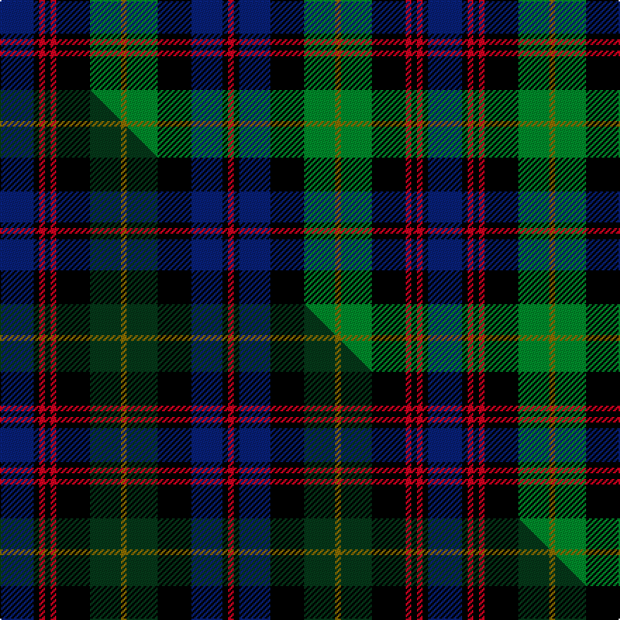

This is one **variant** — a specific cloth: this exact thread count and colourway, with its own
provenance below. It is one weaving of the [sett](/setts/db12k2r2k2r2k12g11y2g11k12db11k2r2/) (the scale-free proportion — the
same cloth at any scale or shade), whose colour order is pattern [BKRKRKGGGKBKR](/stripes/bkrkrkgggkbkr/).

Part of the [Black Watch Plaid of Pipers](/tartans/b/bl/black-watch-plaid-of-pipers/) tartan — the named design grouping this sett with its other cloths.

Sourced from weddslist.  It is a [13 stripe tartan](/stripes/stripes13/).

Original link [http://www.weddslist.com/cgi-bin/tartans/pg.pl?source=sts](http://www.weddslist.com/cgi-bin/tartans/pg.pl?source=sts)

Dataset <small>— provenance for this record, inherited from the source manifest</small>

<dl class="dataset-prov">
<dt>source</dt><dd><a href="/sources/weddslist/">Weddslist</a></dd>
<dt>data captured from</dt><dd><a href="https://github.com/thetartan/tartan-database/blob/master/data/weddslist/data.csv">https://github.com/thetartan/tartan-database/blob/master/data/weddslist/data.csv</a></dd>
<dt>data date</dt><dd>2016-11-17 <small>(dataset default)</small></dd>
<dt>licence</dt><dd><a href="https://creativecommons.org/licenses/by-nc-nd/4.0/">CC BY-NC-ND 4.0</a></dd>
</dl>

Capture chain <small>— the hands this data passed through, oldest first; each capture carries its own licence</small>

<ol class="capture-chain">
<li><a href="https://www.weddslist.com/tartans/">Weddslist</a> <small>the living privately compiled reference</small></li>
<li><a href="https://github.com/thetartan/tartan-database">thetartan/tartan-database</a> <small>2016-2017</small> · <a href="https://creativecommons.org/licenses/by-nc-nd/4.0/">CC BY-NC-ND 4.0</a> <small>Levko Kravets's frozen compilation — the capture we vendored, and where its CC licence text came from</small></li>
<li>this dictionary <small>captured 2026-06-10 · commit 5bf86c7566</small> <small>each re-capture is a git commit to data/sources</small></li>
</ol>

## Thread count
DB/24 K4 R4 K4 R4 K24 G22 Y4 G22 K24 DB22 K4 R/4

One full sett is **304 threads**.

## Palette
<table><thead><tr><th>Colour</th><th>Shade</th><th>OKLCh</th></tr></thead><tbody><tr><td>DB</td><td><code style="background-color:#082077;">#082077</code> <small style="color:#888">#082077</small></td><td><small style="color:#888">oklch(30.0% 0.149 265.1)</small></td></tr><tr><td>G</td><td><code style="background-color:#008B2A;">#008B2A</code> <small style="color:#888">#008B2A</small></td><td><small style="color:#888">oklch(55.4% 0.170 145.9)</small></td></tr><tr><td>K</td><td><code style="background-color:#000000;">#000000</code> <small style="color:#888">#000000</small></td><td><small style="color:#888">oklch(0.0% 0.000 0.0)</small></td></tr><tr><td>R</td><td><code style="background-color:#D60020;">#D60020</code> <small style="color:#888">#D60020</small></td><td><small style="color:#888">oklch(55.2% 0.224 25.5)</small></td></tr><tr><td>Y</td><td><code style="background-color:#8B6E00;">#8B6E00</code> <small style="color:#888">#8B6E00</small></td><td><small style="color:#888">oklch(55.1% 0.113 90.4)</small></td></tr></tbody></table>

# Sample pattern

## Compared to the master

This cloth is one sett of its design; the master sett (the exemplar the design is anchored on) is below for comparison.

Its **ΔTartan distance** from the master is **0.13** — the same measure the nearest-tartans table ranks by (0 is identical; a re-scale of the same cloth is near 0, a recolour or a different proportion further).

<figure class="master-compare" style="margin:0">

this sett
master sett ★

<figcaption style="color:#888;font-size:smaller">One weave of this sett against the <a href="/setts/db12k2r2k2r2k12dg11y2dg11k12db11k2r2/">master sett ★</a>, split on the diagonal: a shared proportion runs seamlessly across it with only the shades shifting; a different proportion breaks on it.</figcaption>
</figure>

## Nearest tartan variants

The nearest existing variants by ΔTartan distance, with this cloth at the top so the swatches line up against it.

ΔTartan

Threads

Variant

Sett

—

304

<a href="/variants/s13/db12k2r2k2r2k12g11y2g11k12db11k2r2~x2/">Black Watch, Plaid of Pipers...</a>

<a href="/ttd/edit/#slug=lr12k2r2k2r2k12dg11y2dg11k12lr11k2r2~x2~lr3101240-k0700000&amp;base=db12k2r2k2r2k12g11y2g11k12db11k2r2~x2" title="compare in the TTD">0.23</a>

304

<a href="/variants/s13/lg12k2r2k2r2k12dg11y2dg11k12lg11k2r2~x2~lg3101240-k0700000/">92nd Regiment Drummers' Plaid (Mil.)</a>

<a href="/ttd/edit/#slug=r1k1g6k6db6k1db1k1db6k6g6k1ly1~x4&amp;base=db12k2r2k2r2k12g11y2g11k12db11k2r2~x2" title="compare in the TTD">1.00</a>

336

<a href="/variants/s13/r1k1g6k6db6k1db1k1db6k6g6k1ly1~x4/">MacEwen/MacEwan</a>

<a href="/ttd/edit/#slug=db6k1db1k1db1k6g6k1w2k1g6k6db6k1r2~x2&amp;base=db12k2r2k2r2k12g11y2g11k12db11k2r2~x2" title="compare in the TTD">1.00</a>

172

<a href="/variants/s15/db6k1db1k1db1k6g6k1w2k1g6k6db6k1r2~x2/">MacKenzie MINI Clan Miniature Tartan</a>

<a href="/ttd/edit/#slug=db13w2db2r2db2k12g12k2g3k2g12k12db12k2r3~x2&amp;base=db12k2r2k2r2k12g11y2g11k12db11k2r2~x2" title="compare in the TTD">1.20</a>

340

<a href="/variants/s15/db13w2db2r2db2k12g12k2g3k2g12k12db12k2r3~x2/">Scottish National District Tartan</a>

<a href="/ttd/edit/#slug=db12k2db2k2db2k12g12r2w2r2g12k12db12r3db2~x2&amp;base=db12k2r2k2r2k12g11y2g11k12db11k2r2~x2" title="compare in the TTD">1.24</a>

336

<a href="/variants/s15/db12k2db2k2db2k12g12r2w2r2g12k12db12r3db2~x2/">MacKenzie Morgan</a>

<a href="/ttd/edit/#slug=db4k1db1k1db1k5g6k1g6k6db3w1r1w1~x4&amp;base=db12k2r2k2r2k12g11y2g11k12db11k2r2~x2" title="compare in the TTD">1.26</a>

284

<a href="/variants/s14/db4k1db1k1db1k5g6k1g6k6db3w1r1w1~x4/">Gemmell Clan Tartan</a>

<a href="/ttd/edit/#slug=w3dgi7k3dgi3k3dgi3k13dg16ly3dg16k13dgi16k3w3~x2~dgi1802166&amp;base=db12k2r2k2r2k12g11y2g11k12db11k2r2~x2" title="compare in the TTD">1.30</a>

408

<a href="/variants/s14/w3dgi7k3dgi3k3dgi3k13dg16ly3dg16k13dgi16k3w3~x2~dgi1802166/">Terre D'Ecosse</a>

<a href="/ttd/edit/#slug=g8dy2k6g11r2db12k12r2k6dy2k4r3~x2&amp;base=db12k2r2k2r2k12g11y2g11k12db11k2r2~x2" title="compare in the TTD">1.36</a>

258

<a href="/variants/s12/g8dy2k6g11r2db12k12r2k6dy2k4r3~x2/">Mandela Commemorative</a>

<a href="/ttd/edit/#slug=db12r2w2r2w2k12g11k2w2k2g11k12db11k2r2~x2&amp;base=db12k2r2k2r2k12g11y2g11k12db11k2r2~x2" title="compare in the TTD">1.39</a>

320

<a href="/variants/s15/db12r2w2r2w2k12g11k2w2k2g11k12db11k2r2~x2/">MacLeods Highlanders</a>

<a href="/ttd/edit/#slug=w5k5db25k16g18k4g5k4g18k16db25r5db5w5&amp;base=db12k2r2k2r2k12g11y2g11k12db11k2r2~x2" title="compare in the TTD">1.44</a>

302

<a href="/variants/s14/w5k5db25k16g18k4g5k4g18k16db25r5db5w5/">Arndt (Personal)</a>

## Neighbour map

Every grey dot is one of 13656 variants placed by the first two principal components of the ΔTartan feature space (42% of its variance). Red is this tartan; blue dots are its nearest — click one to open its page. The map is a flat projection of a many-dimensional space — [how to read it](/posts/neighbourhood-maps/).

<svg viewBox="0 0 640 380" role="img" style="max-width:100%;height:auto;border:1px solid #e0e0e0;border-radius:4px;display:block" xmlns="http://www.w3.org/2000/svg"><image href="/nn/cloud.v1.png" width="640" height="380"/><a href="/variants/s13/lg12k2r2k2r2k12dg11y2dg11k12lg11k2r2~x2~lg3101240-k0700000/"><circle cx="97.4" cy="177.5" r="4" fill="#3465a4"><title>92nd Regiment Drummers' Plaid (Mil.)</title></circle></a><a href="/variants/s13/r1k1g6k6db6k1db1k1db6k6g6k1ly1~x4/"><circle cx="104.6" cy="177.4" r="4" fill="#3465a4"><title>MacEwen/MacEwan</title></circle></a><a href="/variants/s15/db6k1db1k1db1k6g6k1w2k1g6k6db6k1r2~x2/"><circle cx="84.1" cy="168.9" r="4" fill="#3465a4"><title>MacKenzie MINI Clan Miniature Tartan</title></circle></a><a href="/variants/s15/db13w2db2r2db2k12g12k2g3k2g12k12db12k2r3~x2/"><circle cx="82.4" cy="166.0" r="4" fill="#3465a4"><title>Scottish National District Tartan</title></circle></a><a href="/variants/s15/db12k2db2k2db2k12g12r2w2r2g12k12db12r3db2~x2/"><circle cx="82.7" cy="168.5" r="4" fill="#3465a4"><title>MacKenzie Morgan</title></circle></a><a href="/variants/s14/db4k1db1k1db1k5g6k1g6k6db3w1r1w1~x4/"><circle cx="89.5" cy="170.2" r="4" fill="#3465a4"><title>Gemmell Clan Tartan</title></circle></a><a href="/variants/s14/w3dgi7k3dgi3k3dgi3k13dg16ly3dg16k13dgi16k3w3~x2~dgi1802166/"><circle cx="84.7" cy="182.3" r="4" fill="#3465a4"><title>Terre D'Ecosse</title></circle></a><a href="/variants/s12/g8dy2k6g11r2db12k12r2k6dy2k4r3~x2/"><circle cx="94.2" cy="185.2" r="4" fill="#3465a4"><title>Mandela Commemorative</title></circle></a><a href="/variants/s15/db12r2w2r2w2k12g11k2w2k2g11k12db11k2r2~x2/"><circle cx="69.2" cy="162.8" r="4" fill="#3465a4"><title>MacLeods Highlanders</title></circle></a><a href="/variants/s14/w5k5db25k16g18k4g5k4g18k16db25r5db5w5/"><circle cx="78.4" cy="177.2" r="4" fill="#3465a4"><title>Arndt (Personal)</title></circle></a><circle cx="91.4" cy="176.1" r="5" fill="#c00000"/><text x="320" y="376" text-anchor="middle" font-size="11" fill="#999">ground</text><text x="11" y="190" text-anchor="middle" font-size="11" fill="#999" transform="rotate(-90 11 190)">complexity</text></svg>

ID: /variants/s13/db12k2r2k2r2k12g11y2g11k12db11k2r2~x2/
