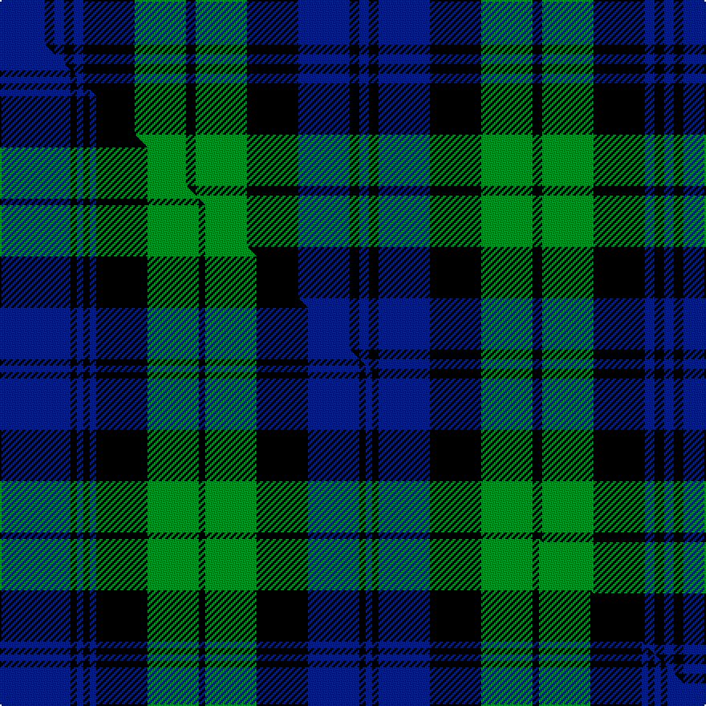

This is one **variant** — a specific cloth: this exact thread count and colourway, with its own
provenance below. It is one weaving of the [sett](/tartans/c/ca/campbell-4/) (the scale-free proportion — the
same cloth at any scale or shade), whose colour order is pattern [BKBKBKGKGKBKB](/stripes/bkbkbkgkgkbkb/).

Part of the [Campbell](/tartans/c/ca/campbell-4/) tartan — the named design grouping this sett with its other cloths.

Sourced from register-of-tartans.  It is a [13 stripe tartan](/stripes/stripes13/).

Original link [https://www.tartanregister.gov.uk/tartanDetails.aspx?ref=502](https://www.tartanregister.gov.uk/tartanDetails.aspx?ref=502)

Dataset <small>— provenance for this record, inherited from the source manifest</small>

<dl class="dataset-prov">
<dt>source</dt><dd><a href="/sources/register-of-tartans/">Scottish Register of Tartans</a></dd>
<dt>data captured from</dt><dd><a href="https://github.com/thetartan/tartan-database/blob/master/data/register-of-tartans/data.csv">https://github.com/thetartan/tartan-database/blob/master/data/register-of-tartans/data.csv</a></dd>
<dt>data date</dt><dd>1725 <small>(this record)</small></dd>
<dt>licence</dt><dd><a href="https://www.tartanregister.gov.uk/copyright">Crown copyright</a></dd>
</dl>

Capture chain <small>— the hands this data passed through, oldest first; each capture carries its own licence</small>

<ol class="capture-chain">
<li><a href="https://www.tartanregister.gov.uk/">Scottish Register of Tartans</a> · <a href="https://www.tartanregister.gov.uk/copyright">Crown copyright</a> <small>the living register — still published by National Records of Scotland</small></li>
<li><a href="https://github.com/thetartan/tartan-database">thetartan/tartan-database</a> <small>2016-2017</small> · <a href="https://creativecommons.org/licenses/by-nc-nd/4.0/">CC BY-NC-ND 4.0</a> <small>Levko Kravets's frozen compilation — the capture we vendored, and where its CC licence text came from</small></li>
<li>this dictionary <small>captured 2026-06-10 · commit 5bf86c7566</small> <small>each re-capture is a git commit to data/sources</small></li>
</ol>

## Register references

External register numbers recorded for this tartan.

- Scottish Register of Tartans: [502](https://www.tartanregister.gov.uk/tartanDetails.aspx?ref=502)
- Scottish Tartans Authority (ITI): 1
- Scottish Tartans World Register: 1

## Thread count
DB/28 K6 DB6 K6 DB6 K32 G32 K6 G32 K32 DB32 K6 DB/6

One full sett is **426 threads**.

## Palette
<table><thead><tr><th>Colour</th><th>Shade</th><th>OKLCh</th></tr></thead><tbody><tr><td>G</td><td><code style="background-color:#008B2A;">#008B2A</code> <small style="color:#888">#008B2A</small></td><td><small style="color:#888">oklch(55.4% 0.170 145.9)</small></td></tr><tr><td>K</td><td><code style="background-color:#000000;">#000000</code> <small style="color:#888">#000000</small></td><td><small style="color:#888">oklch(0.0% 0.000 0.0)</small></td></tr><tr><td>DB</td><td><code style="background-color:#082077;">#082077</code> <small style="color:#888">#082077</small></td><td><small style="color:#888">oklch(30.0% 0.149 265.1)</small></td></tr></tbody></table>

# Sample pattern

## Compared to the master

This cloth is one sett of its design; the master sett (the exemplar the design is anchored on) is below for comparison.

Its **ΔTartan distance** from the master is **0.49** — the same measure the nearest-tartans table ranks by (0 is identical; a re-scale of the same cloth is near 0, a recolour or a different proportion further).

<figure class="master-compare" style="margin:0">

this sett
master sett ★

<figcaption style="color:#888;font-size:smaller">One weave of this sett against the <a href="/setts/db11k1db1k1db1k8g8k1g8k8db8k1db1/">master sett ★</a>, split on the diagonal: a shared proportion runs seamlessly across it with only the shades shifting; a different proportion breaks on it.</figcaption>
</figure>

## Nearest tartan variants

The nearest existing variants by ΔTartan distance, with this cloth at the top so the swatches line up against it.

ΔTartan

Threads

Variant

Sett

—

426

<a href="/variants/s13/db14k3db3k3db3k16g16k3g16k16db16k3db3~x2/">Campbell</a>

<a href="/ttd/edit/#slug=db12k2db2k2db2k10g12k3g12k10db11k2db2~x2&amp;base=db14k3db3k3db3k16g16k3g16k16db16k3db3~x2" title="compare in the TTD">0.19</a>

300

<a href="/variants/s13/db12k2db2k2db2k10g12k3g12k10db11k2db2~x2/">Campbell Clan Tartan</a>

<a href="/ttd/edit/#slug=db2k2db11k10g12k3g12k10db2k2db2k2db2~x2&amp;base=db14k3db3k3db3k16g16k3g16k16db16k3db3~x2" title="compare in the TTD">0.33</a>

280

<a href="/variants/s13/db2k2db11k10g12k3g12k10db2k2db2k2db2~x2/">Campbell</a>

<a href="/ttd/edit/#slug=db11k1db1k1db1k8g8k1g8k8db8k1db1~x4&amp;base=db14k3db3k3db3k16g16k3g16k16db16k3db3~x2" title="compare in the TTD">0.49</a>

416

<a href="/variants/s13/db11k1db1k1db1k8g8k1g8k8db8k1db1~x4/">Grant Hunting or Black Watch</a>

<a href="/ttd/edit/#slug=db11k1db1k1db1k8g8k1g8k8db8k1db1&amp;base=db14k3db3k3db3k16g16k3g16k16db16k3db3~x2" title="compare in the TTD">0.49</a>

104

<a href="/variants/s13/db11k1db1k1db1k8g8k1g8k8db8k1db1/">Campbell</a>

<a href="/ttd/edit/#slug=db11k1db1k1db1k8g8k1g8k8db8k1db1~x2&amp;base=db14k3db3k3db3k16g16k3g16k16db16k3db3~x2" title="compare in the TTD">0.49</a>

208

<a href="/variants/s13/db11k1db1k1db1k8g8k1g8k8db8k1db1~x2/">Black Watch, A&amp;S Highlanders</a>

<a href="/ttd/edit/#slug=db11k3db3k3db3k11r3g13k3g13r3k11db11k3db3~x2&amp;base=db14k3db3k3db3k16g16k3g16k16db16k3db3~x2" title="compare in the TTD">0.88</a>

360

<a href="/variants/s15/db11k3db3k3db3k11r3g13k3g13r3k11db11k3db3~x2/">Fletcher</a>

<a href="/ttd/edit/#slug=db12k2db2k2db2k12g12y2g12k12db11k2db2&amp;base=db14k3db3k3db3k16g16k3g16k16db16k3db3~x2" title="compare in the TTD">1.18</a>

156

<a href="/variants/s13/db12k2db2k2db2k12g12y2g12k12db11k2db2/">Gordon</a>

<a href="/ttd/edit/#slug=db12k2db2k2db2k12g12y2g12k12db11k2db2~x2&amp;base=db14k3db3k3db3k16g16k3g16k16db16k3db3~x2" title="compare in the TTD">1.18</a>

312

<a href="/variants/s13/db12k2db2k2db2k12g12y2g12k12db11k2db2~x2/">Gordon</a>

<a href="/ttd/edit/#slug=db6k1db1k1db1k6g6y1g6k6db6k1db1~x4&amp;base=db14k3db3k3db3k16g16k3g16k16db16k3db3~x2" title="compare in the TTD">1.21</a>

316

<a href="/variants/s13/db6k1db1k1db1k6g6y1g6k6db6k1db1~x4/">Gordon Regimental Tartan</a>

<a href="/ttd/edit/#slug=db30k5db5k5db5k24g24y6g24k24db24k5db5&amp;base=db14k3db3k3db3k16g16k3g16k16db16k3db3~x2" title="compare in the TTD">1.25</a>

337

<a href="/variants/s13/db30k5db5k5db5k24g24y6g24k24db24k5db5/">Lamberton (?)</a>

## Neighbour map

Every grey dot is one of 13657 variants placed by the first two principal components of the ΔTartan feature space (42% of its variance). Red is this tartan; blue dots are its nearest — click one to open its page. The map is a flat projection of a many-dimensional space — [how to read it](/posts/neighbourhood-maps/).

<svg viewBox="0 0 640 380" role="img" style="max-width:100%;height:auto;border:1px solid #e0e0e0;border-radius:4px;display:block" xmlns="http://www.w3.org/2000/svg"><image href="/nn/cloud.v1.png" width="640" height="380"/><a href="/variants/s13/db12k2db2k2db2k10g12k3g12k10db11k2db2~x2/"><circle cx="146.7" cy="211.6" r="4" fill="#3465a4"><title>Campbell Clan Tartan</title></circle></a><a href="/variants/s13/db2k2db11k10g12k3g12k10db2k2db2k2db2~x2/"><circle cx="163.0" cy="202.6" r="4" fill="#3465a4"><title>Campbell</title></circle></a><a href="/variants/s13/db11k1db1k1db1k8g8k1g8k8db8k1db1~x4/"><circle cx="185.6" cy="177.1" r="4" fill="#3465a4"><title>Grant Hunting or Black Watch</title></circle></a><a href="/variants/s13/db11k1db1k1db1k8g8k1g8k8db8k1db1/"><circle cx="185.6" cy="177.1" r="4" fill="#3465a4"><title>Campbell</title></circle></a><a href="/variants/s13/db11k1db1k1db1k8g8k1g8k8db8k1db1~x2/"><circle cx="185.6" cy="177.1" r="4" fill="#3465a4"><title>Black Watch, A&amp;S Highlanders</title></circle></a><a href="/variants/s15/db11k3db3k3db3k11r3g13k3g13r3k11db11k3db3~x2/"><circle cx="93.8" cy="206.0" r="4" fill="#3465a4"><title>Fletcher</title></circle></a><a href="/variants/s13/db12k2db2k2db2k12g12y2g12k12db11k2db2/"><circle cx="128.0" cy="195.8" r="4" fill="#3465a4"><title>Gordon</title></circle></a><a href="/variants/s13/db12k2db2k2db2k12g12y2g12k12db11k2db2~x2/"><circle cx="128.0" cy="195.8" r="4" fill="#3465a4"><title>Gordon</title></circle></a><a href="/variants/s13/db6k1db1k1db1k6g6y1g6k6db6k1db1~x4/"><circle cx="127.8" cy="195.8" r="4" fill="#3465a4"><title>Gordon Regimental Tartan</title></circle></a><a href="/variants/s13/db30k5db5k5db5k24g24y6g24k24db24k5db5/"><circle cx="131.3" cy="200.7" r="4" fill="#3465a4"><title>Lamberton (?)</title></circle></a><circle cx="152.2" cy="215.2" r="5" fill="#c00000"/><text x="320" y="376" text-anchor="middle" font-size="11" fill="#999">ground</text><text x="11" y="190" text-anchor="middle" font-size="11" fill="#999" transform="rotate(-90 11 190)">complexity</text></svg>

ID: /variants/s13/db14k3db3k3db3k16g16k3g16k16db16k3db3~x2/
