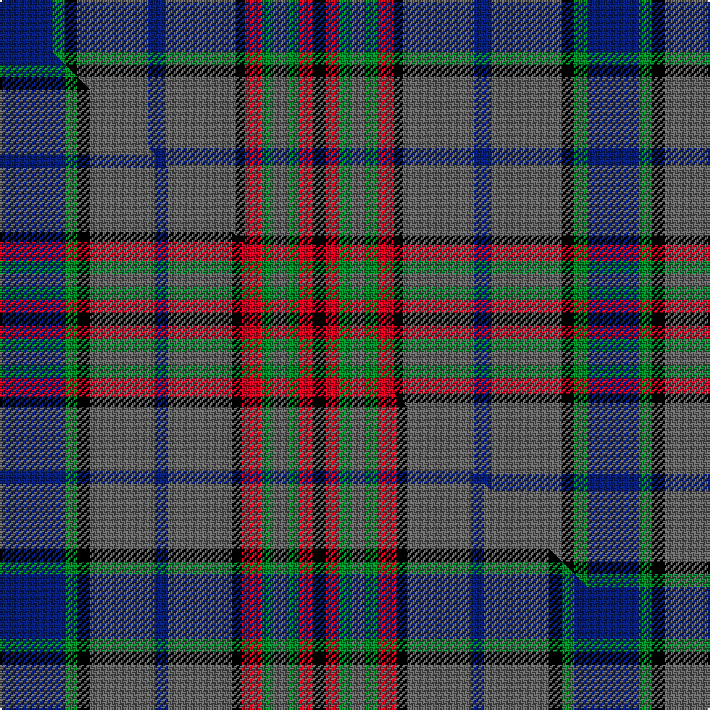

This page is one **sett** — a single exact thread-count. It belongs to the [tartan](/setts/db16g4k4n22db5n22k3r5g4n4g4r4k4/)
(the same proportion at any scale), whose colour order is pattern [BGKBBBKRGBGRK](/stripes/bgkbbbkrgbgrk/).

Part of the [Gayre Hunting](/tartans/gayre-hunting/) tartan — the named design grouping this sett with its other cloths.

Sourced from weddslist.  It is a [13 stripe tartan](/stripes/stripes13/).

Original link http://www.weddslist.com/cgi-bin/tartans/pg.pl?source=sts

## Provenance

Earliest known date: 1963 Five versions of Gayre tartan are recorded. Hunting, Dress, Bodyguard, Arisaidh and the version recorded by Lord Lyon, the Clan sett. This can be found in the Public Register of All Arms and Bearings in Scotland. (1992)

2 attestations — the source records this cloth was collapsed from (oldest owns this page)

<ul>
<li>undated — Gayre, hunting (weddslist, <a href="http://www.weddslist.com/cgi-bin/tartans/pg.pl?source=sts">record</a>) </li>
<li>undated — Gayre Hunting Clan Tartan (house-of-tartan, <a href="http://www.house-of-tartan.scotland.net/house/TartanViewjs.asp?colr=Def&tnam=165">record</a>) </li>
</ul>

## Thread count
DB/32 G8 K8 N44 DB10 N44 K6 R10 G8 N8 G8 R8 K/8

One full sett is **364 threads**.

## Palette
<table><thead><tr><th>Colour</th><th>Shade</th><th>OKLCh</th></tr></thead><tbody><tr><td>DB</td><td><code style="background-color:#082077;">#082077</code> <small style="color:#888">#082077</small></td><td><small style="color:#888">oklch(30.0% 0.149 265.1)</small></td></tr><tr><td>G</td><td><code style="background-color:#008B2A;">#008B2A</code> <small style="color:#888">#008B2A</small></td><td><small style="color:#888">oklch(55.4% 0.170 145.9)</small></td></tr><tr><td>K</td><td><code style="background-color:#000000;">#000000</code> <small style="color:#888">#000000</small></td><td><small style="color:#888">oklch(0.0% 0.000 0.0)</small></td></tr><tr><td>N</td><td><code style="background-color:#636363;">#636363</code> <small style="color:#888">#636363</small></td><td><small style="color:#888">oklch(50.0% 0.000 89.9)</small></td></tr><tr><td>R</td><td><code style="background-color:#D60020;">#D60020</code> <small style="color:#888">#D60020</small></td><td><small style="color:#888">oklch(55.2% 0.224 25.5)</small></td></tr></tbody></table>

# Sample pattern

## Compared to the master

This cloth is one sett of its design; the master sett (the exemplar the design is anchored on) is below for comparison.

Its **ΔTartan distance** from the master is **0.24** — the same measure the nearest-tartans table ranks by (0 is identical; a re-scale of the same cloth is near 0, a recolour or a different proportion further).

<figure class="master-compare" style="margin:0">

this sett
master sett ★

<figcaption style="color:#888;font-size:smaller">One weave of this sett against the <a href="/setts/db20g4k4n20db4n20k3r6g4n4g4r4k4/">master sett ★</a>, split on the diagonal: a shared proportion runs seamlessly across it with only the shades shifting; a different proportion breaks on it.</figcaption>
</figure>

## Nearest tartan variants

The nearest existing variants by ΔTartan distance, with this cloth at the top so the swatches line up against it.

ΔTartan

Threads

Variant

Sett

—

364

<a href="/variants/s13/db16g4k4n22db5n22k3r5g4n4g4r4k4~x2/">Gayre, hunting</a>

<a href="/ttd/edit/#slug=db20g4k4n20db4n20k3r6g4n4g4r4k4~x2&amp;base=db16g4k4n22db5n22k3r5g4n4g4r4k4~x2" title="compare in the TTD">0.24</a>

356

<a href="/variants/s13/db20g4k4n20db4n20k3r6g4n4g4r4k4~x2/">Gayre Hunting</a>

<a href="/ttd/edit/#slug=y4db3y2db2k1r1k1db7k1r1k1g10r1db3y1db3~x2&amp;base=db16g4k4n22db5n22k3r5g4n4g4r4k4~x2" title="compare in the TTD">2.31</a>

154

<a href="/variants/s16/y4db3y2db2k1r1k1db7k1r1k1g10r1db3y1db3~x2/">Tartan de Longueuil</a>

<a href="/ttd/edit/#slug=dg8dr3dg8k10dp5g32dg5g32dp5k10dg8dr3dg8dp3~x2~dg1603171-g2203152&amp;base=db16g4k4n22db5n22k3r5g4n4g4r4k4~x2" title="compare in the TTD">2.51</a>

538

<a href="/variants/s14/dg8dr3dg8k10dp5g32dg5g32dp5k10dg8dr3dg8dp3~x2~dg1603171-g2203152/">Scottish Power Corporate Tartan</a>

<a href="/ttd/edit/#slug=ki16k2lb2k4dg16r2ki15k6lb2ki3lb4~x2~ki0700000-k0504259&amp;base=db16g4k4n22db5n22k3r5g4n4g4r4k4~x2" title="compare in the TTD">2.55</a>

248

<a href="/variants/s11/ki16k2lb2k4dg16r2ki15k6lb2ki3lb4~x2~ki0700000-k0504259/">Scottish Tartans Authority</a>

<a href="/ttd/edit/#slug=r2db8k1g2k1g4k1g2k1db8y2~x2&amp;base=db16g4k4n22db5n22k3r5g4n4g4r4k4~x2" title="compare in the TTD">2.61</a>

120

<a href="/variants/s11/r2db8k1g2k1g4k1g2k1db8y2~x2/">MacCainsh</a>

<a href="/ttd/edit/#slug=b8k5b8dg27b13dg3b13o27b8o3b3~x2&amp;base=db16g4k4n22db5n22k3r5g4n4g4r4k4~x2" title="compare in the TTD">2.76</a>

450

<a href="/variants/s11/b8k5b8dg27b13dg3b13o27b8o3b3~x2/">McCall/MacCall</a>

<a href="/ttd/edit/#slug=db18k3db5k3db18dg6k5dg6o12r5o12r3~x2~o2504058&amp;base=db16g4k4n22db5n22k3r5g4n4g4r4k4~x2" title="compare in the TTD">2.79</a>

342

<a href="/variants/s12/db18k3db5k3db18dg6k5dg6o12r5o12r3~x2~o2504058/">Longford Irish County Tartan</a>

<a href="/ttd/edit/#slug=dr2db8k1g2k1g4k1g2k1db8lo2~x2&amp;base=db16g4k4n22db5n22k3r5g4n4g4r4k4~x2" title="compare in the TTD">2.85</a>

120

<a href="/variants/s11/dr2db8k1g2k1g4k1g2k1db8lo2~x2/">MacCainsh</a>

<a href="/ttd/edit/#slug=k3dt2y2dt2y3db16g4k3g3dt3~x2~dt1204274-db1406275&amp;base=db16g4k4n22db5n22k3r5g4n4g4r4k4~x2" title="compare in the TTD">2.94</a>

152

<a href="/variants/s10/k3db2y2db2y3dbi16g4k3g3db3~x2~db1204274-dbi1406275/">St Andrews, University of</a>

<a href="/ttd/edit/#slug=dg8db8ly1r1k1dg2db2ly1r1k1dg8db8~x4&amp;base=db16g4k4n22db5n22k3r5g4n4g4r4k4~x2" title="compare in the TTD">2.99</a>

272

<a href="/variants/s12/dg8db8ly1r1k1dg2db2ly1r1k1dg8db8~x4/">Chieftain's</a>

## Neighbour map

Every grey dot is one of 13620 variants placed by the first two principal components of the ΔTartan feature space (42% of its variance). Red is this tartan; blue dots are its nearest — click one to open its page.

<svg viewBox="0 0 640 380" role="img" style="max-width:100%;height:auto;border:1px solid #e0e0e0;border-radius:4px;display:block" xmlns="http://www.w3.org/2000/svg"><image href="/nn/cloud.v1.png" width="640" height="380"/><a href="/variants/s13/db20g4k4n20db4n20k3r6g4n4g4r4k4~x2/"><circle cx="166.1" cy="172.5" r="4" fill="#3465a4"><title>Gayre Hunting</title></circle></a><a href="/variants/s16/y4db3y2db2k1r1k1db7k1r1k1g10r1db3y1db3~x2/"><circle cx="156.2" cy="139.1" r="4" fill="#3465a4"><title>Tartan de Longueuil</title></circle></a><a href="/variants/s14/dg8dr3dg8k10dp5g32dg5g32dp5k10dg8dr3dg8dp3~x2~dg1603171-g2203152/"><circle cx="208.9" cy="156.9" r="4" fill="#3465a4"><title>Scottish Power Corporate Tartan</title></circle></a><a href="/variants/s11/ki16k2lb2k4dg16r2ki15k6lb2ki3lb4~x2~ki0700000-k0504259/"><circle cx="196.9" cy="170.1" r="4" fill="#3465a4"><title>Scottish Tartans Authority</title></circle></a><a href="/variants/s11/r2db8k1g2k1g4k1g2k1db8y2~x2/"><circle cx="194.4" cy="167.0" r="4" fill="#3465a4"><title>MacCainsh</title></circle></a><a href="/variants/s11/b8k5b8dg27b13dg3b13o27b8o3b3~x2/"><circle cx="229.1" cy="197.7" r="4" fill="#3465a4"><title>McCall/MacCall</title></circle></a><a href="/variants/s12/db18k3db5k3db18dg6k5dg6o12r5o12r3~x2~o2504058/"><circle cx="132.4" cy="191.7" r="4" fill="#3465a4"><title>Longford Irish County Tartan</title></circle></a><a href="/variants/s11/dr2db8k1g2k1g4k1g2k1db8lo2~x2/"><circle cx="189.0" cy="165.5" r="4" fill="#3465a4"><title>MacCainsh</title></circle></a><a href="/variants/s10/k3db2y2db2y3dbi16g4k3g3db3~x2~db1204274-dbi1406275/"><circle cx="161.5" cy="171.9" r="4" fill="#3465a4"><title>St Andrews, University of</title></circle></a><a href="/variants/s12/dg8db8ly1r1k1dg2db2ly1r1k1dg8db8~x4/"><circle cx="230.1" cy="176.0" r="4" fill="#3465a4"><title>Chieftain's</title></circle></a><circle cx="190.9" cy="167.6" r="5" fill="#c00000"/><text x="320" y="376" text-anchor="middle" font-size="11" fill="#999">ground</text><text x="11" y="190" text-anchor="middle" font-size="11" fill="#999" transform="rotate(-90 11 190)">complexity</text></svg>

ID: /variants/s13/db16g4k4n22db5n22k3r5g4n4g4r4k4~x2/
