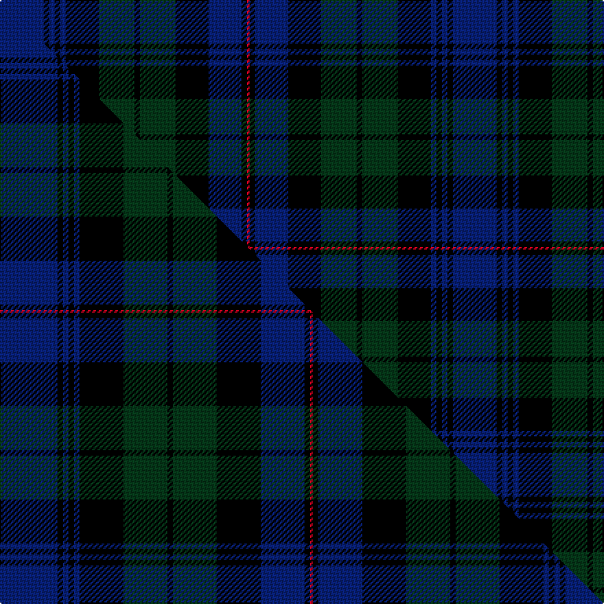

This is one **variant** — a specific cloth: this exact thread count and colourway, with its own
provenance below. It is one weaving of the [sett](/tartans/b/bl/black-watch-isetan-men-s/) (the scale-free proportion — the
same cloth at any scale or shade), whose colour order is pattern [BKBKBKGKGKBKR](/stripes/bkbkbkgkgkbkr/).

Part of the [Black Watch/Isetan Men's](/tartans/b/bl/black-watch-isetan-men-s/) tartan — the named design grouping this sett with its other cloths.

Sourced from tartans-authority.  It is a [13 stripe tartan](/stripes/stripes13/).

Original link <code>http://www.tartansauthority.com/tartan-ferret/display/11123/</code> — retired · [Internet Archive copy](https://web.archive.org/web/*/http://www.tartansauthority.com/tartan-ferret/display/11123/*)

Dataset <small>— provenance for this record, inherited from the source manifest</small>

<dl class="dataset-prov">
<dt>source</dt><dd><a href="/sources/tartans-authority/">Scottish Tartans Authority</a></dd>
<dt>data captured from</dt><dd><a href="https://github.com/thetartan/tartan-database/blob/master/data/tartans-authority/data.csv">https://github.com/thetartan/tartan-database/blob/master/data/tartans-authority/data.csv</a></dd>
<dt>data date</dt><dd>2014 <small>(this record)</small></dd>
<dt>licence</dt><dd><a href="https://creativecommons.org/licenses/by-nc-nd/4.0/">CC BY-NC-ND 4.0</a></dd>
</dl>

Capture chain <small>— the hands this data passed through, oldest first; each capture carries its own licence</small>

<ol class="capture-chain">
<li><a href="https://www.tartansauthority.com/">Scottish Tartans Authority</a> <small>the heritage body’s archive — its tartan-ferret record browser is retired; dead record links are shown unlinked, with an Internet Archive copy (ITI numbers are not SRT references)</small></li>
<li><a href="https://github.com/thetartan/tartan-database">thetartan/tartan-database</a> <small>2016-2017</small> · <a href="https://creativecommons.org/licenses/by-nc-nd/4.0/">CC BY-NC-ND 4.0</a> <small>Levko Kravets's frozen compilation — the capture we vendored, and where its CC licence text came from</small></li>
<li>this dictionary <small>captured 2026-06-10 · commit 5bf86c7566</small> <small>each re-capture is a git commit to data/sources</small></li>
</ol>

## Register references

External register numbers recorded for this tartan.

- Scottish Register of Tartans: [11123](https://www.tartanregister.gov.uk/tartanDetails?ref=11123)
- Scottish Tartans Authority (ITI): 11123

## Thread count
DB/32 K4 DB4 K4 DB4 K24 DG26 K4 DG26 K24 DB24 K4 R/2

One full sett is **330 threads**.

## Palette
<table><thead><tr><th>Colour</th><th>Shade</th><th>OKLCh</th></tr></thead><tbody><tr><td>DB</td><td><code style="background-color:#082077;">#082077</code> <small style="color:#888">#082077</small></td><td><small style="color:#888">oklch(30.0% 0.149 265.1)</small></td></tr><tr><td>DG</td><td><code style="background-color:#053819;">#053819</code> <small style="color:#888">#053819</small></td><td><small style="color:#888">oklch(30.0% 0.075 151.3)</small></td></tr><tr><td>K</td><td><code style="background-color:#000000;">#000000</code> <small style="color:#888">#000000</small></td><td><small style="color:#888">oklch(0.0% 0.000 0.0)</small></td></tr><tr><td>R</td><td><code style="background-color:#D60020;">#D60020</code> <small style="color:#888">#D60020</small></td><td><small style="color:#888">oklch(55.2% 0.224 25.5)</small></td></tr></tbody></table>

# Sample pattern

## Compared to the master

This cloth is one sett of its design; the master sett (the exemplar the design is anchored on) is below for comparison.

Its **ΔTartan distance** from the master is **0.27** — the same measure the nearest-tartans table ranks by (0 is identical; a re-scale of the same cloth is near 0, a recolour or a different proportion further).

<figure class="master-compare" style="margin:0">

this sett
master sett ★

<figcaption style="color:#888;font-size:smaller">One weave of this sett against the <a href="/setts/db21k2db2k2db2k16dg16k2dg16k16db16k2r1/">master sett ★</a>, split on the diagonal: a shared proportion runs seamlessly across it with only the shades shifting; a different proportion breaks on it.</figcaption>
</figure>

## Nearest tartan variants

The nearest existing variants by ΔTartan distance, with this cloth at the top so the swatches line up against it.

ΔTartan

Threads

Variant

Sett

—

330

<a href="/variants/s13/db16k2db2k2db2k12dg13k2dg13k12db12k2r1~x2/">Black Watch/Isetan Men's</a>

<a href="/ttd/edit/#slug=db21k2db2k2db2k16dg16k2dg16k16db16k2r1~x2&amp;base=db16k2db2k2db2k12dg13k2dg13k12db12k2r1~x2" title="compare in the TTD">0.27</a>

412

<a href="/variants/s13/db21k2db2k2db2k16dg16k2dg16k16db16k2r1~x2/">Black Watch/Isetan Men's</a>

<a href="/ttd/edit/#slug=db24k2db2k2db2k20dg20dy3dg20k20db24k2dr4~x2&amp;base=db16k2db2k2db2k12dg13k2dg13k12db12k2r1~x2" title="compare in the TTD">1.34</a>

524

<a href="/variants/s13/db24k2db2k2db2k20dg20dy3dg20k20db24k2dr4~x2/">Loudoun's Highlanders - 1747 #2 (Mil</a>

<a href="/ttd/edit/#slug=k2db12k12dg1t2dg16t2dg1k12db12k1~x4&amp;base=db16k2db2k2db2k12dg13k2dg13k12db12k2r1~x2" title="compare in the TTD">1.40</a>

572

<a href="/variants/s11/k2db12k12dg1t2dg16t2dg1k12db12k1~x4/">Grahame of Morphie</a>

<a href="/ttd/edit/#slug=dg2db12r1k12dg12k2dg12k12r1db12dg1~x4&amp;base=db16k2db2k2db2k12dg13k2dg13k12db12k2r1~x2" title="compare in the TTD">1.43</a>

620

<a href="/variants/s11/dg2db12r1k12dg12k2dg12k12r1db12dg1~x4/">Ferguson of Woodhill</a>

<a href="/ttd/edit/#slug=db11k1db1k1db1k8dg8k1dg8k8db8k1db1~x2&amp;base=db16k2db2k2db2k12dg13k2dg13k12db12k2r1~x2" title="compare in the TTD">1.46</a>

208

<a href="/variants/s13/db11k1db1k1db1k8dg8k1dg8k8db8k1db1~x2/">Black Watch Regimental Tartan</a>

<a href="/ttd/edit/#slug=k11ki1k1ki1k1ki8g8ki1g8ki8k8ki1k1~x4~k0504259-ki0700000&amp;base=db16k2db2k2db2k12dg13k2dg13k12db12k2r1~x2" title="compare in the TTD">1.46</a>

416

<a href="/variants/s13/k11ki1k1ki1k1ki8g8ki1g8ki8k8ki1k1~x4~k0504259-ki0700000/">Royal Regiment of Scotland (Mltry)</a>

<a href="/ttd/edit/#slug=db11k1db1k1db1k8g8k1g8k8db8k1db1~x4~db1406275-k0700000&amp;base=db16k2db2k2db2k12dg13k2dg13k12db12k2r1~x2" title="compare in the TTD">1.46</a>

416

<a href="/variants/s13/db11k1db1k1db1k8g8k1g8k8db8k1db1~x4~db1406275-k0700000/">Black Watch (Military)</a>

<a href="/ttd/edit/#slug=db12k2db2k2db2k12dg12k1w2k1dg12k12db12k1r2~x2&amp;base=db16k2db2k2db2k12dg13k2dg13k12db12k2r1~x2" title="compare in the TTD">1.49</a>

320

<a href="/variants/s15/db12k2db2k2db2k12dg12k1w2k1dg12k12db12k1r2~x2/">MacKenzie - 1780 (Clan) as 78th</a>

<a href="/ttd/edit/#slug=db17k3db3k3db3k17dg17k2w3k2dg17k17db17k2r3~x2&amp;base=db16k2db2k2db2k12dg13k2dg13k12db12k2r1~x2" title="compare in the TTD">1.76</a>

464

<a href="/variants/s15/db17k3db3k3db3k17dg17k2w3k2dg17k17db17k2r3~x2/">Cumbernauld District Tartan</a>

<a href="/ttd/edit/#slug=db16k3db3k3db3k16dg14k2r3k2dg14k16db14k2r3~x2&amp;base=db16k2db2k2db2k12dg13k2dg13k12db12k2r1~x2" title="compare in the TTD">1.84</a>

418

<a href="/variants/s15/db16k3db3k3db3k16dg14k2r3k2dg14k16db14k2r3~x2/">77th Regiment</a>

## Neighbour map

Every grey dot is one of 13657 variants placed by the first two principal components of the ΔTartan feature space (42% of its variance). Red is this tartan; blue dots are its nearest — click one to open its page. The map is a flat projection of a many-dimensional space — [how to read it](/posts/neighbourhood-maps/).

<svg viewBox="0 0 640 380" role="img" style="max-width:100%;height:auto;border:1px solid #e0e0e0;border-radius:4px;display:block" xmlns="http://www.w3.org/2000/svg"><image href="/nn/cloud.v1.png" width="640" height="380"/><a href="/variants/s13/db21k2db2k2db2k16dg16k2dg16k16db16k2r1~x2/"><circle cx="241.6" cy="156.6" r="4" fill="#3465a4"><title>Black Watch/Isetan Men's</title></circle></a><a href="/variants/s13/db24k2db2k2db2k20dg20dy3dg20k20db24k2dr4~x2/"><circle cx="210.7" cy="169.9" r="4" fill="#3465a4"><title>Loudoun's Highlanders - 1747 #2 (Mil</title></circle></a><a href="/variants/s11/k2db12k12dg1t2dg16t2dg1k12db12k1~x4/"><circle cx="213.0" cy="165.4" r="4" fill="#3465a4"><title>Grahame of Morphie</title></circle></a><a href="/variants/s11/dg2db12r1k12dg12k2dg12k12r1db12dg1~x4/"><circle cx="204.2" cy="193.7" r="4" fill="#3465a4"><title>Ferguson of Woodhill</title></circle></a><a href="/variants/s13/db11k1db1k1db1k8dg8k1dg8k8db8k1db1~x2/"><circle cx="252.9" cy="197.0" r="4" fill="#3465a4"><title>Black Watch Regimental Tartan</title></circle></a><a href="/variants/s13/k11ki1k1ki1k1ki8g8ki1g8ki8k8ki1k1~x4~k0504259-ki0700000/"><circle cx="211.9" cy="184.1" r="4" fill="#3465a4"><title>Royal Regiment of Scotland (Mltry)</title></circle></a><a href="/variants/s13/db11k1db1k1db1k8g8k1g8k8db8k1db1~x4~db1406275-k0700000/"><circle cx="227.1" cy="190.6" r="4" fill="#3465a4"><title>Black Watch (Military)</title></circle></a><a href="/variants/s15/db12k2db2k2db2k12dg12k1w2k1dg12k12db12k1r2~x2/"><circle cx="161.9" cy="145.6" r="4" fill="#3465a4"><title>MacKenzie - 1780 (Clan) as 78th</title></circle></a><a href="/variants/s15/db17k3db3k3db3k17dg17k2w3k2dg17k17db17k2r3~x2/"><circle cx="150.0" cy="160.5" r="4" fill="#3465a4"><title>Cumbernauld District Tartan</title></circle></a><a href="/variants/s15/db16k3db3k3db3k16dg14k2r3k2dg14k16db14k2r3~x2/"><circle cx="182.7" cy="181.4" r="4" fill="#3465a4"><title>77th Regiment</title></circle></a><circle cx="225.1" cy="171.4" r="5" fill="#c00000"/><text x="320" y="376" text-anchor="middle" font-size="11" fill="#999">ground</text><text x="11" y="190" text-anchor="middle" font-size="11" fill="#999" transform="rotate(-90 11 190)">complexity</text></svg>

ID: /variants/s13/db16k2db2k2db2k12dg13k2dg13k12db12k2r1~x2/
