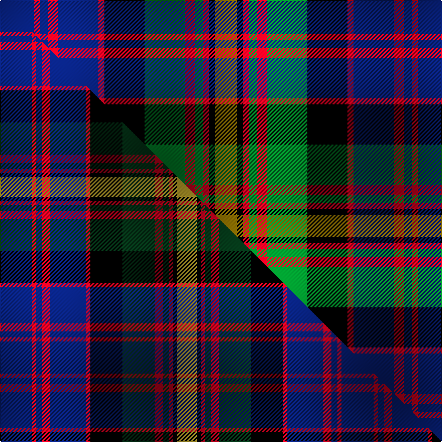

This page is one **sett** — a single exact thread-count. It belongs to the [tartan](/setts/db17r3db4r5db20r3k20g20r5g4r3k3y11/)
(the same proportion at any scale), whose colour order is pattern [BRBRBRKGRGRKG](/stripes/brbrbrkgrgrkg/).

Part of the [MacSporran](/tartans/macsporran/) tartan — the named design grouping this sett with its other cloths.

Sourced from weddslist.  It is a [13 stripe tartan](/stripes/stripes13/).

Original link http://www.weddslist.com/cgi-bin/tartans/pg.pl?source=sts

## Provenance

Earliest known date: 1978 Adopted by the Clan MacSporran Association in 1978

2 attestations — the source records this cloth was collapsed from (oldest owns this page)

<ul>
<li>undated — MacSporran (weddslist, <a href="http://www.weddslist.com/cgi-bin/tartans/pg.pl?source=sts">record</a>) </li>
<li>undated — MacSporran Clan Tartan (house-of-tartan, <a href="http://www.house-of-tartan.scotland.net/house/TartanViewjs.asp?colr=Def&tnam=495">record</a>) </li>
</ul>

## Thread count
DB/34 R6 DB8 R10 DB40 R6 K40 G40 R10 G8 R6 K6 Y/22

One full sett is **416 threads**.

## Palette
<table><thead><tr><th>Colour</th><th>Shade</th><th>OKLCh</th></tr></thead><tbody><tr><td>DB</td><td><code style="background-color:#082077;">#082077</code> <small style="color:#888">#082077</small></td><td><small style="color:#888">oklch(30.0% 0.149 265.1)</small></td></tr><tr><td>G</td><td><code style="background-color:#008B2A;">#008B2A</code> <small style="color:#888">#008B2A</small></td><td><small style="color:#888">oklch(55.4% 0.170 145.9)</small></td></tr><tr><td>K</td><td><code style="background-color:#000000;">#000000</code> <small style="color:#888">#000000</small></td><td><small style="color:#888">oklch(0.0% 0.000 0.0)</small></td></tr><tr><td>R</td><td><code style="background-color:#D60020;">#D60020</code> <small style="color:#888">#D60020</small></td><td><small style="color:#888">oklch(55.2% 0.224 25.5)</small></td></tr><tr><td>Y</td><td><code style="background-color:#8B6E00;">#8B6E00</code> <small style="color:#888">#8B6E00</small></td><td><small style="color:#888">oklch(55.1% 0.113 90.4)</small></td></tr></tbody></table>

# Sample pattern

## Compared to the master

This cloth is one sett of its design; the master sett (the exemplar the design is anchored on) is below for comparison.

Its **ΔTartan distance** from the master is **0.41** — the same measure the nearest-tartans table ranks by (0 is identical; a re-scale of the same cloth is near 0, a recolour or a different proportion further).

<figure class="master-compare" style="margin:0">

this sett
master sett ★

<figcaption style="color:#888;font-size:smaller">One weave of this sett against the <a href="/setts/db16r2db3r4db18r2k16dg16r4dg3r2k2ly10/">master sett ★</a>, split on the diagonal: a shared proportion runs seamlessly across it with only the shades shifting; a different proportion breaks on it.</figcaption>
</figure>

## Nearest tartan variants

The nearest existing variants by ΔTartan distance, with this cloth at the top so the swatches line up against it.

ΔTartan

Threads

Variant

Sett

—

416

<a href="/variants/s13/db17r3db4r5db20r3k20g20r5g4r3k3y11~x2/">MacSporran</a>

<a href="/ttd/edit/#slug=db16r2db3r4db18r2k16dg16r4dg3r2k2ly10~x2&amp;base=db17r3db4r5db20r3k20g20r5g4r3k3y11~x2" title="compare in the TTD">0.41</a>

340

<a href="/variants/s13/db16r2db3r4db18r2k16dg16r4dg3r2k2ly10~x2/">MacSporran</a>

<a href="/ttd/edit/#slug=db10dp2db3r4db14r2k14g14r4g3dp2g10~x2&amp;base=db17r3db4r5db20r3k20g20r5g4r3k3y11~x2" title="compare in the TTD">1.45</a>

288

<a href="/variants/s12/db10dp2db3r4db14r2k14g14r4g3dp2g10~x2/">Denovan, The Lairdship of (Personal)</a>

<a href="/ttd/edit/#slug=db3r1db1r2db6r1k6g6r2g1r1g2y1~x6&amp;base=db17r3db4r5db20r3k20g20r5g4r3k3y11~x2" title="compare in the TTD">1.50</a>

372

<a href="/variants/s13/db3r1db1r2db6r1k6g6r2g1r1g2y1~x6/">Carnegie</a>

<a href="/ttd/edit/#slug=db3r1db1r2db6r1k6g6r2g1r1g2y1~x2&amp;base=db17r3db4r5db20r3k20g20r5g4r3k3y11~x2" title="compare in the TTD">1.50</a>

124

<a href="/variants/s13/db3r1db1r2db6r1k6g6r2g1r1g2y1~x2/">Carnegie</a>

<a href="/ttd/edit/#slug=r6k20y4dy10t21k4t21dy10y4k20r6t3~x2&amp;base=db17r3db4r5db20r3k20g20r5g4r3k3y11~x2" title="compare in the TTD">1.50</a>

498

<a href="/variants/s12/r6k20y4dy10t21k4t21dy10y4k20r6t3~x2/">Swankie (Personal)</a>

<a href="/ttd/edit/#slug=w2k1dg8r2dg8k6db10r4k2r2k1w2~x2&amp;base=db17r3db4r5db20r3k20g20r5g4r3k3y11~x2" title="compare in the TTD">1.59</a>

184

<a href="/variants/s12/w2k1dg8r2dg8k6db10r4k2r2k1w2~x2/">Hargis (Name)</a>

<a href="/ttd/edit/#slug=lr12k2r2k2r2k12dg11y2dg11k12lr11k2r2~x2~lr3101240-k0700000&amp;base=db17r3db4r5db20r3k20g20r5g4r3k3y11~x2" title="compare in the TTD">1.69</a>

304

<a href="/variants/s13/lg12k2r2k2r2k12dg11y2dg11k12lg11k2r2~x2~lg3101240-k0700000/">92nd Regiment Drummers' Plaid (Mil.)</a>

<a href="/ttd/edit/#slug=db2dr2db12k5dg12dr2dg2dr2dg12k5w14dr2w2~x2&amp;base=db17r3db4r5db20r3k20g20r5g4r3k3y11~x2" title="compare in the TTD">1.70</a>

288

<a href="/variants/s13/db2dr2db12k5dg12dr2dg2dr2dg12k5w14dr2w2~x2/">Blair Dress</a>

<a href="/ttd/edit/#slug=db11r2db2r4db15r2k15g15r4g2r2g11~x2&amp;base=db17r3db4r5db20r3k20g20r5g4r3k3y11~x2" title="compare in the TTD">1.71</a>

296

<a href="/variants/s12/db11r2db2r4db15r2k15g15r4g2r2g11~x2/">MacDonald #2</a>

<a href="/ttd/edit/#slug=db8r2db2r3db12r2k12g12r3g2r2g8&amp;base=db17r3db4r5db20r3k20g20r5g4r3k3y11~x2" title="compare in the TTD">1.75</a>

120

<a href="/variants/s12/db8r2db2r3db12r2k12g12r3g2r2g8/">MacDonald MINI Design Tartan</a>

## Neighbour map

Every grey dot is one of 13620 variants placed by the first two principal components of the ΔTartan feature space (42% of its variance). Red is this tartan; blue dots are its nearest — click one to open its page.

<svg viewBox="0 0 640 380" role="img" style="max-width:100%;height:auto;border:1px solid #e0e0e0;border-radius:4px;display:block" xmlns="http://www.w3.org/2000/svg"><image href="/nn/cloud.v1.png" width="640" height="380"/><a href="/variants/s13/db16r2db3r4db18r2k16dg16r4dg3r2k2ly10~x2/"><circle cx="111.5" cy="152.4" r="4" fill="#3465a4"><title>MacSporran</title></circle></a><a href="/variants/s12/db10dp2db3r4db14r2k14g14r4g3dp2g10~x2/"><circle cx="89.6" cy="181.0" r="4" fill="#3465a4"><title>Denovan, The Lairdship of (Personal)</title></circle></a><a href="/variants/s13/db3r1db1r2db6r1k6g6r2g1r1g2y1~x6/"><circle cx="70.9" cy="174.8" r="4" fill="#3465a4"><title>Carnegie</title></circle></a><a href="/variants/s13/db3r1db1r2db6r1k6g6r2g1r1g2y1~x2/"><circle cx="70.9" cy="174.8" r="4" fill="#3465a4"><title>Carnegie</title></circle></a><a href="/variants/s12/r6k20y4dy10t21k4t21dy10y4k20r6t3~x2/"><circle cx="87.8" cy="181.1" r="4" fill="#3465a4"><title>Swankie (Personal)</title></circle></a><a href="/variants/s12/w2k1dg8r2dg8k6db10r4k2r2k1w2~x2/"><circle cx="84.5" cy="156.8" r="4" fill="#3465a4"><title>Hargis (Name)</title></circle></a><a href="/variants/s13/lg12k2r2k2r2k12dg11y2dg11k12lg11k2r2~x2~lg3101240-k0700000/"><circle cx="97.6" cy="177.7" r="4" fill="#3465a4"><title>92nd Regiment Drummers' Plaid (Mil.)</title></circle></a><a href="/variants/s13/db2dr2db12k5dg12dr2dg2dr2dg12k5w14dr2w2~x2/"><circle cx="74.5" cy="163.2" r="4" fill="#3465a4"><title>Blair Dress</title></circle></a><a href="/variants/s12/db11r2db2r4db15r2k15g15r4g2r2g11~x2/"><circle cx="113.6" cy="184.5" r="4" fill="#3465a4"><title>MacDonald #2</title></circle></a><a href="/variants/s12/db8r2db2r3db12r2k12g12r3g2r2g8/"><circle cx="100.8" cy="195.9" r="4" fill="#3465a4"><title>MacDonald MINI Design Tartan</title></circle></a><circle cx="85.9" cy="170.2" r="5" fill="#c00000"/><text x="320" y="376" text-anchor="middle" font-size="11" fill="#999">ground</text><text x="11" y="190" text-anchor="middle" font-size="11" fill="#999" transform="rotate(-90 11 190)">complexity</text></svg>

ID: /variants/s13/db17r3db4r5db20r3k20g20r5g4r3k3y11~x2/
