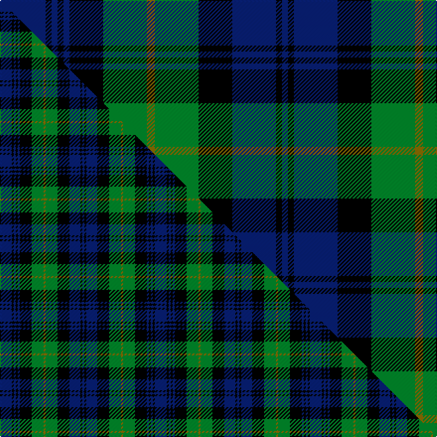

This page is one **sett** — a single exact thread-count. It belongs to the [tartan](/setts/db23k3db3k3db3k17g22y4g22k17db22k3db3/)
(the same proportion at any scale), whose colour order is pattern [BKBKBKGGGKBKB](/stripes/bkbkbkgggkbkb/).

Part of the [Gordon](/tartans/gordon/) tartan — the named design grouping this sett with its other cloths.

Sourced from tartans-authority.  It is a [13 stripe tartan](/stripes/stripes13/).

Original link http://www.tartansauthority.com/tartan-ferret/display/223/

2 attestations — the source records this cloth was collapsed from (oldest owns this page)

<ul>
<li>1793 — Gordon (Clan) (tartans-authority, <a href="http://www.tartansauthority.com/tartan-ferret/display/223/">record</a>)  <em>The Gordon tartan is the regimental tartan of the famous Gordon Highlanders and was selected by the Alexander, the 4th Duke from a choice of three submitted by William Forsyth, a weaver and outfitter from the town of Huntly. Forsyth wrote on 15th April 1793 "When I had the honour of communing with His Grace the Duke of Gordon, he was desirous to have patterns of the 42nd Regiment plaid with a small yellow stripe properly placed. I imagine the yellow stripes will appear very lively." A Gordon website claims that the Duke offered the other two Forsyth samples to Gordon Branch or Cadet Families. The Gordons of Hallhead and Esslemont selected the tartan with three yellow lines and the Gordon-Cumming of Altyre and Gordonstoun chose the tartan with two yellow lines. The earliest known date from a list compiled by D C Stewart from Wilsons of Bannockburn letters is 1798.</em></li>
<li>pre 2010 — Westgate (Corporate) (tartans-authority, <a href="http://www.tartansauthority.com/tartan-ferret/display/6019/">record</a>)  <em>Assumed to be a school tartan from Marton Mills. It is in fact the 92nd Regiment tartan (#214) and would not have been accepted by the STA had Marton Mills attempted to register it.</em></li>
</ul>

## Register references

External register numbers recorded for this tartan.

- Scottish Register of Tartans: [6019](https://www.tartanregister.gov.uk/tartanDetails?ref=6019)
- Scottish Tartans Authority (ITI): 6019

## Thread count
DB/46 K6 DB6 K6 DB6 K34 G44 Y8 G44 K34 DB44 K6 DB/6

One full sett is **528 threads**.

## Palette
<table><thead><tr><th>Colour</th><th>Shade</th><th>OKLCh</th></tr></thead><tbody><tr><td>DB</td><td><code style="background-color:#082077;">#082077</code> <small style="color:#888">#082077</small></td><td><small style="color:#888">oklch(30.0% 0.149 265.1)</small></td></tr><tr><td>Y</td><td><code style="background-color:#8B6E00;">#8B6E00</code> <small style="color:#888">#8B6E00</small></td><td><small style="color:#888">oklch(55.1% 0.113 90.4)</small></td></tr><tr><td>K</td><td><code style="background-color:#000000;">#000000</code> <small style="color:#888">#000000</small></td><td><small style="color:#888">oklch(0.0% 0.000 0.0)</small></td></tr><tr><td>G</td><td><code style="background-color:#008B2A;">#008B2A</code> <small style="color:#888">#008B2A</small></td><td><small style="color:#888">oklch(55.4% 0.170 145.9)</small></td></tr></tbody></table>

# Sample pattern

## Compared to the master

This cloth is one sett of its design; the master sett (the exemplar the design is anchored on) is below for comparison.

Its **ΔTartan distance** from the master is **0.47** — the same measure the nearest-tartans table ranks by (0 is identical; a re-scale of the same cloth is near 0, a recolour or a different proportion further).

<figure class="master-compare" style="margin:0">

this sett
master sett ★

<figcaption style="color:#888;font-size:smaller">One weave of this sett against the <a href="/setts/db12k2db2k2db2k12g12y2g12k12db11k2db2/">master sett ★</a>, split on the diagonal: a shared proportion runs seamlessly across it with only the shades shifting; a different proportion breaks on it.</figcaption>
</figure>

## Nearest variants

The nearest existing variants by ΔTartan distance, with this cloth at the top so the swatches line up against it.

ΔTartan

Threads

Variant

Sett

—

528

<a href="/variants/s13/db23k3db3k3db3k17g22y4g22k17db22k3db3~x2/">Gordon (Clan)</a>

<a href="/ttd/edit/#slug=db6k1db1k1db1k6g6y1g6k6db6k1db1~x4&amp;base=db23k3db3k3db3k17g22y4g22k17db22k3db3~x2" title="compare in the TTD">0.20</a>

316

<a href="/variants/s13/db6k1db1k1db1k6g6y1g6k6db6k1db1~x4/">Gordon 4</a>

<a href="/ttd/edit/#slug=db12k2db2k2db2k12g12y2g12k12db11k2db2&amp;base=db23k3db3k3db3k17g22y4g22k17db22k3db3~x2" title="compare in the TTD">0.21</a>

156

<a href="/variants/s13/db12k2db2k2db2k12g12y2g12k12db11k2db2/">Gordon</a>

<a href="/ttd/edit/#slug=db12k2db2k2db2k12g12y2g12k12db11k2db2~x2&amp;base=db23k3db3k3db3k17g22y4g22k17db22k3db3~x2" title="compare in the TTD">0.21</a>

312

<a href="/variants/s13/db12k2db2k2db2k12g12y2g12k12db11k2db2~x2/">Gordon</a>

<a href="/ttd/edit/#slug=db30k5db5k5db5k24g24y6g24k24db24k5db5&amp;base=db23k3db3k3db3k17g22y4g22k17db22k3db3~x2" title="compare in the TTD">0.38</a>

337

<a href="/variants/s13/db30k5db5k5db5k24g24y6g24k24db24k5db5/">Lamberton (?)</a>

<a href="/ttd/edit/#slug=db23k3db3k3db3k22g22w3g22k22db18k3db3~x2&amp;base=db23k3db3k3db3k17g22y4g22k17db22k3db3~x2" title="compare in the TTD">0.46</a>

548

<a href="/variants/s13/db23k3db3k3db3k22g22w3g22k22db18k3db3~x2/">Lamont #3</a>

<a href="/ttd/edit/#slug=db6k1db1k1db1k6g6lb2g6k6db6k1db2~x2&amp;base=db23k3db3k3db3k17g22y4g22k17db22k3db3~x2" title="compare in the TTD">0.54</a>

164

<a href="/variants/s13/db6k1db1k1db1k6g6lb2g6k6db6k1db2~x2/">Cheape of Torosay</a>

<a href="/ttd/edit/#slug=db6k1db1k1db1k6g6lb2g6k6db6k1db2~x4&amp;base=db23k3db3k3db3k17g22y4g22k17db22k3db3~x2" title="compare in the TTD">0.54</a>

328

<a href="/variants/s13/db6k1db1k1db1k6g6lb2g6k6db6k1db2~x4/">Cheape of Torosay (Clan)</a>

<a href="/ttd/edit/#slug=db6k1db1k1db1k6g6r2g6k6db6k1db2~x4&amp;base=db23k3db3k3db3k17g22y4g22k17db22k3db3~x2" title="compare in the TTD">0.54</a>

328

<a href="/variants/s13/db6k1db1k1db1k6g6r2g6k6db6k1db2~x4/">Murray #2</a>

<a href="/ttd/edit/#slug=db6k1db1k1db1k6g6r2g6k6db6k1db2~x2&amp;base=db23k3db3k3db3k17g22y4g22k17db22k3db3~x2" title="compare in the TTD">0.54</a>

164

<a href="/variants/s13/db6k1db1k1db1k6g6r2g6k6db6k1db2~x2/">New South Wales Scottish Rifles</a>

<a href="/ttd/edit/#slug=db6k1db1k1db1k6g6r2g6k6db6k1db2&amp;base=db23k3db3k3db3k17g22y4g22k17db22k3db3~x2" title="compare in the TTD">0.54</a>

82

<a href="/variants/s13/db6k1db1k1db1k6g6r2g6k6db6k1db2/">Murray</a>

## Neighbour map

Every grey dot is one of 13620 variants placed by the first two principal components of the ΔTartan feature space (42% of its variance). Red is this tartan; blue dots are its nearest — click one to open its page.

<svg viewBox="0 0 640 380" role="img" style="max-width:100%;height:auto;border:1px solid #e0e0e0;border-radius:4px;display:block" xmlns="http://www.w3.org/2000/svg"><image href="/nn/cloud.v1.png" width="640" height="380"/><a href="/variants/s13/db6k1db1k1db1k6g6y1g6k6db6k1db1~x4/"><circle cx="128.1" cy="196.0" r="4" fill="#3465a4"><title>Gordon 4</title></circle></a><a href="/variants/s13/db12k2db2k2db2k12g12y2g12k12db11k2db2/"><circle cx="128.4" cy="196.0" r="4" fill="#3465a4"><title>Gordon</title></circle></a><a href="/variants/s13/db12k2db2k2db2k12g12y2g12k12db11k2db2~x2/"><circle cx="128.4" cy="196.0" r="4" fill="#3465a4"><title>Gordon</title></circle></a><a href="/variants/s13/db30k5db5k5db5k24g24y6g24k24db24k5db5/"><circle cx="131.7" cy="200.9" r="4" fill="#3465a4"><title>Lamberton (?)</title></circle></a><a href="/variants/s13/db23k3db3k3db3k22g22w3g22k22db18k3db3~x2/"><circle cx="135.5" cy="181.4" r="4" fill="#3465a4"><title>Lamont #3</title></circle></a><a href="/variants/s13/db6k1db1k1db1k6g6lb2g6k6db6k1db2~x2/"><circle cx="117.1" cy="201.8" r="4" fill="#3465a4"><title>Cheape of Torosay</title></circle></a><a href="/variants/s13/db6k1db1k1db1k6g6lb2g6k6db6k1db2~x4/"><circle cx="117.1" cy="201.8" r="4" fill="#3465a4"><title>Cheape of Torosay (Clan)</title></circle></a><a href="/variants/s13/db6k1db1k1db1k6g6r2g6k6db6k1db2~x4/"><circle cx="119.6" cy="200.6" r="4" fill="#3465a4"><title>Murray #2</title></circle></a><a href="/variants/s13/db6k1db1k1db1k6g6r2g6k6db6k1db2~x2/"><circle cx="119.6" cy="200.6" r="4" fill="#3465a4"><title>New South Wales Scottish Rifles</title></circle></a><a href="/variants/s13/db6k1db1k1db1k6g6r2g6k6db6k1db2/"><circle cx="119.6" cy="200.6" r="4" fill="#3465a4"><title>Murray</title></circle></a><circle cx="145.2" cy="183.9" r="5" fill="#c00000"/><text x="320" y="376" text-anchor="middle" font-size="11" fill="#999">ground</text><text x="11" y="190" text-anchor="middle" font-size="11" fill="#999" transform="rotate(-90 11 190)">complexity</text></svg>

ID: /variants/s13/db23k3db3k3db3k17g22y4g22k17db22k3db3~x2/
