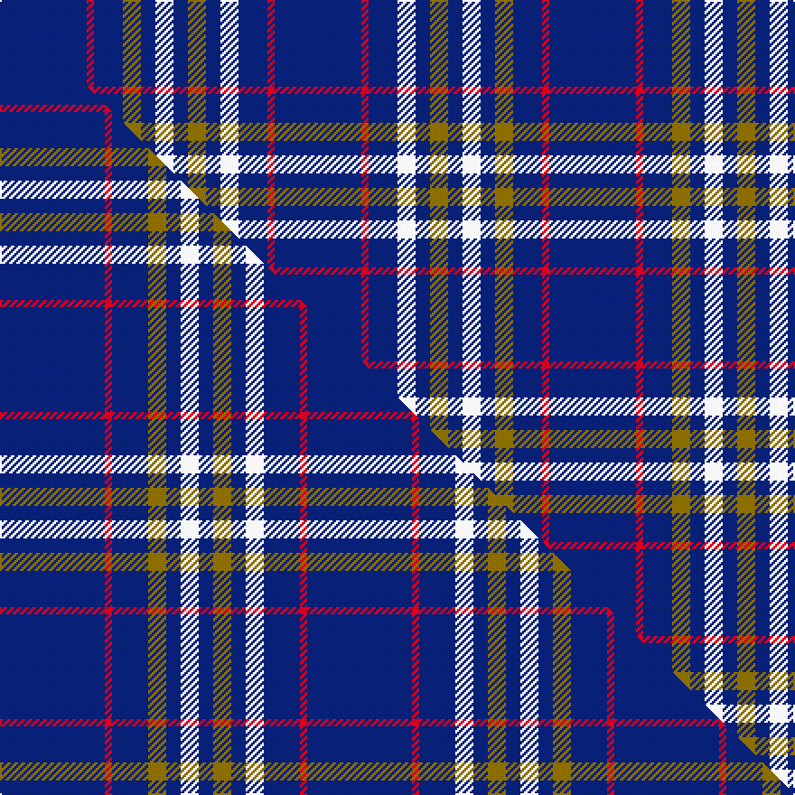

This is one **variant** — a specific cloth: this exact thread count and colourway, with its own
provenance below. It is one weaving of the [sett](/setts/db24r2db8y5db4w5db4y5db4w5db8r2db24/) (the scale-free proportion — the
same cloth at any scale or shade), whose colour order is pattern [BRBGBWBGBWBRB](/stripes/brbgbwbgbwbrb/).

Part of the [Clackson](/tartans/c/cl/clackson/) tartan — the named design grouping this sett with its other cloths.

Sourced from tartans-authority.  It is a [13 stripe tartan](/stripes/stripes13/).

Original link [https://www.tartanregister.gov.uk/tartanDetails.aspx?ref=5831](https://www.tartanregister.gov.uk/tartanDetails.aspx?ref=5831)

## Provenance

Earliest known date: June 2003 Designed by Dr. Stephen Gregory Clackson of Orkney for all bearers of any version of his armorial bearings, for all descendants of such persons and for all persons granted written permission by him or his heirs. Inspired by the armorial bearings of Dr Clackson (which are matriculated in the Public Register of all Arms and Bearings in Scotland) to commemorate the birth in Aberdeen of his daughter Frideswide Joyce Charlotte on the 13th February 2003.

2 attestations — the source records this cloth was collapsed from (oldest owns this page)

<ul>
<li>June 2003 — Clackson (Personal) (tartans-authority, <a href="https://www.tartanregister.gov.uk/tartanDetails.aspx?ref=5831">record</a>)  <em>Designed by Dr. Stephen Gregory Clackson of Orkney for all bearers of any version of his armorial bearings, for all descendants of such persons and for all persons granted written permission by him or his heirs. Inspired by the armorial bearings of Dr Clackson (which are matriculated in the Public Register of all Arms and Bearings in Scotland) to commemorate the birth in Aberdeen of his daughter Frideswide Joyce Charlotte on the 13th February 2003.</em></li>
<li>June 2003 — Clackson Personal Weavers Tartan (house-of-tartan, <a href="http://www.house-of-tartan.scotland.net/house/TartanViewjs.asp?colr=Def&tnam=5831">record</a>) </li>
</ul>

Dataset <small>— provenance for this record, inherited from the source manifest</small>

<dl class="dataset-prov">
<dt>source</dt><dd><a href="/sources/tartans-authority/">Scottish Tartans Authority</a></dd>
<dt>data captured from</dt><dd><a href="https://github.com/thetartan/tartan-database/blob/master/data/tartans-authority/data.csv">https://github.com/thetartan/tartan-database/blob/master/data/tartans-authority/data.csv</a></dd>
<dt>data date</dt><dd>June 2003 <small>(this record)</small></dd>
<dt>licence</dt><dd><a href="https://creativecommons.org/licenses/by-nc-nd/4.0/">CC BY-NC-ND 4.0</a></dd>
</dl>

Capture chain <small>— the hands this data passed through, oldest first; each capture carries its own licence</small>

<ol class="capture-chain">
<li><a href="https://www.tartansauthority.com/">Scottish Tartans Authority</a> <small>the heritage body's archive — its tartan-ferret record browser is retired (links repaired to the SRT, above)</small></li>
<li><a href="https://github.com/thetartan/tartan-database">thetartan/tartan-database</a> <small>2016-2017</small> · <a href="https://creativecommons.org/licenses/by-nc-nd/4.0/">CC BY-NC-ND 4.0</a> <small>Levko Kravets's frozen compilation — the capture we vendored, and where its CC licence text came from</small></li>
<li>this dictionary <small>captured 2026-06-10 · commit 5bf86c7566</small> <small>each re-capture is a git commit to data/sources</small></li>
</ol>

## Register references

External register numbers recorded for this tartan.

- Scottish Tartans Authority (ITI): 5831

## Thread count
DB/48 R4 DB16 Y10 DB8 W10 DB8 Y10 DB8 W10 DB16 R4 DB/48

One full sett is **304 threads**.

## Palette
<table><thead><tr><th>Colour</th><th>Shade</th><th>OKLCh</th></tr></thead><tbody><tr><td>DB</td><td><code style="background-color:#082077;">#082077</code> <small style="color:#888">#082077</small></td><td><small style="color:#888">oklch(30.0% 0.149 265.1)</small></td></tr><tr><td>W</td><td><code style="background-color:#F7F7F7;">#F7F7F7</code> <small style="color:#888">#F7F7F7</small></td><td><small style="color:#888">oklch(97.6% 0.000 89.9)</small></td></tr><tr><td>R</td><td><code style="background-color:#D60020;">#D60020</code> <small style="color:#888">#D60020</small></td><td><small style="color:#888">oklch(55.2% 0.224 25.5)</small></td></tr><tr><td>Y</td><td><code style="background-color:#8B6E00;">#8B6E00</code> <small style="color:#888">#8B6E00</small></td><td><small style="color:#888">oklch(55.1% 0.113 90.4)</small></td></tr></tbody></table>

# Sample pattern

## Compared to the master

This cloth is one sett of its design; the master sett (the exemplar the design is anchored on) is below for comparison.

Its **ΔTartan distance** from the master is **0.17** — the same measure the nearest-tartans table ranks by (0 is identical; a re-scale of the same cloth is near 0, a recolour or a different proportion further).

<figure class="master-compare" style="margin:0">

this sett
master sett ★

<figcaption style="color:#888;font-size:smaller">One weave of this sett against the <a href="/setts/db29r2db10y5db4w5db4y5db4w5db10r2db29/">master sett ★</a>, split on the diagonal: a shared proportion runs seamlessly across it with only the shades shifting; a different proportion breaks on it.</figcaption>
</figure>

## Nearest tartan variants

The nearest existing variants by ΔTartan distance, with this cloth at the top so the swatches line up against it.

ΔTartan

Threads

Variant

Sett

—

304

<a href="/variants/s13/db24r2db8y5db4w5db4y5db4w5db8r2db24~x2/">Clackson (Personal)</a>

<a href="/ttd/edit/#slug=db29r2db10y5db4w5db4y5db4w5db10r2db29~x2&amp;base=db24r2db8y5db4w5db4y5db4w5db8r2db24~x2" title="compare in the TTD">0.17</a>

340

<a href="/variants/s13/db29r2db10y5db4w5db4y5db4w5db10r2db29~x2/">Clackson (Personal)</a>

<a href="/ttd/edit/#slug=db25r3db3r2db4r2db3r3db18k16r1db16r3db8y2~x2&amp;base=db24r2db8y5db4w5db4y5db4w5db8r2db24~x2" title="compare in the TTD">2.05</a>

382

<a href="/variants/s15/db25r3db3r2db4r2db3r3db18k16r1db16r3db8y2~x2/">Dundonald</a>

<a href="/ttd/edit/#slug=g6db3g3db11w2db4g2r4db5r2db24lb2db4~x2&amp;base=db24r2db8y5db4w5db4y5db4w5db8r2db24~x2" title="compare in the TTD">2.80</a>

268

<a href="/variants/s13/g6db3g3db11w2db4g2r4db5r2db24lb2db4~x2/">Massachusetts-The Bay State</a>

<a href="/ttd/edit/#slug=db4r6db16w4db4w4db4w4db16ly2db16r6w3db4~x2&amp;base=db24r2db8y5db4w5db4y5db4w5db8r2db24~x2" title="compare in the TTD">2.83</a>

356

<a href="/variants/s14/db4r6db16w4db4w4db4w4db16ly2db16r6w3db4~x2/">Parker (USA)</a>

<a href="/ttd/edit/#slug=db3w2db2w3db6y2db26y2db6r2~x2&amp;base=db24r2db8y5db4w5db4y5db4w5db8r2db24~x2" title="compare in the TTD">2.85</a>

206

<a href="/variants/s10/db3w2db2w3db6y2db26y2db6r2~x2/">Dundee Football Club</a>

<a href="/ttd/edit/#slug=g12db6g6db22w4db8g4r8db10r3db48lb4db8&amp;base=db24r2db8y5db4w5db4y5db4w5db8r2db24~x2" title="compare in the TTD">2.90</a>

266

<a href="/variants/s13/g12db6g6db22w4db8g4r8db10r3db48lb4db8/">Massachusetts - The Bay State</a>

<a href="/ttd/edit/#slug=db4r2db25lb7w1db5w2db5w1lb7db26r2~x2&amp;base=db24r2db8y5db4w5db4y5db4w5db8r2db24~x2" title="compare in the TTD">2.95</a>

336

<a href="/variants/s12/db4r2db25lb7w1db5w2db5w1lb7db26r2~x2/">Glasgow Caledonian University (Corp)</a>

<a href="/ttd/edit/#slug=r5db20r3db20w6db3lb2db1~x2&amp;base=db24r2db8y5db4w5db4y5db4w5db8r2db24~x2" title="compare in the TTD">2.96</a>

228

<a href="/variants/s8/r5db20r3db20w6db3lb2db1~x2/">Masai Shuka 29 (Artefact)</a>

<a href="/ttd/edit/#slug=db15g2db2w1db1w1db1w1db2g2db15dr10~x4&amp;base=db24r2db8y5db4w5db4y5db4w5db8r2db24~x2" title="compare in the TTD">3.00</a>

324

<a href="/variants/s12/db15g2db2w1db1w1db1w1db2g2db15dr10~x4/">Ikelman #5 (Personal)</a>

<a href="/ttd/edit/#slug=db4w4db4w4db4w4db16ly2db16r6w3db4~x2&amp;base=db24r2db8y5db4w5db4y5db4w5db8r2db24~x2" title="compare in the TTD">3.24</a>

268

<a href="/variants/s12/db4w4db4w4db4w4db16ly2db16r6w3db4~x2/">Parker Dress (USA)</a>

## Neighbour map

Every grey dot is one of 13621 variants placed by the first two principal components of the ΔTartan feature space (42% of its variance). Red is this tartan; blue dots are its nearest — click one to open its page.

<svg viewBox="0 0 640 380" role="img" style="max-width:100%;height:auto;border:1px solid #e0e0e0;border-radius:4px;display:block" xmlns="http://www.w3.org/2000/svg"><image href="/nn/cloud.v1.png" width="640" height="380"/><a href="/variants/s13/db29r2db10y5db4w5db4y5db4w5db10r2db29~x2/"><circle cx="449.9" cy="147.9" r="4" fill="#3465a4"><title>Clackson (Personal)</title></circle></a><a href="/variants/s15/db25r3db3r2db4r2db3r3db18k16r1db16r3db8y2~x2/"><circle cx="400.2" cy="111.6" r="4" fill="#3465a4"><title>Dundonald</title></circle></a><a href="/variants/s13/g6db3g3db11w2db4g2r4db5r2db24lb2db4~x2/"><circle cx="374.7" cy="143.2" r="4" fill="#3465a4"><title>Massachusetts-The Bay State</title></circle></a><a href="/variants/s14/db4r6db16w4db4w4db4w4db16ly2db16r6w3db4~x2/"><circle cx="320.2" cy="183.9" r="4" fill="#3465a4"><title>Parker (USA)</title></circle></a><a href="/variants/s10/db3w2db2w3db6y2db26y2db6r2~x2/"><circle cx="470.8" cy="143.7" r="4" fill="#3465a4"><title>Dundee Football Club</title></circle></a><a href="/variants/s13/g12db6g6db22w4db8g4r8db10r3db48lb4db8/"><circle cx="388.3" cy="132.0" r="4" fill="#3465a4"><title>Massachusetts - The Bay State</title></circle></a><a href="/variants/s12/db4r2db25lb7w1db5w2db5w1lb7db26r2~x2/"><circle cx="440.7" cy="119.1" r="4" fill="#3465a4"><title>Glasgow Caledonian University (Corp)</title></circle></a><a href="/variants/s8/r5db20r3db20w6db3lb2db1~x2/"><circle cx="417.0" cy="153.4" r="4" fill="#3465a4"><title>Masai Shuka 29 (Artefact)</title></circle></a><a href="/variants/s12/db15g2db2w1db1w1db1w1db2g2db15dr10~x4/"><circle cx="425.5" cy="161.3" r="4" fill="#3465a4"><title>Ikelman #5 (Personal)</title></circle></a><a href="/variants/s12/db4w4db4w4db4w4db16ly2db16r6w3db4~x2/"><circle cx="314.5" cy="187.7" r="4" fill="#3465a4"><title>Parker Dress (USA)</title></circle></a><circle cx="411.1" cy="160.6" r="5" fill="#c00000"/><text x="320" y="376" text-anchor="middle" font-size="11" fill="#999">ground</text><text x="11" y="190" text-anchor="middle" font-size="11" fill="#999" transform="rotate(-90 11 190)">complexity</text></svg>

ID: /variants/s13/db24r2db8y5db4w5db4y5db4w5db8r2db24~x2/
