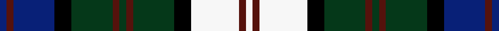

This page is one **sett** — a single exact thread-count. It belongs to the [tartan](/setts/db2dr2db12k5dg12dr2dg2dr2dg12k5w14dr2w2/)
(the same proportion at any scale), whose colour order is pattern [BBBKGBGBGKWBW](/stripes/bbbkgbgbgkwbw/).

Part of the [Blair Dress](/tartans/blair-dress/) tartan — the named design grouping this sett with its other cloths.

Sourced from register-of-tartans.  It is a [13 stripe tartan](/stripes/stripes13/).

Original link https://www.tartanregister.gov.uk/tartanDetails.aspx?ref=292

2 attestations — the source records this cloth was collapsed from (oldest owns this page)

<ul>
<li>01/01/1989 — Blair Dress (register-of-tartans, <a href="https://www.tartanregister.gov.uk/tartanDetails.aspx?ref=292">record</a>)  <em>Designed by Phil Smith in 1989 and produced by John Buchan Mill in 1991 (Lochcarron of Scotland).</em></li>
<li>1989 — Blair Dress (Name) (tartans-authority, <a href="http://www.tartansauthority.com/tartan-ferret/display/483/">record</a>)  <em>Designed by Phil Smith in 1989 and produced by John Buchan Mill in 1991 (Lochcarron of Scotland).</em></li>
</ul>

## Register references

External register numbers recorded for this tartan.

- Scottish Register of Tartans: [292](https://www.tartanregister.gov.uk/tartanDetails.aspx?ref=292)
- Scottish Tartans Authority (ITI): 483
- Scottish Tartans World Register: 483

## Thread count
DB/4 DR4 DB24 K10 DG24 DR4 DG4 DR4 DG24 K10 W28 DR4 W/4

One full sett is **288 threads**.

## Palette
<table><thead><tr><th>Colour</th><th>Shade</th><th>OKLCh</th></tr></thead><tbody><tr><td>DB</td><td><code style="background-color:#082077;">#082077</code> <small style="color:#888">#082077</small></td><td><small style="color:#888">oklch(30.0% 0.149 265.1)</small></td></tr><tr><td>DR</td><td><code style="background-color:#55120C;">#55120C</code> <small style="color:#888">#55120C</small></td><td><small style="color:#888">oklch(30.0% 0.099 29.3)</small></td></tr><tr><td>G</td><td><code style="background-color:#053819;">#053819</code> <small style="color:#888">#053819</small></td><td><small style="color:#888">oklch(30.0% 0.075 151.3)</small></td></tr><tr><td>K</td><td><code style="background-color:#000000;">#000000</code> <small style="color:#888">#000000</small></td><td><small style="color:#888">oklch(0.0% 0.000 0.0)</small></td></tr><tr><td>LN</td><td><code style="background-color:#F7F7F7;">#F7F7F7</code> <small style="color:#888">#F7F7F7</small></td><td><small style="color:#888">oklch(97.6% 0.000 89.9)</small></td></tr><tr><td>N</td><td><code style="background-color:#FF9C97;">#FF9C97</code> <small style="color:#888">#FF9C97</small></td><td><small style="color:#888">oklch(79.3% 0.119 23.2)</small></td></tr></tbody></table>

# Sample pattern

ID: /variants/s13/db2dr2db12k5dg12dr2dg2dr2dg12k5w14dr2w2~x2/
