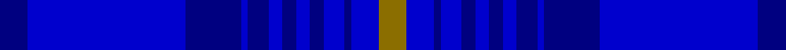

This is one **variant** — a specific cloth: this exact thread count and colourway, with its own
provenance below. It is one weaving of the [sett](/setts/db4b23db8b1db3b2db2b2db2b3db1b4y4/) (the scale-free proportion — the
same cloth at any scale or shade), whose colour order is pattern [BBBBBBBBBBBBG](/stripes/bbbbbbbbbbbbg/).

Part of the [Hawick Common Riding](/tartans/h/ha/hawick-common-riding/) tartan — the named design grouping this sett with its other cloths.

Sourced from register-of-tartans.  It is a [13 stripe tartan](/stripes/stripes13/).

Original link [https://www.tartanregister.gov.uk/tartanDetails.aspx?ref=10601](https://www.tartanregister.gov.uk/tartanDetails.aspx?ref=10601)

Dataset <small>— provenance for this record, inherited from the source manifest</small>

<dl class="dataset-prov">
<dt>source</dt><dd><a href="/sources/register-of-tartans/">Scottish Register of Tartans</a></dd>
<dt>data captured from</dt><dd><a href="https://github.com/thetartan/tartan-database/blob/master/data/register-of-tartans/data.csv">https://github.com/thetartan/tartan-database/blob/master/data/register-of-tartans/data.csv</a></dd>
<dt>data date</dt><dd>2012 <small>(this record)</small></dd>
<dt>licence</dt><dd><a href="https://www.tartanregister.gov.uk/copyright">Crown copyright</a></dd>
</dl>

Capture chain <small>— the hands this data passed through, oldest first; each capture carries its own licence</small>

<ol class="capture-chain">
<li><a href="https://www.tartanregister.gov.uk/">Scottish Register of Tartans</a> · <a href="https://www.tartanregister.gov.uk/copyright">Crown copyright</a> <small>the living register — still published by National Records of Scotland</small></li>
<li><a href="https://github.com/thetartan/tartan-database">thetartan/tartan-database</a> <small>2016-2017</small> · <a href="https://creativecommons.org/licenses/by-nc-nd/4.0/">CC BY-NC-ND 4.0</a> <small>Levko Kravets's frozen compilation — the capture we vendored, and where its CC licence text came from</small></li>
<li>this dictionary <small>captured 2026-06-10 · commit 5bf86c7566</small> <small>each re-capture is a git commit to data/sources</small></li>
</ol>

## Register references

External register numbers recorded for this tartan.

- Scottish Register of Tartans: [10601](https://www.tartanregister.gov.uk/tartanDetails.aspx?ref=10601)

## Thread count
DB/8 B46 DB16 B2 DB6 B4 DB4 B4 DB4 B6 DB2 B8 Y/8

One full sett is **220 threads**.

## Palette
<table><thead><tr><th>Colour</th><th>Shade</th><th>OKLCh</th></tr></thead><tbody><tr><td>B</td><td><code style="background-color:#0000CD;">#0000CD</code> <small style="color:#888">#0000CD</small></td><td><small style="color:#888">oklch(38.3% 0.266 264.1)</small></td></tr><tr><td>DB</td><td><code style="background-color:#000080;">#000080</code> <small style="color:#888">#000080</small></td><td><small style="color:#888">oklch(27.1% 0.188 264.1)</small></td></tr><tr><td>Y</td><td><code style="background-color:#8B6E00;">#8B6E00</code> <small style="color:#888">#8B6E00</small></td><td><small style="color:#888">oklch(55.1% 0.113 90.4)</small></td></tr></tbody></table>

# Sample pattern

## Nearest tartan variants

The nearest existing variants by ΔTartan distance, with this cloth at the top so the swatches line up against it.

ΔTartan

Threads

Variant

Sett

—

220

<a href="/variants/s13/db4b23db8b1db3b2db2b2db2b3db1b4y4~x2~db1108266-b1511266/">Hawick Common Riding</a>

<a href="/ttd/edit/#slug=dbi4db23dbi8db1dbi3db2dbi2db2dbi2db3dbi1db4ly4~x2~dbi1404245-db1106275&amp;base=db4b23db8b1db3b2db2b2db2b3db1b4y4~x2~db1108266-b1511266" title="compare in the TTD">0.99</a>

220

<a href="/variants/s13/dbi4db23dbi8db1dbi3db2dbi2db2dbi2db3dbi1db4ly4~x2~dbi1404245-db1106275/">Hawick Common Riding (Commemorative)</a>

<a href="/ttd/edit/#slug=dg4db3b4db3dg2db3b4db2y2b4db2b52db2b4&amp;base=db4b23db8b1db3b2db2b2db2b3db1b4y4~x2~db1108266-b1511266" title="compare in the TTD">2.57</a>

174

<a href="/variants/s14/dg4db3b4db3dg2db3b4db2y2b4db2b52db2b4/">Unidentified 3</a>

## Neighbour map

Every grey dot is one of 13621 variants placed by the first two principal components of the ΔTartan feature space (42% of its variance). Red is this tartan; blue dots are its nearest — click one to open its page. The map is a flat projection of a many-dimensional space — [how to read it](/posts/neighbourhood-maps/).

<svg viewBox="0 0 640 380" role="img" style="max-width:100%;height:auto;border:1px solid #e0e0e0;border-radius:4px;display:block" xmlns="http://www.w3.org/2000/svg"><image href="/nn/cloud.v1.png" width="640" height="380"/><a href="/variants/s13/dbi4db23dbi8db1dbi3db2dbi2db2dbi2db3dbi1db4ly4~x2~dbi1404245-db1106275/"><circle cx="500.1" cy="192.3" r="4" fill="#3465a4"><title>Hawick Common Riding (Commemorative)</title></circle></a><a href="/variants/s14/dg4db3b4db3dg2db3b4db2y2b4db2b52db2b4/"><circle cx="600.1" cy="131.1" r="4" fill="#3465a4"><title>Unidentified 3</title></circle></a><circle cx="535.8" cy="201.4" r="5" fill="#c00000"/><text x="320" y="376" text-anchor="middle" font-size="11" fill="#999">ground</text><text x="11" y="190" text-anchor="middle" font-size="11" fill="#999" transform="rotate(-90 11 190)">complexity</text></svg>

ID: /variants/s13/db4b23db8b1db3b2db2b2db2b3db1b4y4~x2~db1108266-b1511266/
