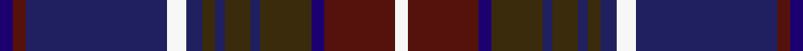

This page is one **sett** — a single exact thread-count. It belongs to the [tartan](/setts/db4dr4dbi44w6dbi5dy4dbi3dy8dbi3dy16db4dr22w4/)
(the same proportion at any scale), whose colour order is pattern [BBBWBGBGBGBBW](/stripes/bbbwbgbgbgbbw/).

Sourced from house-of-tartan.  It is a [13 stripe tartan](/stripes/stripes13/).

Original link http://www.house-of-tartan.scotland.net/house/TartanViewjs.asp?colr=Def&tnam=478

## Provenance

Earliest known date: 1981 The Largs tartan is a new design created for the town and officially adopted in 1981. There is also a dress version.

## Thread count
DB/4 DR4 DBi44 W6 DBi5 DY4 DBi3 DY8 DBi3 DY16 DB4 DR22 W/4

One full sett is **246 threads**.

## Palette
<table><thead><tr><th>Colour</th><th>Shade</th><th>OKLCh</th></tr></thead><tbody><tr><td>DB</td><td><code style="background-color:#202060;">#202060</code> <small style="color:#888">#202060</small></td><td><small style="color:#888">oklch(28.9% 0.111 276.9)</small></td></tr><tr><td>DBa</td><td><code style="background-color:#1C0070;">#1C0070</code> <small style="color:#888">#1C0070</small></td><td><small style="color:#888">oklch(26.3% 0.162 277.1)</small></td></tr><tr><td>DR</td><td><code style="background-color:#55120C;">#55120C</code> <small style="color:#888">#55120C</small></td><td><small style="color:#888">oklch(30.0% 0.099 29.3)</small></td></tr><tr><td>LN</td><td><code style="background-color:#F7F7F7;">#F7F7F7</code> <small style="color:#888">#F7F7F7</small></td><td><small style="color:#888">oklch(97.6% 0.000 89.9)</small></td></tr><tr><td>T</td><td><code style="background-color:#3A2B0D;">#3A2B0D</code> <small style="color:#888">#3A2B0D</small></td><td><small style="color:#888">oklch(30.0% 0.049 82.0)</small></td></tr></tbody></table>

# Sample pattern

ID: /variants/s13/db4dr4dbi44w6dbi5dy4dbi3dy8dbi3dy16db4dr22w4~db1106275-dbi1204274/
