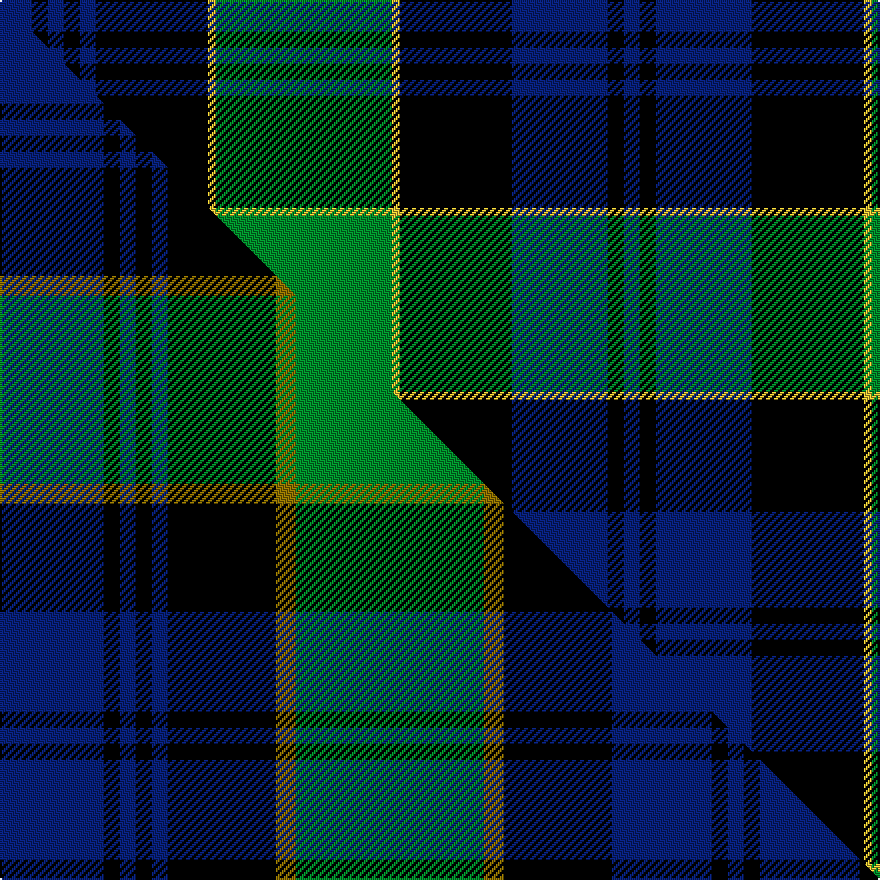

This page is one **sett** — a single exact thread-count. It belongs to the [tartan](/setts/db4k2db2k2db2k14ly1g22ly1k14db12k2db2/)
(the same proportion at any scale), whose colour order is pattern [BKBKBKYGYKBKB](/stripes/bkbkbkygykbkb/).

Part of the [Campbell of Breadalbane](/tartans/campbell-of-breadalbane/) tartan — the named design grouping this sett with its other cloths.

Sourced from logan-1831.  It is a [13 stripe tartan](/stripes/stripes13/).

Original link /posts/logans-scottish-gael/

## Provenance

<figure class="logan-scan">

<figcaption>Logan, The Scottish Gaël (1831), vol. II p. 402 — page-scan crop (913,1814)–(1169,2238), (1181,1147)–(1436,1549)</figcaption>
</figure>

James Logan recorded the **Campbell of Breadalbane** sett in 1831, on page 402 of the *Table of Clan Tartans* in *The Scottish Gaël* — the earliest systematic published collection of clan setts. Logan gives the stripe widths in eighths of an inch, measured across the cloth and reflected about each end (a half-sett):

> 2 blue · 1 black · 1 blue · 1 black · 1 blue · 7 black · ½ yellow · 11 green · ½ yellow · 7 black · 6 blue · 1 black · 1 blue

In threads (at 8 to the eighth-inch) that is `B/16 K8 B8 K8 B8 K56 Y4 G88 Y4 K56 B48 K8 B/8`. Logan named his colours rather than dyeing to a standard, so the palette here is the Dictionary's modern reading of his names.

See [Logan's Scottish Gaël](/posts/logans-scottish-gael/) for the full table and method.

## Related setts

Later records of the **Campbell of Breadalbane** name adjusted Logan's counts: [Campbell of Breadalbane](/setts/s13/b8k1b1k1b1k8y1g14y1k8b8k1b1~b2c4084-g005020-k101010-ye8c000~x2/); [Campbell of Breadalbane #2](/setts/s13/b26k4b4k4b4k27y5g47y5k27b25k4b4~b2c4084-g005020-k101010-ye8c000~x2/); [Campbell of Breadalbane #3](/setts/s7/k9g9y2g9k9b9k3~b2c2c80-g006818-k000000-ydcbc00~x2/); [Campbell of Breadalbane (Military)](/setts/s13/b26k4b4k4b4k27y5g47y5k27b25k4b4~b202060-g006818-k101010-ye8c000~x2/). Compare their thread counts with Logan's above.

## Thread count
DB/16 K8 DB8 K8 DB8 K56 LY4 G88 LY4 K56 DB48 K8 DB/8

One full sett is **616 threads**.

## Palette
<table><thead><tr><th>Colour</th><th>Shade</th><th>OKLCh</th></tr></thead><tbody><tr><td>DB</td><td><code style="background-color:#082077;">#082077</code> <small style="color:#888">#082077</small></td><td><small style="color:#888">oklch(30.0% 0.149 265.1)</small></td></tr><tr><td>G</td><td><code style="background-color:#008B2A;">#008B2A</code> <small style="color:#888">#008B2A</small></td><td><small style="color:#888">oklch(55.4% 0.170 145.9)</small></td></tr><tr><td>K</td><td><code style="background-color:#000000;">#000000</code> <small style="color:#888">#000000</small></td><td><small style="color:#888">oklch(0.0% 0.000 0.0)</small></td></tr><tr><td>LY</td><td><code style="background-color:#DCBC32;">#DCBC32</code> <small style="color:#888">#DCBC32</small></td><td><small style="color:#888">oklch(80.0% 0.150 95.2)</small></td></tr></tbody></table>

# Sample pattern

## Compared to the master

This cloth is one sett of its design; the master sett (the exemplar the design is anchored on) is below for comparison.

Its **ΔTartan distance** from the master is **1.21** — the same measure the nearest-tartans table ranks by (0 is identical; a re-scale of the same cloth is near 0, a recolour or a different proportion further).

<figure class="master-compare" style="margin:0">

this sett
master sett ★

<figcaption style="color:#888;font-size:smaller">One weave of this sett against the <a href="/setts/db26k4db4k4db4k27y5g47y5k27db25k4db4/">master sett ★</a>, split on the diagonal: a shared proportion runs seamlessly across it with only the shades shifting; a different proportion breaks on it.</figcaption>
</figure>

## Nearest variants

The nearest existing variants by ΔTartan distance, with this cloth at the top so the swatches line up against it.

ΔTartan

Threads

Variant

Sett

—

616

<a href="/variants/s13/db4k2db2k2db2k14ly1g22ly1k14db12k2db2~x4/">Campbell of Breadalbane</a>

<a href="/ttd/edit/#slug=db8k1db1k1db1k8y1g14y1k8db8k1db1~x2&amp;base=db4k2db2k2db2k14ly1g22ly1k14db12k2db2~x4" title="compare in the TTD">0.65</a>

198

<a href="/variants/s13/db8k1db1k1db1k8y1g14y1k8db8k1db1~x2/">Black from Cumnock (Personal)</a>

<a href="/ttd/edit/#slug=db8k1db1k1db1k8y1g14y1k8db8k1db1&amp;base=db4k2db2k2db2k14ly1g22ly1k14db12k2db2~x4" title="compare in the TTD">0.65</a>

99

<a href="/variants/s13/db8k1db1k1db1k8y1g14y1k8db8k1db1/">Breadalbane Fencibles</a>

<a href="/ttd/edit/#slug=db26k4db4k4db4k27y5g47y5k27db25k4db4~x2&amp;base=db4k2db2k2db2k14ly1g22ly1k14db12k2db2~x4" title="compare in the TTD">0.68</a>

684

<a href="/variants/s13/db26k4db4k4db4k27y5g47y5k27db25k4db4~x2/">Campbell of Breadalbane (Military)</a>

<a href="/ttd/edit/#slug=db8k1db1k1db1k8y1g13y1k8db9k1db1&amp;base=db4k2db2k2db2k14ly1g22ly1k14db12k2db2~x4" title="compare in the TTD">0.68</a>

99

<a href="/variants/s13/db8k1db1k1db1k8y1g13y1k8db9k1db1/">Breadalbane Fencibles</a>

<a href="/ttd/edit/#slug=db8k1db1k1db1k8r1g14r1k8db8k1db1~x4&amp;base=db4k2db2k2db2k14ly1g22ly1k14db12k2db2~x4" title="compare in the TTD">1.26</a>

396

<a href="/variants/s13/db8k1db1k1db1k8r1g14r1k8db8k1db1~x4/">Riddoch (Name)</a>

<a href="/ttd/edit/#slug=db8k1db1k1db1k8r1g14r1k8db9k1db1~x4&amp;base=db4k2db2k2db2k14ly1g22ly1k14db12k2db2~x4" title="compare in the TTD">1.28</a>

404

<a href="/variants/s13/db8k1db1k1db1k8r1g14r1k8db9k1db1~x4/">Riddoch</a>

<a href="/ttd/edit/#slug=g28r2k15db2k2db2k2db18~x2&amp;base=db4k2db2k2db2k14ly1g22ly1k14db12k2db2~x4" title="compare in the TTD">2.16</a>

192

<a href="/variants/s8/g28r2k15db2k2db2k2db18~x2/">Riddoch Personal Tartan</a>

## Neighbour map

Every grey dot is one of 13620 variants placed by the first two principal components of the ΔTartan feature space (42% of its variance). Red is this tartan; blue dots are its nearest — click one to open its page.

<svg viewBox="0 0 640 380" role="img" style="max-width:100%;height:auto;border:1px solid #e0e0e0;border-radius:4px;display:block" xmlns="http://www.w3.org/2000/svg"><image href="/nn/cloud.v1.png" width="640" height="380"/><a href="/variants/s13/db8k1db1k1db1k8y1g14y1k8db8k1db1~x2/"><circle cx="171.4" cy="142.7" r="4" fill="#3465a4"><title>Black from Cumnock (Personal)</title></circle></a><a href="/variants/s13/db8k1db1k1db1k8y1g14y1k8db8k1db1/"><circle cx="171.4" cy="142.7" r="4" fill="#3465a4"><title>Breadalbane Fencibles</title></circle></a><a href="/variants/s13/db26k4db4k4db4k27y5g47y5k27db25k4db4~x2/"><circle cx="159.5" cy="153.4" r="4" fill="#3465a4"><title>Campbell of Breadalbane (Military)</title></circle></a><a href="/variants/s13/db8k1db1k1db1k8y1g13y1k8db9k1db1/"><circle cx="176.5" cy="146.7" r="4" fill="#3465a4"><title>Breadalbane Fencibles</title></circle></a><a href="/variants/s13/db8k1db1k1db1k8r1g14r1k8db8k1db1~x4/"><circle cx="166.7" cy="139.0" r="4" fill="#3465a4"><title>Riddoch (Name)</title></circle></a><a href="/variants/s13/db8k1db1k1db1k8r1g14r1k8db9k1db1~x4/"><circle cx="171.5" cy="139.0" r="4" fill="#3465a4"><title>Riddoch</title></circle></a><a href="/variants/s8/g28r2k15db2k2db2k2db18~x2/"><circle cx="182.0" cy="122.5" r="4" fill="#3465a4"><title>Riddoch Personal Tartan</title></circle></a><circle cx="209.6" cy="119.7" r="5" fill="#c00000"/><text x="320" y="376" text-anchor="middle" font-size="11" fill="#999">ground</text><text x="11" y="190" text-anchor="middle" font-size="11" fill="#999" transform="rotate(-90 11 190)">complexity</text></svg>

ID: /variants/s13/db4k2db2k2db2k14ly1g22ly1k14db12k2db2~x4/
