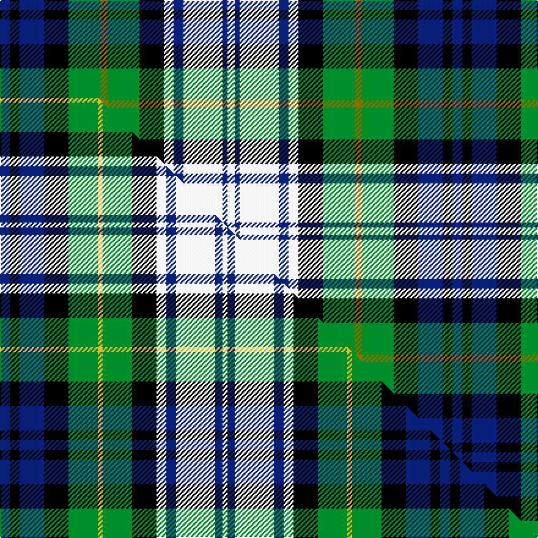

This page is one **sett** — a single exact thread-count. It belongs to the [tartan](/setts/db4k4db10k10g13y3g13k10w4db4w16db2w3/)
(the same proportion at any scale), whose colour order is pattern [BKBKGGGKWBWBW](/stripes/bkbkgggkwbwbw/).

Part of the [Gordon Dress](/tartans/gordon-dress/) tartan — the named design grouping this sett with its other cloths.

Sourced from register-of-tartans.  It is a [13 stripe tartan](/stripes/stripes13/).

Original link https://www.tartanregister.gov.uk/tartanDetails.aspx?ref=1454

## Provenance

Earliest known date: pre 2003 No source given

2 attestations — the source records this cloth was collapsed from (oldest owns this page)

<ul>
<li>undated — Gordon Dress (register-of-tartans, <a href="https://www.tartanregister.gov.uk/tartanDetails.aspx?ref=1454">record</a>)  <em>None</em></li>
<li>undated — Gordon Dress Tartan (house-of-tartan, <a href="http://www.house-of-tartan.scotland.net/house/TartanViewjs.asp?colr=Def&tnam=294">record</a>) </li>
</ul>

## Register references

External register numbers recorded for this tartan.

- Scottish Register of Tartans: [1454](https://www.tartanregister.gov.uk/tartanDetails.aspx?ref=1454)
- Scottish Tartans World Register: 294

## Thread count
DB/8 K8 DB20 K20 G26 Y6 G26 K20 W8 DB8 W32 DB4 W/6

One full sett is **370 threads**.

## Palette
<table><thead><tr><th>Colour</th><th>Shade</th><th>OKLCh</th></tr></thead><tbody><tr><td>DB</td><td><code style="background-color:#082077;">#082077</code> <small style="color:#888">#082077</small></td><td><small style="color:#888">oklch(30.0% 0.149 265.1)</small></td></tr><tr><td>G</td><td><code style="background-color:#008B2A;">#008B2A</code> <small style="color:#888">#008B2A</small></td><td><small style="color:#888">oklch(55.4% 0.170 145.9)</small></td></tr><tr><td>K</td><td><code style="background-color:#000000;">#000000</code> <small style="color:#888">#000000</small></td><td><small style="color:#888">oklch(0.0% 0.000 0.0)</small></td></tr><tr><td>W</td><td><code style="background-color:#F7F7F7;">#F7F7F7</code> <small style="color:#888">#F7F7F7</small></td><td><small style="color:#888">oklch(97.6% 0.000 89.9)</small></td></tr><tr><td>Y</td><td><code style="background-color:#8B6E00;">#8B6E00</code> <small style="color:#888">#8B6E00</small></td><td><small style="color:#888">oklch(55.1% 0.113 90.4)</small></td></tr></tbody></table>

# Sample pattern

## Compared to the master

This cloth is one sett of its design; the master sett (the exemplar the design is anchored on) is below for comparison.

Its **ΔTartan distance** from the master is **0.16** — the same measure the nearest-tartans table ranks by (0 is identical; a re-scale of the same cloth is near 0, a recolour or a different proportion further).

<figure class="master-compare" style="margin:0">

this sett
master sett ★

<figcaption style="color:#888;font-size:smaller">One weave of this sett against the <a href="/setts/db4k4db10k10g12ly2g12k10w4db4w16db3w2/">master sett ★</a>, split on the diagonal: a shared proportion runs seamlessly across it with only the shades shifting; a different proportion breaks on it.</figcaption>
</figure>

## Nearest tartan variants

The nearest existing variants by ΔTartan distance, with this cloth at the top so the swatches line up against it.

ΔTartan

Threads

Variant

Sett

—

370

<a href="/variants/s13/db4k4db10k10g13y3g13k10w4db4w16db2w3~x2/">Gordon Dress</a>

<a href="/ttd/edit/#slug=db4k4db10k10g12ly2g12k10w4db4w16db3w2~x2&amp;base=db4k4db10k10g13y3g13k10w4db4w16db2w3~x2" title="compare in the TTD">0.12</a>

360

<a href="/variants/s13/db4k4db10k10g12ly2g12k10w4db4w16db3w2~x2/">Gordon Dress (1965)</a>

<a href="/ttd/edit/#slug=b1k1b3k3dg4k1dg4k3w1b1w6b1w1~x4&amp;base=db4k4db10k10g13y3g13k10w4db4w16db2w3~x2" title="compare in the TTD">1.46</a>

232

<a href="/variants/s13/b1k1b3k3dg4k1dg4k3w1b1w6b1w1~x4/">Black Watch Dress (Fashion)</a>

<a href="/ttd/edit/#slug=w3k2w15db3w3k7g8k2g8k7db8k1db2~x2&amp;base=db4k4db10k10g13y3g13k10w4db4w16db2w3~x2" title="compare in the TTD">2.50</a>

266

<a href="/variants/s13/w3k2w15db3w3k7g8k2g8k7db8k1db2~x2/">Campbell, 42nd dress</a>

<a href="/ttd/edit/#slug=w20k3w3k3w3k16g17y5g17k16db16k3db3~x2&amp;base=db4k4db10k10g13y3g13k10w4db4w16db2w3~x2" title="compare in the TTD">2.59</a>

454

<a href="/variants/s13/w20k3w3k3w3k16g17y5g17k16db16k3db3~x2/">Gordon Dress #2</a>

<a href="/ttd/edit/#slug=w5db1w16db4w4k6g10dr2g10k6db10dr2~x2&amp;base=db4k4db10k10g13y3g13k10w4db4w16db2w3~x2" title="compare in the TTD">2.94</a>

290

<a href="/variants/s12/w5db1w16db4w4k6g10dr2g10k6db10dr2~x2/">Murray of Atholl Dress</a>

## Neighbour map

Every grey dot is one of 13620 variants placed by the first two principal components of the ΔTartan feature space (42% of its variance). Red is this tartan; blue dots are its nearest — click one to open its page.

<svg viewBox="0 0 640 380" role="img" style="max-width:100%;height:auto;border:1px solid #e0e0e0;border-radius:4px;display:block" xmlns="http://www.w3.org/2000/svg"><image href="/nn/cloud.v1.png" width="640" height="380"/><a href="/variants/s13/db4k4db10k10g12ly2g12k10w4db4w16db3w2~x2/"><circle cx="26.8" cy="180.0" r="4" fill="#3465a4"><title>Gordon Dress (1965)</title></circle></a><a href="/variants/s13/b1k1b3k3dg4k1dg4k3w1b1w6b1w1~x4/"><circle cx="46.1" cy="193.8" r="4" fill="#3465a4"><title>Black Watch Dress (Fashion)</title></circle></a><a href="/variants/s13/w3k2w15db3w3k7g8k2g8k7db8k1db2~x2/"><circle cx="85.4" cy="157.2" r="4" fill="#3465a4"><title>Campbell, 42nd dress</title></circle></a><a href="/variants/s13/w20k3w3k3w3k16g17y5g17k16db16k3db3~x2/"><circle cx="51.3" cy="173.8" r="4" fill="#3465a4"><title>Gordon Dress #2</title></circle></a><a href="/variants/s12/w5db1w16db4w4k6g10dr2g10k6db10dr2~x2/"><circle cx="75.7" cy="151.9" r="4" fill="#3465a4"><title>Murray of Atholl Dress</title></circle></a><circle cx="28.2" cy="180.0" r="5" fill="#c00000"/><text x="320" y="376" text-anchor="middle" font-size="11" fill="#999">ground</text><text x="11" y="190" text-anchor="middle" font-size="11" fill="#999" transform="rotate(-90 11 190)">complexity</text></svg>

ID: /variants/s13/db4k4db10k10g13y3g13k10w4db4w16db2w3~x2/
