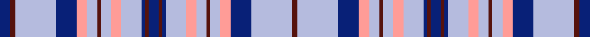

This is one **variant** — a specific cloth: this exact thread count and colourway, with its own
provenance below. It is one weaving of the [sett](/tartans/i/il/illinois-state/) (the scale-free proportion — the
same cloth at any scale or shade), whose colour order is pattern [BBBWYWBWYBWBB](/stripes/bbbwywbwybwbb/).

Part of the [Illinois State](/tartans/i/il/illinois-state/) tartan — the named design grouping this sett with its other cloths.

Sourced from register-of-tartans.  It is a [13 stripe tartan](/stripes/stripes13/).

Original link [https://www.tartanregister.gov.uk/tartanDetails.aspx?ref=1817](https://www.tartanregister.gov.uk/tartanDetails.aspx?ref=1817)

2 attestations — the source records this cloth was collapsed from (oldest owns this page)

<ul>
<li>01/01/1990 — Illinois St.Andrews Society (register-of-tartans, <a href="https://www.tartanregister.gov.uk/tartanDetails.aspx?ref=1817">record</a>)  <em>Designed by Frances Gillan of or for, the Illinois St. Andrews Society - a philanthropic body founded by Scots in 1854. The tartan was designed to mark the 150th anniversary in 1990. The colours represent the State of Illinois Flag, the Chicago sports teams and the St Andrew's flag. Sample in Scottish Tartans Authority's Johnston Collection. Sometimes regarded as the State tartan but it has never been adopted as such.</em></li>
<li>1990 — Illinois State (District) (tartans-authority, <a href="https://web.archive.org/web/*/http://www.tartansauthority.com/tartan-ferret/display/2051/*">record</a>)  <em>Designed by Frances Gillan of or for, the Illinois St. Andrews Society - a philanthropic body founded by Scots in 1854. The tartan was designed to mark the 150th anniversary in 1990. The colours represent the State of Illinois Flag, the Chicago sports teams and the St Andrew's flag. Sample in STA's Johnston Collection. Sometimes regarded as the State tartan but it has never been adopted as such. JUNE 2012 - SEE BELOW Accepted as the Illinois State Tartan in June 2012 through House Bill 4492 in the Illinois Senate where it was unanimous (44 - 0). The final step will be the signing in summer 2012 by State Governor Quinn.</em></li>
</ul>

Dataset <small>— provenance for this record, inherited from the source manifest</small>

<dl class="dataset-prov">
<dt>source</dt><dd><a href="/sources/register-of-tartans/">Scottish Register of Tartans</a></dd>
<dt>data captured from</dt><dd><a href="https://github.com/thetartan/tartan-database/blob/master/data/register-of-tartans/data.csv">https://github.com/thetartan/tartan-database/blob/master/data/register-of-tartans/data.csv</a></dd>
<dt>data date</dt><dd>1990 <small>(this record)</small></dd>
<dt>licence</dt><dd><a href="https://www.tartanregister.gov.uk/copyright">Crown copyright</a></dd>
</dl>

Capture chain <small>— the hands this data passed through, oldest first; each capture carries its own licence</small>

<ol class="capture-chain">
<li><a href="https://www.tartanregister.gov.uk/">Scottish Register of Tartans</a> · <a href="https://www.tartanregister.gov.uk/copyright">Crown copyright</a> <small>the living register — still published by National Records of Scotland</small></li>
<li><a href="https://github.com/thetartan/tartan-database">thetartan/tartan-database</a> <small>2016-2017</small> · <a href="https://creativecommons.org/licenses/by-nc-nd/4.0/">CC BY-NC-ND 4.0</a> <small>Levko Kravets's frozen compilation — the capture we vendored, and where its CC licence text came from</small></li>
<li>this dictionary <small>captured 2026-06-10 · commit 5bf86c7566</small> <small>each re-capture is a git commit to data/sources</small></li>
</ol>

## Register references

External register numbers recorded for this tartan.

- Scottish Register of Tartans: [1817](https://www.tartanregister.gov.uk/tartanDetails.aspx?ref=1817)
- Scottish Tartans Authority (ITI): 2051
- Scottish Tartans World Register: 2051

## Thread count
DB/12 DR6 LB48 DB24 LR12 LB12 DR4 LB12 LR12 LB24 DB4 DR4 DB/12

One full sett is **348 threads**.

The source recorded this cloth as DB/12 DR6 LB48 DB24 LR12 LB12 DR4 LB12 LR12 LB24 DB4 DR4 DB12 DR4 DB4 LB24 LR12 LB12 DR4 LB12 LR12 DB24 LB48 DR/6 — 678 threads; it folds to the canonical 348-thread sett above.

## Palette
<table><thead><tr><th>Colour</th><th>Shade</th><th>OKLCh</th></tr></thead><tbody><tr><td>LB</td><td><code style="background-color:#B5BBDE;">#B5BBDE</code> <small style="color:#888">#B5BBDE</small></td><td><small style="color:#888">oklch(79.9% 0.050 277.6)</small></td></tr><tr><td>DB</td><td><code style="background-color:#082077;">#082077</code> <small style="color:#888">#082077</small></td><td><small style="color:#888">oklch(30.0% 0.149 265.1)</small></td></tr><tr><td>DR</td><td><code style="background-color:#55120C;">#55120C</code> <small style="color:#888">#55120C</small></td><td><small style="color:#888">oklch(30.0% 0.099 29.3)</small></td></tr><tr><td>G</td><td><code style="background-color:#008B2A;">#008B2A</code> <small style="color:#888">#008B2A</small></td><td><small style="color:#888">oklch(55.4% 0.170 145.9)</small></td></tr><tr><td>LR</td><td><code style="background-color:#FF9C97;">#FF9C97</code> <small style="color:#888">#FF9C97</small></td><td><small style="color:#888">oklch(79.3% 0.119 23.2)</small></td></tr></tbody></table>

# Sample pattern

## Nearest tartan variants

The nearest existing variants by ΔTartan distance, with this cloth at the top so the swatches line up against it.

ΔTartan

Threads

Variant

Sett

—

678

<a href="/variants/s13/db6dr3lb24db12lr6lb6dr2lb6lr6lb12db2dr2db6~x2/">Illinois St.Andrews Society</a>

<a href="/ttd/edit/#slug=lb6ly2lb24w4lb4dr2db16lb20w4lb20db16w16db3w4~x2&amp;base=db6dr3lb24db12lr6lb6dr2lb6lr6lb12db2dr2db6~x2" title="compare in the TTD">3.34</a>

544

<a href="/variants/s14/lb6ly2lb24w4lb4dr2db16lb20w4lb20db16w16db3w4~x2/">MacHinery Dress (Fashion)</a>

<a href="/ttd/edit/#slug=w5lb1dp1w10lb2w1dp4w10g8lb2w1dp3~x2~dp1607327&amp;base=db6dr3lb24db12lr6lb6dr2lb6lr6lb12db2dr2db6~x2" title="compare in the TTD">3.79</a>

176

<a href="/variants/s12/w5lb1dp1w10lb2w1dp4w10g8lb2w1dp3~x2~dp1607327/">Unidentified Scarlett #2</a>

<a href="/ttd/edit/#slug=db7w3db2w6db16lb26dr4~x2~db1404245&amp;base=db6dr3lb24db12lr6lb6dr2lb6lr6lb12db2dr2db6~x2" title="compare in the TTD">3.90</a>

234

<a href="/variants/s7/db7w3db2w6db16lb26dr4~x2~db1404245/">Keela</a>

## Neighbour map

Every grey dot is one of 13656 variants placed by the first two principal components of the ΔTartan feature space (42% of its variance). Red is this tartan; blue dots are its nearest — click one to open its page. The map is a flat projection of a many-dimensional space — [how to read it](/posts/neighbourhood-maps/).

<svg viewBox="0 0 640 380" role="img" style="max-width:100%;height:auto;border:1px solid #e0e0e0;border-radius:4px;display:block" xmlns="http://www.w3.org/2000/svg"><image href="/nn/cloud.v1.png" width="640" height="380"/><a href="/variants/s14/lb6ly2lb24w4lb4dr2db16lb20w4lb20db16w16db3w4~x2/"><circle cx="271.8" cy="192.6" r="4" fill="#3465a4"><title>MacHinery Dress (Fashion)</title></circle></a><a href="/variants/s12/w5lb1dp1w10lb2w1dp4w10g8lb2w1dp3~x2~dp1607327/"><circle cx="275.1" cy="177.0" r="4" fill="#3465a4"><title>Unidentified Scarlett #2</title></circle></a><a href="/variants/s7/db7w3db2w6db16lb26dr4~x2~db1404245/"><circle cx="275.7" cy="204.8" r="4" fill="#3465a4"><title>Keela</title></circle></a><circle cx="296.1" cy="177.4" r="5" fill="#c00000"/><text x="320" y="376" text-anchor="middle" font-size="11" fill="#999">ground</text><text x="11" y="190" text-anchor="middle" font-size="11" fill="#999" transform="rotate(-90 11 190)">complexity</text></svg>

ID: /variants/s13/db6dr3lb24db12lr6lb6dr2lb6lr6lb12db2dr2db6~x2/
