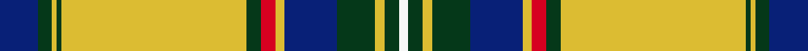

This page is one **sett** — a single exact thread-count. It belongs to the [tartan](/setts/db8dg3ly1dg1ly39dg3r3ly2db11dg8ly2dg3w2/)
(the same proportion at any scale), whose colour order is pattern [BGYGYGRYBGYGW](/stripes/bgygygrybgygw/).

Sourced from register-of-tartans.  It is a [13 stripe tartan](/stripes/stripes13/).

Original link https://www.tartanregister.gov.uk/tartanDetails.aspx?ref=10425

## Register references

External register numbers recorded for this tartan.

- Scottish Register of Tartans: [10425](https://www.tartanregister.gov.uk/tartanDetails.aspx?ref=10425)

## Thread count
DB/16 DG6 LY2 DG2 LY78 DG6 R6 LY4 DB22 DG16 LY4 DG6 W/4

One full sett is **324 threads**.

## Palette
<table><thead><tr><th>Colour</th><th>Shade</th><th>OKLCh</th></tr></thead><tbody><tr><td>R</td><td><code style="background-color:#D60020;">#D60020</code> <small style="color:#888">#D60020</small></td><td><small style="color:#888">oklch(55.2% 0.224 25.5)</small></td></tr><tr><td>LY</td><td><code style="background-color:#DCBC32;">#DCBC32</code> <small style="color:#888">#DCBC32</small></td><td><small style="color:#888">oklch(80.0% 0.150 95.2)</small></td></tr><tr><td>DB</td><td><code style="background-color:#082077;">#082077</code> <small style="color:#888">#082077</small></td><td><small style="color:#888">oklch(30.0% 0.149 265.1)</small></td></tr><tr><td>DG</td><td><code style="background-color:#053819;">#053819</code> <small style="color:#888">#053819</small></td><td><small style="color:#888">oklch(30.0% 0.075 151.3)</small></td></tr><tr><td>W</td><td><code style="background-color:#F7F7F7;">#F7F7F7</code> <small style="color:#888">#F7F7F7</small></td><td><small style="color:#888">oklch(97.6% 0.000 89.9)</small></td></tr></tbody></table>

# Sample pattern

ID: /variants/s13/db8dg3ly1dg1ly39dg3r3ly2db11dg8ly2dg3w2~x2/
