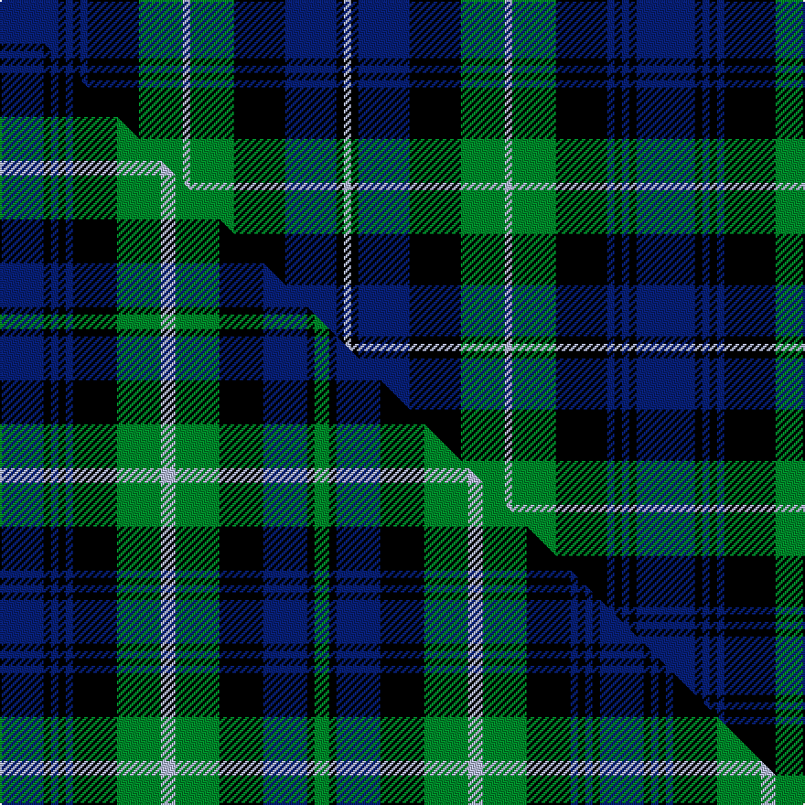

This page is one **sett** — a single exact thread-count. It belongs to the [tartan](/setts/db8k1db1k1db1k7g6lb1g6k7db7k1lb1/)
(the same proportion at any scale), whose colour order is pattern [BKBKBKGWGKBKW](/stripes/bkbkbkgwgkbkw/).

Part of the [Cheape of Torosay](/tartans/cheape-of-torosay/) tartan — the named design grouping this sett with its other cloths.

Sourced from tartans-authority.  It is a [13 stripe tartan](/stripes/stripes13/).

Original link http://www.tartansauthority.com/tartan-ferret/display/4498/

## Register references

External register numbers recorded for this tartan.

- Scottish Tartans Authority (ITI): 4498

## Thread count
DB/32 K4 DB4 K4 DB4 K28 G24 LB4 G24 K28 DB28 K4 LB/4

One full sett is **348 threads**.

## Palette
<table><thead><tr><th>Colour</th><th>Shade</th><th>OKLCh</th></tr></thead><tbody><tr><td>DB</td><td><code style="background-color:#082077;">#082077</code> <small style="color:#888">#082077</small></td><td><small style="color:#888">oklch(30.0% 0.149 265.1)</small></td></tr><tr><td>G</td><td><code style="background-color:#008B2A;">#008B2A</code> <small style="color:#888">#008B2A</small></td><td><small style="color:#888">oklch(55.4% 0.170 145.9)</small></td></tr><tr><td>K</td><td><code style="background-color:#000000;">#000000</code> <small style="color:#888">#000000</small></td><td><small style="color:#888">oklch(0.0% 0.000 0.0)</small></td></tr><tr><td>LB</td><td><code style="background-color:#B5BBDE;">#B5BBDE</code> <small style="color:#888">#B5BBDE</small></td><td><small style="color:#888">oklch(79.9% 0.050 277.6)</small></td></tr></tbody></table>

# Sample pattern

## Compared to the master

This cloth is one sett of its design; the master sett (the exemplar the design is anchored on) is below for comparison.

Its **ΔTartan distance** from the master is **1.21** — the same measure the nearest-tartans table ranks by (0 is identical; a re-scale of the same cloth is near 0, a recolour or a different proportion further).

<figure class="master-compare" style="margin:0">

this sett
master sett ★

<figcaption style="color:#888;font-size:smaller">One weave of this sett against the <a href="/setts/db6k1db1k1db1k6g6lb2g6k6db6k1g2/">master sett ★</a>, split on the diagonal: a shared proportion runs seamlessly across it with only the shades shifting; a different proportion breaks on it.</figcaption>
</figure>

## Nearest tartan variants

The nearest existing variants by ΔTartan distance, with this cloth at the top so the swatches line up against it.

ΔTartan

Threads

Variant

Sett

—

348

<a href="/variants/s13/db8k1db1k1db1k7g6lb1g6k7db7k1lb1~x4/">Cheape of Torosay (Personal)</a>

<a href="/ttd/edit/#slug=db9k1db1k1db1k7g8y2g8k7db8k1r2~x2&amp;base=db8k1db1k1db1k7g6lb1g6k7db7k1lb1~x4" title="compare in the TTD">0.81</a>

202

<a href="/variants/s13/db9k1db1k1db1k7g8y2g8k7db8k1r2~x2/">MacLeod of Gesto</a>

<a href="/ttd/edit/#slug=g4k1g1k1g1k8db8r1db8k8g8k1g1~x8&amp;base=db8k1db1k1db1k7g6lb1g6k7db7k1lb1~x4" title="compare in the TTD">1.00</a>

776

<a href="/variants/s13/g4k1g1k1g1k8db8r1db8k8g8k1g1~x8/">Urquhart</a>

<a href="/ttd/edit/#slug=db5k1db1k1db1k4g5y1g5k4db6k1~x4&amp;base=db8k1db1k1db1k7g6lb1g6k7db7k1lb1~x4" title="compare in the TTD">1.00</a>

256

<a href="/variants/s12/db5k1db1k1db1k4g5y1g5k4db6k1~x4/">Gordon</a>

<a href="/ttd/edit/#slug=db12k2db2k2db2k12g12r3g12k12db12k1r3~x2&amp;base=db8k1db1k1db1k7g6lb1g6k7db7k1lb1~x4" title="compare in the TTD">1.07</a>

318

<a href="/variants/s13/db12k2db2k2db2k12g12r3g12k12db12k1r3~x2/">Murray of Atholl #3</a>

<a href="/ttd/edit/#slug=db12k2db2k2db2k12g12r3g12k12db12k1r3&amp;base=db8k1db1k1db1k7g6lb1g6k7db7k1lb1~x4" title="compare in the TTD">1.07</a>

159

<a href="/variants/s13/db12k2db2k2db2k12g12r3g12k12db12k1r3/">Murray of Atholl</a>

<a href="/ttd/edit/#slug=db2r1g8k2g2k2g2k8db2k2db2k2db8k1g2~x2&amp;base=db8k1db1k1db1k7g6lb1g6k7db7k1lb1~x4" title="compare in the TTD">1.08</a>

176

<a href="/variants/s15/db2r1g8k2g2k2g2k8db2k2db2k2db8k1g2~x2/">Lorne, Louise of</a>

<a href="/ttd/edit/#slug=db9k9g9k1w1k2w1k1g9k9db9k1g2~x4&amp;base=db8k1db1k1db1k7g6lb1g6k7db7k1lb1~x4" title="compare in the TTD">1.14</a>

460

<a href="/variants/s13/db9k9g9k1w1k2w1k1g9k9db9k1g2~x4/">Stephenson Hunting</a>

<a href="/ttd/edit/#slug=g8k1g1k1g1k8db8r1db8k8g8k1g1~x2&amp;base=db8k1db1k1db1k7g6lb1g6k7db7k1lb1~x4" title="compare in the TTD">1.16</a>

202

<a href="/variants/s13/g8k1g1k1g1k8db8r1db8k8g8k1g1~x2/">Urquhart L</a>

<a href="/ttd/edit/#slug=g8k1g1k1g1k8db8dr1db8k8g8k1g1~x2&amp;base=db8k1db1k1db1k7g6lb1g6k7db7k1lb1~x4" title="compare in the TTD">1.16</a>

202

<a href="/variants/s13/g8k1g1k1g1k8db8dr1db8k8g8k1g1~x2/">Urquhart (Logan)</a>

<a href="/ttd/edit/#slug=db1k1db6k6g6k1w1k1g6k6db6k1db1~x8&amp;base=db8k1db1k1db1k7g6lb1g6k7db7k1lb1~x4" title="compare in the TTD">1.18</a>

672

<a href="/variants/s13/db1k1db6k6g6k1w1k1g6k6db6k1db1~x8/">Forbes</a>

## Neighbour map

Every grey dot is one of 13620 variants placed by the first two principal components of the ΔTartan feature space (42% of its variance). Red is this tartan; blue dots are its nearest — click one to open its page.

<svg viewBox="0 0 640 380" role="img" style="max-width:100%;height:auto;border:1px solid #e0e0e0;border-radius:4px;display:block" xmlns="http://www.w3.org/2000/svg"><image href="/nn/cloud.v1.png" width="640" height="380"/><a href="/variants/s13/db9k1db1k1db1k7g8y2g8k7db8k1r2~x2/"><circle cx="107.5" cy="163.5" r="4" fill="#3465a4"><title>MacLeod of Gesto</title></circle></a><a href="/variants/s13/g4k1g1k1g1k8db8r1db8k8g8k1g1~x8/"><circle cx="147.2" cy="174.6" r="4" fill="#3465a4"><title>Urquhart</title></circle></a><a href="/variants/s12/db5k1db1k1db1k4g5y1g5k4db6k1~x4/"><circle cx="130.9" cy="206.6" r="4" fill="#3465a4"><title>Gordon</title></circle></a><a href="/variants/s13/db12k2db2k2db2k12g12r3g12k12db12k1r3~x2/"><circle cx="128.3" cy="167.8" r="4" fill="#3465a4"><title>Murray of Atholl #3</title></circle></a><a href="/variants/s13/db12k2db2k2db2k12g12r3g12k12db12k1r3/"><circle cx="128.3" cy="167.8" r="4" fill="#3465a4"><title>Murray of Atholl</title></circle></a><a href="/variants/s15/db2r1g8k2g2k2g2k8db2k2db2k2db8k1g2~x2/"><circle cx="139.2" cy="171.9" r="4" fill="#3465a4"><title>Lorne, Louise of</title></circle></a><a href="/variants/s13/db9k9g9k1w1k2w1k1g9k9db9k1g2~x4/"><circle cx="133.4" cy="172.9" r="4" fill="#3465a4"><title>Stephenson Hunting</title></circle></a><a href="/variants/s13/g8k1g1k1g1k8db8r1db8k8g8k1g1~x2/"><circle cx="135.3" cy="177.3" r="4" fill="#3465a4"><title>Urquhart L</title></circle></a><a href="/variants/s13/g8k1g1k1g1k8db8dr1db8k8g8k1g1~x2/"><circle cx="136.9" cy="178.1" r="4" fill="#3465a4"><title>Urquhart (Logan)</title></circle></a><a href="/variants/s13/db1k1db6k6g6k1w1k1g6k6db6k1db1~x8/"><circle cx="126.4" cy="192.2" r="4" fill="#3465a4"><title>Forbes</title></circle></a><circle cx="136.3" cy="180.4" r="5" fill="#c00000"/><text x="320" y="376" text-anchor="middle" font-size="11" fill="#999">ground</text><text x="11" y="190" text-anchor="middle" font-size="11" fill="#999" transform="rotate(-90 11 190)">complexity</text></svg>

ID: /variants/s13/db8k1db1k1db1k7g6lb1g6k7db7k1lb1~x4/
