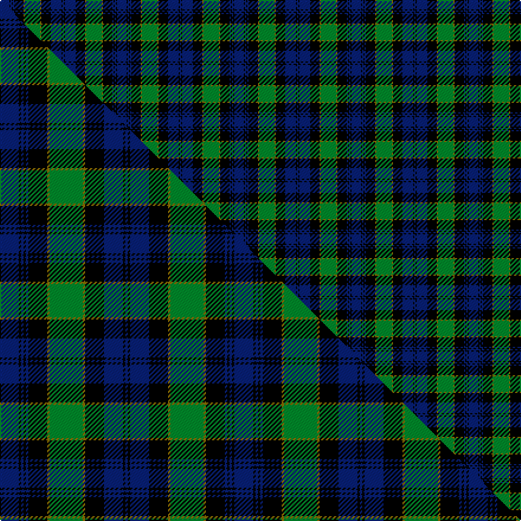

This is one **variant** — a specific cloth: this exact thread count and colourway, with its own
provenance below. It is one weaving of the [sett](/setts/db8k1db1k1db1k8y1g13y1k8db9k1db1/) (the scale-free proportion — the
same cloth at any scale or shade), whose colour order is pattern [BKBKBKGGGKBKB](/stripes/bkbkbkgggkbkb/).

Part of the [Breadalbane Fencibles](/tartans/breadalbane-fencibles/) tartan — the named design grouping this sett with its other cloths.

Sourced from weddslist.  It is a [13 stripe tartan](/stripes/stripes13/).

Original link [http://www.weddslist.com/cgi-bin/tartans/pg.pl?source=rb](http://www.weddslist.com/cgi-bin/tartans/pg.pl?source=rb)

Dataset <small>— provenance for this record, inherited from the source manifest</small>

<dl class="dataset-prov">
<dt>source</dt><dd><a href="/sources/weddslist/">Weddslist</a></dd>
<dt>data captured from</dt><dd><a href="https://github.com/thetartan/tartan-database/blob/master/data/weddslist/data.csv">https://github.com/thetartan/tartan-database/blob/master/data/weddslist/data.csv</a></dd>
<dt>data date</dt><dd>2016-11-17 <small>(dataset default)</small></dd>
<dt>licence</dt><dd><a href="https://creativecommons.org/licenses/by-nc-nd/4.0/">CC BY-NC-ND 4.0</a></dd>
</dl>

Capture chain <small>— the hands this data passed through, oldest first; each capture carries its own licence</small>

<ol class="capture-chain">
<li><a href="https://www.weddslist.com/tartans/">Weddslist</a> <small>the living privately compiled reference</small></li>
<li><a href="https://github.com/thetartan/tartan-database">thetartan/tartan-database</a> <small>2016-2017</small> · <a href="https://creativecommons.org/licenses/by-nc-nd/4.0/">CC BY-NC-ND 4.0</a> <small>Levko Kravets's frozen compilation — the capture we vendored, and where its CC licence text came from</small></li>
<li>this dictionary <small>captured 2026-06-10 · commit 5bf86c7566</small> <small>each re-capture is a git commit to data/sources</small></li>
</ol>

## Thread count
DB/8 K1 DB1 K1 DB1 K8 Y1 G13 Y1 K8 DB9 K1 DB/1

One full sett is **99 threads**.

## Palette
<table><thead><tr><th>Colour</th><th>Shade</th><th>OKLCh</th></tr></thead><tbody><tr><td>DB</td><td><code style="background-color:#082077;">#082077</code> <small style="color:#888">#082077</small></td><td><small style="color:#888">oklch(30.0% 0.149 265.1)</small></td></tr><tr><td>G</td><td><code style="background-color:#008B2A;">#008B2A</code> <small style="color:#888">#008B2A</small></td><td><small style="color:#888">oklch(55.4% 0.170 145.9)</small></td></tr><tr><td>K</td><td><code style="background-color:#000000;">#000000</code> <small style="color:#888">#000000</small></td><td><small style="color:#888">oklch(0.0% 0.000 0.0)</small></td></tr><tr><td>Y</td><td><code style="background-color:#8B6E00;">#8B6E00</code> <small style="color:#888">#8B6E00</small></td><td><small style="color:#888">oklch(55.1% 0.113 90.4)</small></td></tr></tbody></table>

# Sample pattern

## Compared to the master

This cloth is one sett of its design; the master sett (the exemplar the design is anchored on) is below for comparison.

Its **ΔTartan distance** from the master is **0.08** — the same measure the nearest-tartans table ranks by (0 is identical; a re-scale of the same cloth is near 0, a recolour or a different proportion further).

<figure class="master-compare" style="margin:0">

this sett
master sett ★

<figcaption style="color:#888;font-size:smaller">One weave of this sett against the <a href="/setts/db8k1db1k1db1k8y1g14y1k8db8k1db1/">master sett ★</a>, split on the diagonal: a shared proportion runs seamlessly across it with only the shades shifting; a different proportion breaks on it.</figcaption>
</figure>

## Nearest tartan variants

The nearest existing variants by ΔTartan distance, with this cloth at the top so the swatches line up against it.

ΔTartan

Threads

Variant

Sett

—

99

<a href="/variants/s13/db8k1db1k1db1k8y1g13y1k8db9k1db1/">Breadalbane Fencibles</a>

<a href="/ttd/edit/#slug=db8k1db1k1db1k8y1g14y1k8db8k1db1~x2&amp;base=db8k1db1k1db1k8y1g13y1k8db9k1db1" title="compare in the TTD">0.08</a>

198

<a href="/variants/s13/db8k1db1k1db1k8y1g14y1k8db8k1db1~x2/">Black from Cumnock (Personal)</a>

<a href="/ttd/edit/#slug=db8k1db1k1db1k8y1g14y1k8db8k1db1&amp;base=db8k1db1k1db1k8y1g13y1k8db9k1db1" title="compare in the TTD">0.08</a>

99

<a href="/variants/s13/db8k1db1k1db1k8y1g14y1k8db8k1db1/">Breadalbane Fencibles</a>

<a href="/ttd/edit/#slug=db26k4db4k4db4k27y5g47y5k27db25k4db4~x2&amp;base=db8k1db1k1db1k8y1g13y1k8db9k1db1" title="compare in the TTD">0.26</a>

684

<a href="/variants/s13/db26k4db4k4db4k27y5g47y5k27db25k4db4~x2/">Campbell of Breadalbane (Military)</a>

<a href="/ttd/edit/#slug=db8k1db1k1db1k8r1g14r1k8db9k1db1~x4&amp;base=db8k1db1k1db1k8y1g13y1k8db9k1db1" title="compare in the TTD">0.63</a>

404

<a href="/variants/s13/db8k1db1k1db1k8r1g14r1k8db9k1db1~x4/">Riddoch</a>

<a href="/ttd/edit/#slug=db8k1db1k1db1k8r1g14r1k8db8k1db1~x4&amp;base=db8k1db1k1db1k8y1g13y1k8db9k1db1" title="compare in the TTD">0.68</a>

396

<a href="/variants/s13/db8k1db1k1db1k8r1g14r1k8db8k1db1~x4/">Riddoch (Name)</a>

<a href="/ttd/edit/#slug=db4k2db2k2db2k14ly1g22ly1k14db12k2db2~x4&amp;base=db8k1db1k1db1k8y1g13y1k8db9k1db1" title="compare in the TTD">0.69</a>

616

<a href="/variants/s13/db4k2db2k2db2k14ly1g22ly1k14db12k2db2~x4/">Campbell of Breadalbane</a>

<a href="/ttd/edit/#slug=db20k2w2k2db2k10g3k2g20k2g3k10db8k2~x2&amp;base=db8k1db1k1db1k8y1g13y1k8db9k1db1" title="compare in the TTD">1.29</a>

308

<a href="/variants/s14/db20k2w2k2db2k10g3k2g20k2g3k10db8k2~x2/">Caithelyn (Personal)</a>

<a href="/ttd/edit/#slug=db56k6db6k6db6k44g44y4g5y8&amp;base=db8k1db1k1db1k8y1g13y1k8db9k1db1" title="compare in the TTD">1.37</a>

306

<a href="/variants/s10/db56k6db6k6db6k44g44y4g5y8/">Gordon #2</a>

<a href="/ttd/edit/#slug=g19k1g4k1g3k10db20y1k7y1db20k10y3g1~x2&amp;base=db8k1db1k1db1k8y1g13y1k8db9k1db1" title="compare in the TTD">1.57</a>

364

<a href="/variants/s14/g19k1g4k1g3k10db20y1k7y1db20k10y3g1~x2/">Hope-Vere/Weir #2</a>

<a href="/ttd/edit/#slug=k2db12k12g1t2g16t2g1k12db12k1~x4&amp;base=db8k1db1k1db1k8y1g13y1k8db9k1db1" title="compare in the TTD">1.58</a>

572

<a href="/variants/s11/k2db12k12g1t2g16t2g1k12db12k1~x4/">Graham</a>

## Neighbour map

Every grey dot is one of 13621 variants placed by the first two principal components of the ΔTartan feature space (42% of its variance). Red is this tartan; blue dots are its nearest — click one to open its page.

<svg viewBox="0 0 640 380" role="img" style="max-width:100%;height:auto;border:1px solid #e0e0e0;border-radius:4px;display:block" xmlns="http://www.w3.org/2000/svg"><image href="/nn/cloud.v1.png" width="640" height="380"/><a href="/variants/s13/db8k1db1k1db1k8y1g14y1k8db8k1db1~x2/"><circle cx="171.4" cy="142.8" r="4" fill="#3465a4"><title>Black from Cumnock (Personal)</title></circle></a><a href="/variants/s13/db8k1db1k1db1k8y1g14y1k8db8k1db1/"><circle cx="171.4" cy="142.8" r="4" fill="#3465a4"><title>Breadalbane Fencibles</title></circle></a><a href="/variants/s13/db26k4db4k4db4k27y5g47y5k27db25k4db4~x2/"><circle cx="159.5" cy="153.6" r="4" fill="#3465a4"><title>Campbell of Breadalbane (Military)</title></circle></a><a href="/variants/s13/db8k1db1k1db1k8r1g14r1k8db9k1db1~x4/"><circle cx="171.4" cy="139.1" r="4" fill="#3465a4"><title>Riddoch</title></circle></a><a href="/variants/s13/db8k1db1k1db1k8r1g14r1k8db8k1db1~x4/"><circle cx="166.7" cy="139.2" r="4" fill="#3465a4"><title>Riddoch (Name)</title></circle></a><a href="/variants/s13/db4k2db2k2db2k14ly1g22ly1k14db12k2db2~x4/"><circle cx="209.6" cy="119.7" r="4" fill="#3465a4"><title>Campbell of Breadalbane</title></circle></a><a href="/variants/s14/db20k2w2k2db2k10g3k2g20k2g3k10db8k2~x2/"><circle cx="146.9" cy="151.5" r="4" fill="#3465a4"><title>Caithelyn (Personal)</title></circle></a><a href="/variants/s10/db56k6db6k6db6k44g44y4g5y8/"><circle cx="179.6" cy="150.8" r="4" fill="#3465a4"><title>Gordon #2</title></circle></a><a href="/variants/s14/g19k1g4k1g3k10db20y1k7y1db20k10y3g1~x2/"><circle cx="191.9" cy="128.4" r="4" fill="#3465a4"><title>Hope-Vere/Weir #2</title></circle></a><a href="/variants/s11/k2db12k12g1t2g16t2g1k12db12k1~x4/"><circle cx="165.0" cy="152.0" r="4" fill="#3465a4"><title>Graham</title></circle></a><circle cx="176.4" cy="146.9" r="5" fill="#c00000"/><text x="320" y="376" text-anchor="middle" font-size="11" fill="#999">ground</text><text x="11" y="190" text-anchor="middle" font-size="11" fill="#999" transform="rotate(-90 11 190)">complexity</text></svg>

ID: /variants/s13/db8k1db1k1db1k8y1g13y1k8db9k1db1/
