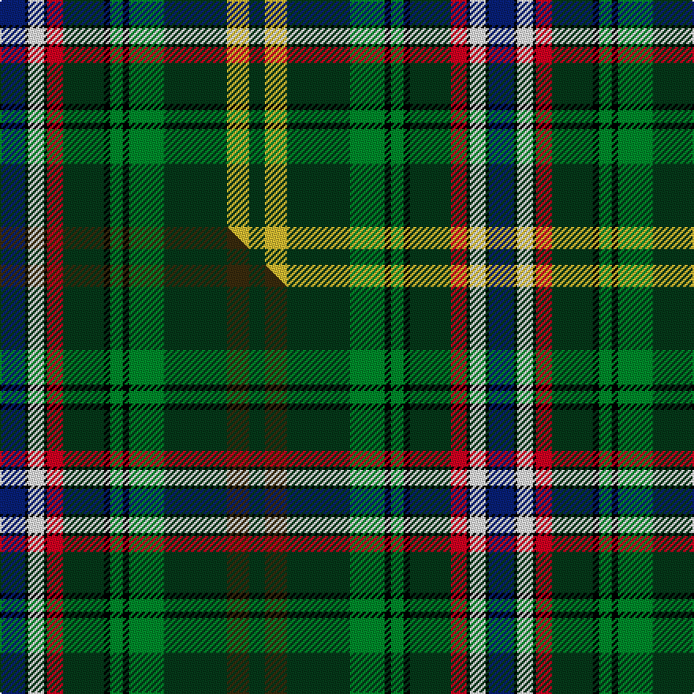

This is one **variant** — a specific cloth: this exact thread count and colourway, with its own
provenance below. It is one weaving of the [sett](/setts/db8k1w5k1r5dg13k2g4k2g11dg20ly7dg5/) (the scale-free proportion — the
same cloth at any scale or shade), whose colour order is pattern [BKWKRGKGKGGYG](/stripes/bkwkrgkgkggyg/).

Part of the [Wild Geese](/tartans/wild-geese/) tartan — the named design grouping this sett with its other cloths.

Sourced from tartans-authority.  It is a [13 stripe tartan](/stripes/stripes13/).

Original link [https://www.tartanregister.gov.uk/tartanDetails.aspx?ref=7400](https://www.tartanregister.gov.uk/tartanDetails.aspx?ref=7400)

Dataset <small>— provenance for this record, inherited from the source manifest</small>

<dl class="dataset-prov">
<dt>source</dt><dd><a href="/sources/tartans-authority/">Scottish Tartans Authority</a></dd>
<dt>data captured from</dt><dd><a href="https://github.com/thetartan/tartan-database/blob/master/data/tartans-authority/data.csv">https://github.com/thetartan/tartan-database/blob/master/data/tartans-authority/data.csv</a></dd>
<dt>data date</dt><dd>pre 2007 <small>(this record)</small></dd>
<dt>licence</dt><dd><a href="https://creativecommons.org/licenses/by-nc-nd/4.0/">CC BY-NC-ND 4.0</a></dd>
</dl>

Capture chain <small>— the hands this data passed through, oldest first; each capture carries its own licence</small>

<ol class="capture-chain">
<li><a href="https://www.tartansauthority.com/">Scottish Tartans Authority</a> <small>the heritage body's archive — its tartan-ferret record browser is retired (links repaired to the SRT, above)</small></li>
<li><a href="https://github.com/thetartan/tartan-database">thetartan/tartan-database</a> <small>2016-2017</small> · <a href="https://creativecommons.org/licenses/by-nc-nd/4.0/">CC BY-NC-ND 4.0</a> <small>Levko Kravets's frozen compilation — the capture we vendored, and where its CC licence text came from</small></li>
<li>this dictionary <small>captured 2026-06-10 · commit 5bf86c7566</small> <small>each re-capture is a git commit to data/sources</small></li>
</ol>

## Register references

External register numbers recorded for this tartan.

- Scottish Tartans Authority (ITI): 7400

## Thread count
DB/16 K2 W10 K2 R10 DG26 K4 G8 K4 G22 DG40 LY14 DG/10

One full sett is **310 threads**.

## Palette
<table><thead><tr><th>Colour</th><th>Shade</th><th>OKLCh</th></tr></thead><tbody><tr><td>DB</td><td><code style="background-color:#082077;">#082077</code> <small style="color:#888">#082077</small></td><td><small style="color:#888">oklch(30.0% 0.149 265.1)</small></td></tr><tr><td>DG</td><td><code style="background-color:#053819;">#053819</code> <small style="color:#888">#053819</small></td><td><small style="color:#888">oklch(30.0% 0.075 151.3)</small></td></tr><tr><td>LY</td><td><code style="background-color:#DCBC32;">#DCBC32</code> <small style="color:#888">#DCBC32</small></td><td><small style="color:#888">oklch(80.0% 0.150 95.2)</small></td></tr><tr><td>G</td><td><code style="background-color:#008B2A;">#008B2A</code> <small style="color:#888">#008B2A</small></td><td><small style="color:#888">oklch(55.4% 0.170 145.9)</small></td></tr><tr><td>K</td><td><code style="background-color:#000000;">#000000</code> <small style="color:#888">#000000</small></td><td><small style="color:#888">oklch(0.0% 0.000 0.0)</small></td></tr><tr><td>W</td><td><code style="background-color:#F7F7F7;">#F7F7F7</code> <small style="color:#888">#F7F7F7</small></td><td><small style="color:#888">oklch(97.6% 0.000 89.9)</small></td></tr><tr><td>R</td><td><code style="background-color:#D60020;">#D60020</code> <small style="color:#888">#D60020</small></td><td><small style="color:#888">oklch(55.2% 0.224 25.5)</small></td></tr></tbody></table>

# Sample pattern

## Compared to the master

This cloth is one sett of its design; the master sett (the exemplar the design is anchored on) is below for comparison.

Its **ΔTartan distance** from the master is **0.09** — the same measure the nearest-tartans table ranks by (0 is identical; a re-scale of the same cloth is near 0, a recolour or a different proportion further).

<figure class="master-compare" style="margin:0">

this sett
master sett ★

<figcaption style="color:#888;font-size:smaller">One weave of this sett against the <a href="/setts/db8k1w5k1r5dg13k2g4k2g11dg20dy7dg5/">master sett ★</a>, split on the diagonal: a shared proportion runs seamlessly across it with only the shades shifting; a different proportion breaks on it.</figcaption>
</figure>

## Nearest tartan variants

The nearest existing variants by ΔTartan distance, with this cloth at the top so the swatches line up against it.

ΔTartan

Threads

Variant

Sett

—

310

<a href="/variants/s13/db8k1w5k1r5dg13k2g4k2g11dg20ly7dg5~x2/">Wild Geese (Corporate)</a>

<a href="/ttd/edit/#slug=db8k1w5k1r5dg13k2g4k2g11dg20dy7dg5~x2&amp;base=db8k1w5k1r5dg13k2g4k2g11dg20ly7dg5~x2" title="compare in the TTD">0.09</a>

310

<a href="/variants/s13/db8k1w5k1r5dg13k2g4k2g11dg20dy7dg5~x2/">Wild Geese</a>

<a href="/ttd/edit/#slug=k8dy4ly1db13dy13g29w2g29dy13db13ly1dy4k3~x2~db1406275-w3600000&amp;base=db8k1w5k1r5dg13k2g4k2g11dg20ly7dg5~x2" title="compare in the TTD">2.39</a>

510

<a href="/variants/s13/k8dy4ly1db13dy13g29w2g29dy13db13ly1dy4k3~x2~db1406275-w3600000/">Teviotdale District Tartan</a>

<a href="/ttd/edit/#slug=k14r2k2r2k2g18r2g18w1db12lb1r8~x2&amp;base=db8k1w5k1r5dg13k2g4k2g11dg20ly7dg5~x2" title="compare in the TTD">2.42</a>

284

<a href="/variants/s12/k14r2k2r2k2g18r2g18w1db12lb1r8~x2/">Princess Diana</a>

<a href="/ttd/edit/#slug=dy8k3dr6k2g20db4g2db4g5lb4db3w3~x2&amp;base=db8k1w5k1r5dg13k2g4k2g11dg20ly7dg5~x2" title="compare in the TTD">2.58</a>

234

<a href="/variants/s12/dy8k3dr6k2g20db4g2db4g5lb4db3w3~x2/">Down County, Crest Range</a>

<a href="/ttd/edit/#slug=y4k1g10r2g10r4g10r2g10k16t28k1lb4~x2~t2503227-lb3103284&amp;base=db8k1w5k1r5dg13k2g4k2g11dg20ly7dg5~x2" title="compare in the TTD">2.68</a>

392

<a href="/variants/s13/y4k1g10r2g10r4g10r2g10k16t28k1lb4~x2~t2503227-lb3103284/">California State</a>

<a href="/ttd/edit/#slug=lo4k1g10r2g10r4g10r2g10k16t28k1lb4~x2~t2503227-lb3103284&amp;base=db8k1w5k1r5dg13k2g4k2g11dg20ly7dg5~x2" title="compare in the TTD">2.72</a>

392

<a href="/variants/s13/lo4k1g10r2g10r4g10r2g10k16t28k1lb4~x2~t2503227-lb3103284/">California State American District Tartan</a>

<a href="/ttd/edit/#slug=g32lb3dp3lb3g2k20b17dr3lo4~x2~lb3300000-b2603265&amp;base=db8k1w5k1r5dg13k2g4k2g11dg20ly7dg5~x2" title="compare in the TTD">2.82</a>

276

<a href="/variants/s9/g32lb3dp3lb3g2k20b17dr3lo4~x2~lb3300000-b2603265/">Colorado</a>

<a href="/ttd/edit/#slug=db17dp4db2k11g33y4g33k11db2dp4db17lb6~x2&amp;base=db8k1w5k1r5dg13k2g4k2g11dg20ly7dg5~x2" title="compare in the TTD">2.84</a>

530

<a href="/variants/s12/db17dp4db2k11g33y4g33k11db2dp4db17lb6~x2/">East Lothian (Fashion) Fashion Tartan</a>

<a href="/ttd/edit/#slug=ly8k3dr6k2g20db4g2db4g5lb4db3w3~x2&amp;base=db8k1w5k1r5dg13k2g4k2g11dg20ly7dg5~x2" title="compare in the TTD">2.86</a>

234

<a href="/variants/s12/ly8k3dr6k2g20db4g2db4g5lb4db3w3~x2/">Down County Crest (Fashion)</a>

<a href="/ttd/edit/#slug=w5db3g12db3lb5db3k13db3r5db3ly2k11db3g5db3g25w2&amp;base=db8k1w5k1r5dg13k2g4k2g11dg20ly7dg5~x2" title="compare in the TTD">2.86</a>

205

<a href="/variants/s17/w5db3g12db3lb5db3k13db3r5db3ly2k11db3g5db3g25w2/">Kumikyoku - Tone of Forest</a>

## Neighbour map

Every grey dot is one of 13621 variants placed by the first two principal components of the ΔTartan feature space (42% of its variance). Red is this tartan; blue dots are its nearest — click one to open its page.

<svg viewBox="0 0 640 380" role="img" style="max-width:100%;height:auto;border:1px solid #e0e0e0;border-radius:4px;display:block" xmlns="http://www.w3.org/2000/svg"><image href="/nn/cloud.v1.png" width="640" height="380"/><a href="/variants/s13/db8k1w5k1r5dg13k2g4k2g11dg20dy7dg5~x2/"><circle cx="144.3" cy="108.1" r="4" fill="#3465a4"><title>Wild Geese</title></circle></a><a href="/variants/s13/k8dy4ly1db13dy13g29w2g29dy13db13ly1dy4k3~x2~db1406275-w3600000/"><circle cx="170.8" cy="80.3" r="4" fill="#3465a4"><title>Teviotdale District Tartan</title></circle></a><a href="/variants/s12/k14r2k2r2k2g18r2g18w1db12lb1r8~x2/"><circle cx="145.5" cy="105.4" r="4" fill="#3465a4"><title>Princess Diana</title></circle></a><a href="/variants/s12/dy8k3dr6k2g20db4g2db4g5lb4db3w3~x2/"><circle cx="101.5" cy="130.4" r="4" fill="#3465a4"><title>Down County, Crest Range</title></circle></a><a href="/variants/s13/y4k1g10r2g10r4g10r2g10k16t28k1lb4~x2~t2503227-lb3103284/"><circle cx="149.5" cy="99.2" r="4" fill="#3465a4"><title>California State</title></circle></a><a href="/variants/s13/lo4k1g10r2g10r4g10r2g10k16t28k1lb4~x2~t2503227-lb3103284/"><circle cx="145.8" cy="97.6" r="4" fill="#3465a4"><title>California State American District Tartan</title></circle></a><a href="/variants/s9/g32lb3dp3lb3g2k20b17dr3lo4~x2~lb3300000-b2603265/"><circle cx="113.0" cy="107.8" r="4" fill="#3465a4"><title>Colorado</title></circle></a><a href="/variants/s12/db17dp4db2k11g33y4g33k11db2dp4db17lb6~x2/"><circle cx="164.8" cy="124.1" r="4" fill="#3465a4"><title>East Lothian (Fashion) Fashion Tartan</title></circle></a><a href="/variants/s12/ly8k3dr6k2g20db4g2db4g5lb4db3w3~x2/"><circle cx="91.9" cy="128.1" r="4" fill="#3465a4"><title>Down County Crest (Fashion)</title></circle></a><a href="/variants/s17/w5db3g12db3lb5db3k13db3r5db3ly2k11db3g5db3g25w2/"><circle cx="81.2" cy="99.8" r="4" fill="#3465a4"><title>Kumikyoku - Tone of Forest</title></circle></a><circle cx="126.5" cy="102.4" r="5" fill="#c00000"/><text x="320" y="376" text-anchor="middle" font-size="11" fill="#999">ground</text><text x="11" y="190" text-anchor="middle" font-size="11" fill="#999" transform="rotate(-90 11 190)">complexity</text></svg>

ID: /variants/s13/db8k1w5k1r5dg13k2g4k2g11dg20ly7dg5~x2/
