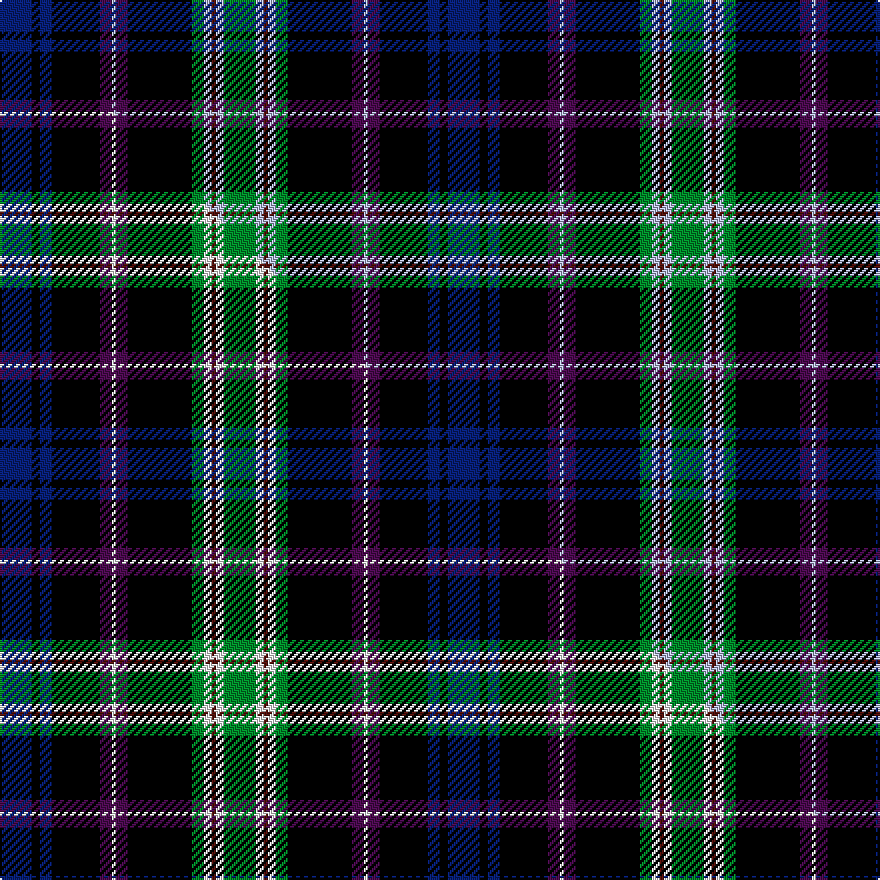

This page is one **sett** — a single exact thread-count. It belongs to the [tartan](/setts/db8k2db3k12dp3lb1dp3k16g3lb2dr1lb2g8/)
(the same proportion at any scale), whose colour order is pattern [BKBKBWBKGWBWG](/stripes/bkbkbwbkgwbwg/).

Part of the [MacKusick](/tartans/mackusick/) tartan — the named design grouping this sett with its other cloths.

Sourced from tartans-authority.  It is a [13 stripe tartan](/stripes/stripes13/).

Original link http://www.tartansauthority.com/tartan-ferret/display/2143/

## Register references

External register numbers recorded for this tartan.

- Scottish Tartans Authority (ITI): 2143

## Thread count
DB/16 K4 DB6 K24 DP6 LB2 DP6 K32 G6 LB4 DR2 LB4 G/16

One full sett is **224 threads**.

## Palette
<table><thead><tr><th>Colour</th><th>Shade</th><th>OKLCh</th></tr></thead><tbody><tr><td>DB</td><td><code style="background-color:#082077;">#082077</code> <small style="color:#888">#082077</small></td><td><small style="color:#888">oklch(30.0% 0.149 265.1)</small></td></tr><tr><td>DR</td><td><code style="background-color:#55120C;">#55120C</code> <small style="color:#888">#55120C</small></td><td><small style="color:#888">oklch(30.0% 0.099 29.3)</small></td></tr><tr><td>G</td><td><code style="background-color:#008B2A;">#008B2A</code> <small style="color:#888">#008B2A</small></td><td><small style="color:#888">oklch(55.4% 0.170 145.9)</small></td></tr><tr><td>K</td><td><code style="background-color:#000000;">#000000</code> <small style="color:#888">#000000</small></td><td><small style="color:#888">oklch(0.0% 0.000 0.0)</small></td></tr><tr><td>LB</td><td><code style="background-color:#B5BBDE;">#B5BBDE</code> <small style="color:#888">#B5BBDE</small></td><td><small style="color:#888">oklch(79.9% 0.050 277.6)</small></td></tr><tr><td>DP</td><td><code style="background-color:#4B0B4F;">#4B0B4F</code> <small style="color:#888">#4B0B4F</small></td><td><small style="color:#888">oklch(30.1% 0.125 325.4)</small></td></tr></tbody></table>

# Sample pattern

## Compared to the master

This cloth is one sett of its design; the master sett (the exemplar the design is anchored on) is below for comparison.

Its **ΔTartan distance** from the master is **0.90** — the same measure the nearest-tartans table ranks by (0 is identical; a re-scale of the same cloth is near 0, a recolour or a different proportion further).

<figure class="master-compare" style="margin:0">

this sett
master sett ★

<figcaption style="color:#888;font-size:smaller">One weave of this sett against the <a href="/setts/db8k2db3k12dp3w1dp3k16g3w2dr1w2g8/">master sett ★</a>, split on the diagonal: a shared proportion runs seamlessly across it with only the shades shifting; a different proportion breaks on it.</figcaption>
</figure>

## Nearest tartan variants

The nearest existing variants by ΔTartan distance, with this cloth at the top so the swatches line up against it.

ΔTartan

Threads

Variant

Sett

—

224

<a href="/variants/s13/db8k2db3k12dp3lb1dp3k16g3lb2dr1lb2g8~x2/">MacKusick (Name)</a>

<a href="/ttd/edit/#slug=db8k2db3k12dp3w1dp3k16g3w2dr1w2g8~x2~w4000000&amp;base=db8k2db3k12dp3lb1dp3k16g3lb2dr1lb2g8~x2" title="compare in the TTD">0.90</a>

224

<a href="/variants/s13/db8k2db3k12dp3w1dp3k16g3w2dr1w2g8~x2~w4000000/">MacKusick</a>

<a href="/ttd/edit/#slug=db8k2db3k12dp3w1dp3k16g3w2r1w2g8~x2&amp;base=db8k2db3k12dp3lb1dp3k16g3lb2dr1lb2g8~x2" title="compare in the TTD">0.90</a>

224

<a href="/variants/s13/db8k2db3k12dp3w1dp3k16g3w2r1w2g8~x2/">MacKusick Family Tartan of North America</a>

<a href="/ttd/edit/#slug=k7db20lb2r6lb2k20y3g20db27r3db6~x2&amp;base=db8k2db3k12dp3lb1dp3k16g3lb2dr1lb2g8~x2" title="compare in the TTD">2.01</a>

438

<a href="/variants/s11/k7db20lb2r6lb2k20y3g20db27r3db6~x2/">Stinson, Ancient</a>

<a href="/ttd/edit/#slug=db33r8k12dy2k4w4k4g12db8k4db4w2~x2&amp;base=db8k2db3k12dp3lb1dp3k16g3lb2dr1lb2g8~x2" title="compare in the TTD">2.02</a>

318

<a href="/variants/s12/db33r8k12dy2k4w4k4g12db8k4db4w2~x2/">MacLulich</a>

<a href="/ttd/edit/#slug=db33r8k12y2k4w4k4g12db8k4db4w2~x2&amp;base=db8k2db3k12dp3lb1dp3k16g3lb2dr1lb2g8~x2" title="compare in the TTD">2.04</a>

318

<a href="/variants/s12/db33r8k12y2k4w4k4g12db8k4db4w2~x2/">MacBeth/Stewart Brydone 1862</a>

<a href="/ttd/edit/#slug=db37r3k17r3g22k4g22r3k17r3db37w3~x2&amp;base=db8k2db3k12dp3lb1dp3k16g3lb2dr1lb2g8~x2" title="compare in the TTD">2.09</a>

604

<a href="/variants/s12/db37r3k17r3g22k4g22r3k17r3db37w3~x2/">Souza Nery (Personal)</a>

<a href="/ttd/edit/#slug=dy9k8dy30k4lb8k4db24k54dr14k4lr8~lb3103284-lr2800000&amp;base=db8k2db3k12dp3lb1dp3k16g3lb2dr1lb2g8~x2" title="compare in the TTD">2.22</a>

317

<a href="/variants/s11/dy9k8dy30k4lb8k4db24k54dr14k4lr8~lb3103284-lr2800000/">Dublin County, Crest Range</a>

<a href="/ttd/edit/#slug=k2dr1db9dr2k7db2dr6g6dr2k12lb1n1k1~x4&amp;base=db8k2db3k12dp3lb1dp3k16g3lb2dr1lb2g8~x2" title="compare in the TTD">2.24</a>

404

<a href="/variants/s13/k2dr1db9dr2k7db2dr6g6dr2k12lb1n1k1~x4/">Oban (District?)</a>

<a href="/ttd/edit/#slug=r4dg2y2dg24k2dg3k3dg3k10b10w2b4~x2&amp;base=db8k2db3k12dp3lb1dp3k16g3lb2dr1lb2g8~x2" title="compare in the TTD">2.27</a>

260

<a href="/variants/s12/r4dg2y2dg24k2dg3k3dg3k10b10w2b4~x2/">Kerby, from the Tennessee Cumberland Basin</a>

<a href="/ttd/edit/#slug=db4y2db24k2db5r3k14g14w3r3db3~x2&amp;base=db8k2db3k12dp3lb1dp3k16g3lb2dr1lb2g8~x2" title="compare in the TTD">2.27</a>

294

<a href="/variants/s11/db4y2db24k2db5r3k14g14w3r3db3~x2/">Czech National (District)</a>

## Neighbour map

Every grey dot is one of 13620 variants placed by the first two principal components of the ΔTartan feature space (42% of its variance). Red is this tartan; blue dots are its nearest — click one to open its page.

<svg viewBox="0 0 640 380" role="img" style="max-width:100%;height:auto;border:1px solid #e0e0e0;border-radius:4px;display:block" xmlns="http://www.w3.org/2000/svg"><image href="/nn/cloud.v1.png" width="640" height="380"/><a href="/variants/s13/db8k2db3k12dp3w1dp3k16g3w2dr1w2g8~x2~w4000000/"><circle cx="147.1" cy="108.6" r="4" fill="#3465a4"><title>MacKusick</title></circle></a><a href="/variants/s13/db8k2db3k12dp3w1dp3k16g3w2r1w2g8~x2/"><circle cx="147.1" cy="108.4" r="4" fill="#3465a4"><title>MacKusick Family Tartan of North America</title></circle></a><a href="/variants/s11/k7db20lb2r6lb2k20y3g20db27r3db6~x2/"><circle cx="156.9" cy="133.7" r="4" fill="#3465a4"><title>Stinson, Ancient</title></circle></a><a href="/variants/s12/db33r8k12dy2k4w4k4g12db8k4db4w2~x2/"><circle cx="163.2" cy="103.1" r="4" fill="#3465a4"><title>MacLulich</title></circle></a><a href="/variants/s12/db33r8k12y2k4w4k4g12db8k4db4w2~x2/"><circle cx="162.2" cy="102.8" r="4" fill="#3465a4"><title>MacBeth/Stewart Brydone 1862</title></circle></a><a href="/variants/s12/db37r3k17r3g22k4g22r3k17r3db37w3~x2/"><circle cx="140.7" cy="128.3" r="4" fill="#3465a4"><title>Souza Nery (Personal)</title></circle></a><a href="/variants/s11/dy9k8dy30k4lb8k4db24k54dr14k4lr8~lb3103284-lr2800000/"><circle cx="170.0" cy="124.3" r="4" fill="#3465a4"><title>Dublin County, Crest Range</title></circle></a><a href="/variants/s13/k2dr1db9dr2k7db2dr6g6dr2k12lb1n1k1~x4/"><circle cx="143.0" cy="127.0" r="4" fill="#3465a4"><title>Oban (District?)</title></circle></a><a href="/variants/s12/r4dg2y2dg24k2dg3k3dg3k10b10w2b4~x2/"><circle cx="172.7" cy="117.9" r="4" fill="#3465a4"><title>Kerby, from the Tennessee Cumberland Basin</title></circle></a><a href="/variants/s11/db4y2db24k2db5r3k14g14w3r3db3~x2/"><circle cx="157.6" cy="123.0" r="4" fill="#3465a4"><title>Czech National (District)</title></circle></a><circle cx="156.2" cy="111.3" r="5" fill="#c00000"/><text x="320" y="376" text-anchor="middle" font-size="11" fill="#999">ground</text><text x="11" y="190" text-anchor="middle" font-size="11" fill="#999" transform="rotate(-90 11 190)">complexity</text></svg>

ID: /variants/s13/db8k2db3k12dp3lb1dp3k16g3lb2dr1lb2g8~x2/
