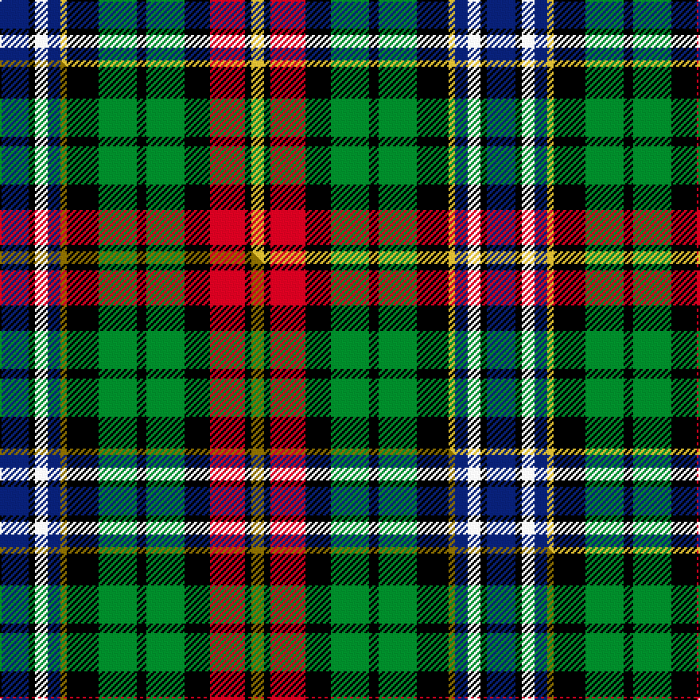

This is one **variant** — a specific cloth: this exact thread count and colourway, with its own
provenance below. It is one weaving of the [sett](/tartans/w/wa/watt/) (the scale-free proportion — the
same cloth at any scale or shade), whose colour order is pattern [BKWBYKGKGKRKY](/stripes/bkwbykgkgkrky/).

Part of the [Watt](/tartans/w/wa/watt/) tartan — the named design grouping this sett with its other cloths.

Sourced from tartans-authority.  It is a [13 stripe tartan](/stripes/stripes13/).

Original link <code>http://www.tartansauthority.com/tartan-ferret/display/6737/</code> — retired · [Internet Archive copy](https://web.archive.org/web/*/http://www.tartansauthority.com/tartan-ferret/display/6737/*)

Dataset <small>— provenance for this record, inherited from the source manifest</small>

<dl class="dataset-prov">
<dt>source</dt><dd><a href="/sources/tartans-authority/">Scottish Tartans Authority</a></dd>
<dt>data captured from</dt><dd><a href="https://github.com/thetartan/tartan-database/blob/master/data/tartans-authority/data.csv">https://github.com/thetartan/tartan-database/blob/master/data/tartans-authority/data.csv</a></dd>
<dt>data date</dt><dd>pre 2005 <small>(this record)</small></dd>
<dt>licence</dt><dd><a href="https://creativecommons.org/licenses/by-nc-nd/4.0/">CC BY-NC-ND 4.0</a></dd>
</dl>

Capture chain <small>— the hands this data passed through, oldest first; each capture carries its own licence</small>

<ol class="capture-chain">
<li><a href="https://www.tartansauthority.com/">Scottish Tartans Authority</a> <small>the heritage body’s archive — its tartan-ferret record browser is retired; dead record links are shown unlinked, with an Internet Archive copy (ITI numbers are not SRT references)</small></li>
<li><a href="https://github.com/thetartan/tartan-database">thetartan/tartan-database</a> <small>2016-2017</small> · <a href="https://creativecommons.org/licenses/by-nc-nd/4.0/">CC BY-NC-ND 4.0</a> <small>Levko Kravets's frozen compilation — the capture we vendored, and where its CC licence text came from</small></li>
<li>this dictionary <small>captured 2026-06-10 · commit 5bf86c7566</small> <small>each re-capture is a git commit to data/sources</small></li>
</ol>

## Register references

External register numbers recorded for this tartan.

- Scottish Tartans Authority (ITI): 6737

## Thread count
DB/18 K4 W8 DB8 LY4 K20 G24 K6 G24 K16 R22 K4 LY/8

One full sett is **306 threads**.

## Palette
<table><thead><tr><th>Colour</th><th>Shade</th><th>OKLCh</th></tr></thead><tbody><tr><td>DB</td><td><code style="background-color:#082077;">#082077</code> <small style="color:#888">#082077</small></td><td><small style="color:#888">oklch(30.0% 0.149 265.1)</small></td></tr><tr><td>LY</td><td><code style="background-color:#DCBC32;">#DCBC32</code> <small style="color:#888">#DCBC32</small></td><td><small style="color:#888">oklch(80.0% 0.150 95.2)</small></td></tr><tr><td>G</td><td><code style="background-color:#008B2A;">#008B2A</code> <small style="color:#888">#008B2A</small></td><td><small style="color:#888">oklch(55.4% 0.170 145.9)</small></td></tr><tr><td>K</td><td><code style="background-color:#000000;">#000000</code> <small style="color:#888">#000000</small></td><td><small style="color:#888">oklch(0.0% 0.000 0.0)</small></td></tr><tr><td>R</td><td><code style="background-color:#D60020;">#D60020</code> <small style="color:#888">#D60020</small></td><td><small style="color:#888">oklch(55.2% 0.224 25.5)</small></td></tr><tr><td>W</td><td><code style="background-color:#F7F7F7;">#F7F7F7</code> <small style="color:#888">#F7F7F7</small></td><td><small style="color:#888">oklch(97.6% 0.000 89.9)</small></td></tr></tbody></table>

# Sample pattern

[Sample sheet (PDF)](swatch.pdf) — the woven sample, thread count and palette on one printable A4, rendered on demand (the same sheet the TTD print page downloads).

## Compared to the master

This cloth is one sett of its design; the master sett (the exemplar the design is anchored on) is below for comparison.

Its **ΔTartan distance** from the master is **0.04** — the same measure the nearest-tartans table ranks by (0 is identical; a re-scale of the same cloth is near 0, a recolour or a different proportion further).

<figure class="master-compare" style="margin:0">

this sett
master sett ★

<figcaption style="color:#888;font-size:smaller">One weave of this sett against the <a href="/setts/db9k2w4db4y2k10g12k3g12k8r11k2y4/">master sett ★</a>, split on the diagonal: a shared proportion runs seamlessly across it with only the shades shifting; a different proportion breaks on it.</figcaption>
</figure>

## Nearest tartan variants

The nearest existing variants by ΔTartan distance, with this cloth at the top so the swatches line up against it.

ΔTartan

Threads

Variant

Sett

—

306

<a href="/variants/s13/db9k2w4db4ly2k10g12k3g12k8r11k2ly4~x2/">Watt (Personal)</a>

<a href="/ttd/edit/#slug=db9k2w4db4y2k10g12k3g12k8r11k2y4~x2&amp;base=db9k2w4db4ly2k10g12k3g12k8r11k2ly4~x2" title="compare in the TTD">0.04</a>

306

<a href="/variants/s13/db9k2w4db4y2k10g12k3g12k8r11k2y4~x2/">Watt (Dunfermline) (Personal)</a>

<a href="/ttd/edit/#slug=k16dg3g8k3o12k3o12k3g8k3lb12g8lb12g8dg3k16w3~x2~dg4514144-g5408159&amp;base=db9k2w4db4ly2k10g12k3g12k8r11k2ly4~x2" title="compare in the TTD">1.49</a>

494

<a href="/variants/s17/k16dg3g8k3o12k3o12k3g8k3lb12g8lb12g8dg3k16w3~x2~dg4514144-g5408159/">St. Margaret's School Edinburgh</a>

<a href="/ttd/edit/#slug=k4n10k4g8k12r5g16t16r5t6w2~x2~t6107234&amp;base=db9k2w4db4ly2k10g12k3g12k8r11k2ly4~x2" title="compare in the TTD">1.93</a>

340

<a href="/variants/s11/k4n10k4g8k12r5g16t16r5t6w2~x2~t6107234/">Manderson Family Tartan</a>

<a href="/ttd/edit/#slug=y4g20r3db11lb3r11g11r3k20r3k3lb3~x2&amp;base=db9k2w4db4ly2k10g12k3g12k8r11k2ly4~x2" title="compare in the TTD">1.98</a>

366

<a href="/variants/s12/y4g20r3db11lb3r11g11r3k20r3k3lb3~x2/">Gordonstoun</a>

<a href="/ttd/edit/#slug=k14g2lb14g3lb14g2k14g14w2g14k14r2g2r10y4r10g2r2~x2&amp;base=db9k2w4db4ly2k10g12k3g12k8r11k2ly4~x2" title="compare in the TTD">2.15</a>

524

<a href="/variants/s18/k14g2lb14g3lb14g2k14g14w2g14k14r2g2r10y4r10g2r2~x2/">Langston (Personal)</a>

<a href="/ttd/edit/#slug=g5k1g5k1db5w1db5g2w1dy2db1r3dy1r3~x4&amp;base=db9k2w4db4ly2k10g12k3g12k8r11k2ly4~x2" title="compare in the TTD">2.20</a>

256

<a href="/variants/s14/g5k1g5k1db5w1db5g2w1dy2db1r3dy1r3~x4/">Festival Celtique de Québec</a>

<a href="/ttd/edit/#slug=lr2db3k3g8dr6db2ly2k3lr2k6db8ly2~x2&amp;base=db9k2w4db4ly2k10g12k3g12k8r11k2ly4~x2" title="compare in the TTD">2.22</a>

180

<a href="/variants/s12/lr2db3k3g8dr6db2ly2k3lr2k6db8ly2~x2/">Talisman</a>

<a href="/ttd/edit/#slug=g5k1g5k1db5w1db5g2w1ly2db1r3ly1r3~x4&amp;base=db9k2w4db4ly2k10g12k3g12k8r11k2ly4~x2" title="compare in the TTD">2.25</a>

256

<a href="/variants/s14/g5k1g5k1db5w1db5g2w1ly2db1r3ly1r3~x4/">Festival Celtique de Qubecc</a>

<a href="/ttd/edit/#slug=dp3k3dp10k11g14db3g14k11w3lb3db15lb2w2~x2&amp;base=db9k2w4db4ly2k10g12k3g12k8r11k2ly4~x2" title="compare in the TTD">2.31</a>

366

<a href="/variants/s13/dp3k3dp10k11g14db3g14k11w3lb3db15lb2w2~x2/">North of Scotland Tartan Army</a>

<a href="/ttd/edit/#slug=w6k1w1k1w1k8g8y2g8k8db8k1dr2~x2&amp;base=db9k2w4db4ly2k10g12k3g12k8r11k2ly4~x2" title="compare in the TTD">2.33</a>

204

<a href="/variants/s13/w6k1w1k1w1k8g8y2g8k8db8k1dr2~x2/">Farquharson Dress</a>

## Neighbour map

Every grey dot is one of 13662 variants placed by the first two principal components of the ΔTartan feature space (42% of its variance). Red is this tartan; blue dots are its nearest — click one to open its page. The map is a flat projection of a many-dimensional space — [how to read it](/posts/neighbourhood-maps/).

<svg viewBox="0 0 640 380" role="img" style="max-width:100%;height:auto;border:1px solid #e0e0e0;border-radius:4px;display:block" xmlns="http://www.w3.org/2000/svg"><image href="/nn/cloud.v1.png" width="640" height="380"/><a href="/variants/s13/db9k2w4db4y2k10g12k3g12k8r11k2y4~x2/"><circle cx="14.8" cy="174.9" r="4" fill="#3465a4"><title>Watt (Dunfermline) (Personal)</title></circle></a><a href="/variants/s17/k16dg3g8k3o12k3o12k3g8k3lb12g8lb12g8dg3k16w3~x2~dg4514144-g5408159/"><circle cx="14.0" cy="168.5" r="4" fill="#3465a4"><title>St. Margaret's School Edinburgh</title></circle></a><a href="/variants/s11/k4n10k4g8k12r5g16t16r5t6w2~x2~t6107234/"><circle cx="25.4" cy="180.6" r="4" fill="#3465a4"><title>Manderson Family Tartan</title></circle></a><a href="/variants/s12/y4g20r3db11lb3r11g11r3k20r3k3lb3~x2/"><circle cx="49.5" cy="154.3" r="4" fill="#3465a4"><title>Gordonstoun</title></circle></a><a href="/variants/s18/k14g2lb14g3lb14g2k14g14w2g14k14r2g2r10y4r10g2r2~x2/"><circle cx="23.9" cy="143.1" r="4" fill="#3465a4"><title>Langston (Personal)</title></circle></a><a href="/variants/s14/g5k1g5k1db5w1db5g2w1dy2db1r3dy1r3~x4/"><circle cx="49.5" cy="181.7" r="4" fill="#3465a4"><title>Festival Celtique de Québec</title></circle></a><a href="/variants/s12/lr2db3k3g8dr6db2ly2k3lr2k6db8ly2~x2/"><circle cx="14.0" cy="199.6" r="4" fill="#3465a4"><title>Talisman</title></circle></a><a href="/variants/s14/g5k1g5k1db5w1db5g2w1ly2db1r3ly1r3~x4/"><circle cx="42.4" cy="179.9" r="4" fill="#3465a4"><title>Festival Celtique de Qubecc</title></circle></a><a href="/variants/s13/dp3k3dp10k11g14db3g14k11w3lb3db15lb2w2~x2/"><circle cx="33.5" cy="162.3" r="4" fill="#3465a4"><title>North of Scotland Tartan Army</title></circle></a><a href="/variants/s13/w6k1w1k1w1k8g8y2g8k8db8k1dr2~x2/"><circle cx="52.0" cy="149.3" r="4" fill="#3465a4"><title>Farquharson Dress</title></circle></a><circle cx="14.0" cy="173.7" r="5" fill="#c00000"/><text x="320" y="376" text-anchor="middle" font-size="11" fill="#999">ground</text><text x="11" y="190" text-anchor="middle" font-size="11" fill="#999" transform="rotate(-90 11 190)">complexity</text></svg>

ID: /variants/s13/db9k2w4db4ly2k10g12k3g12k8r11k2ly4~x2/
