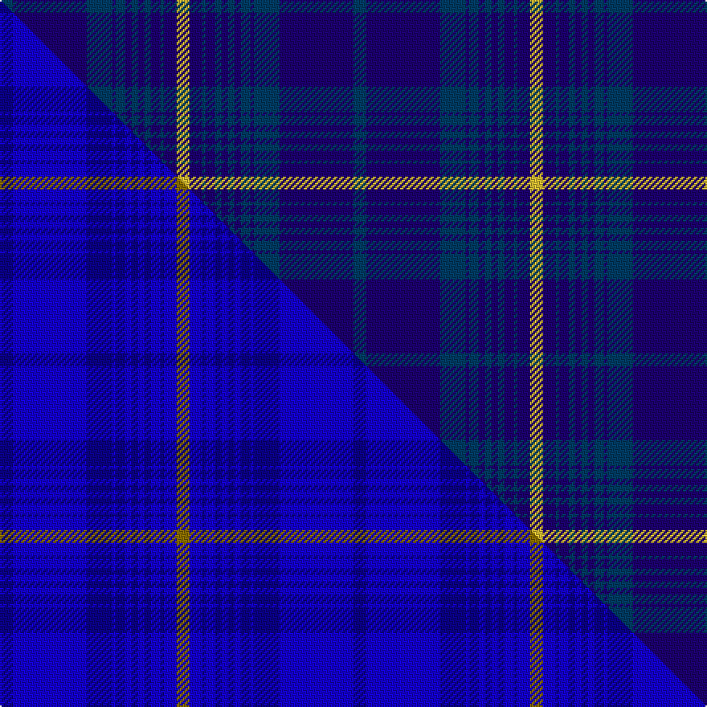

This page is one **sett** — a single exact thread-count. It belongs to the [tartan](/setts/dbi4db23dbi8db1dbi3db2dbi2db2dbi2db3dbi1db4ly4/)
(the same proportion at any scale), whose colour order is pattern [BBBBBBBBBBBBY](/stripes/bbbbbbbbbbbby/).

Part of the [Hawick Common Riding](/tartans/hawick-common-riding/) tartan — the named design grouping this sett with its other cloths.

Sourced from tartans-authority.  It is a [13 stripe tartan](/stripes/stripes13/).

Original link http://www.tartansauthority.com/tartan-ferret/display/10601/

## Register references

External register numbers recorded for this tartan.

- Scottish Register of Tartans: [10601](https://www.tartanregister.gov.uk/tartanDetails?ref=10601)
- Scottish Tartans Authority (ITI): 10601

## Thread count
DBi/8 DB46 DBi16 DB2 DBi6 DB4 DBi4 DB4 DBi4 DB6 DBi2 DB8 LY/8

One full sett is **220 threads**.

## Palette
<table><thead><tr><th>Colour</th><th>Shade</th><th>OKLCh</th></tr></thead><tbody><tr><td>DB</td><td><code style="background-color:#003C64;">#003C64</code> <small style="color:#888">#003C64</small></td><td><small style="color:#888">oklch(34.5% 0.089 246.0)</small></td></tr><tr><td>DB</td><td><code style="background-color:#1C0070;">#1C0070</code> <small style="color:#888">#1C0070</small></td><td><small style="color:#888">oklch(26.3% 0.162 277.1)</small></td></tr><tr><td>LY</td><td><code style="background-color:#DCBC32;">#DCBC32</code> <small style="color:#888">#DCBC32</small></td><td><small style="color:#888">oklch(80.0% 0.150 95.2)</small></td></tr></tbody></table>

# Sample pattern

## Compared to the master

This cloth is one sett of its design; the master sett (the exemplar the design is anchored on) is below for comparison.

Its **ΔTartan distance** from the master is **3.10** — the same measure the nearest-tartans table ranks by (0 is identical; a re-scale of the same cloth is near 0, a recolour or a different proportion further).

<figure class="master-compare" style="margin:0">

this sett
master sett ★

<figcaption style="color:#888;font-size:smaller">One weave of this sett against the <a href="/setts/db4b23db8b1db3b2db2b2db2b3db1b4y4/">master sett ★</a>, split on the diagonal: a shared proportion runs seamlessly across it with only the shades shifting; a different proportion breaks on it.</figcaption>
</figure>

## Nearest variants

The nearest existing variants by ΔTartan distance, with this cloth at the top so the swatches line up against it.

ΔTartan

Threads

Variant

Sett

—

220

<a href="/variants/s13/dbi4db23dbi8db1dbi3db2dbi2db2dbi2db3dbi1db4ly4~x2~dbi1404245-db1106275/">Hawick Common Riding (Commemorative)</a>

0.99

—

<a href="/variants/s13/db4b23db8b1db3b2db2b2db2b3db1b4y4~x2~db1108266-b1511266/">Hawick Common Riding</a>

## Neighbour map

Every grey dot is one of 13620 variants placed by the first two principal components of the ΔTartan feature space (42% of its variance). Red is this tartan; blue dots are its nearest — click one to open its page.

<svg viewBox="0 0 640 380" role="img" style="max-width:100%;height:auto;border:1px solid #e0e0e0;border-radius:4px;display:block" xmlns="http://www.w3.org/2000/svg"><image href="/nn/cloud.v1.png" width="640" height="380"/><a href="/variants/s13/db4b23db8b1db3b2db2b2db2b3db1b4y4~x2~db1108266-b1511266/"><circle cx="535.8" cy="201.6" r="4" fill="#3465a4"><title>Hawick Common Riding</title></circle></a><circle cx="500.1" cy="192.4" r="5" fill="#c00000"/><text x="320" y="376" text-anchor="middle" font-size="11" fill="#999">ground</text><text x="11" y="190" text-anchor="middle" font-size="11" fill="#999" transform="rotate(-90 11 190)">complexity</text></svg>

ID: /variants/s13/dbi4db23dbi8db1dbi3db2dbi2db2dbi2db3dbi1db4ly4~x2~dbi1404245-db1106275/
