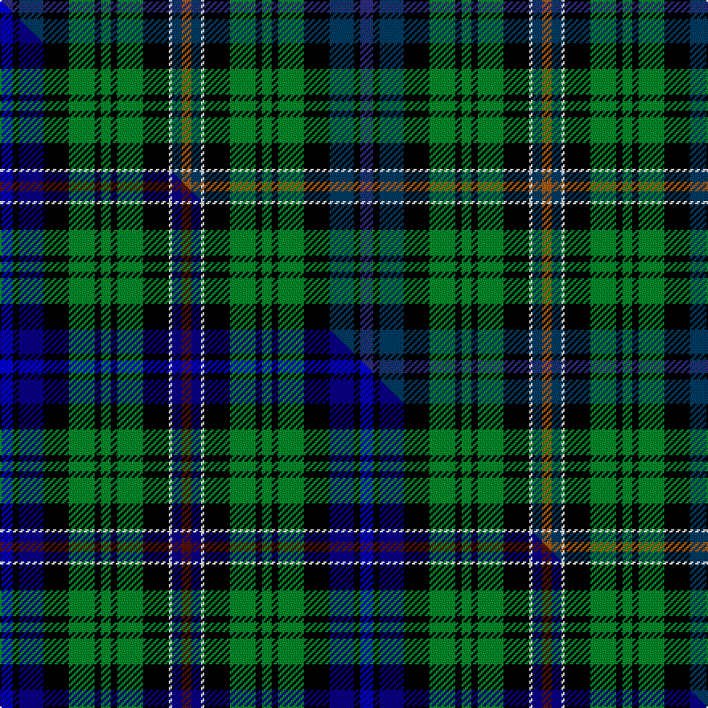

This is one **variant** — a specific cloth: this exact thread count and colourway, with its own
provenance below. It is one weaving of the [sett](/tartans/f/fr/free/) (the scale-free proportion — the
same cloth at any scale or shade), whose colour order is pattern [BKBKGKGKGKWBR](/stripes/bkbkgkgkgkwbr/).

Part of the [Free](/tartans/f/fr/free/) tartan — the named design grouping this sett with its other cloths.

Sourced from tartans-authority.  It is a [13 stripe tartan](/stripes/stripes13/).

Original link <code>http://www.tartansauthority.com/tartan-ferret/display/10156/</code> — retired · [Internet Archive copy](https://web.archive.org/web/*/http://www.tartansauthority.com/tartan-ferret/display/10156/*)

Dataset <small>— provenance for this record, inherited from the source manifest</small>

<dl class="dataset-prov">
<dt>source</dt><dd><a href="/sources/tartans-authority/">Scottish Tartans Authority</a></dd>
<dt>data captured from</dt><dd><a href="https://github.com/thetartan/tartan-database/blob/master/data/tartans-authority/data.csv">https://github.com/thetartan/tartan-database/blob/master/data/tartans-authority/data.csv</a></dd>
<dt>data date</dt><dd>1st Feb. 2010 <small>(this record)</small></dd>
<dt>licence</dt><dd><a href="https://creativecommons.org/licenses/by-nc-nd/4.0/">CC BY-NC-ND 4.0</a></dd>
</dl>

Capture chain <small>— the hands this data passed through, oldest first; each capture carries its own licence</small>

<ol class="capture-chain">
<li><a href="https://www.tartansauthority.com/">Scottish Tartans Authority</a> <small>the heritage body’s archive — its tartan-ferret record browser is retired; dead record links are shown unlinked, with an Internet Archive copy (ITI numbers are not SRT references)</small></li>
<li><a href="https://github.com/thetartan/tartan-database">thetartan/tartan-database</a> <small>2016-2017</small> · <a href="https://creativecommons.org/licenses/by-nc-nd/4.0/">CC BY-NC-ND 4.0</a> <small>Levko Kravets's frozen compilation — the capture we vendored, and where its CC licence text came from</small></li>
<li>this dictionary <small>captured 2026-06-10 · commit 5bf86c7566</small> <small>each re-capture is a git commit to data/sources</small></li>
</ol>

## Register references

External register numbers recorded for this tartan.

- Scottish Register of Tartans: [10156](https://www.tartanregister.gov.uk/tartanDetails?ref=10156)
- Scottish Tartans Authority (ITI): 10156

## Thread count
DBi/8 K4 DB15 K16 G16 K4 G6 K4 G16 K16 W2 DB6 O/6

One full sett is **224 threads**.

## Palette
<table><thead><tr><th>Colour</th><th>Shade</th><th>OKLCh</th></tr></thead><tbody><tr><td>DB</td><td><code style="background-color:#2C2C80;">#2C2C80</code> <small style="color:#888">#2C2C80</small></td><td><small style="color:#888">oklch(35.0% 0.138 276.6)</small></td></tr><tr><td>DB</td><td><code style="background-color:#003C64;">#003C64</code> <small style="color:#888">#003C64</small></td><td><small style="color:#888">oklch(34.5% 0.089 246.0)</small></td></tr><tr><td>G</td><td><code style="background-color:#008B2A;">#008B2A</code> <small style="color:#888">#008B2A</small></td><td><small style="color:#888">oklch(55.4% 0.170 145.9)</small></td></tr><tr><td>K</td><td><code style="background-color:#000000;">#000000</code> <small style="color:#888">#000000</small></td><td><small style="color:#888">oklch(0.0% 0.000 0.0)</small></td></tr><tr><td>W</td><td><code style="background-color:#F7F7F7;">#F7F7F7</code> <small style="color:#888">#F7F7F7</small></td><td><small style="color:#888">oklch(97.6% 0.000 89.9)</small></td></tr><tr><td>O</td><td><code style="background-color:#A65C11;">#A65C11</code> <small style="color:#888">#A65C11</small></td><td><small style="color:#888">oklch(55.0% 0.125 58.3)</small></td></tr></tbody></table>

# Sample pattern

## Compared to the master

This cloth is one sett of its design; the master sett (the exemplar the design is anchored on) is below for comparison.

Its **ΔTartan distance** from the master is **0.35** — the same measure the nearest-tartans table ranks by (0 is identical; a re-scale of the same cloth is near 0, a recolour or a different proportion further).

<figure class="master-compare" style="margin:0">

this sett
master sett ★

<figcaption style="color:#888;font-size:smaller">One weave of this sett against the <a href="/setts/b8k4db15k16g16k4g6k4g16k16w2db6dr6/">master sett ★</a>, split on the diagonal: a shared proportion runs seamlessly across it with only the shades shifting; a different proportion breaks on it.</figcaption>
</figure>

## Nearest tartan variants

The nearest existing variants by ΔTartan distance, with this cloth at the top so the swatches line up against it.

ΔTartan

Threads

Variant

Sett

—

224

<a href="/variants/s13/dbi8k4db15k16g16k4g6k4g16k16w2db6o6~dbi1406275-db1404245/">Free (Universal)</a>

<a href="/ttd/edit/#slug=b8k4db15k16g16k4g6k4g16k16w2db6dr6~b1712264-db1108266&amp;base=dbi8k4db15k16g16k4g6k4g16k16w2db6o6~dbi1406275-db1404245" title="compare in the TTD">0.35</a>

224

<a href="/variants/s13/b8k4db15k16g16k4g6k4g16k16w2db6dr6~b1712264-db1108266/">Free (Wishaw)</a>

<a href="/ttd/edit/#slug=r2k1db8k7g8y2g8k7db8k1t2~x4&amp;base=dbi8k4db15k16g16k4g6k4g16k16w2db6o6~dbi1406275-db1404245" title="compare in the TTD">1.81</a>

416

<a href="/variants/s11/r2k1db8k7g8y2g8k7db8k1t2~x4/">Adam Smith (Corporate)</a>

<a href="/ttd/edit/#slug=r3k1g12k12n12db3n12k12g12k1y3~x2~n1604274-db0805267&amp;base=dbi8k4db15k16g16k4g6k4g16k16w2db6o6~dbi1406275-db1404245" title="compare in the TTD">2.08</a>

320

<a href="/variants/s11/r3k1g12k12dbi12db3dbi12k12g12k1y3~x2~dbi1604274-db0805267/">Gow, hunting</a>

<a href="/ttd/edit/#slug=dr2k1g7k6t7db2t7k6g7k1lo2~x4&amp;base=dbi8k4db15k16g16k4g6k4g16k16w2db6o6~dbi1406275-db1404245" title="compare in the TTD">2.09</a>

368

<a href="/variants/s11/dr2k1g7k6t7db2t7k6g7k1lo2~x4/">Smith of Pennilands (Clan)</a>

<a href="/ttd/edit/#slug=r3k1g12k12dbi12db3dbi12k12g12k1y3~x2~dbi1605267-db0804274&amp;base=dbi8k4db15k16g16k4g6k4g16k16w2db6o6~dbi1406275-db1404245" title="compare in the TTD">2.09</a>

320

<a href="/variants/s11/r3k1g12k12dbi12db3dbi12k12g12k1y3~x2~dbi1605267-db0804274/">Gow Hunting</a>

<a href="/ttd/edit/#slug=lb6k1lb1k1lb1k8g8lo2g8k8db8k1dr2~x2&amp;base=dbi8k4db15k16g16k4g6k4g16k16w2db6o6~dbi1406275-db1404245" title="compare in the TTD">2.10</a>

204

<a href="/variants/s13/lb6k1lb1k1lb1k8g8lo2g8k8db8k1dr2~x2/">Farquharson Dress (Fashion)</a>

<a href="/ttd/edit/#slug=k12g12k1r1k1g12k1y3k1g12k12db12dt3db12~x4~db1406275-dt1204274&amp;base=dbi8k4db15k16g16k4g6k4g16k16w2db6o6~dbi1406275-db1404245" title="compare in the TTD">2.22</a>

664

<a href="/variants/s14/k12g12k1r1k1g12k1y3k1g12k12dbi12db3dbi12~x4~dbi1406275-db1204274/">Gow Hunting Family Tartan</a>

<a href="/ttd/edit/#slug=db8k4y3k4db14k4dg4g6dg3g10k10g9k3r3k4~x2&amp;base=dbi8k4db15k16g16k4g6k4g16k16w2db6o6~dbi1406275-db1404245" title="compare in the TTD">2.23</a>

332

<a href="/variants/s15/db8k4y3k4db14k4dg4g6dg3g10k10g9k3r3k4~x2/">Wells, Edward G. (Personal)</a>

<a href="/ttd/edit/#slug=r3k1g12k12db12dt3db12k12g12k1y3~x2~db1406275-dt1204274&amp;base=dbi8k4db15k16g16k4g6k4g16k16w2db6o6~dbi1406275-db1404245" title="compare in the TTD">2.25</a>

320

<a href="/variants/s11/r3k1g12k12dbi12db3dbi12k12g12k1y3~x2~dbi1406275-db1204274/">Gow Hunting (Clan)</a>

<a href="/ttd/edit/#slug=dr2g10db10k5b2k5g10k10b2k10lo2~x2&amp;base=dbi8k4db15k16g16k4g6k4g16k16w2db6o6~dbi1406275-db1404245" title="compare in the TTD">2.28</a>

264

<a href="/variants/s11/dr2g10db10k5b2k5g10k10b2k10lo2~x2/">Nairn (Edinburgh Woollen Mill)</a>

## Neighbour map

Every grey dot is one of 13657 variants placed by the first two principal components of the ΔTartan feature space (42% of its variance). Red is this tartan; blue dots are its nearest — click one to open its page. The map is a flat projection of a many-dimensional space — [how to read it](/posts/neighbourhood-maps/).

<svg viewBox="0 0 640 380" role="img" style="max-width:100%;height:auto;border:1px solid #e0e0e0;border-radius:4px;display:block" xmlns="http://www.w3.org/2000/svg"><image href="/nn/cloud.v1.png" width="640" height="380"/><a href="/variants/s13/b8k4db15k16g16k4g6k4g16k16w2db6dr6~b1712264-db1108266/"><circle cx="67.7" cy="170.2" r="4" fill="#3465a4"><title>Free (Wishaw)</title></circle></a><a href="/variants/s11/r2k1db8k7g8y2g8k7db8k1t2~x4/"><circle cx="56.7" cy="176.7" r="4" fill="#3465a4"><title>Adam Smith (Corporate)</title></circle></a><a href="/variants/s11/r3k1g12k12dbi12db3dbi12k12g12k1y3~x2~dbi1604274-db0805267/"><circle cx="78.7" cy="157.7" r="4" fill="#3465a4"><title>Gow, hunting</title></circle></a><a href="/variants/s11/dr2k1g7k6t7db2t7k6g7k1lo2~x4/"><circle cx="39.9" cy="187.2" r="4" fill="#3465a4"><title>Smith of Pennilands (Clan)</title></circle></a><a href="/variants/s11/r3k1g12k12dbi12db3dbi12k12g12k1y3~x2~dbi1605267-db0804274/"><circle cx="78.5" cy="157.7" r="4" fill="#3465a4"><title>Gow Hunting</title></circle></a><a href="/variants/s13/lb6k1lb1k1lb1k8g8lo2g8k8db8k1dr2~x2/"><circle cx="59.1" cy="151.3" r="4" fill="#3465a4"><title>Farquharson Dress (Fashion)</title></circle></a><a href="/variants/s14/k12g12k1r1k1g12k1y3k1g12k12dbi12db3dbi12~x4~dbi1406275-db1204274/"><circle cx="107.9" cy="134.9" r="4" fill="#3465a4"><title>Gow Hunting Family Tartan</title></circle></a><a href="/variants/s15/db8k4y3k4db14k4dg4g6dg3g10k10g9k3r3k4~x2/"><circle cx="32.4" cy="190.6" r="4" fill="#3465a4"><title>Wells, Edward G. (Personal)</title></circle></a><a href="/variants/s11/r3k1g12k12dbi12db3dbi12k12g12k1y3~x2~dbi1406275-db1204274/"><circle cx="79.0" cy="157.0" r="4" fill="#3465a4"><title>Gow Hunting (Clan)</title></circle></a><a href="/variants/s11/dr2g10db10k5b2k5g10k10b2k10lo2~x2/"><circle cx="89.4" cy="191.7" r="4" fill="#3465a4"><title>Nairn (Edinburgh Woollen Mill)</title></circle></a><circle cx="71.9" cy="171.7" r="5" fill="#c00000"/><text x="320" y="376" text-anchor="middle" font-size="11" fill="#999">ground</text><text x="11" y="190" text-anchor="middle" font-size="11" fill="#999" transform="rotate(-90 11 190)">complexity</text></svg>

ID: /variants/s13/dbi8k4db15k16g16k4g6k4g16k16w2db6o6~dbi1406275-db1404245/
