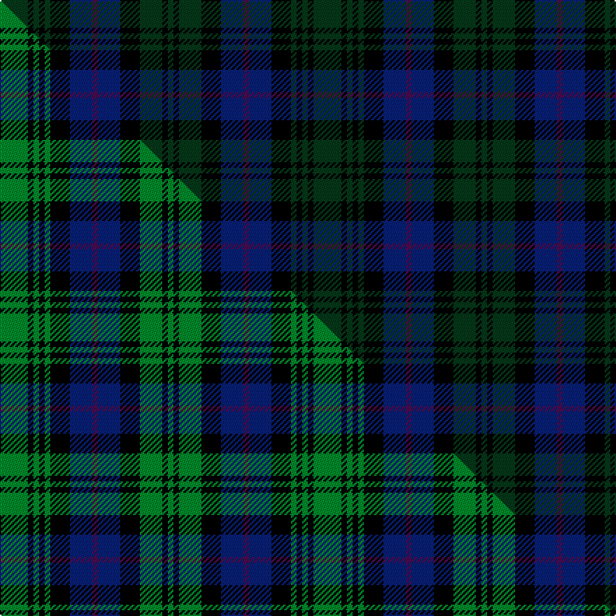

This page is one **sett** — a single exact thread-count. It belongs to the [tartan](/setts/dg10k2dg2k2dg2k7db8dp2db8k7dg8k2dg2/)
(the same proportion at any scale), whose colour order is pattern [GKGKBBBKGKGKG](/stripes/gkgkbbbkgkgkg/).

Part of the [Lochinvar Marine Harvest](/tartans/lochinvar-marine-harvest/) tartan — the named design grouping this sett with its other cloths.

Sourced from weddslist.  It is a [13 stripe tartan](/stripes/stripes13/).

Original link http://www.weddslist.com/cgi-bin/tartans/pg.pl?source=sts

## Provenance

Earliest known date: 1989 Colours represents the Scottish hills, the water, and the heather.

2 attestations — the source records this cloth was collapsed from (oldest owns this page)

<ul>
<li>undated — Lochinvar Marine Harvest (weddslist, <a href="http://www.weddslist.com/cgi-bin/tartans/pg.pl?source=sts">record</a>) </li>
<li>undated — Lochinvar Marine Harvest Corporate Tartan (house-of-tartan, <a href="http://www.house-of-tartan.scotland.net/house/TartanViewjs.asp?colr=Def&tnam=2102">record</a>) </li>
</ul>

## Thread count
DG/20 K4 DG4 K4 DG4 K14 DB16 DP4 DB16 K14 DG16 K4 DG/4

One full sett is **224 threads**.

## Palette
<table><thead><tr><th>Colour</th><th>Shade</th><th>OKLCh</th></tr></thead><tbody><tr><td>DB</td><td><code style="background-color:#082077;">#082077</code> <small style="color:#888">#082077</small></td><td><small style="color:#888">oklch(30.0% 0.149 265.1)</small></td></tr><tr><td>DG</td><td><code style="background-color:#053819;">#053819</code> <small style="color:#888">#053819</small></td><td><small style="color:#888">oklch(30.0% 0.075 151.3)</small></td></tr><tr><td>K</td><td><code style="background-color:#000000;">#000000</code> <small style="color:#888">#000000</small></td><td><small style="color:#888">oklch(0.0% 0.000 0.0)</small></td></tr><tr><td>DP</td><td><code style="background-color:#4B0B4F;">#4B0B4F</code> <small style="color:#888">#4B0B4F</small></td><td><small style="color:#888">oklch(30.1% 0.125 325.4)</small></td></tr></tbody></table>

# Sample pattern

## Compared to the master

This cloth is one sett of its design; the master sett (the exemplar the design is anchored on) is below for comparison.

Its **ΔTartan distance** from the master is **2.43** — the same measure the nearest-tartans table ranks by (0 is identical; a re-scale of the same cloth is near 0, a recolour or a different proportion further).

<figure class="master-compare" style="margin:0">

this sett
master sett ★

<figcaption style="color:#888;font-size:smaller">One weave of this sett against the <a href="/setts/g10k2g2k2g2k7db8dp2db8k7g8k2g2/">master sett ★</a>, split on the diagonal: a shared proportion runs seamlessly across it with only the shades shifting; a different proportion breaks on it.</figcaption>
</figure>

## Nearest variants

The nearest existing variants by ΔTartan distance, with this cloth at the top so the swatches line up against it.

ΔTartan

Threads

Variant

Sett

—

224

<a href="/variants/s13/dg10k2dg2k2dg2k7db8dp2db8k7dg8k2dg2~x2/">Lochinvar Marine Harvest</a>

<a href="/ttd/edit/#slug=dg46k5dg6k5dg6k30db38y6db38k30dg36k6dg6&amp;base=dg10k2dg2k2dg2k7db8dp2db8k7dg8k2dg2~x2" title="compare in the TTD">0.77</a>

464

<a href="/variants/s13/dg46k5dg6k5dg6k30db38y6db38k30dg36k6dg6/">Dewar, Highlander</a>

## Neighbour map

Every grey dot is one of 13620 variants placed by the first two principal components of the ΔTartan feature space (42% of its variance). Red is this tartan; blue dots are its nearest — click one to open its page.

<svg viewBox="0 0 640 380" role="img" style="max-width:100%;height:auto;border:1px solid #e0e0e0;border-radius:4px;display:block" xmlns="http://www.w3.org/2000/svg"><image href="/nn/cloud.v1.png" width="640" height="380"/><a href="/variants/s13/dg46k5dg6k5dg6k30db38y6db38k30dg36k6dg6/"><circle cx="221.7" cy="195.6" r="4" fill="#3465a4"><title>Dewar, Highlander</title></circle></a><circle cx="197.5" cy="234.4" r="5" fill="#c00000"/><text x="320" y="376" text-anchor="middle" font-size="11" fill="#999">ground</text><text x="11" y="190" text-anchor="middle" font-size="11" fill="#999" transform="rotate(-90 11 190)">complexity</text></svg>

ID: /variants/s13/dg10k2dg2k2dg2k7db8dp2db8k7dg8k2dg2~x2/
