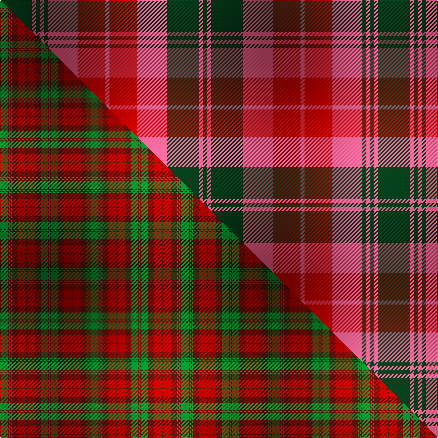

This is one **variant** — a specific cloth: this exact thread count and colourway, with its own
provenance below. It is one weaving of the [sett](/setts/dg16m2dg2m2dg2m15r14m2r14m15dg16m2dg2/) (the scale-free proportion — the
same cloth at any scale or shade), whose colour order is pattern [GRGRGRRRRRGRG](/stripes/grgrgrrrrrgrg/).

Part of the [MacNab](/tartans/macnab-5/) tartan — the named design grouping this sett with its other cloths.

Sourced from tartans-authority.  It is a [13 stripe tartan](/stripes/stripes13/).

Original link [https://www.tartanregister.gov.uk/tartanDetails.aspx?ref=857](https://www.tartanregister.gov.uk/tartanDetails.aspx?ref=857)

Dataset <small>— provenance for this record, inherited from the source manifest</small>

<dl class="dataset-prov">
<dt>source</dt><dd><a href="/sources/tartans-authority/">Scottish Tartans Authority</a></dd>
<dt>data captured from</dt><dd><a href="https://github.com/thetartan/tartan-database/blob/master/data/tartans-authority/data.csv">https://github.com/thetartan/tartan-database/blob/master/data/tartans-authority/data.csv</a></dd>
<dt>data date</dt><dd>1831 <small>(this record)</small></dd>
<dt>licence</dt><dd><a href="https://creativecommons.org/licenses/by-nc-nd/4.0/">CC BY-NC-ND 4.0</a></dd>
</dl>

Capture chain <small>— the hands this data passed through, oldest first; each capture carries its own licence</small>

<ol class="capture-chain">
<li><a href="https://www.tartansauthority.com/">Scottish Tartans Authority</a> <small>the heritage body's archive — its tartan-ferret record browser is retired (links repaired to the SRT, above)</small></li>
<li><a href="https://github.com/thetartan/tartan-database">thetartan/tartan-database</a> <small>2016-2017</small> · <a href="https://creativecommons.org/licenses/by-nc-nd/4.0/">CC BY-NC-ND 4.0</a> <small>Levko Kravets's frozen compilation — the capture we vendored, and where its CC licence text came from</small></li>
<li>this dictionary <small>captured 2026-06-10 · commit 5bf86c7566</small> <small>each re-capture is a git commit to data/sources</small></li>
</ol>

## Register references

External register numbers recorded for this tartan.

- Scottish Tartans Authority (ITI): 857

## Thread count
DG/32 M4 DG4 M4 DG4 M30 R28 M4 R28 M30 DG32 M4 DG/4

One full sett is **380 threads**.

## Palette
<table><thead><tr><th>Colour</th><th>Shade</th><th>OKLCh</th></tr></thead><tbody><tr><td>DG</td><td><code style="background-color:#053819;">#053819</code> <small style="color:#888">#053819</small></td><td><small style="color:#888">oklch(30.0% 0.075 151.3)</small></td></tr><tr><td>M</td><td><code style="background-color:#FC5C88;">#FC5C88</code> <small style="color:#888">#FC5C88</small></td><td><small style="color:#888">oklch(69.6% 0.197 7.0)</small></td></tr><tr><td>R</td><td><code style="background-color:#C80000;">#C80000</code> <small style="color:#888">#C80000</small></td><td><small style="color:#888">oklch(52.3% 0.215 29.2)</small></td></tr></tbody></table>

# Sample pattern

## Compared to the master

This cloth is one sett of its design; the master sett (the exemplar the design is anchored on) is below for comparison.

Its **ΔTartan distance** from the master is **4.03** — the same measure the nearest-tartans table ranks by (0 is identical; a re-scale of the same cloth is near 0, a recolour or a different proportion further).

<figure class="master-compare" style="margin:0">

this sett
master sett ★

<figcaption style="color:#888;font-size:smaller">One weave of this sett against the <a href="/setts/g8dr1g1dr1g1dr6r8dr1r8dr6g7dr1g1/">master sett ★</a>, split on the diagonal: a shared proportion runs seamlessly across it with only the shades shifting; a different proportion breaks on it.</figcaption>
</figure>

## Nearest tartan variants

The nearest existing variants by ΔTartan distance, with this cloth at the top so the swatches line up against it.

ΔTartan

Threads

Variant

Sett

—

380

<a href="/variants/s13/dg16m2dg2m2dg2m15r14m2r14m15dg16m2dg2~x2~m2808007-r2109032/">MacNab (Clan)</a>

<a href="/ttd/edit/#slug=r2dp3dg2r15dp3g19dp20r15dp3dg2r2~x2&amp;base=dg16m2dg2m2dg2m15r14m2r14m15dg16m2dg2~x2~m2808007-r2109032" title="compare in the TTD">2.68</a>

336

<a href="/variants/s11/r2dp3dg2r15dp3g19dp20r15dp3dg2r2~x2/">Drumlithie, Rock and Wheel</a>

<a href="/ttd/edit/#slug=r2dp3ri2r15dp3g19dp20r15dp3ri2r2~x2~r2109032-ri2406019&amp;base=dg16m2dg2m2dg2m15r14m2r14m15dg16m2dg2~x2~m2808007-r2109032" title="compare in the TTD">2.80</a>

336

<a href="/variants/s11/r2dp3ri2r15dp3g19dp20r15dp3ri2r2~x2~r2109032-ri2406019/">Drumlithie Rock and Wheel Tartan</a>

<a href="/ttd/edit/#slug=r2dp3ri2r15dp2g20dp20r15dp3ri2r2~x2~r2109032-ri2406019&amp;base=dg16m2dg2m2dg2m15r14m2r14m15dg16m2dg2~x2~m2808007-r2109032" title="compare in the TTD">2.85</a>

336

<a href="/variants/s11/r2dp3ri2r15dp2g20dp20r15dp3ri2r2~x2~r2109032-ri2406019/">Drumlithie</a>

<a href="/ttd/edit/#slug=db16r4db4r4db4r29g27r4g27r29db26r4db4~x2&amp;base=dg16m2dg2m2dg2m15r14m2r14m15dg16m2dg2~x2~m2808007-r2109032" title="compare in the TTD">3.08</a>

688

<a href="/variants/s13/db16r4db4r4db4r29g27r4g27r29db26r4db4~x2/">Black Watch (Band Plaid)</a>

<a href="/ttd/edit/#slug=r14g2dp10r2g14dp3g14r2dp10g2r14dp3~x2~r2406019&amp;base=dg16m2dg2m2dg2m15r14m2r14m15dg16m2dg2~x2~m2808007-r2109032" title="compare in the TTD">3.17</a>

326

<a href="/variants/s12/r14g2dp10r2g14dp3g14r2dp10g2r14dp3~x2~r2406019/">Unidentified Scarlett #12</a>

<a href="/ttd/edit/#slug=db28r3db3r3g20r30g4r30g20db22r3db3~x2&amp;base=dg16m2dg2m2dg2m15r14m2r14m15dg16m2dg2~x2~m2808007-r2109032" title="compare in the TTD">3.18</a>

614

<a href="/variants/s12/db28r3db3r3g20r30g4r30g20db22r3db3~x2/">Fraser Stewart of Athol</a>

<a href="/ttd/edit/#slug=db3r23db3r26db3r3db25r3g24r3~x2&amp;base=dg16m2dg2m2dg2m15r14m2r14m15dg16m2dg2~x2~m2808007-r2109032" title="compare in the TTD">3.29</a>

452

<a href="/variants/s10/db3r23db3r26db3r3db25r3g24r3~x2/">Unidentified Early 18th Centuary</a>

<a href="/ttd/edit/#slug=g6r2g2r18dp9r3g3r3dp9r3g24r2g2r4~x2&amp;base=dg16m2dg2m2dg2m15r14m2r14m15dg16m2dg2~x2~m2808007-r2109032" title="compare in the TTD">3.31</a>

340

<a href="/variants/s14/g6r2g2r18dp9r3g3r3dp9r3g24r2g2r4~x2/">Stewart of Urrard (Clan?)</a>

<a href="/ttd/edit/#slug=dy11db1dy11w10db1r11db1r11~x2&amp;base=dg16m2dg2m2dg2m15r14m2r14m15dg16m2dg2~x2~m2808007-r2109032" title="compare in the TTD">3.38</a>

184

<a href="/variants/s8/dy11db1dy11w10db1r11db1r11~x2/">St. Andrews (Queens University)</a>

<a href="/ttd/edit/#slug=dy21ri8r14dy6ri3r10~x2~ri2806019-r2109032&amp;base=dg16m2dg2m2dg2m15r14m2r14m15dg16m2dg2~x2~m2808007-r2109032" title="compare in the TTD">3.40</a>

186

<a href="/variants/s6/dy21ri8r14dy6ri3r10~x2~ri2806019-r2109032/">Kozlosky (Personal)</a>

## Neighbour map

Every grey dot is one of 13621 variants placed by the first two principal components of the ΔTartan feature space (42% of its variance). Red is this tartan; blue dots are its nearest — click one to open its page.

<svg viewBox="0 0 640 380" role="img" style="max-width:100%;height:auto;border:1px solid #e0e0e0;border-radius:4px;display:block" xmlns="http://www.w3.org/2000/svg"><image href="/nn/cloud.v1.png" width="640" height="380"/><a href="/variants/s11/r2dp3dg2r15dp3g19dp20r15dp3dg2r2~x2/"><circle cx="234.6" cy="180.3" r="4" fill="#3465a4"><title>Drumlithie, Rock and Wheel</title></circle></a><a href="/variants/s11/r2dp3ri2r15dp3g19dp20r15dp3ri2r2~x2~r2109032-ri2406019/"><circle cx="244.1" cy="182.9" r="4" fill="#3465a4"><title>Drumlithie Rock and Wheel Tartan</title></circle></a><a href="/variants/s11/r2dp3ri2r15dp2g20dp20r15dp3ri2r2~x2~r2109032-ri2406019/"><circle cx="243.9" cy="180.9" r="4" fill="#3465a4"><title>Drumlithie</title></circle></a><a href="/variants/s13/db16r4db4r4db4r29g27r4g27r29db26r4db4~x2/"><circle cx="222.0" cy="210.3" r="4" fill="#3465a4"><title>Black Watch (Band Plaid)</title></circle></a><a href="/variants/s12/r14g2dp10r2g14dp3g14r2dp10g2r14dp3~x2~r2406019/"><circle cx="217.3" cy="231.3" r="4" fill="#3465a4"><title>Unidentified Scarlett #12</title></circle></a><a href="/variants/s12/db28r3db3r3g20r30g4r30g20db22r3db3~x2/"><circle cx="235.3" cy="200.3" r="4" fill="#3465a4"><title>Fraser Stewart of Athol</title></circle></a><a href="/variants/s10/db3r23db3r26db3r3db25r3g24r3~x2/"><circle cx="285.6" cy="199.9" r="4" fill="#3465a4"><title>Unidentified Early 18th Centuary</title></circle></a><a href="/variants/s14/g6r2g2r18dp9r3g3r3dp9r3g24r2g2r4~x2/"><circle cx="270.6" cy="176.4" r="4" fill="#3465a4"><title>Stewart of Urrard (Clan?)</title></circle></a><a href="/variants/s8/dy11db1dy11w10db1r11db1r11~x2/"><circle cx="164.5" cy="176.2" r="4" fill="#3465a4"><title>St. Andrews (Queens University)</title></circle></a><a href="/variants/s6/dy21ri8r14dy6ri3r10~x2~ri2806019-r2109032/"><circle cx="253.5" cy="249.2" r="4" fill="#3465a4"><title>Kozlosky (Personal)</title></circle></a><circle cx="220.2" cy="201.1" r="5" fill="#c00000"/><text x="320" y="376" text-anchor="middle" font-size="11" fill="#999">ground</text><text x="11" y="190" text-anchor="middle" font-size="11" fill="#999" transform="rotate(-90 11 190)">complexity</text></svg>

ID: /variants/s13/dg16m2dg2m2dg2m15r14m2r14m15dg16m2dg2~x2~m2808007-r2109032/
