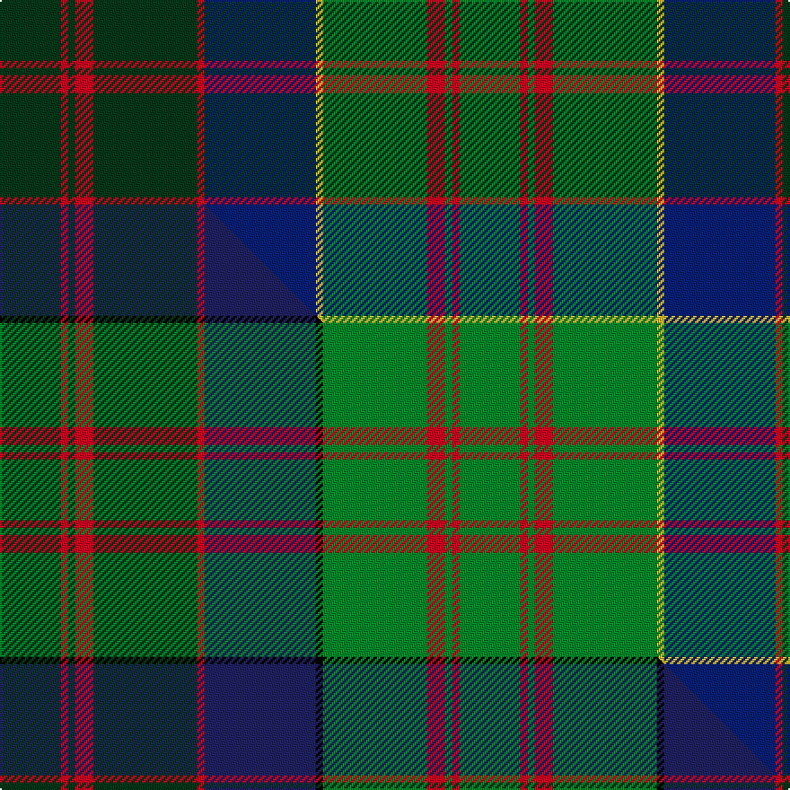

This is one **variant** — a specific cloth: this exact thread count and colourway, with its own
provenance below. It is one weaving of the [sett](/tartans/b/ba/barbecue-presbyterian-church/) (the scale-free proportion — the
same cloth at any scale or shade), whose colour order is pattern [GRGRGRBYGRGRG](/stripes/grgrgrbygrgrg/).

Part of the [Barbecue Presbyterian Church](/tartans/b/ba/barbecue-presbyterian-church/) tartan — the named design grouping this sett with its other cloths.

Sourced from tartans-authority.  It is a [13 stripe tartan](/stripes/stripes13/).

Original link <code>http://www.tartansauthority.com/tartan-ferret/display/7496/</code> — retired · [Internet Archive copy](https://web.archive.org/web/*/http://www.tartansauthority.com/tartan-ferret/display/7496/*)

Dataset <small>— provenance for this record, inherited from the source manifest</small>

<dl class="dataset-prov">
<dt>source</dt><dd><a href="/sources/tartans-authority/">Scottish Tartans Authority</a></dd>
<dt>data captured from</dt><dd><a href="https://github.com/thetartan/tartan-database/blob/master/data/tartans-authority/data.csv">https://github.com/thetartan/tartan-database/blob/master/data/tartans-authority/data.csv</a></dd>
<dt>data date</dt><dd>January 2008 <small>(this record)</small></dd>
<dt>licence</dt><dd><a href="https://creativecommons.org/licenses/by-nc-nd/4.0/">CC BY-NC-ND 4.0</a></dd>
</dl>

Capture chain <small>— the hands this data passed through, oldest first; each capture carries its own licence</small>

<ol class="capture-chain">
<li><a href="https://www.tartansauthority.com/">Scottish Tartans Authority</a> <small>the heritage body’s archive — its tartan-ferret record browser is retired; dead record links are shown unlinked, with an Internet Archive copy (ITI numbers are not SRT references)</small></li>
<li><a href="https://github.com/thetartan/tartan-database">thetartan/tartan-database</a> <small>2016-2017</small> · <a href="https://creativecommons.org/licenses/by-nc-nd/4.0/">CC BY-NC-ND 4.0</a> <small>Levko Kravets's frozen compilation — the capture we vendored, and where its CC licence text came from</small></li>
<li>this dictionary <small>captured 2026-06-10 · commit 5bf86c7566</small> <small>each re-capture is a git commit to data/sources</small></li>
</ol>

## Register references

External register numbers recorded for this tartan.

- Scottish Tartans Authority (ITI): 7496

## Thread count
DG/34 R4 DG4 R10 DG58 R4 DB62 LY4 G58 R10 G4 R4 G/34

One full sett is **512 threads**.

## Palette
<table><thead><tr><th>Colour</th><th>Shade</th><th>OKLCh</th></tr></thead><tbody><tr><td>DB</td><td><code style="background-color:#082077;">#082077</code> <small style="color:#888">#082077</small></td><td><small style="color:#888">oklch(30.0% 0.149 265.1)</small></td></tr><tr><td>DG</td><td><code style="background-color:#053819;">#053819</code> <small style="color:#888">#053819</small></td><td><small style="color:#888">oklch(30.0% 0.075 151.3)</small></td></tr><tr><td>G</td><td><code style="background-color:#008B2A;">#008B2A</code> <small style="color:#888">#008B2A</small></td><td><small style="color:#888">oklch(55.4% 0.170 145.9)</small></td></tr><tr><td>R</td><td><code style="background-color:#D60020;">#D60020</code> <small style="color:#888">#D60020</small></td><td><small style="color:#888">oklch(55.2% 0.224 25.5)</small></td></tr><tr><td>LY</td><td><code style="background-color:#DCBC32;">#DCBC32</code> <small style="color:#888">#DCBC32</small></td><td><small style="color:#888">oklch(80.0% 0.150 95.2)</small></td></tr></tbody></table>

# Sample pattern

## Compared to the master

This cloth is one sett of its design; the master sett (the exemplar the design is anchored on) is below for comparison.

Its **ΔTartan distance** from the master is **0.32** — the same measure the nearest-tartans table ranks by (0 is identical; a re-scale of the same cloth is near 0, a recolour or a different proportion further).

<figure class="master-compare" style="margin:0">

this sett
master sett ★

<figcaption style="color:#888;font-size:smaller">One weave of this sett against the <a href="/setts/dg17r2dg2r5dg29r2db31k2g29r5g2r2g17/">master sett ★</a>, split on the diagonal: a shared proportion runs seamlessly across it with only the shades shifting; a different proportion breaks on it.</figcaption>
</figure>

## Nearest tartan variants

The nearest existing variants by ΔTartan distance, with this cloth at the top so the swatches line up against it.

ΔTartan

Threads

Variant

Sett

—

512

<a href="/variants/s13/dg17r2dg2r5dg29r2db31ly2g29r5g2r2g17~x2/">Barbecue Presbyterian Church (Corp)</a>

<a href="/ttd/edit/#slug=dg17r2dg2r5dg29r2db31k2g29r5g2r2g17~x2~db2911276&amp;base=dg17r2dg2r5dg29r2db31ly2g29r5g2r2g17~x2" title="compare in the TTD">0.32</a>

512

<a href="/variants/s13/dg17r2dg2r5dg29r2db31k2g29r5g2r2g17~x2~db2911276/">Barbecue Presbyterian Church</a>

<a href="/ttd/edit/#slug=g46r6g6r2g8r2g6r2g6dy36r2db47r6db24y6&amp;base=dg17r2dg2r5dg29r2db31ly2g29r5g2r2g17~x2" title="compare in the TTD">2.06</a>

358

<a href="/variants/s15/g46r6g6r2g8r2g6r2g6dy36r2db47r6db24y6/">Cochrane Hunting</a>

<a href="/ttd/edit/#slug=g46r6g6r2g8r2g6r2g6dr36r2db47r6db24ly6&amp;base=dg17r2dg2r5dg29r2db31ly2g29r5g2r2g17~x2" title="compare in the TTD">2.55</a>

358

<a href="/variants/s15/g46r6g6r2g8r2g6r2g6dr36r2db47r6db24ly6/">Cochrane Hunting</a>

<a href="/ttd/edit/#slug=db11r1db2r3db1do8g11w1g11do8db8y1r1y1~x2&amp;base=dg17r2dg2r5dg29r2db31ly2g29r5g2r2g17~x2" title="compare in the TTD">2.75</a>

248

<a href="/variants/s14/db11r1db2r3db1do8g11w1g11do8db8y1r1y1~x2/">Allen Northumbrian Family Tartan</a>

<a href="/ttd/edit/#slug=g19r1g2r2g15r1dt13w1db2r2db21r1w3~x2&amp;base=dg17r2dg2r5dg29r2db31ly2g29r5g2r2g17~x2" title="compare in the TTD">2.89</a>

288

<a href="/variants/s13/g19r1g2r2g15r1dt13w1db2r2db21r1w3~x2/">Ontario (Official)</a>

<a href="/ttd/edit/#slug=r6db3y3o32db24g32y3g3y3g3y6&amp;base=dg17r2dg2r5dg29r2db31ly2g29r5g2r2g17~x2" title="compare in the TTD">2.92</a>

224

<a href="/variants/s11/r6db3y3o32db24g32y3g3y3g3y6/">Bonnie Brae Corporate Tartan</a>

<a href="/ttd/edit/#slug=ly3dg30g20lo6g3lo3g3db20r2~x2~dg4514144-g4808117&amp;base=dg17r2dg2r5dg29r2db31ly2g29r5g2r2g17~x2" title="compare in the TTD">2.94</a>

350

<a href="/variants/s9/ly3dg30g20lo6g3lo3g3db20r2~x2~dg4514144-g4808117/">Glens of Corbie</a>

<a href="/ttd/edit/#slug=g11r4g4r7g41dy11lb4db41r4db8&amp;base=dg17r2dg2r5dg29r2db31ly2g29r5g2r2g17~x2" title="compare in the TTD">2.97</a>

251

<a href="/variants/s10/g11r4g4r7g41dy11lb4db41r4db8/">Stewart of Appin Hunting Clan Tartan</a>

<a href="/ttd/edit/#slug=g11r4g4r7g41o11lb4db41r4db8&amp;base=dg17r2dg2r5dg29r2db31ly2g29r5g2r2g17~x2" title="compare in the TTD">3.00</a>

251

<a href="/variants/s10/g11r4g4r7g41o11lb4db41r4db8/">Stewart of Appin, Ancient hunting</a>

<a href="/ttd/edit/#slug=g3r2b1db18r2g8r4lb1db8r2g18r2b1db3lb1~x2&amp;base=dg17r2dg2r5dg29r2db31ly2g29r5g2r2g17~x2" title="compare in the TTD">3.04</a>

288

<a href="/variants/s15/g3r2b1db18r2g8r4lb1db8r2g18r2b1db3lb1~x2/">Glen Orchy</a>

## Neighbour map

Every grey dot is one of 13662 variants placed by the first two principal components of the ΔTartan feature space (42% of its variance). Red is this tartan; blue dots are its nearest — click one to open its page. The map is a flat projection of a many-dimensional space — [how to read it](/posts/neighbourhood-maps/).

<svg viewBox="0 0 640 380" role="img" style="max-width:100%;height:auto;border:1px solid #e0e0e0;border-radius:4px;display:block" xmlns="http://www.w3.org/2000/svg"><image href="/nn/cloud.v1.png" width="640" height="380"/><a href="/variants/s13/dg17r2dg2r5dg29r2db31k2g29r5g2r2g17~x2~db2911276/"><circle cx="182.6" cy="143.2" r="4" fill="#3465a4"><title>Barbecue Presbyterian Church</title></circle></a><a href="/variants/s15/g46r6g6r2g8r2g6r2g6dy36r2db47r6db24y6/"><circle cx="219.5" cy="122.9" r="4" fill="#3465a4"><title>Cochrane Hunting</title></circle></a><a href="/variants/s15/g46r6g6r2g8r2g6r2g6dr36r2db47r6db24ly6/"><circle cx="208.4" cy="117.4" r="4" fill="#3465a4"><title>Cochrane Hunting</title></circle></a><a href="/variants/s14/db11r1db2r3db1do8g11w1g11do8db8y1r1y1~x2/"><circle cx="150.7" cy="161.0" r="4" fill="#3465a4"><title>Allen Northumbrian Family Tartan</title></circle></a><a href="/variants/s13/g19r1g2r2g15r1dt13w1db2r2db21r1w3~x2/"><circle cx="227.8" cy="126.7" r="4" fill="#3465a4"><title>Ontario (Official)</title></circle></a><a href="/variants/s11/r6db3y3o32db24g32y3g3y3g3y6/"><circle cx="205.1" cy="177.9" r="4" fill="#3465a4"><title>Bonnie Brae Corporate Tartan</title></circle></a><a href="/variants/s9/ly3dg30g20lo6g3lo3g3db20r2~x2~dg4514144-g4808117/"><circle cx="197.5" cy="167.5" r="4" fill="#3465a4"><title>Glens of Corbie</title></circle></a><a href="/variants/s10/g11r4g4r7g41dy11lb4db41r4db8/"><circle cx="217.0" cy="171.0" r="4" fill="#3465a4"><title>Stewart of Appin Hunting Clan Tartan</title></circle></a><a href="/variants/s10/g11r4g4r7g41o11lb4db41r4db8/"><circle cx="217.4" cy="170.8" r="4" fill="#3465a4"><title>Stewart of Appin, Ancient hunting</title></circle></a><a href="/variants/s15/g3r2b1db18r2g8r4lb1db8r2g18r2b1db3lb1~x2/"><circle cx="222.9" cy="126.6" r="4" fill="#3465a4"><title>Glen Orchy</title></circle></a><circle cx="198.1" cy="155.9" r="5" fill="#c00000"/><text x="320" y="376" text-anchor="middle" font-size="11" fill="#999">ground</text><text x="11" y="190" text-anchor="middle" font-size="11" fill="#999" transform="rotate(-90 11 190)">complexity</text></svg>

ID: /variants/s13/dg17r2dg2r5dg29r2db31ly2g29r5g2r2g17~x2/
