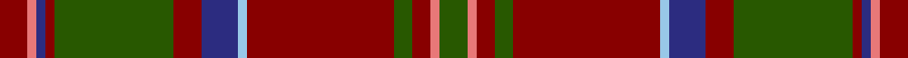

This page is one **sett** — a single exact thread-count. It belongs to the [tartan](/setts/dg3ri1r2dg2r16lb1db4r3dg13r1db1ri1r3/)
(the same proportion at any scale), whose colour order is pattern [GRRGRWBRGRBRR](/stripes/grrgrwbrgrbrr/).

Part of the [MacDonald of Glencoe](/tartans/macdonald-of-glencoe/) tartan — the named design grouping this sett with its other cloths.

Sourced from register-of-tartans.  It is a [13 stripe tartan](/stripes/stripes13/).

Original link https://www.tartanregister.gov.uk/tartanDetails.aspx?ref=909

## Also known as

This cloth is also recorded under:

- MacDonald of Glenaladale #2
- MacDonald of Glencoe #2
- MacDonald of Glencoe #3
- MacDonald of Glencoe Artifact
- MacDonald, of Glencoe

## Register references

External register numbers recorded for this tartan.

- Scottish Register of Tartans: [909](https://www.tartanregister.gov.uk/tartanDetails.aspx?ref=909)
- Scottish Tartans Authority (ITI): 6431

## Thread count
DR/6 LR2 DB2 DR2 G26 DR6 DB8 LB2 DR32 G4 DR4 LR2 G/6

One full sett is **192 threads**.

## Palette

Palette: <strong>Tartan Register</strong>
<table><thead><tr><th>Colour</th><th>Threads</th><th>Shade</th><th>Base</th><th>OKLCh</th></tr></thead><tbody><tr><td>DR/</td><td style="text-align:right;font-variant-numeric:tabular-nums">6</td><td><code style="background-color:#880000;">#880000</code> <small style="color:#888">#880000</small></td><td>R <code style="background-color:#CC0000;">#CC0000</code></td><td><small style="color:#888">oklch(39.4% 0.162 29.2)</small></td></tr><tr><td>LR</td><td style="text-align:right;font-variant-numeric:tabular-nums">2</td><td><code style="background-color:#E87878;">#E87878</code> <small style="color:#888">#E87878</small></td><td>R <code style="background-color:#CC0000;">#CC0000</code></td><td><small style="color:#888">oklch(70.0% 0.139 21.2)</small></td></tr><tr><td>DB</td><td style="text-align:right;font-variant-numeric:tabular-nums">2</td><td><code style="background-color:#2C2C80;">#2C2C80</code> <small style="color:#888">#2C2C80</small></td><td>B <code style="background-color:#2A418A;">#2A418A</code></td><td><small style="color:#888">oklch(35.0% 0.138 276.6)</small></td></tr><tr><td>DR</td><td style="text-align:right;font-variant-numeric:tabular-nums">2</td><td><code style="background-color:#880000;">#880000</code> <small style="color:#888">#880000</small></td><td>R <code style="background-color:#CC0000;">#CC0000</code></td><td><small style="color:#888">oklch(39.4% 0.162 29.2)</small></td></tr><tr><td>G</td><td style="text-align:right;font-variant-numeric:tabular-nums">26</td><td><code style="background-color:#285800;">#285800</code> <small style="color:#888">#285800</small></td><td>G <code style="background-color:#006100;">#006100</code></td><td><small style="color:#888">oklch(41.0% 0.122 135.8)</small></td></tr><tr><td>DR</td><td style="text-align:right;font-variant-numeric:tabular-nums">6</td><td><code style="background-color:#880000;">#880000</code> <small style="color:#888">#880000</small></td><td>R <code style="background-color:#CC0000;">#CC0000</code></td><td><small style="color:#888">oklch(39.4% 0.162 29.2)</small></td></tr><tr><td>DB</td><td style="text-align:right;font-variant-numeric:tabular-nums">8</td><td><code style="background-color:#2C2C80;">#2C2C80</code> <small style="color:#888">#2C2C80</small></td><td>B <code style="background-color:#2A418A;">#2A418A</code></td><td><small style="color:#888">oklch(35.0% 0.138 276.6)</small></td></tr><tr><td>LB</td><td style="text-align:right;font-variant-numeric:tabular-nums">2</td><td><code style="background-color:#98C8E8;">#98C8E8</code> <small style="color:#888">#98C8E8</small></td><td>W <code style="background-color:#F7F7F7;">#F7F7F7</code></td><td><small style="color:#888">oklch(81.0% 0.068 237.9)</small></td></tr><tr><td>DR</td><td style="text-align:right;font-variant-numeric:tabular-nums">32</td><td><code style="background-color:#880000;">#880000</code> <small style="color:#888">#880000</small></td><td>R <code style="background-color:#CC0000;">#CC0000</code></td><td><small style="color:#888">oklch(39.4% 0.162 29.2)</small></td></tr><tr><td>G</td><td style="text-align:right;font-variant-numeric:tabular-nums">4</td><td><code style="background-color:#285800;">#285800</code> <small style="color:#888">#285800</small></td><td>G <code style="background-color:#006100;">#006100</code></td><td><small style="color:#888">oklch(41.0% 0.122 135.8)</small></td></tr><tr><td>DR</td><td style="text-align:right;font-variant-numeric:tabular-nums">4</td><td><code style="background-color:#880000;">#880000</code> <small style="color:#888">#880000</small></td><td>R <code style="background-color:#CC0000;">#CC0000</code></td><td><small style="color:#888">oklch(39.4% 0.162 29.2)</small></td></tr><tr><td>LR</td><td style="text-align:right;font-variant-numeric:tabular-nums">2</td><td><code style="background-color:#E87878;">#E87878</code> <small style="color:#888">#E87878</small></td><td>R <code style="background-color:#CC0000;">#CC0000</code></td><td><small style="color:#888">oklch(70.0% 0.139 21.2)</small></td></tr><tr><td>G/</td><td style="text-align:right;font-variant-numeric:tabular-nums">6</td><td><code style="background-color:#285800;">#285800</code> <small style="color:#888">#285800</small></td><td>G <code style="background-color:#006100;">#006100</code></td><td><small style="color:#888">oklch(41.0% 0.122 135.8)</small></td></tr></tbody></table>

## Compared to the master

This cloth is one sett of its design; the master sett (the exemplar the design is anchored on) is below for comparison.

<figure style="margin:0"><figcaption style="color:#888;font-size:smaller">this sett</figcaption></figure>
<figure style="margin:0"><figcaption style="color:#888;font-size:smaller"><a href="/setts/m6r1db2m2g40m6db13t1m48g2m4r1g4/">master sett →</a></figcaption></figure>

## Nearest tartans

The nearest existing variants by ΔTartan distance, with this tartan at the top so the swatches line up against it.

ΔTartan

Tartan

Sett

—

<a href="/ttd/edit/#slug=dg3ri1r2dg2r16lb1db4r3dg13r1db1ri1r3~x2">MacDonald of Glencoe</a> <a class="nn-out" href="/variants/s13/dg3ri1r2dg2r16lb1db4r3dg13r1db1ri1r3~x2/" title="open its dictionary page">↗</a>

0.89

<a href="/ttd/edit/#slug=db4r24dg2r3dg19ly2r2db8r2dg2w2r2~x2&amp;base=dg3ri1r2dg2r16lb1db4r3dg13r1db1ri1r3~x2">Michael from Appin (Personal)</a> <a class="nn-out" href="/variants/s12/db4r24dg2r3dg19ly2r2db8r2dg2w2r2~x2/" title="open its dictionary page">↗</a>

0.93

<a href="/ttd/edit/#slug=y14lo1y1lo1y2k3y3k3doi3do1doi9lo1~x4&amp;base=dg3ri1r2dg2r16lb1db4r3dg13r1db1ri1r3~x2">Glen Nevis #2 (Personal)</a> <a class="nn-out" href="/variants/s12/y14lo1y1lo1y2k3y3k3doi3do1doi9lo1~x4/" title="open its dictionary page">↗</a>

0.95

<a href="/ttd/edit/#slug=r6k2r2k4r2k2r6g18r2lo1r2k2r10w1r2~x4&amp;base=dg3ri1r2dg2r16lb1db4r3dg13r1db1ri1r3~x2">Ainslie #2</a> <a class="nn-out" href="/variants/s15/r6k2r2k4r2k2r6g18r2lo1r2k2r10w1r2~x4/" title="open its dictionary page">↗</a>

0.96

<a href="/ttd/edit/#slug=k2lr1r2g6r2db4r2k2r15g2r2k1~x4&amp;base=dg3ri1r2dg2r16lb1db4r3dg13r1db1ri1r3~x2">MacClure Clan/Family Tartan</a> <a class="nn-out" href="/variants/s12/k2lr1r2g6r2db4r2k2r15g2r2k1~x4/" title="open its dictionary page">↗</a>

1.04

<a href="/ttd/edit/#slug=r5ri2k3r4g43r6k7t2r47g2r3ri2g4~x2&amp;base=dg3ri1r2dg2r16lb1db4r3dg13r1db1ri1r3~x2">Glen Coe (District)</a> <a class="nn-out" href="/variants/s13/r5ri2k3r4g43r6k7t2r47g2r3ri2g4~x2/" title="open its dictionary page">↗</a>

1.10

<a href="/ttd/edit/#slug=dy21m2w1ly3m2dy5m21ly1ly1ly1m1dy8~x2&amp;base=dg3ri1r2dg2r16lb1db4r3dg13r1db1ri1r3~x2">Glendronach Corporate Tartan</a> <a class="nn-out" href="/variants/s12/dy21m2w1ly3m2dy5m21ly1ly1ly1m1dy8~x2/" title="open its dictionary page">↗</a>

1.11

<a href="/ttd/edit/#slug=k2lb1r2dg6r2db4r2k2r15dg2r2k1~x4&amp;base=dg3ri1r2dg2r16lb1db4r3dg13r1db1ri1r3~x2">MacClure</a> <a class="nn-out" href="/variants/s12/k2lb1r2dg6r2db4r2k2r15dg2r2k1~x4/" title="open its dictionary page">↗</a>

1.15

<a href="/ttd/edit/#slug=n19do2m1dr3w1dr1w1dr1do6n3dr1do3w1~x4&amp;base=dg3ri1r2dg2r16lb1db4r3dg13r1db1ri1r3~x2">Leando Hunting (Personal)</a> <a class="nn-out" href="/variants/s13/n19do2m1dr3w1dr1w1dr1do6n3dr1do3w1~x4/" title="open its dictionary page">↗</a>

1.17

<a href="/ttd/edit/#slug=ri7r2db2ri2g32ri6db12ri41g2ri5r2g5~x2&amp;base=dg3ri1r2dg2r16lb1db4r3dg13r1db1ri1r3~x2">MacDonald of Glenaladale</a> <a class="nn-out" href="/variants/s12/ri7r2db2ri2g32ri6db12ri41g2ri5r2g5~x2/" title="open its dictionary page">↗</a>

1.20

<a href="/ttd/edit/#slug=ly3dy3r1ly2r1dy20k5dy4k5dy3r2dy3o7dy2~x2&amp;base=dg3ri1r2dg2r16lb1db4r3dg13r1db1ri1r3~x2">Balnagowan (Harrods)</a> <a class="nn-out" href="/variants/s14/ly3dy3r1ly2r1dy20k5dy4k5dy3r2dy3o7dy2~x2/" title="open its dictionary page">↗</a>

## Neighbour map

Every grey dot is one of 14360 variants placed by the first two principal components of the ΔTartan feature space (44% of its variance). Red is this tartan; blue dots are its nearest — click one to open its page.

<svg viewBox="0 0 640 380" role="img" style="max-width:100%;height:auto;border:1px solid #e0e0e0;border-radius:4px;display:block" xmlns="http://www.w3.org/2000/svg"><image href="/nn/cloud.v1.png" width="640" height="380"/><a href="/variants/s12/db4r24dg2r3dg19ly2r2db8r2dg2w2r2~x2/"><circle cx="270.2" cy="142.1" r="4" fill="#3465a4"><title>Michael from Appin (Personal)</title></circle></a><a href="/variants/s12/y14lo1y1lo1y2k3y3k3doi3do1doi9lo1~x4/"><circle cx="274.8" cy="146.9" r="4" fill="#3465a4"><title>Glen Nevis #2 (Personal)</title></circle></a><a href="/variants/s15/r6k2r2k4r2k2r6g18r2lo1r2k2r10w1r2~x4/"><circle cx="302.5" cy="127.1" r="4" fill="#3465a4"><title>Ainslie #2</title></circle></a><a href="/variants/s12/k2lr1r2g6r2db4r2k2r15g2r2k1~x4/"><circle cx="327.3" cy="145.6" r="4" fill="#3465a4"><title>MacClure Clan/Family Tartan</title></circle></a><a href="/variants/s13/r5ri2k3r4g43r6k7t2r47g2r3ri2g4~x2/"><circle cx="354.9" cy="107.5" r="4" fill="#3465a4"><title>Glen Coe (District)</title></circle></a><a href="/variants/s12/dy21m2w1ly3m2dy5m21ly1ly1ly1m1dy8~x2/"><circle cx="353.0" cy="117.3" r="4" fill="#3465a4"><title>Glendronach Corporate Tartan</title></circle></a><a href="/variants/s12/k2lb1r2dg6r2db4r2k2r15dg2r2k1~x4/"><circle cx="339.6" cy="151.1" r="4" fill="#3465a4"><title>MacClure</title></circle></a><a href="/variants/s13/n19do2m1dr3w1dr1w1dr1do6n3dr1do3w1~x4/"><circle cx="320.3" cy="115.5" r="4" fill="#3465a4"><title>Leando Hunting (Personal)</title></circle></a><a href="/variants/s12/ri7r2db2ri2g32ri6db12ri41g2ri5r2g5~x2/"><circle cx="350.4" cy="135.2" r="4" fill="#3465a4"><title>MacDonald of Glenaladale</title></circle></a><a href="/variants/s14/ly3dy3r1ly2r1dy20k5dy4k5dy3r2dy3o7dy2~x2/"><circle cx="325.6" cy="125.0" r="4" fill="#3465a4"><title>Balnagowan (Harrods)</title></circle></a><circle cx="320.2" cy="138.6" r="5" fill="#c00000"/></svg>

ID: /variants/s13/dg3ri1r2dg2r16lb1db4r3dg13r1db1ri1r3~x2/
