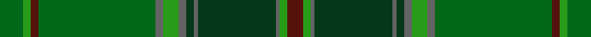

This page is one **sett** — a single exact thread-count. It belongs to the [tartan](/setts/dgi6g2dr2dgi30n2g4n2dg2n1dg20n1g2dr4/)
(the same proportion at any scale), whose colour order is pattern [BGBGBGBGBGBGG](/stripes/bgbgbgbgbgbgg/).

Part of the [All Ireland](/tartans/all-ireland/) tartan — the named design grouping this sett with its other cloths.

Sourced from register-of-tartans.  It is a [13 stripe tartan](/stripes/stripes13/).

Original link https://www.tartanregister.gov.uk/tartanDetails.aspx?ref=53

## Register references

External register numbers recorded for this tartan.

- Scottish Register of Tartans: [53](https://www.tartanregister.gov.uk/tartanDetails.aspx?ref=53)
- Scottish Tartans Authority (ITI): 4065

## Thread count
DGi/12 G4 DR4 DGi60 N4 G8 N4 DG4 N2 DG40 N2 G4 DR/8

One full sett is **292 threads**.

## Palette
<table><thead><tr><th>Colour</th><th>Shade</th><th>OKLCh</th></tr></thead><tbody><tr><td>DG</td><td><code style="background-color:#053819;">#053819</code> <small style="color:#888">#053819</small></td><td><small style="color:#888">oklch(30.0% 0.075 151.3)</small></td></tr><tr><td>DR</td><td><code style="background-color:#55120C;">#55120C</code> <small style="color:#888">#55120C</small></td><td><small style="color:#888">oklch(30.0% 0.099 29.3)</small></td></tr><tr><td>G</td><td><code style="background-color:#006818;">#006818</code> <small style="color:#888">#006818</small></td><td><small style="color:#888">oklch(45.0% 0.142 145.0)</small></td></tr><tr><td>Ga</td><td><code style="background-color:#289C18;">#289C18</code> <small style="color:#888">#289C18</small></td><td><small style="color:#888">oklch(60.6% 0.191 141.6)</small></td></tr><tr><td>N</td><td><code style="background-color:#636363;">#636363</code> <small style="color:#888">#636363</small></td><td><small style="color:#888">oklch(50.0% 0.000 89.9)</small></td></tr></tbody></table>

# Sample pattern

## Nearest variants

The nearest existing variants by ΔTartan distance, with this cloth at the top so the swatches line up against it.

ΔTartan

Threads

Variant

Sett

—

292

<a href="/variants/s13/dgi6g2dr2dgi30n2g4n2dg2n1dg20n1g2dr4~x2~dgi1806142-g2408144/">All Ireland Green</a>

<a href="/ttd/edit/#slug=dgi6g2dr2dgi30y2g4y2dg2y1dg20y1g2dr4~x2~dgi1806142-g2408144&amp;base=dgi6g2dr2dgi30n2g4n2dg2n1dg20n1g2dr4~x2~dgi1806142-g2408144" title="compare in the TTD">1.20</a>

292

<a href="/variants/s13/dgi6g2dr2dgi30y2g4y2dg2y1dg20y1g2dr4~x2~dgi1806142-g2408144/">All Ireland Green (Fashion)</a>

<a href="/ttd/edit/#slug=dgi6g2dr2dgi30lo2g4lo2dg2lo1dg20lo1g2dr4~x2~dgi1806142-g2408144&amp;base=dgi6g2dr2dgi30n2g4n2dg2n1dg20n1g2dr4~x2~dgi1806142-g2408144" title="compare in the TTD">1.20</a>

292

<a href="/variants/s13/dgi6g2dr2dgi30lo2g4lo2dg2lo1dg20lo1g2dr4~x2~dgi1806142-g2408144/">All Irish Green Irish District Tartan</a>

## Neighbour map

Every grey dot is one of 13620 variants placed by the first two principal components of the ΔTartan feature space (42% of its variance). Red is this tartan; blue dots are its nearest — click one to open its page.

<svg viewBox="0 0 640 380" role="img" style="max-width:100%;height:auto;border:1px solid #e0e0e0;border-radius:4px;display:block" xmlns="http://www.w3.org/2000/svg"><image href="/nn/cloud.v1.png" width="640" height="380"/><a href="/variants/s13/dgi6g2dr2dgi30y2g4y2dg2y1dg20y1g2dr4~x2~dgi1806142-g2408144/"><circle cx="412.1" cy="159.4" r="4" fill="#3465a4"><title>All Ireland Green (Fashion)</title></circle></a><a href="/variants/s13/dgi6g2dr2dgi30lo2g4lo2dg2lo1dg20lo1g2dr4~x2~dgi1806142-g2408144/"><circle cx="352.1" cy="137.8" r="4" fill="#3465a4"><title>All Irish Green Irish District Tartan</title></circle></a><circle cx="418.6" cy="162.0" r="5" fill="#c00000"/><text x="320" y="376" text-anchor="middle" font-size="11" fill="#999">ground</text><text x="11" y="190" text-anchor="middle" font-size="11" fill="#999" transform="rotate(-90 11 190)">complexity</text></svg>

ID: /variants/s13/dgi6g2dr2dgi30n2g4n2dg2n1dg20n1g2dr4~x2~dgi1806142-g2408144/
